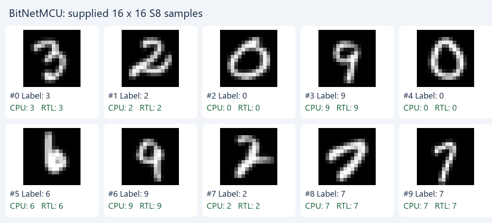

# Diagram references

<!-- reading-navigation:start -->
[Documentation](README.md) → [01 · System](01-system/README.md) → This page

| Reading guide | Document |
|---|---|
| Read first | [Full RTL graph](source_guide/full_graph.md) |
| Continue / related lookup | [Editable diagram catalog](diagrams/architecture_catalog.md) |
<!-- reading-navigation:end -->

> **Category: GUIDE.** The former combined-document diagrams were exact copies of the owners below. Use these links to avoid loading duplicate diagrams; historical and legacy owners retain their scope labels.

- [demos/legacy/model_candidates.md](demos/legacy/model_candidates.md)
- [demos/legacy/nanofable_hybrid.md](demos/legacy/nanofable_hybrid.md)
- [design/exact_throughput_optimization.md](design/exact_throughput_optimization.md)
- [design/full_rtl_language.md](design/full_rtl_language.md)
- [design/host_interface.md](design/host_interface.md)
- [design/legacy/architecture.md](design/legacy/architecture.md)
- [history/full_rtl_development.md](history/full_rtl_development.md)
- [history/reviews/rtl_change_review.md](history/reviews/rtl_change_review.md)
- [history/reviews/rtl_change_review_v2.md](history/reviews/rtl_change_review_v2.md)
- [source_guide/blocks/PC.sv.md](source_guide/blocks/PC.sv.md)
- [source_guide/blocks/acc_mul.sv.md](source_guide/blocks/acc_mul.sv.md)
- [source_guide/blocks/banked_word_ram.sv.md](source_guide/blocks/banked_word_ram.sv.md)
- [source_guide/blocks/descriptor_file.sv.md](source_guide/blocks/descriptor_file.sv.md)
- [source_guide/blocks/div.sv.md](source_guide/blocks/div.sv.md)
- [source_guide/blocks/ins_mem.sv.md](source_guide/blocks/ins_mem.sv.md)
- [source_guide/blocks/isqrt_u64.sv.md](source_guide/blocks/isqrt_u64.sv.md)
- [source_guide/blocks/llm_attention_engine.sv.md](source_guide/blocks/llm_attention_engine.sv.md)
- [source_guide/blocks/llm_attention_normalize.sv.md](source_guide/blocks/llm_attention_normalize.sv.md)
- [source_guide/blocks/llm_bank_ram.sv.md](source_guide/blocks/llm_bank_ram.sv.md)
- [source_guide/blocks/llm_head_engine.sv.md](source_guide/blocks/llm_head_engine.sv.md)
- [source_guide/blocks/llm_linear_engine.sv.md](source_guide/blocks/llm_linear_engine.sv.md)
- [source_guide/blocks/llm_math.sv.md](source_guide/blocks/llm_math.sv.md)
- [source_guide/blocks/llm_parameter_ram.sv.md](source_guide/blocks/llm_parameter_ram.sv.md)
- [source_guide/blocks/llm_pkg.sv.md](source_guide/blocks/llm_pkg.sv.md)
- [source_guide/blocks/llm_soc.sv.md](source_guide/blocks/llm_soc.sv.md)
- [source_guide/blocks/logic_mul.sv.md](source_guide/blocks/logic_mul.sv.md)
- [source_guide/blocks/matmul_wrap.sv.md](source_guide/blocks/matmul_wrap.sv.md)
- [source_guide/blocks/matmulfree.sv.md](source_guide/blocks/matmulfree.sv.md)
- [source_guide/blocks/mem_mapping.sv.md](source_guide/blocks/mem_mapping.sv.md)
- [source_guide/blocks/mul.sv.md](source_guide/blocks/mul.sv.md)
- [source_guide/blocks/norm.sv.md](source_guide/blocks/norm.sv.md)
- [source_guide/blocks/norm_dispatch.sv.md](source_guide/blocks/norm_dispatch.sv.md)
- [source_guide/blocks/npu_pkg.sv.md](source_guide/blocks/npu_pkg.sv.md)
- [source_guide/blocks/pipelined_word_ram.sv.md](source_guide/blocks/pipelined_word_ram.sv.md)
- [source_guide/blocks/postscale.sv.md](source_guide/blocks/postscale.sv.md)
- [source_guide/blocks/quartus_word_ram.sv.md](source_guide/blocks/quartus_word_ram.sv.md)
- [source_guide/blocks/regfile.sv.md](source_guide/blocks/regfile.sv.md)
- [source_guide/blocks/reset_release.sv.md](source_guide/blocks/reset_release.sv.md)
- [source_guide/blocks/rowwise_dispatch.sv.md](source_guide/blocks/rowwise_dispatch.sv.md)
- [source_guide/blocks/rowwise_op.sv.md](source_guide/blocks/rowwise_op.sv.md)
- [source_guide/blocks/scale_compose.sv.md](source_guide/blocks/scale_compose.sv.md)
- [source_guide/blocks/sigmoid.sv.md](source_guide/blocks/sigmoid.sv.md)
- [source_guide/blocks/sram_256_wrapper.sv.md](source_guide/blocks/sram_256_wrapper.sv.md)
- [source_guide/blocks/sram_word_tile.sv.md](source_guide/blocks/sram_word_tile.sv.md)
- [source_guide/blocks/ternary_dot32.sv.md](source_guide/blocks/ternary_dot32.sv.md)
- [source_guide/blocks/ternary_mul.sv.md](source_guide/blocks/ternary_mul.sv.md)
- [source_guide/legacy/README.md](source_guide/legacy/README.md)

## Preserved ASCII snapshots

The following legacy/research snapshots remain unchanged; current architecture is owned by [full RTL language](design/full_rtl_language.md).

```text
a11_Opt12k_cos_Aug_BitMnist_PerTensor_Binary_RMS_width160_160_160_lr0.001_decay0.1_stepsize10_bs128_epochs60.pth
```

```text
 She was very happy. She was so happy. She was so happy. She was so happy. She was so happy. She was so happy. She was
```

```text
llm_soc
├── u_reset: reset_release                  two ordinary release FFs
├── u_parameters: llm_parameter_ram         8 lanes, each 32 × 24576 bits
│   └── g_ram_lane[0..7].u_storage: pipelined_word_ram
│       ├── g_ip_tiled.g_tile[0..23].u_storage: quartus_word_ram → altsyncram
│       └── g_model.g_tile[*].u_tile: sram_word_tile (alternative branch)
├── u_vectors: llm_bank_ram                 32 lanes, each 24 × 96 bits
│   └── g_bank[0..31].u_storage: pipelined_word_ram → selected SRAM branch
├── u_cache: llm_bank_ram                   32 lanes, each 24 × 4096 bits
│   └── g_bank[0..31].u_storage: pipelined_word_ram → selected SRAM branch
├── u_math: llm_math                        32 SIMD lanes
│   └── g_mul_lane[0..31].g_byte[0..3].u_mul: logic_mul (128 instances)
├── u_scalar_lo/u_scalar_mid/u_scalar_hi: logic_mul
├── u_exp_mul: logic_mul
├── u_noise_mul: logic_mul
├── u_root: isqrt_u64                       declared in norm.sv
├── u_div: div                             NUM_W=64, DEN_W=32
├── u_sig: sigmoid
│   ├── u_bit_mul: logic_mul
│   └── u_lookup: sigmoid_sample            constant table module
├── u_exp_hi/u_exp_lo: llm_exp_sample        constant table modules
└── u_gumbel_lookup: llm_gumbel_sample       constant table module
```

```text
matmul_wrap → matmulfree
  ├── PC, ins_mem, descriptor_file
  ├── register (regfile.sv), mem_mapping → sram_256_wrapper
  ├── rowwise_dispatch → rowwise_op → sigmoid, logic_mul
  ├── norm_dispatch → norm → isqrt_u64, div, logic_mul
  ├── ternary_mul → acc_mul, logic_mul, postscale_finish
  └── scale_compose → div, logic_mul
```

```text
S = Σ x_i²
Q = floor(S/K), rem = S mod K
V = (Q << 32) + floor((rem << 32)/K) + epsilon_raw32
R = floor(sqrt(V))
```

```text
z_raw[i] = RNE(x_i × M_norm / 2^r_norm)
z_real[i] ≈ z_raw[i] / 65536
A = max(abs(z_raw[i]))
D = max(A, delta_raw)
```

```text
M_quant / 2^r_quant ≈ 0x7F / D
q[i] = clamp_S8(RNE(z_raw[i] × M_quant / 2^r_quant))
scale_q = D / (0x7F × 0x1_0000)
```

```text
acc[j] = Σ q[i] × w[j,i]
y_raw[j] = saturate(RNE(acc[j] × M / 2^r) + bias_raw[j])
```

```text
C_effective ≈ (M_descriptor / 2^r_descriptor) × D/(0x7F×0x1_0000)
```

```text
new_H = sat_S16(RNE((F_raw × old_H + (0x8000−F_raw) × C) / 0x8000))
```

```text
LUT[i] = RNE(0x8000 / (1 + exp(−x_i)))
```

```text
llm_soc
├── u_reset: reset_release                  two ordinary release FFs
├── u_parameters: llm_parameter_ram         8 lanes, each 32 × 24576 bits
│   └── g_ram_lane[0..7].u_storage: pipelined_word_ram
│       ├── g_ip_tiled.g_tile[0..23].u_storage: quartus_word_ram → altsyncram
│       └── g_model.g_tile[*].u_tile: sram_word_tile (alternative branch)
├── u_vectors: llm_bank_ram                 32 lanes, each 24 × 96 bits
│   └── g_bank[0..31].u_storage: pipelined_word_ram → selected SRAM branch
├── u_cache: llm_bank_ram                   32 lanes, each 24 × 4096 bits
│   └── g_bank[0..31].u_storage: pipelined_word_ram → selected SRAM branch
├── u_math: llm_math                        32 SIMD lanes
│   └── g_mul_lane[0..31].g_byte[0..3].u_mul: logic_mul (128 instances)
├── u_scalar_lo/u_scalar_mid/u_scalar_hi: logic_mul
├── u_exp_mul: logic_mul
├── u_noise_mul: logic_mul
├── u_root: isqrt_u64                       declared in norm.sv
├── u_div: div                             NUM_W=64, DEN_W=32
├── u_sig: sigmoid
│   ├── u_bit_mul: logic_mul
│   └── u_lookup: sigmoid_sample            constant table module
├── u_exp_hi/u_exp_lo: llm_exp_sample        constant table modules
└── u_gumbel_lookup: llm_gumbel_sample       constant table module
```

```text
matmul_wrap → matmulfree
  ├── PC, ins_mem, descriptor_file
  ├── register (regfile.sv), mem_mapping → sram_256_wrapper
  ├── rowwise_dispatch → rowwise_op → sigmoid, logic_mul
  ├── norm_dispatch → norm → isqrt_u64, div, logic_mul
  ├── ternary_mul → acc_mul, logic_mul, postscale_finish
  └── scale_compose → div, logic_mul
```

