# Preserved documentation diagrams

> **Category: HISTORICAL SNAPSHOT ? 2026-10-07.** Generated combined-document prose and RTL copies were removed. Diagrams remain unchanged; they are not authoritative for current architecture.

Start at [documentation](README.md); current diagrams are indexed in [diagram navigation](diagrams/README.md).

## docs/demos/legacy/model_candidates.md

```text
a11_Opt12k_cos_Aug_BitMnist_PerTensor_Binary_RMS_width160_160_160_lr0.001_decay0.1_stepsize10_bs128_epochs60.pth
```

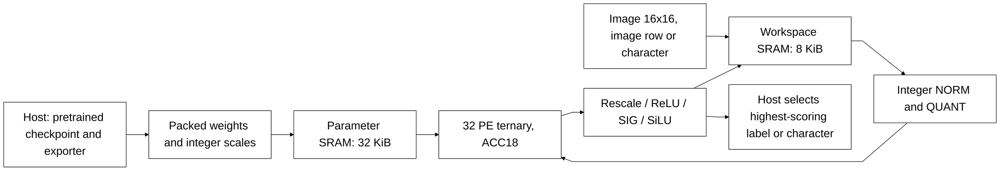

## docs/demos/legacy/nanofable_hybrid.md

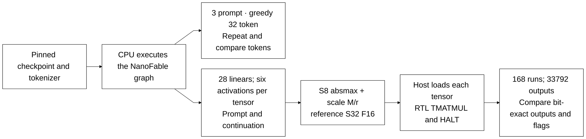

```text
 She was very happy. She was so happy. She was so happy. She was so happy. She was so happy. She was so happy. She was
```

## docs/design/legacy/architecture.md

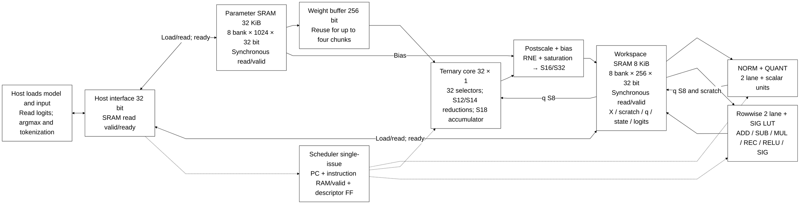

## docs/history/architecture_research_20261005.md

```text
llm_soc
├── u_reset: reset_release                  two ordinary release FFs
├── u_parameters: llm_parameter_ram         8 lanes, each 32 × 24576 bits
│   └── g_ram_lane[0..7].u_storage: pipelined_word_ram
│       ├── g_ip_tiled.g_tile[0..23].u_storage: quartus_word_ram → altsyncram
│       └── g_model.g_tile[*].u_tile: sram_word_tile (alternative branch)
├── u_vectors: llm_bank_ram                 32 lanes, each 24 × 96 bits
│   └── g_bank[0..31].u_storage: pipelined_word_ram → selected SRAM branch
├── u_cache: llm_bank_ram                   32 lanes, each 24 × 4096 bits
│   └── g_bank[0..31].u_storage: pipelined_word_ram → selected SRAM branch
├── u_math: llm_math                        32 SIMD lanes
│   └── g_mul_lane[0..31].g_byte[0..3].u_mul: logic_mul (128 instances)
├── u_scalar_lo/u_scalar_mid/u_scalar_hi: logic_mul
├── u_exp_mul: logic_mul
├── u_noise_mul: logic_mul
├── u_root: isqrt_u64                       declared in norm.sv
├── u_div: div                             NUM_W=64, DEN_W=32
├── u_sig: sigmoid
│   ├── u_bit_mul: logic_mul
│   └── u_lookup: sigmoid_sample            constant table module
├── u_exp_hi/u_exp_lo: llm_exp_sample        constant table modules
└── u_gumbel_lookup: llm_gumbel_sample       constant table module
```

```text
matmul_wrap → matmulfree
  ├── PC, ins_mem, descriptor_file
  ├── register (regfile.sv), mem_mapping → sram_256_wrapper
  ├── rowwise_dispatch → rowwise_op → sigmoid, logic_mul
  ├── norm_dispatch → norm → isqrt_u64, div, logic_mul
  ├── ternary_mul → acc_mul, logic_mul, postscale_finish
  └── scale_compose → div, logic_mul
```

## docs/design/exact_throughput_optimization.md

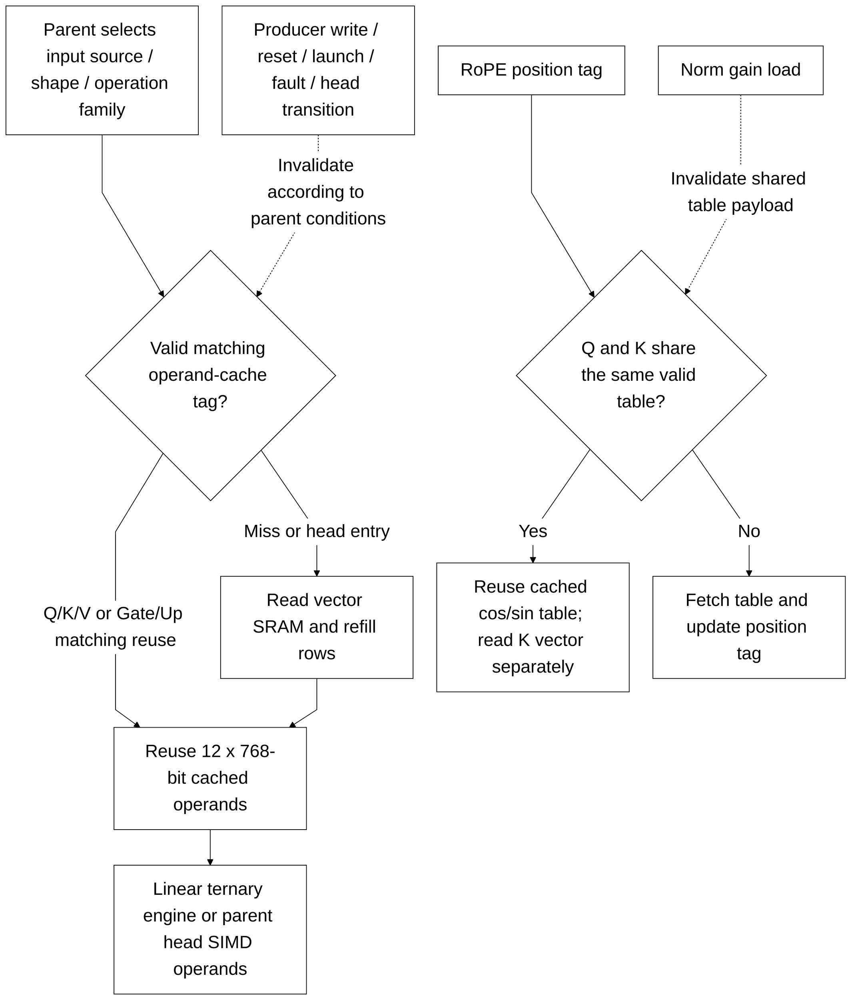

## docs/design/full_rtl_language.md

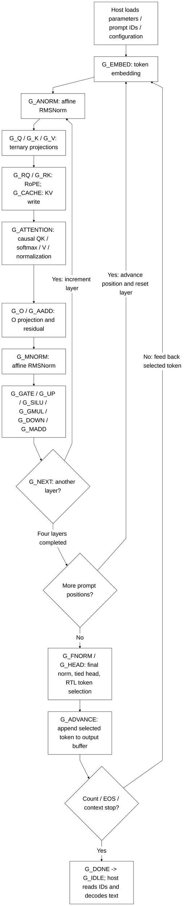

## docs/design/host_interface.md

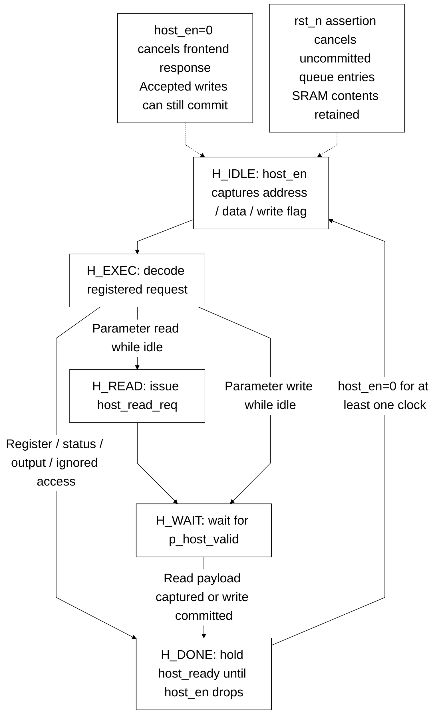

## docs/history/full_rtl_development.md

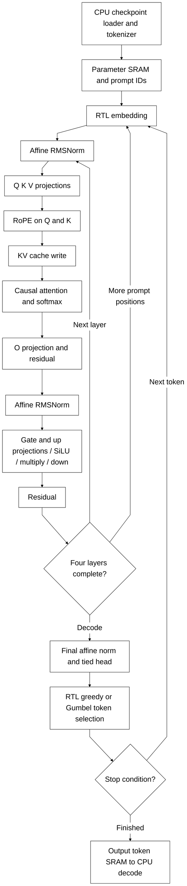

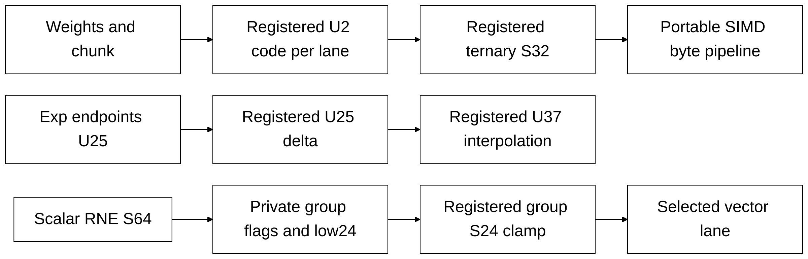

## docs/history/reviews/rtl_change_review.md

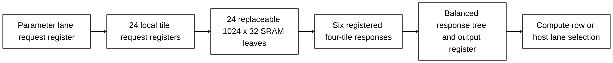

## docs/history/reviews/rtl_change_review_v2.md

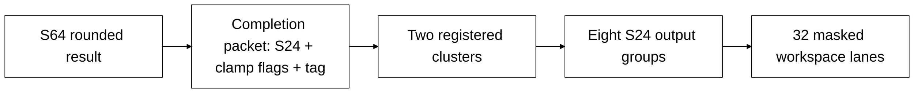

## docs/source_guide/full_graph.md

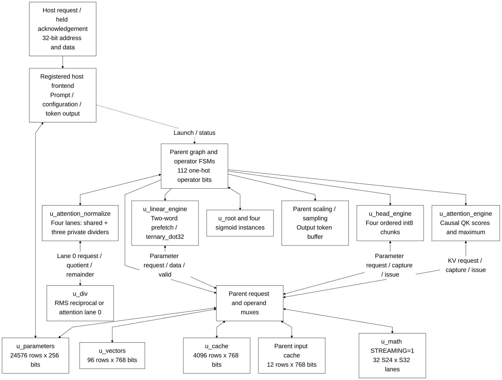

## docs/source_guide/legacy/README.md

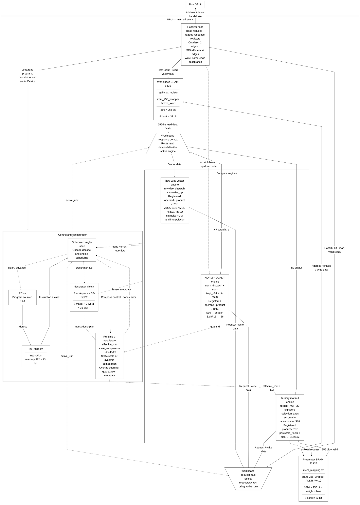

```text
S = Σ x_i²
Q = floor(S/K), rem = S mod K
V = (Q << 32) + floor((rem << 32)/K) + epsilon_raw32
R = floor(sqrt(V))
```

```text
z_raw[i] = RNE(x_i × M_norm / 2^r_norm)
z_real[i] ≈ z_raw[i] / 65536
A = max(abs(z_raw[i]))
D = max(A, delta_raw)
```

```text
M_quant / 2^r_quant ≈ 0x7F / D
q[i] = clamp_S8(RNE(z_raw[i] × M_quant / 2^r_quant))
scale_q = D / (0x7F × 0x1_0000)
```

```text
acc[j] = Σ q[i] × w[j,i]
y_raw[j] = saturate(RNE(acc[j] × M / 2^r) + bias_raw[j])
```

```text
C_effective ≈ (M_descriptor / 2^r_descriptor) × D/(0x7F×0x1_0000)
```

```text
new_H = sat_S16(RNE((F_raw × old_H + (0x8000−F_raw) × C) / 0x8000))
```

```text
LUT[i] = RNE(0x8000 / (1 + exp(−x_i)))
```

## docs/source_guide/blocks/acc_mul.sv.md

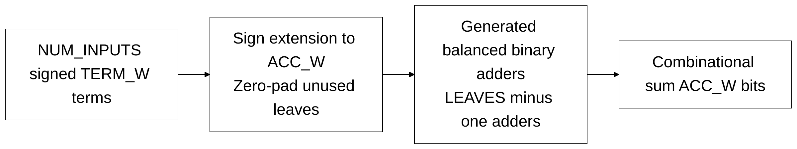

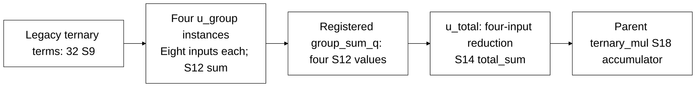

## docs/source_guide/blocks/banked_word_ram.sv.md

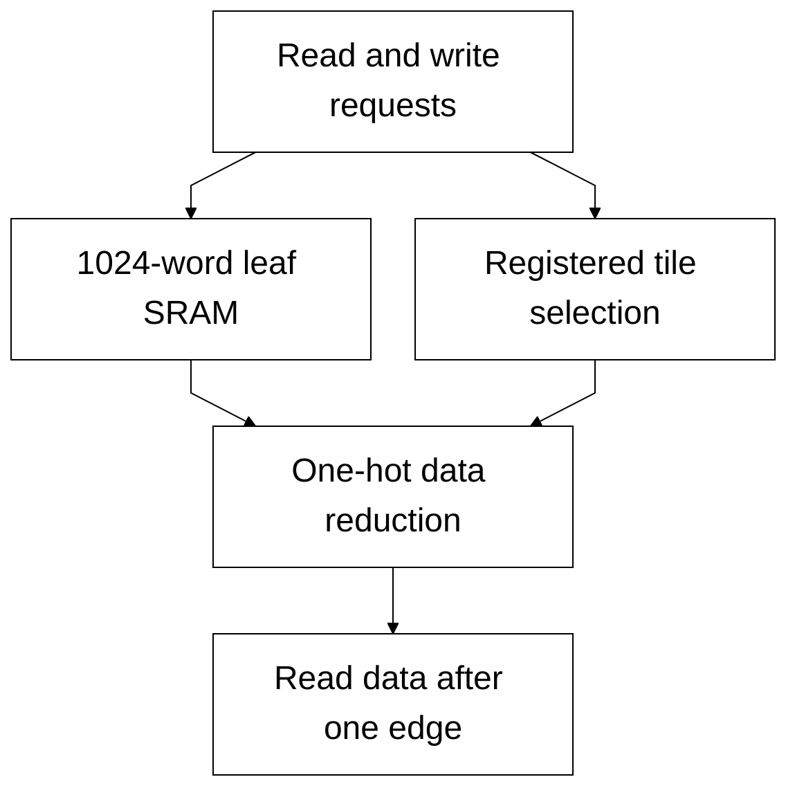

## docs/source_guide/blocks/descriptor_file.sv.md

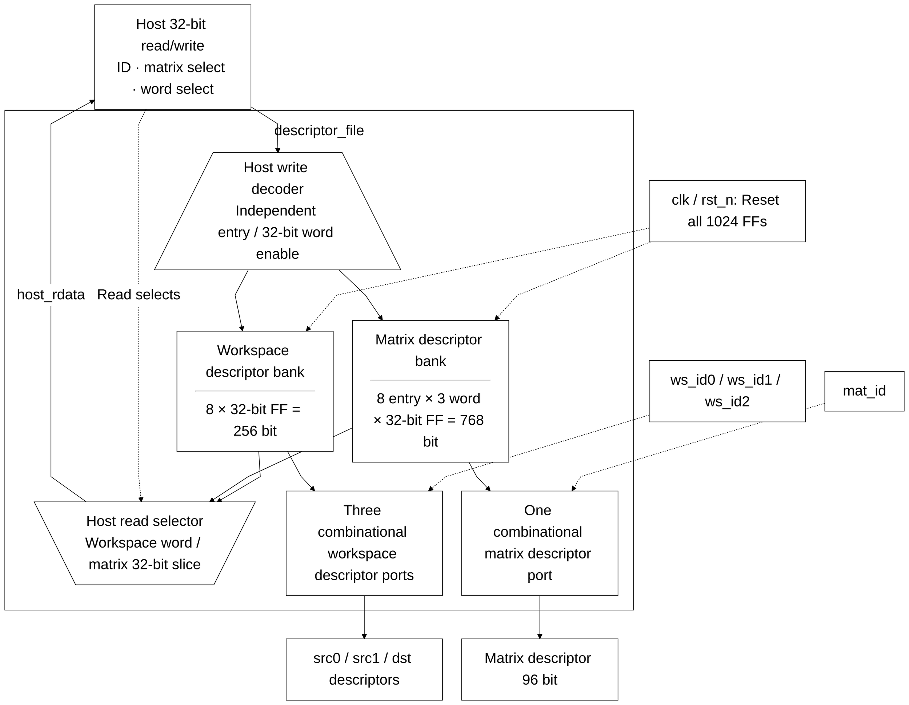

## docs/source_guide/blocks/div.sv.md

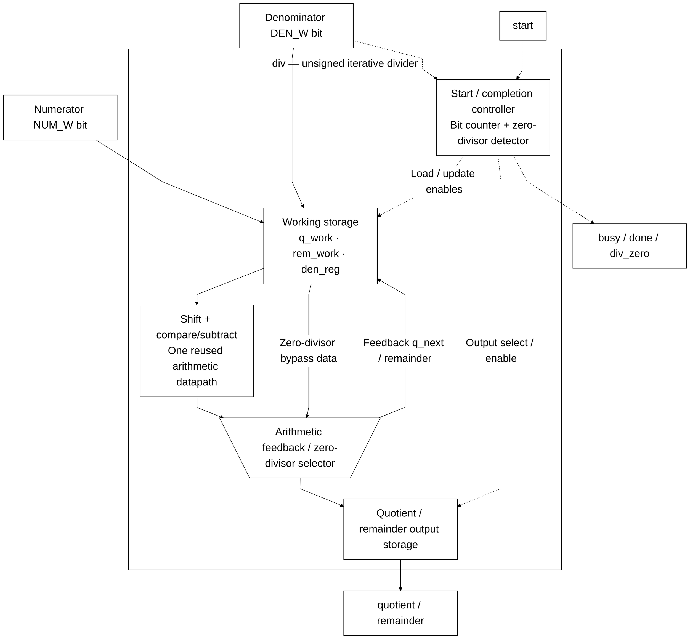

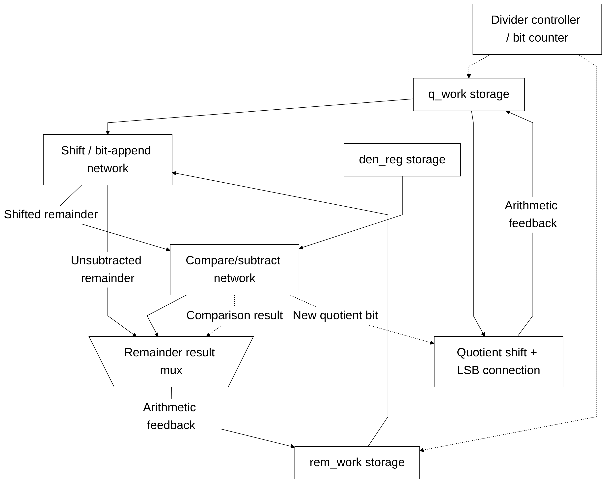

## docs/source_guide/blocks/ins_mem.sv.md

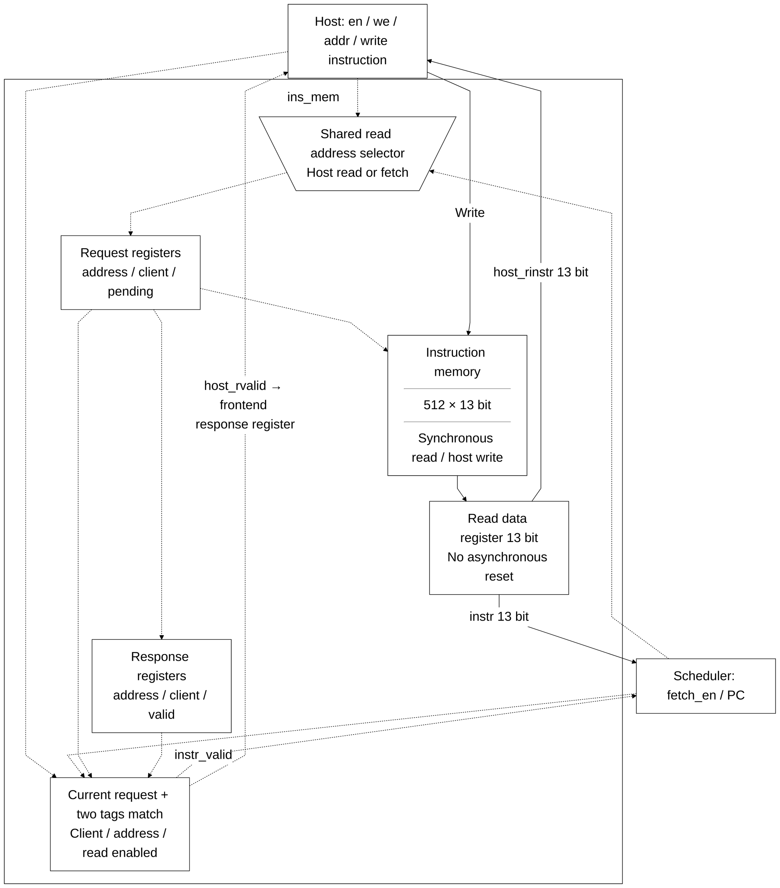

## docs/source_guide/blocks/isqrt_u64.sv.md

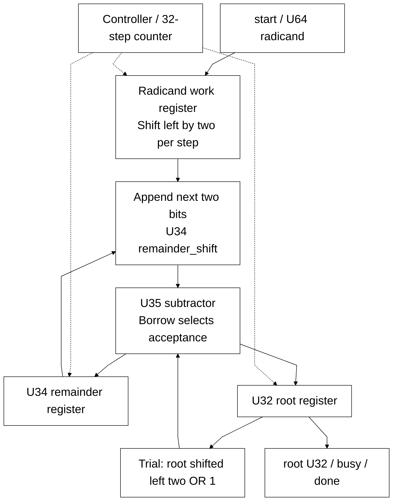

## docs/source_guide/blocks/llm_attention_engine.sv.md

```mermaid
%%{init: {"theme":"base","fontFamily":"Arial, sans-serif","themeVariables":{"fontSize":"24px","primaryColor":"#ffffff","primaryTextColor":"#000000","primaryBorderColor":"#000000","secondaryColor":"#ffffff","tertiaryColor":"#ffffff","lineColor":"#000000","textColor":"#000000","mainBkg":"#ffffff","nodeBorder":"#000000","clusterBkg":"#ffffff","clusterBorder":"#000000","edgeLabelBackground":"#ffffff"},"flowchart":{"htmlLabels":true,"useMaxWidth":false,"nodeSpacing":32,"rankSpacing":48,"curve":"linear","subGraphTitleMargin":{"top":16,"bottom":30}}}}%%
flowchart TB
 C["start_i / layer_i / head_i / position_i"] --> Q["Ordered causal KV requests<br/>0 through position_i"]
 Q --> K["Parent KV SRAM"]
 K -->|"kv_valid_i"| O["operand_capture_o<br/>Parent Q/K operand registers"]
 O --> M["math_issue_o<br/>Parent shared u_math"]
 M -->|"sum_i / sum_valid_i"| R["RNE16 and S39 register"]
 R --> S["u_scale logic_mul<br/>S39 x 11585 to S55"]
 S --> T["Registered product<br/>RNE16 and S32 clamp"]
 T --> A["128-entry score array<br/>Maximum comparator / register"]
 A --> OUT["score_o / max_score_o / done_o<br/>Parent softmax and V pass"]
    classDef default fill:white,stroke:black,color:black,font-size:24px;
    linkStyle default stroke:black,color:black;
```

## docs/source_guide/blocks/llm_attention_normalize.sv.md

```mermaid
%%{init: {"theme":"base","fontFamily":"Arial, sans-serif","themeVariables":{"fontSize":"24px","primaryColor":"#ffffff","primaryTextColor":"#000000","primaryBorderColor":"#000000","secondaryColor":"#ffffff","tertiaryColor":"#ffffff","lineColor":"#000000","textColor":"#000000","mainBkg":"#ffffff","nodeBorder":"#000000","clusterBkg":"#ffffff","clusterBorder":"#000000","edgeLabelBackground":"#ffffff"},"flowchart":{"htmlLabels":true,"useMaxWidth":false,"nodeSpacing":32,"rankSpacing":48,"curve":"linear","subGraphTitleMargin":{"top":16,"bottom":30}}}}%%
flowchart TB
 A["32 signed S56 accumulators<br/>Shared U32 denominator"] --> B["Batch operand capture<br/>Magnitude U64 / sign bits"]
 B --> L["Lane 0 external u_div<br/>USE_SHARED=1 in llm_soc"]
 B --> P["Lanes 1 to 3 private dividers<br/>U64 numerator / U32 denominator"]
 L --> Q["Capture quotient and RNE decision"]
 P --> Q
 Q --> R["ROUND<br/>Increment ties to even"]
 R --> S["SIGN<br/>Restore original sign"]
 S --> C["CLAMP<br/>S24 output lane registers"]
 C --> N["NEXT_BATCH<br/>Eight batches at four lanes"]
 N -->|"More lanes"| B
 N --> O["vector_o 768 bits / done_o"]
    classDef default fill:white,stroke:black,color:black,font-size:24px;
    linkStyle default stroke:black,color:black;
```

## docs/source_guide/blocks/llm_bank_ram.sv.md

```mermaid
%%{init: {"theme":"base","fontFamily":"Arial, sans-serif","themeVariables":{"fontSize":"24px","primaryColor":"#ffffff","primaryTextColor":"#000000","primaryBorderColor":"#000000","secondaryColor":"#ffffff","tertiaryColor":"#ffffff","lineColor":"#000000","textColor":"#000000","mainBkg":"#ffffff","nodeBorder":"#000000","clusterBkg":"#ffffff","clusterBorder":"#000000","edgeLabelBackground":"#ffffff"},"flowchart":{"htmlLabels":true,"useMaxWidth":false,"nodeSpacing":32,"rankSpacing":48,"curve":"linear","subGraphTitleMargin":{"top":16,"bottom":30}}}}%%
flowchart TB
    REQ[Shared row requests] --> GROUP[Requests per four lanes]
    MASK[Lane write mask] --> GROUP
    GROUP --> LOCAL[Per-lane request registers]
    LOCAL --> BANK[Technology-selected word banks]
    BANK --> DATA[768-bit row after five edges]
    MASK --> DRAIN[Four-stage write pending and wr_busy]
    classDef default fill:white,stroke:black,color:black,font-size:24px;
    linkStyle default stroke:black,color:black;
```

## docs/source_guide/blocks/llm_head_engine.sv.md

```mermaid
%%{init: {"theme":"base","fontFamily":"Arial, sans-serif","themeVariables":{"fontSize":"24px","primaryColor":"#ffffff","primaryTextColor":"#000000","primaryBorderColor":"#000000","secondaryColor":"#ffffff","tertiaryColor":"#ffffff","lineColor":"#000000","textColor":"#000000","mainBkg":"#ffffff","nodeBorder":"#000000","clusterBkg":"#ffffff","clusterBorder":"#000000","edgeLabelBackground":"#ffffff"},"flowchart":{"htmlLabels":true,"useMaxWidth":false,"nodeSpacing":32,"rankSpacing":48,"curve":"linear","subGraphTitleMargin":{"top":16,"bottom":30}}}}%%
flowchart TB
 S["start_i / vocabulary_i"] --> C["Active flag<br/>Request / response / sum counters"]
 C --> P["Four parameter addresses<br/>vocabulary row x 4 + chunk"]
 P --> M["Parent parameter SRAM"]
 M -->|"parameter_valid_i"| O["operand_capture_o / input_chunk_o"]
 O --> R["Parent operand registers"]
 R --> Q["math_issue_o on following edge"]
 Q --> SIMD["Parent shared u_math"]
 SIMD -->|"sum_valid_i / sum_i"| A["S39 accumulator<br/>done_o after fourth sum"]
 A --> OUT["Parent row scale / sampling"]
    classDef default fill:white,stroke:black,color:black,font-size:24px;
    linkStyle default stroke:black,color:black;
```

## docs/source_guide/blocks/llm_linear_engine.sv.md

```mermaid
%%{init: {"theme":"base","fontFamily":"Arial, sans-serif","themeVariables":{"fontSize":"24px","primaryColor":"#ffffff","primaryTextColor":"#000000","primaryBorderColor":"#000000","secondaryColor":"#ffffff","tertiaryColor":"#ffffff","lineColor":"#000000","textColor":"#000000","mainBkg":"#ffffff","nodeBorder":"#000000","clusterBkg":"#ffffff","clusterBorder":"#000000","edgeLabelBackground":"#ffffff"},"flowchart":{"htmlLabels":true,"useMaxWidth":false,"nodeSpacing":32,"rankSpacing":48,"curve":"linear","subGraphTitleMargin":{"top":16,"bottom":30}}}}%%
flowchart TB
 S["start_i / ready_o<br/>weight_base_i / chunks_i"] --> C["IDLE / RUN / DRAIN<br/>Request / response / issue / retire counters"]
 C --> Q["Parameter request credit<br/>At most two unconsumed words"]
 Q --> P["Parent parameter SRAM mux"]
 P -->|"parameter_data_i / parameter_valid_i"| F["Two entries x 256-bit FIFO"]
 F --> W["Four 64-bit weight chunks per word"]
 X["Parent cached S24 operands<br/>input_chunk_o selects 32 lanes"] --> R["Operand registers x_q / w_q"]
 W --> R
 R --> D["u_dot<br/>(ternary_dot32)"]
 D -->|"valid_o / sum_o S30"| A["Ordered S39 accumulator"]
 D -.->|"reserved_o"| C
 C --> O["done_o / fault_o / busy_o"]
    classDef default fill:white,stroke:black,color:black,font-size:24px;
    linkStyle default stroke:black,color:black;
```

## docs/source_guide/blocks/llm_math.sv.md

```mermaid
%%{init: {"theme":"base","fontFamily":"Arial, sans-serif","themeVariables":{"fontSize":"24px","primaryColor":"#ffffff","primaryTextColor":"#000000","primaryBorderColor":"#000000","secondaryColor":"#ffffff","tertiaryColor":"#ffffff","lineColor":"#000000","textColor":"#000000","mainBkg":"#ffffff","nodeBorder":"#000000","clusterBkg":"#ffffff","clusterBorder":"#000000","edgeLabelBackground":"#ffffff"},"flowchart":{"htmlLabels":true,"useMaxWidth":false,"nodeSpacing":32,"rankSpacing":48,"curve":"linear","subGraphTitleMargin":{"top":16,"bottom":30}}}}%%
flowchart LR
 I["start AND in_ready<br/>32 S24 / S32 operand pairs at E0"] --> C["Operand registers"]
 C --> B["128 logic_mul instances<br/>Three unsigned bytes / one signed byte per lane"]
 B --> P["Partial registers S33 at E1"]
 P --> R["Pair registers S41 at E2"]
 R --> X["Product registers S56 at E3"]
 X --> T["Five registered reduction levels<br/>S57 / S58 / S59 / S60 / S61"]
 T --> S["sum S61 at E8"]
 V["10-bit valid pipeline<br/>Reset cancels validity"] -.->|"product_valid E3"| X
 V -.->|"sum_valid E8"| S
 V --> D["busy / done E9<br/>in_ready depends on STREAMING"]
    classDef default fill:white,stroke:black,color:black,font-size:24px;
    linkStyle default stroke:black,color:black;
```

## docs/source_guide/blocks/llm_parameter_ram.sv.md

```mermaid
%%{init: {"theme":"base","fontFamily":"Arial, sans-serif","themeVariables":{"fontSize":"24px","primaryColor":"#ffffff","primaryTextColor":"#000000","primaryBorderColor":"#000000","secondaryColor":"#ffffff","tertiaryColor":"#ffffff","lineColor":"#000000","textColor":"#000000","mainBkg":"#ffffff","nodeBorder":"#000000","clusterBkg":"#ffffff","clusterBorder":"#000000","edgeLabelBackground":"#ffffff"},"flowchart":{"htmlLabels":true,"useMaxWidth":false,"nodeSpacing":32,"rankSpacing":48,"curve":"linear","subGraphTitleMargin":{"top":16,"bottom":30}}}}%%
flowchart TB
    HOST[Host active address and explicit requests] --> BANK[Eight local lane requests]
    CORE[Compute row request] --> BANK
    BANK --> SRAM[Technology-selected word banks]
    SRAM --> ROW[256-bit row after five edges]
    ROW --> LANE[Registered host lane selection]
    TAG[Address owner and cancellation tags] --> VALID[Compute and host validity]
    SRAM --> COMMIT[Write commit acknowledgement]
    classDef default fill:white,stroke:black,color:black,font-size:24px;
    linkStyle default stroke:black,color:black;
```

## docs/source_guide/blocks/llm_pkg.sv.md

```mermaid
%%{init: {"theme":"base","fontFamily":"Arial, sans-serif","themeVariables":{"fontSize":"24px","primaryColor":"#ffffff","primaryTextColor":"#000000","primaryBorderColor":"#000000","secondaryColor":"#ffffff","tertiaryColor":"#ffffff","lineColor":"#000000","textColor":"#000000","mainBkg":"#ffffff","nodeBorder":"#000000","clusterBkg":"#ffffff","clusterBorder":"#000000","edgeLabelBackground":"#ffffff"},"flowchart":{"htmlLabels":true,"useMaxWidth":false,"nodeSpacing":32,"rankSpacing":48,"curve":"linear","subGraphTitleMargin":{"top":16,"bottom":30}}}}%%
flowchart TB
    LAYOUT[Fixed graph and SRAM offsets] --> CTRL[llm_soc]
    SAT[S24 saturation and S56 extension] --> MATH[Numeric datapath]
    EXP[Exponential LUT] --> ATT[Softmax]
    RANDOM[Xorshift32 and Gumbel LUT] --> HEAD[Token selection]
    classDef default fill:white,stroke:black,color:black,font-size:24px;
    linkStyle default stroke:black,color:black;
```

## docs/source_guide/blocks/llm_soc.sv.md

```mermaid
%%{init: {"theme":"base","fontFamily":"Arial, sans-serif","themeVariables":{"fontSize":"24px","primaryColor":"#ffffff","primaryTextColor":"#000000","primaryBorderColor":"#000000","secondaryColor":"#ffffff","tertiaryColor":"#ffffff","lineColor":"#000000","textColor":"#000000","mainBkg":"#ffffff","nodeBorder":"#000000","clusterBkg":"#ffffff","clusterBorder":"#000000","edgeLabelBackground":"#ffffff"},"flowchart":{"htmlLabels":true,"useMaxWidth":false,"nodeSpacing":32,"rankSpacing":48,"curve":"linear","subGraphTitleMargin":{"top":16,"bottom":30}}}}%%
flowchart TB
 H["Host request / held acknowledgement<br/>32-bit address and data"] --> F["Registered host frontend<br/>Prompt / configuration / token output"]
 F <--> P["u_parameters<br/>24576 rows x 256 bits"]
 G["Parent graph and operator FSMs<br/>112 one-hot operator bits"] --> R["Parent request and operand muxes"]
 R <--> P
 R <--> V["u_vectors<br/>96 rows x 768 bits"]
 R <--> K["u_cache<br/>4096 rows x 768 bits"]
 G --> L["u_linear_engine<br/>Two-word prefetch / ternary_dot32"]
 G --> E["u_head_engine<br/>Four ordered int8 chunks"]
 G --> A["u_attention_engine<br/>Causal QK scores and maximum"]
 L <-->|"Parameter request / data / valid"| R
 E <-->|"Parameter request / capture / issue"| R
 A <-->|"KV request / capture / issue"| R
 R <--> C["Parent input cache<br/>12 rows x 768 bits"]
 R <--> M["u_math STREAMING=1<br/>32 S24 x S32 lanes"]
 G <--> N["u_attention_normalize<br/>Four lanes: shared + three private dividers"]
 N <-->|"Lane 0 request / quotient / remainder"| D["u_div<br/>RMS reciprocal or attention lane 0"]
 G <--> Q["u_root and four sigmoid instances"]
 G --> O["Parent scaling / sampling<br/>Output token buffer"]
 F -.->|"Launch / status"| G
    classDef default fill:white,stroke:black,color:black,font-size:24px;
    linkStyle default stroke:black,color:black;
```

## docs/source_guide/blocks/logic_mul.sv.md

```mermaid
%%{init: {"theme":"base","fontFamily":"Arial, sans-serif","themeVariables":{"fontSize":"24px","primaryColor":"#ffffff","primaryTextColor":"#000000","primaryBorderColor":"#000000","secondaryColor":"#ffffff","tertiaryColor":"#ffffff","lineColor":"#000000","textColor":"#000000","mainBkg":"#ffffff","nodeBorder":"#000000","clusterBkg":"#ffffff","clusterBorder":"#000000","edgeLabelBackground":"#ffffff"},"flowchart":{"htmlLabels":true,"useMaxWidth":false,"nodeSpacing":32,"rankSpacing":48,"curve":"linear","subGraphTitleMargin":{"top":16,"bottom":30}}}}%%
flowchart TB
    A[Sign or zero extend A] --> BIT[AND with each B bit and constant shift]
    B[B bits and sign bit] --> BIT
    BIT --> CSA[XOR sum and majority carry shifted left]
    CSA --> TREE[Compress three rows into two per level]
    TREE --> ADD[One final carry-propagate adder]
    ADD --> OUT[Low OUT_W product bits]
    classDef default fill:white,stroke:black,color:black,font-size:24px;
    linkStyle default stroke:black,color:black;
```

## docs/source_guide/blocks/matmulfree.sv.md

```mermaid
%%{init: {"theme":"base","fontFamily":"Arial, sans-serif","themeVariables":{"fontSize":"24px","primaryColor":"#ffffff","primaryTextColor":"#000000","primaryBorderColor":"#000000","secondaryColor":"#ffffff","tertiaryColor":"#ffffff","lineColor":"#000000","textColor":"#000000","mainBkg":"#ffffff","nodeBorder":"#000000","clusterBkg":"#ffffff","clusterBorder":"#000000","edgeLabelBackground":"#ffffff"},"flowchart":{"htmlLabels":true,"useMaxWidth":false,"nodeSpacing":32,"rankSpacing":48,"curve":"linear","subGraphTitleMargin":{"top":16,"bottom":30}}}}%%
flowchart TB
HOST["Host 32 bit"]
    subgraph NPU["NPU — matmulfree.sv"]
        IF["Host interface<br/>Read request + tagged response registers<br/>Ctrl/desc: 2 edges · SRAM/imem: 4 edges<br/>Write: same-edge acceptance"]
        subgraph CTRL["Control and configuration"]
            PC["PC.sv<br/>Program counter 9 bit"]
            IM@{ shape: rect, label: "ins_mem.sv<hr/>Instruction memory 512 × 13 bit" }
            SCH["Scheduler single-issue<br/>Opcode decode and engine scheduling"]
            DESC@{ shape: rect, label: "descriptor_file.sv<hr/>8 workspace × 32-bit FF<hr/>8 matrix × 3 word × 32-bit FF" }
            SCALE["Runtime q metadata + effective_mat<br/>scale_compose.sv + div 48/25<br/>Static scale or dynamic composition<br/>Overlap guard for quantization metadata"]
        end
        subgraph ENG["Compute engines"]
            ROW["Row-wise vector engine<br/>rowwise_dispatch + rowwise_op<br/>Registered operand / product / RNE<br/>ADD / SUB / MUL / REC / RELU<br/>sigmoid: ROM and interpolation"]
            NORM["NORM + QUANT engine<br/>norm_dispatch + norm<br/>isqrt_u64 + div 55/32<br/>Registered operand / product / RNE<br/>S16 → scratch S24/F16 → S8"]
            TM["Ternary matmul engine<br/>ternary_mul · 32 sign/zero selection lanes<br/>acc_mul + accumulator S18<br/>Registered product / RNE<br/>postscale_finish + bias → S16/S32"]
        end
        REQMUX@{ shape: trap-t, label: "Workspace request mux<br/>Select requests/writes using active_unit" }
        RSPDEC@{ shape: trap-b, label: "Workspace response demux<br/>Route read data/valid to the active engine" }
        WS@{ shape: rect, label: "Workspace SRAM 8 KiB<hr/>regfile.sv: register<hr/>sram_256_wrapper ADDR_W=8<hr/>256 × 256 bit<hr/>8 bank × 32 bit" }
        PM@{ shape: rect, label: "Parameter SRAM 32 KiB<hr/>mem_mapping.sv<hr/>sram_256_wrapper ADDR_W=10<hr/>1024 × 256 bit · weight + bias<hr/>8 bank × 32 bit" }
        IF <-->|"Load/read program, descriptors and control/status"| CTRL
        IF <-->|"Host 32 bit · read valid/ready"| WS
        IF <-->|"Host 32 bit · read valid/ready"| PM
        PC -->|"Address"| IM
        IM -->|"Instruction + valid"| SCH
        SCH -.->|"clear / advance"| PC
        SCH -.->|"Descriptor IDs"| DESC
        DESC -.->|"Tensor metadata"| ENG
        DESC -.->|"Matrix descriptor"| SCALE
        SCH -.->|"start / opcode"| ENG
        ENG -.->|"done / error / overflow"| SCH
        SCH -.->|"active_unit"| REQMUX
        SCH -.->|"active_unit"| RSPDEC
        SCH -.->|"Compose control"| SCALE
        SCALE -.->|"done / error"| SCH
        IF -.->|"scratch base / epsilon / delta"| NORM
        NORM -.->|"quant_d"| SCALE
        SCALE -.->|"effective_mat + M/r"| TM
        ROW -->|"Request / write data"| REQMUX
        NORM -->|"Request / write data"| REQMUX
        TM -->|"Request / write data"| REQMUX
        REQMUX -->|"Address / enable / write data"| WS
        WS -->|"256-bit read data / valid"| RSPDEC
        RSPDEC -->|"Vector data"| ROW
        RSPDEC -->|"X / scratch / q"| NORM
        RSPDEC -->|"q / output"| TM
        TM -.->|"Read request"| PM
        PM -->|"256 bit + valid"| TM
    end
    HOST <-->|"Address / data / handshake"| IF
    classDef default fill:white,stroke:black,color:black,font-size:24px;
    linkStyle default stroke:black,color:black;
```

```mermaid
%%{init: {"theme":"base","fontFamily":"Arial, sans-serif","themeVariables":{"fontSize":"24px","primaryColor":"#ffffff","primaryTextColor":"#000000","primaryBorderColor":"#000000","secondaryColor":"#ffffff","tertiaryColor":"#ffffff","lineColor":"#000000","textColor":"#000000","mainBkg":"#ffffff","nodeBorder":"#000000","clusterBkg":"#ffffff","clusterBorder":"#000000","edgeLabelBackground":"#ffffff"},"flowchart":{"htmlLabels":true,"useMaxWidth":false,"nodeSpacing":32,"rankSpacing":48,"curve":"linear","subGraphTitleMargin":{"top":16,"bottom":30}}}}%%
flowchart LR
H["Host enable / read / address"]
    D["Range + alignment decoder<br/>Control always · other regions idle"]
    R["Request registers<br/>Address + one-hot region + pending"]
    C["Control / descriptor data<br/>Address from request register"]
    M["SRAM / instruction adapter<br/>Synchronous read + tag + valid"]
    X@{ shape: trap-t, label: "Parallel region response mux" }
    P["Response registers<br/>Data + address tag + valid"]
    O["host_rdata<br/>Valid mask to zero"]
    A["host_ready<br/>Response tag matches current request"]
    H --> D
    D --> R
    R --> C
    R --> M
    C --> X
    M --> X
    X --> P
    R -.->|"Request tag"| P
    P --> O
    P -.-> A
    H -.->|"Enable / read / address"| A
    classDef default fill:white,stroke:black,color:black,font-size:24px;
    linkStyle default stroke:black,color:black;
```

```mermaid
%%{init: {"theme":"base","fontFamily":"Arial, sans-serif","themeVariables":{"fontSize":"24px","primaryColor":"#ffffff","primaryTextColor":"#000000","primaryBorderColor":"#000000","secondaryColor":"#ffffff","tertiaryColor":"#ffffff","lineColor":"#000000","textColor":"#000000","mainBkg":"#ffffff","nodeBorder":"#000000","clusterBkg":"#ffffff","clusterBorder":"#000000","edgeLabelBackground":"#ffffff"},"flowchart":{"htmlLabels":true,"useMaxWidth":false,"nodeSpacing":32,"rankSpacing":48,"curve":"linear","subGraphTitleMargin":{"top":16,"bottom":30}}}}%%
flowchart TB
PROG["Program block<br/>PC + instruction memory"]
    DESC@{ shape: rect, label: "Descriptor file<hr/>Addressable storage" }
    subgraph CTRL["Top-level matmulfree control"]
        DECODE["Instruction storage + opcode decode"]
        SCH["Single-issue scheduler"]
        STATUS["Completion/error aggregation<br/>running / ready / sticky error / overflow"]
        QMETA@{ shape: rect, label: "Runtime q metadata bank<hr/>336-bit payload without async reset<hr/>8 resettable valid bits" }
        ESEL@{ shape: trap-t, label: "Static/dynamic coefficient selector" }
        EFF["Effective matrix descriptor storage"]
    end
    ENGINE["Row-wise / NORM / ternary engines"]
    COMP["scale_compose"]
    PROG --> DECODE
    DECODE -.-> SCH
    DECODE -.->|"IDs"| DESC
    DESC -.-> ESEL
    DESC -.->|"q base/length validation"| SCH
    SCH -.->|"clear / advance"| PROG
    SCH -.->|"start / active_unit"| ENGINE
    ENGINE -.->|"done / error / overflow"| STATUS
    STATUS -.-> SCH
    ENGINE -->|"NORM quant_d"| QMETA
    WR["Workspace write address / host descriptor write"] -.->|"Invalidate"| QMETA
    QMETA -->|"D masked to zero while invalid"| COMP
    QMETA -.->|"Valid / extent · alias-overlap guard"| SCH
    ESEL --> EFF
    EFF -->|"Descriptor M/r"| COMP
    SCH -.->|"Compose start"| COMP
    COMP -.->|"done / error"| SCH
    COMP -->|"Composed M/r"| ESEL
    EFF -.->|"Matrix config"| ENGINE
    classDef default fill:white,stroke:black,color:black,font-size:24px;
    linkStyle default stroke:black,color:black;
```

## docs/source_guide/blocks/matmul_wrap.sv.md

```mermaid
%%{init: {"theme":"base","fontFamily":"Arial, sans-serif","themeVariables":{"fontSize":"24px","primaryColor":"#ffffff","primaryTextColor":"#000000","primaryBorderColor":"#000000","secondaryColor":"#ffffff","tertiaryColor":"#ffffff","lineColor":"#000000","textColor":"#000000","mainBkg":"#ffffff","nodeBorder":"#000000","clusterBkg":"#ffffff","clusterBorder":"#000000","edgeLabelBackground":"#ffffff"},"flowchart":{"htmlLabels":true,"useMaxWidth":false,"nodeSpacing":32,"rankSpacing":48,"curve":"linear","subGraphTitleMargin":{"top":16,"bottom":30}}}}%%
flowchart LR
CLK["CLOCK_50"] -.-> CORE["matmulfree<br/>NPU core"]
    SW["SW[0] / rst_n"] -.-> CORE
    HOST["Host 32-bit interface"] <--> CORE
    CORE -.-> LED["LEDG[0]=ready<br/>LEDG[1]=overflow<br/>LEDG[2]=error"]
    CORE -.-> DBG["Local signals<br/>running · pc_debug · instr_debug"]
    classDef default fill:white,stroke:black,color:black,font-size:24px;
    linkStyle default stroke:black,color:black;
```

## docs/source_guide/blocks/mem_mapping.sv.md

```mermaid
%%{init: {"theme":"base","fontFamily":"Arial, sans-serif","themeVariables":{"fontSize":"24px","primaryColor":"#ffffff","primaryTextColor":"#000000","primaryBorderColor":"#000000","secondaryColor":"#ffffff","tertiaryColor":"#ffffff","lineColor":"#000000","textColor":"#000000","mainBkg":"#ffffff","nodeBorder":"#000000","clusterBkg":"#ffffff","clusterBorder":"#000000","edgeLabelBackground":"#ffffff"},"flowchart":{"htmlLabels":true,"useMaxWidth":false,"nodeSpacing":32,"rankSpacing":48,"curve":"linear","subGraphTitleMargin":{"top":16,"bottom":30}}}}%%
flowchart LR
C["Ternary compute read port<br/>Data 256 bit · address 10 bit<br/>Compute write tied off in matmulfree"]
    H["Host port<br/>Data 32 bit · word-index 13 bit"]
    subgraph WRAP["mem_mapping"]
        subgraph SRAM["sram_256_wrapper · ADDR_W=10"]
            PORT["Masked write / shared synchronous read<br/>Host lane select + host_rvalid"]
            MEM@{ shape: rect, label: "Parameter memory array<hr/>1024 × 256 bit<hr/>8 bank × 32 bit<hr/>32 KiB" }
            PORT <--> MEM
        end
    end
    C -.->|"Read request"| PORT
    PORT -->|"Read data / valid"| C
    H <-->|"32-bit lane access + host_rvalid"| PORT
    classDef default fill:white,stroke:black,color:black,font-size:24px;
    linkStyle default stroke:black,color:black;
```

## docs/source_guide/blocks/mul.sv.md

```mermaid
%%{init: {"theme":"base","fontFamily":"Arial, sans-serif","themeVariables":{"fontSize":"24px","primaryColor":"#ffffff","primaryTextColor":"#000000","primaryBorderColor":"#000000","secondaryColor":"#ffffff","tertiaryColor":"#ffffff","lineColor":"#000000","textColor":"#000000","mainBkg":"#ffffff","nodeBorder":"#000000","clusterBkg":"#ffffff","clusterBorder":"#000000","edgeLabelBackground":"#ffffff"},"flowchart":{"htmlLabels":true,"useMaxWidth":false,"nodeSpacing":32,"rankSpacing":48,"curve":"linear","subGraphTitleMargin":{"top":16,"bottom":30}}}}%%
flowchart TB
A["a S16"] --> MUL["Signed multiplier<br/>S16 × S17 → S33"]
    B["b 16 bit"] --> EXT@{ shape: trap-t, label: "Sign/zero-extension selector" }
    U["b_unsigned"] -.-> EXT
    EXT --> MUL
    MUL --> P["product output<br/>Low 32 bits"]
    MUL --> RNE["Sign-extend S64 + RNE shifter"]
    SHIFT["rshift"] -.-> RNE
    RNE --> SAT["S16 saturator + range checker"]
    B --> GATE["Gate range detector<br/>Raw value above 0x8000"]
    U -.-> GATE
    SAT --> R["result S16"]
    SAT -.-> OV["Overflow OR logic"]
    GATE -.-> OV
    OV --> O["overflow"]
    classDef default fill:white,stroke:black,color:black,font-size:24px;
    linkStyle default stroke:black,color:black;
```

## docs/source_guide/blocks/norm.sv.md

```mermaid
%%{init: {"theme":"base","fontFamily":"Arial, sans-serif","themeVariables":{"fontSize":"24px","primaryColor":"#ffffff","primaryTextColor":"#000000","primaryBorderColor":"#000000","secondaryColor":"#ffffff","tertiaryColor":"#ffffff","lineColor":"#000000","textColor":"#000000","mainBkg":"#ffffff","nodeBorder":"#000000","clusterBkg":"#ffffff","clusterBorder":"#000000","edgeLabelBackground":"#ffffff"},"flowchart":{"htmlLabels":true,"useMaxWidth":false,"nodeSpacing":32,"rankSpacing":48,"curve":"linear","subGraphTitleMargin":{"top":16,"bottom":30}}}}%%
flowchart TB
WS@{ shape: rect, label: "Workspace SRAM<hr/>X S16 · scratch S32 · q S8" }
    CFG["Descriptors / epsilon / delta / start"]
    subgraph CORE["norm — shared arithmetic datapath"]
        CTRL["Controller / bounds / row-lane counters"]
        READ["Read buffer 256 bit + two-lane selectors"]
        OPS@{ shape: trap-t, label: "Operand mux by pass<hr/>P1: X × X<hr/>P2: X × M_norm<hr/>P3: z × M_quant" }
        OREG["Operand + shift registers<br/>Two S25 pairs · U6 shift"]
        MUL["Two signed 25 × 25 multipliers<br/>Product S48"]
        PREG["Product registers<br/>2 × S48"]
        RNE["Two shared RNE paths<br/>Shift 0 / norm_r / quant_r"]
        RREG["Rounded result registers<br/>2 × S64"]
        SUM["P1: tail mask + pair sum<br/>Accumulator U40"]
        COEF["Shared internal div 55/32<br/>isqrt_u64 / coefficient RNE"]
        Z["P2: clamp S24/F16<br/>abs + max tracker"]
        Q["P3: clamp S8"]
        PACK["Output packer 256 bit<br/>Scratch S32 or q S8"]
    end
    CFG -.-> CTRL
    CFG -.-> COEF
    CTRL -.->|"Read/write"| WS
    WS --> READ
    READ --> OPS
    CTRL -.->|"Pass selection"| OPS
    COEF -.->|"M/r"| OPS
    OPS --> OREG
    OREG --> MUL
    MUL --> PREG
    PREG --> SUM
    PREG --> RNE
    COEF -.->|"r"| RNE
    SUM --> COEF
    RNE --> RREG
    RREG --> Z
    RREG --> Q
    Z -->|"D=max(absmax,delta)"| COEF
    Z --> PACK
    Q --> PACK
    PACK --> WS
    COEF --> META["norm M/r · quant M/r · D"]
    CTRL -.-> STATUS["busy / done / overflow / format_error"]
    classDef default fill:white,stroke:black,color:black,font-size:24px;
    linkStyle default stroke:black,color:black;
```

```mermaid
%%{init: {"theme":"base","fontFamily":"Arial, sans-serif","themeVariables":{"fontSize":"24px","primaryColor":"#ffffff","primaryTextColor":"#000000","primaryBorderColor":"#000000","secondaryColor":"#ffffff","tertiaryColor":"#ffffff","lineColor":"#000000","textColor":"#000000","mainBkg":"#ffffff","nodeBorder":"#000000","clusterBkg":"#ffffff","clusterBorder":"#000000","edgeLabelBackground":"#ffffff"},"flowchart":{"htmlLabels":true,"useMaxWidth":false,"nodeSpacing":32,"rankSpacing":48,"curve":"linear","subGraphTitleMargin":{"top":16,"bottom":30}}}}%%
flowchart TB
WS["Workspace read port 256 bit"] --> BUF["Read buffer + two S16 lane selectors"]
    CTRL["Word/lane counters + length mask<br/>Read request controller"] -.-> WS
    CTRL -.-> BUF
    BUF --> SQ0["Shared multiplier 0 in P1<br/>S16 × S16"]
    BUF --> SQ1["Shared multiplier 1 in P1<br/>S16 × S16"]
    SQ0 --> MASK["Tail mask + pair sum U40"]
    SQ1 --> MASK
    CTRL -.-> MASK
    MASK --> ACC["U40 sum accumulator<br/>Adder + sum_sq storage"]
    ACC --> COEF["Mean-square / coefficient block"]
    classDef default fill:white,stroke:black,color:black,font-size:24px;
    linkStyle default stroke:black,color:black;
```

```mermaid
%%{init: {"theme":"base","fontFamily":"Arial, sans-serif","themeVariables":{"fontSize":"24px","primaryColor":"#ffffff","primaryTextColor":"#000000","primaryBorderColor":"#000000","secondaryColor":"#ffffff","tertiaryColor":"#ffffff","lineColor":"#000000","textColor":"#000000","mainBkg":"#ffffff","nodeBorder":"#000000","clusterBkg":"#ffffff","clusterBorder":"#000000","edgeLabelBackground":"#ffffff"},"flowchart":{"htmlLabels":true,"useMaxWidth":false,"nodeSpacing":32,"rankSpacing":48,"curve":"linear","subGraphTitleMargin":{"top":16,"bottom":30}}}}%%
flowchart TB
X["Read buffer<br/>Two X values S16"] --> OREG["P2_CAPTURE<br/>Operand S25 / shift U6 registers"]
    COEF["norm_m U24 / norm_r U6"] --> OREG
    OREG --> MUL["Two shared multipliers in P2<br/>X × norm_m"]
    MUL --> PREG["P2_MUL<br/>Product registers S48"]
    PREG --> RNE["Shared RNE paths"]
    OREG -.->|"Shift"| RNE
    RNE --> RREG["P2_ROUND<br/>Rounded registers S64"]
    RREG --> ROUND["S24 clamp"]
    ROUND --> PACK["Sign-extension to S32<br/>256-bit scratch pack buffer"]
    ROUND --> MAX["Absolute-value + max comparator<br/>absmax storage"]
    PACK --> WS["Workspace scratch write port"]
    MAX --> D@{ shape: trap-t, label: "D selector / quantization coefficient block" }
    CTRL["Address / lane / pack counters + write control"] -.-> PACK
    CTRL -.-> WS
    ROUND -.-> OV["Overflow aggregation"]
    classDef default fill:white,stroke:black,color:black,font-size:24px;
    linkStyle default stroke:black,color:black;
```

```mermaid
%%{init: {"theme":"base","fontFamily":"Arial, sans-serif","themeVariables":{"fontSize":"24px","primaryColor":"#ffffff","primaryTextColor":"#000000","primaryBorderColor":"#000000","secondaryColor":"#ffffff","tertiaryColor":"#ffffff","lineColor":"#000000","textColor":"#000000","mainBkg":"#ffffff","nodeBorder":"#000000","clusterBkg":"#ffffff","clusterBorder":"#000000","edgeLabelBackground":"#ffffff"},"flowchart":{"htmlLabels":true,"useMaxWidth":false,"nodeSpacing":32,"rankSpacing":48,"curve":"linear","subGraphTitleMargin":{"top":16,"bottom":30}}}}%%
flowchart TB
WS["Workspace scratch read port<br/>256 bit = 8 S32 slots"] --> BUF@{ shape: trap-t, label: "Read buffer + two S24 lane selectors" }
    BUF --> OREG["P3_CAPTURE<br/>Operand S25 / shift U6 registers"]
    COEF["quant_m U24 / quant_r U6"] --> OREG
    OREG --> MUL["Two shared multipliers in P3<br/>z × quant_m"]
    MUL --> PREG["P3_MUL<br/>Product registers S48"]
    PREG --> RNE["Shared RNE paths"]
    OREG -.->|"Shift"| RNE
    RNE --> RREG["P3_ROUND<br/>Rounded registers S64"]
    RREG --> ROUND["S8 clamp"]
    ROUND --> PACK["256-bit output pack buffer<br/>32 q values S8"]
    PACK --> OUT["Workspace q write port"]
    CTRL["Read/write controller<br/>Address / lane / pack counters"] -.-> WS
    CTRL -.-> BUF
    CTRL -.-> PACK
    CTRL -.-> OUT
    classDef default fill:white,stroke:black,color:black,font-size:24px;
    linkStyle default stroke:black,color:black;
```

## docs/source_guide/blocks/norm_dispatch.sv.md

```mermaid
%%{init: {"theme":"base","fontFamily":"Arial, sans-serif","themeVariables":{"fontSize":"24px","primaryColor":"#ffffff","primaryTextColor":"#000000","primaryBorderColor":"#000000","secondaryColor":"#ffffff","tertiaryColor":"#ffffff","lineColor":"#000000","textColor":"#000000","mainBkg":"#ffffff","nodeBorder":"#000000","clusterBkg":"#ffffff","clusterBorder":"#000000","edgeLabelBackground":"#ffffff"},"flowchart":{"htmlLabels":true,"useMaxWidth":false,"nodeSpacing":32,"rankSpacing":48,"curve":"linear","subGraphTitleMargin":{"top":16,"bottom":30}}}}%%
flowchart TB
D["src / dst descriptors"]
    C["start · scratch base · epsilon · delta"]
    subgraph WRAP["norm_dispatch"]
        CHECK["Descriptor checker<br/>Bounds · S16/S8 · equal length"]
        GATE["Start gate + rejection pulse storage"]
        CORE["norm core<br/>RMSNorm + QUANT"]
        STATUS["Completion/error combiner<br/>Core status + rejected<br/>Mask overflow on rejection"]
    end
    D -.-> CHECK
    D -.->|"Base / K"| CORE
    C -.-> GATE
    C -.->|"scratch / epsilon / delta"| CORE
    CHECK -.-> GATE
    GATE -.->|"Validated start"| CORE
    CORE -.->|"core_busy"| GATE
    CORE <-->|"256-bit data / request / valid"| WS["Workspace port"]
    CORE --> META["D + norm M/r + quant M/r"]
    CORE -.-> STATUS
    GATE -.->|"rejected"| STATUS
    STATUS -.-> OUT["busy / done / overflow / format_error"]
    classDef default fill:white,stroke:black,color:black,font-size:24px;
    linkStyle default stroke:black,color:black;
```

## docs/source_guide/blocks/npu_pkg.sv.md

```mermaid
%%{init: {"theme":"base","fontFamily":"Arial, sans-serif","themeVariables":{"fontSize":"24px","primaryColor":"#ffffff","primaryTextColor":"#000000","primaryBorderColor":"#000000","secondaryColor":"#ffffff","tertiaryColor":"#ffffff","lineColor":"#000000","textColor":"#000000","mainBkg":"#ffffff","nodeBorder":"#000000","clusterBkg":"#ffffff","clusterBorder":"#000000","edgeLabelBackground":"#ffffff"},"flowchart":{"htmlLabels":true,"useMaxWidth":false,"nodeSpacing":32,"rankSpacing":48,"curve":"linear","subGraphTitleMargin":{"top":16,"bottom":30}}}}%%
flowchart TB
subgraph PKG["npu_pkg: elaboration definitions; no module instance"]
        SIZE["Width and capacity constants<br/>SRAM 256 bit · K_MAX=512"]
        TYPE["Tensor and descriptor types<br/>ws_desc_t 32 bit · mat_desc_t 96 bit"]
        ARITH["Pure combinational arithmetic helpers<br/>RNE / scale_shift / saturation"]
        CHECK["Pure descriptor checks<br/>ws_words / ws_valid / ranges_overlap"]
    end
    TOP["Top + descriptor file + SRAM wrappers"]
    ENGINE["Row-wise / NORM / ternary engines"]
    SIZE -.->|"RTL geometry"| TOP
    SIZE -.-> ENGINE
    TYPE -.->|"Port and metadata types"| TOP
    TYPE -.-> ENGINE
    ARITH -.->|"Combinational logic at call sites"| ENGINE
    CHECK -.->|"Checks at call sites"| ENGINE
    classDef default fill:white,stroke:black,color:black,font-size:24px;
    linkStyle default stroke:black,color:black;
```

```mermaid
%%{init: {"theme":"base","fontFamily":"Arial, sans-serif","themeVariables":{"fontSize":"24px","primaryColor":"#ffffff","primaryTextColor":"#000000","primaryBorderColor":"#000000","secondaryColor":"#ffffff","tertiaryColor":"#ffffff","lineColor":"#000000","textColor":"#000000","mainBkg":"#ffffff","nodeBorder":"#000000","clusterBkg":"#ffffff","clusterBorder":"#000000","edgeLabelBackground":"#ffffff"},"flowchart":{"htmlLabels":true,"useMaxWidth":false,"nodeSpacing":32,"rankSpacing":48,"curve":"linear","subGraphTitleMargin":{"top":16,"bottom":30}}}}%%
flowchart TB
    X["x signed S64"] --> SH["Arithmetic right shift<br/>q = floor(x / 2^shift)"]
    R["shift U6"] -.-> SH
    X --> BITS["Unsigned left shift by 64-shift<br/>7-bit shift amount<br/>guard=MSB · sticky=OR lower bits"]
    R -.-> BITS
    SH -->|"q LSB"| ROUND["Increment decision<br/>guard AND sticky-or-q-LSB"]
    BITS --> ROUND
    SH --> ADD["Signed q + increment"]
    ROUND -.-> ADD
    ADD --> OUT["RNE signed S64<br/>shift=0: output=input"]
    classDef default fill:white,stroke:black,color:black,font-size:24px;
    linkStyle default stroke:black,color:black;
```

## docs/source_guide/blocks/PC.sv.md

```mermaid
%%{init: {"theme":"base","fontFamily":"Arial, sans-serif","themeVariables":{"fontSize":"24px","primaryColor":"#ffffff","primaryTextColor":"#000000","primaryBorderColor":"#000000","secondaryColor":"#ffffff","tertiaryColor":"#ffffff","lineColor":"#000000","textColor":"#000000","mainBkg":"#ffffff","nodeBorder":"#000000","clusterBkg":"#ffffff","clusterBorder":"#000000","edgeLabelBackground":"#ffffff"},"flowchart":{"htmlLabels":true,"useMaxWidth":false,"nodeSpacing":32,"rankSpacing":48,"curve":"linear","subGraphTitleMargin":{"top":16,"bottom":30}}}}%%
flowchart TB
CTRL["clear / advance"] -.-> MUX@{ shape: trap-t, label: "Next-PC selector<br/>Zero / increment / hold" }
    ZERO["Constant 0"] --> MUX
    INC["Incrementer +1<br/>9 bit"] --> MUX
    MUX --> REG["PC storage 9 bit"]
    REG --> INC
    REG -->|"Hold feedback"| MUX
    CLK["clk / rst_n"] -.-> REG
    REG --> OUT["pc_out → instruction memory address"]
    classDef default fill:white,stroke:black,color:black,font-size:24px;
    linkStyle default stroke:black,color:black;
```

## docs/source_guide/blocks/pipelined_word_ram.sv.md

```mermaid
%%{init: {"theme":"base","fontFamily":"Arial, sans-serif","themeVariables":{"fontSize":"24px","primaryColor":"#ffffff","primaryTextColor":"#000000","primaryBorderColor":"#000000","secondaryColor":"#ffffff","tertiaryColor":"#ffffff","lineColor":"#000000","textColor":"#000000","mainBkg":"#ffffff","nodeBorder":"#000000","clusterBkg":"#ffffff","clusterBorder":"#000000","edgeLabelBackground":"#ffffff"},"flowchart":{"htmlLabels":true,"useMaxWidth":false,"nodeSpacing":32,"rankSpacing":48,"curve":"linear","subGraphTitleMargin":{"top":16,"bottom":30}}}}%%
flowchart TB
 R["Read / write request"] --> C["Registered address / data / enables"]
 C --> B{"USE_QUARTUS_MEMORY?"}
 B -->|"1 and ROWS above 4096"| T["g_ip_tiled<br/>quartus_word_ram per 1024-word tile"]
 B -->|"1 and ROWS at most 4096"| W["g_ip<br/>One whole-bank quartus_word_ram"]
 B -->|"0"| P["g_model.g_tile<br/>Portable sram_word_tile leaves"]
 T --> G["Registered groups of four tiles"]
 P --> G
 G --> F["Additional response stage<br/>When more than four tiles"]
 W --> O["Read data / matching rd_valid"]
 F --> O
 V["Read-valid pipeline / write pending"] --> A["wr_valid after leaf commit"]
    classDef default fill:white,stroke:black,color:black,font-size:24px;
    linkStyle default stroke:black,color:black;
```

## docs/source_guide/blocks/postscale.sv.md

```mermaid
%%{init: {"theme":"base","fontFamily":"Arial, sans-serif","themeVariables":{"fontSize":"24px","primaryColor":"#ffffff","primaryTextColor":"#000000","primaryBorderColor":"#000000","secondaryColor":"#ffffff","tertiaryColor":"#ffffff","lineColor":"#000000","textColor":"#000000","mainBkg":"#ffffff","nodeBorder":"#000000","clusterBkg":"#ffffff","clusterBorder":"#000000","edgeLabelBackground":"#ffffff"},"flowchart":{"htmlLabels":true,"useMaxWidth":false,"nodeSpacing":32,"rankSpacing":48,"curve":"linear","subGraphTitleMargin":{"top":16,"bottom":30}}}}%%
flowchart TB
A["acc S18"] --> MUL["Multiplier<br/>S18 × U24 → S42"]
    M["scale_m U24"] --> MUL
    MUL --> RNE["rne_shift42<br/>Signed RNE S42"]
    R["scale_r U6"] -.-> RNE
    subgraph FIN["postscale_finish — reused combinational module"]
        ADD["Bias adder S43"]
        S16["Saturation S16"]
        S32["Saturation S32"]
        DET["S16 / S32 range detectors"]
    end
    RNE --> ADD
    B["bias S32 sign-extended"] --> ADD
    ADD --> S16
    ADD --> S32
    ADD --> DET
    F["output_s32"] -.-> DET
    S16 --> Y16["y_s16"]
    S32 --> Y32["y_s32"]
    DET --> OV["overflow"]
    REG["ternary_mul rounded register S42<br/>Alternative caller"] --> ADD
    classDef default fill:white,stroke:black,color:black,font-size:24px;
    linkStyle default stroke:black,color:black;
```

```mermaid
%%{init: {"theme":"base","fontFamily":"Arial, sans-serif","themeVariables":{"fontSize":"24px","primaryColor":"#ffffff","primaryTextColor":"#000000","primaryBorderColor":"#000000","secondaryColor":"#ffffff","tertiaryColor":"#ffffff","lineColor":"#000000","textColor":"#000000","mainBkg":"#ffffff","nodeBorder":"#000000","clusterBkg":"#ffffff","clusterBorder":"#000000","edgeLabelBackground":"#ffffff"},"flowchart":{"htmlLabels":true,"useMaxWidth":false,"nodeSpacing":32,"rankSpacing":48,"curve":"linear","subGraphTitleMargin":{"top":16,"bottom":30}}}}%%
flowchart TB
    R["Rounded S42<br/>From wrapper or engine register"] --> EXT["Sign extension S43"]
    B["Bias S32, in output units"] --> EXT_B["Sign extension S43"]
    EXT --> ADD["Signed bias adder S43"]
    EXT_B --> ADD
    ADD --> S16["S16 clamp"]
    ADD --> S32["S32 clamp"]
    ADD --> DET["S16 / S32 overflow comparators"]
    F["output_s32"] -.-> DET
    S16 --> Y16["y_s16"]
    S32 --> Y32["y_s32"]
    DET --> OV["overflow"]
    classDef default fill:white,stroke:black,color:black,font-size:24px;
    linkStyle default stroke:black,color:black;
```

## docs/source_guide/blocks/quartus_word_ram.sv.md

```mermaid
%%{init: {"theme":"base","fontFamily":"Arial, sans-serif","themeVariables":{"fontSize":"24px","primaryColor":"#ffffff","primaryTextColor":"#000000","primaryBorderColor":"#000000","secondaryColor":"#ffffff","tertiaryColor":"#ffffff","lineColor":"#000000","textColor":"#000000","mainBkg":"#ffffff","nodeBorder":"#000000","clusterBkg":"#ffffff","clusterBorder":"#000000","edgeLabelBackground":"#ffffff"},"flowchart":{"htmlLabels":true,"useMaxWidth":false,"nodeSpacing":32,"rankSpacing":48,"curve":"linear","subGraphTitleMargin":{"top":16,"bottom":30}}}}%%
flowchart TB
    WR[Write address data enable] --> IP[altsyncram M10K 1R 1W]
    RD[Read address enable] --> IP
    CLK[Common clock] --> IP
    IP --> Q[Raw read after one edge]
    CONTRACT[OLD_DATA and no storage reset] -.-> IP
    classDef default fill:white,stroke:black,color:black,font-size:24px;
    linkStyle default stroke:black,color:black;
```

## docs/source_guide/blocks/regfile.sv.md

```mermaid
%%{init: {"theme":"base","fontFamily":"Arial, sans-serif","themeVariables":{"fontSize":"24px","primaryColor":"#ffffff","primaryTextColor":"#000000","primaryBorderColor":"#000000","secondaryColor":"#ffffff","tertiaryColor":"#ffffff","lineColor":"#000000","textColor":"#000000","mainBkg":"#ffffff","nodeBorder":"#000000","clusterBkg":"#ffffff","clusterBorder":"#000000","edgeLabelBackground":"#ffffff"},"flowchart":{"htmlLabels":true,"useMaxWidth":false,"nodeSpacing":32,"rankSpacing":48,"curve":"linear","subGraphTitleMargin":{"top":16,"bottom":30}}}}%%
flowchart LR
C["Compute workspace port<br/>Data 256 bit · address 8 bit"]
    H["Host/debug port<br/>Data 32 bit · word-index 11 bit"]
    subgraph WRAP["regfile.sv — module register"]
        subgraph SRAM["sram_256_wrapper · ADDR_W=8"]
            PORT["Masked write / shared synchronous read<br/>Host lane select + host_rvalid"]
            MEM@{ shape: rect, label: "Workspace memory array<hr/>256 × 256 bit<hr/>8 bank × 32 bit<hr/>8 KiB" }
            PORT <--> MEM
        end
    end
    C <-->|"Read/write + valid"| PORT
    H <-->|"32-bit lane access + host_rvalid"| PORT
    classDef default fill:white,stroke:black,color:black,font-size:24px;
    linkStyle default stroke:black,color:black;
```

## docs/source_guide/blocks/reset_release.sv.md

```mermaid
%%{init: {"theme":"base","fontFamily":"Arial, sans-serif","themeVariables":{"fontSize":"24px","primaryColor":"#ffffff","primaryTextColor":"#000000","primaryBorderColor":"#000000","secondaryColor":"#ffffff","tertiaryColor":"#ffffff","lineColor":"#000000","textColor":"#000000","mainBkg":"#ffffff","nodeBorder":"#000000","clusterBkg":"#ffffff","clusterBorder":"#000000","edgeLabelBackground":"#ffffff"},"flowchart":{"htmlLabels":true,"useMaxWidth":false,"nodeSpacing":32,"rankSpacing":48,"curve":"linear","subGraphTitleMargin":{"top":16,"bottom":30}}}}%%
flowchart TB
    RST[Raw rst_n] --> FF1[First release FF async clear]
    RST --> FF2[Second release FF async clear]
    CLK[clk] --> FF1
    CLK --> FF2
    FF1 --> FF2
    FF2 --> CORE[core_rst_n after two rising edges]
    CORE --> CONTROL[Controller and adapter resets]
    classDef default fill:white,stroke:black,color:black,font-size:24px;
    linkStyle default stroke:black,color:black;
```

## docs/source_guide/blocks/rowwise_dispatch.sv.md

```mermaid
%%{init: {"theme":"base","fontFamily":"Arial, sans-serif","themeVariables":{"fontSize":"24px","primaryColor":"#ffffff","primaryTextColor":"#000000","primaryBorderColor":"#000000","secondaryColor":"#ffffff","tertiaryColor":"#ffffff","lineColor":"#000000","textColor":"#000000","mainBkg":"#ffffff","nodeBorder":"#000000","clusterBkg":"#ffffff","clusterBorder":"#000000","edgeLabelBackground":"#ffffff"},"flowchart":{"htmlLabels":true,"useMaxWidth":false,"nodeSpacing":32,"rankSpacing":48,"curve":"linear","subGraphTitleMargin":{"top":16,"bottom":30}}}}%%
flowchart TB
CFG["start / opcode / A, B, dst descriptors"]
    WS["Workspace read/write port 256 bit"]
    subgraph DISPATCH["rowwise_dispatch"]
        CHECK["Descriptor checker<br/>Format / scale / length / overlap"]
        CTRL["Controller + word counter<br/>valid_elems"]
        ADDR@{ shape: trap-t, label: "Workspace address selector<br/>A / B / old dst / output dst" }
        BUF["A / B / old-destination buffers<br/>3 × 256 bit"]
        ALU["rowwise_op<br/>Vector arithmetic + sigmoid"]
        WRITE["Output write connection<br/>alu_result + dst address"]
        STATUS["Completion / error / overflow aggregation"]
    end
    CFG -.-> CHECK
    CFG -.-> CTRL
    CHECK -.-> CTRL
    CTRL -.->|"Select + enable"| ADDR
    ADDR -.->|"Read/write address"| WS
    WS -->|"Read data / valid"| BUF
    CTRL -.->|"Buffer load selects"| BUF
    BUF --> ALU
    CTRL -.->|"start / op / format / tail"| ALU
    ALU -.->|"done / error / overflow"| CTRL
    ALU --> WRITE
    WRITE -->|"Write data"| WS
    CTRL -.-> STATUS
    classDef default fill:white,stroke:black,color:black,font-size:24px;
    linkStyle default stroke:black,color:black;
```

```mermaid
%%{init: {"theme":"base","fontFamily":"Arial, sans-serif","themeVariables":{"fontSize":"24px","primaryColor":"#ffffff","primaryTextColor":"#000000","primaryBorderColor":"#000000","secondaryColor":"#ffffff","tertiaryColor":"#ffffff","lineColor":"#000000","textColor":"#000000","mainBkg":"#ffffff","nodeBorder":"#000000","clusterBkg":"#ffffff","clusterBorder":"#000000","edgeLabelBackground":"#ffffff"},"flowchart":{"htmlLabels":true,"useMaxWidth":false,"nodeSpacing":32,"rankSpacing":48,"curve":"linear","subGraphTitleMargin":{"top":16,"bottom":30}}}}%%
flowchart TB
D["Latched descriptors + opcode"] -.-> CTRL["Dispatcher controller<br/>word_index / word_count / valid_elems"]
    D -.-> ADDR@{ shape: trap-t, label: "Workspace address selector<br/>A / B / old dst / output dst" }
    CTRL -.-> ADDR
    ADDR -.-> WS["Workspace SRAM interface"]
    WS -->|"Read data / valid"| BUF["A / B / old-state word buffers"]
    CTRL -.->|"Load selects"| BUF
    BUF --> ALU["rowwise_op"]
    CTRL -.->|"start / format / opcode"| ALU
    ALU -->|"Result word"| WS
    ALU -.->|"done / error / overflow"| CTRL
    CTRL -.->|"Write enable"| WS
    CTRL -.-> STATUS["busy / done / overflow / format_error"]
    classDef default fill:white,stroke:black,color:black,font-size:24px;
    linkStyle default stroke:black,color:black;
```

## docs/source_guide/blocks/rowwise_op.sv.md

```mermaid
%%{init: {"theme":"base","fontFamily":"Arial, sans-serif","themeVariables":{"fontSize":"24px","primaryColor":"#ffffff","primaryTextColor":"#000000","primaryBorderColor":"#000000","secondaryColor":"#ffffff","tertiaryColor":"#ffffff","lineColor":"#000000","textColor":"#000000","mainBkg":"#ffffff","nodeBorder":"#000000","clusterBkg":"#ffffff","clusterBorder":"#000000","edgeLabelBackground":"#ffffff"},"flowchart":{"htmlLabels":true,"useMaxWidth":false,"nodeSpacing":32,"rankSpacing":48,"curve":"linear","subGraphTitleMargin":{"top":16,"bottom":30}}}}%%
flowchart TB
IN["A / B / old state words 256 bit<br/>Format + fractional bits + valid_elems"]
    subgraph CORE["rowwise_op — registered datapath"]
        CTRL["Opcode controller + element index<br/>LOAD / MULTIPLY / RAW / ROUND / PACK"]
        BUF["Input word buffers"]
        LANE@{ shape: trap-t, label: "Lane and multiplier operand selectors<hr/>Magnitude / sign / gate complement" }
        LREG["Lane registers<br/>2 × S17 for A and B"]
        MREG["Magnitude + sign registers<br/>2 × U16 pairs"]
        MUL["Two shared unsigned<br/>16 × 16 multipliers"]
        PREG["Product registers<br/>2 × U32"]
        SIGN["Product sign correction<br/>REC sum S33"]
        AS["ADD / SUB / ReLU<br/>Extended arithmetic"]
        RAW@{ shape: trap-t, label: "Raw-value selectors<hr/>MUL / REC / ADD / SUB / ReLU" }
        RREG["Raw result registers<br/>2 × S33"]
        RNE["Two shared scale / RNE paths<br/>REC shift=15"]
        SREG["Rounded result registers<br/>2 × S64"]
        SAT["S16 / U16 saturation<br/>Tail and result position selection"]
        SQ["Sigmoid input register S16"]
        SIG["sigmoid<br/>ROM + interpolation"]
        RES@{ shape: trap-t, label: "Result selector<hr/>Arithmetic PACK / SIG done" }
        RBUF["Result buffer 256 bit"]
    end
    IN --> BUF
    IN -.-> CTRL
    BUF --> LANE
    CTRL -.->|"Index / opcode"| LANE
    LANE --> LREG
    LANE --> MREG
    LANE --> SQ
    MREG --> MUL
    MUL --> PREG
    PREG --> SIGN
    LREG --> AS
    AS --> RAW
    SIGN --> RAW
    RAW --> RREG
    RREG --> RNE
    CTRL -.->|"Latched shift"| RNE
    RNE --> SREG
    SREG --> SAT
    CTRL -.->|"Index / valid lanes"| SAT
    SAT --> RES
    SQ --> SIG
    SIG --> RES
    CTRL -.->|"Enable / state"| RES
    RES --> RBUF
    RBUF --> OUT["result_word 256 bit"]
    CTRL -.-> STATUS["busy / done / overflow / format_error"]
    classDef default fill:white,stroke:black,color:black,font-size:24px;
    linkStyle default stroke:black,color:black;
```

```mermaid
%%{init: {"theme":"base","fontFamily":"Arial, sans-serif","themeVariables":{"fontSize":"24px","primaryColor":"#ffffff","primaryTextColor":"#000000","primaryBorderColor":"#000000","secondaryColor":"#ffffff","tertiaryColor":"#ffffff","lineColor":"#000000","textColor":"#000000","mainBkg":"#ffffff","nodeBorder":"#000000","clusterBkg":"#ffffff","clusterBorder":"#000000","edgeLabelBackground":"#ffffff"},"flowchart":{"htmlLabels":true,"useMaxWidth":false,"nodeSpacing":32,"rankSpacing":48,"curve":"linear","subGraphTitleMargin":{"top":16,"bottom":30}}}}%%
flowchart TB
    SELECT["Lane selection + magnitude / sign"] --> INREG["LOAD registers<br/>Magnitude U16 pairs + sign + lane S17"]
    INREG --> MUL["2 shared unsigned 16 × 16 multipliers"]
    MUL --> PREG["MULTIPLY registers<br/>2 × U32"]
    PREG --> RAW["Sign correction / REC S33 sum<br/>Raw operation selection"]
    INREG --> RAW
    RAW --> RREG["RAW registers<br/>2 × S33"]
    RREG --> RNE["Shared scale_shift64 / RNE"]
    RNE --> SREG["ROUND registers<br/>2 × S64"]
    SREG --> PACK["Saturation / tail / pack<br/>Result register write at PACK"]
    OP["Latched opcode / shift"] -.-> RAW
    OP -.-> RNE
    CTRL["FSM phase enables"] -.-> INREG
    CTRL -.-> PREG
    CTRL -.-> RREG
    CTRL -.-> SREG
    CTRL -.-> PACK
    classDef default fill:white,stroke:black,color:black,font-size:24px;
    linkStyle default stroke:black,color:black;
```

## docs/source_guide/blocks/scale_compose.sv.md

```mermaid
%%{init: {"theme":"base","fontFamily":"Arial, sans-serif","themeVariables":{"fontSize":"24px","primaryColor":"#ffffff","primaryTextColor":"#000000","primaryBorderColor":"#000000","secondaryColor":"#ffffff","tertiaryColor":"#ffffff","lineColor":"#000000","textColor":"#000000","mainBkg":"#ffffff","nodeBorder":"#000000","clusterBkg":"#ffffff","clusterBorder":"#000000","edgeLabelBackground":"#ffffff"},"flowchart":{"htmlLabels":true,"useMaxWidth":false,"nodeSpacing":32,"rankSpacing":48,"curve":"linear","subGraphTitleMargin":{"top":16,"bottom":30}}}}%%
flowchart TB
    IN[U24 factors and U6 base shift] --> MUL[Registered U48 product]
    MUL --> FIT[48 constant threshold comparisons]
    FIT --> SELECT[Prefix boundary and signed target shift]
    SELECT --> SHIFT[Registered numerator and denominator]
    SHIFT --> DIV[Divider U48 by U25]
    DIV --> RNE[Remainder RNE and range checks]
    SELECT --> OUT[Result M and r]
    RNE --> OUT
    classDef default fill:white,stroke:black,color:black,font-size:24px;
    linkStyle default stroke:black,color:black;
```

## docs/source_guide/blocks/sigmoid.sv.md

```mermaid
%%{init: {"theme":"base","fontFamily":"Arial, sans-serif","themeVariables":{"fontSize":"24px","primaryColor":"#ffffff","primaryTextColor":"#000000","primaryBorderColor":"#000000","secondaryColor":"#ffffff","tertiaryColor":"#ffffff","lineColor":"#000000","textColor":"#000000","mainBkg":"#ffffff","nodeBorder":"#000000","clusterBkg":"#ffffff","clusterBorder":"#000000","edgeLabelBackground":"#ffffff"},"flowchart":{"htmlLabels":true,"useMaxWidth":false,"nodeSpacing":32,"rankSpacing":48,"curve":"linear","subGraphTitleMargin":{"top":16,"bottom":30}}}}%%
flowchart TB
X["x_raw S16 + frac_bits"]
    subgraph SIG["sigmoid"]
        COORD["Coordinate S45 + boundary clamp<br/>Index U9 · fraction U24"]
        CTRL["Controller + index/fraction storage"]
        ADDR@{ shape: trap-t, label: "ROM address selector<br/>index or bounded index+1" }
        ROM@{ shape: rect, label: "One shared ROM lookup<hr/>257 × 16 bit · sigmoid_lut.svh" }
        SAMPLES["Sample storage y0 / y1"]
        INTERP["Interpolation pipeline<br/>Slope U10 → product U34 → integer sum U17<br/>RNE uses full integer-sum parity"]
        OUT["Output storage U16/F15"]
    end
    X --> COORD
    COORD --> CTRL
    START["start"] -.-> CTRL
    CTRL -.-> ADDR
    ADDR --> ROM
    ROM --> SAMPLES
    CTRL -.->|"Sample load selects"| SAMPLES
    SAMPLES --> INTERP
    CTRL -->|"fraction"| INTERP
    INTERP --> OUT
    CTRL -.->|"Output enable"| OUT
    OUT --> Y["y_raw U16/F15"]
    CTRL -.-> STATUS["busy / done"]
    classDef default fill:white,stroke:black,color:black,font-size:24px;
    linkStyle default stroke:black,color:black;
```

```mermaid
%%{init: {"theme":"base","fontFamily":"Arial, sans-serif","themeVariables":{"fontSize":"24px","primaryColor":"#ffffff","primaryTextColor":"#000000","primaryBorderColor":"#000000","secondaryColor":"#ffffff","tertiaryColor":"#ffffff","lineColor":"#000000","textColor":"#000000","mainBkg":"#ffffff","nodeBorder":"#000000","clusterBkg":"#ffffff","clusterBorder":"#000000","edgeLabelBackground":"#ffffff"},"flowchart":{"htmlLabels":true,"useMaxWidth":false,"nodeSpacing":32,"rankSpacing":48,"curve":"linear","subGraphTitleMargin":{"top":16,"bottom":30}}}}%%
flowchart TB
X["x_raw S16 / frac_bits 0…24"] --> COORD["Coordinate conversion S45 + clamp"]
    COORD --> IDX["Index U9 / fraction U24 storage"]
    IDX -.-> ADDR@{ shape: trap-t, label: "Bounded index / index+1 address selector" }
    CTRL["Sample controller"] -.-> ADDR
    ADDR --> ROM@{ shape: rect, label: "One shared ROM lookup<hr/>257 samples × 16 bit" }
    ROM --> SAMPLE["y0 / y1 sample storage"]
    CTRL -.-> SAMPLE
    SAMPLE --> SUB["Monotone adjacent-sample difference U10<br/>0 ≤ y1 − y0 ≤ 512"]
    SUB --> MUL["U10 × U24 interpolation multiplier<br/>Exact product U34"]
    IDX -->|"fraction"| MUL
    MUL --> ADD["Upper product U10 + sample y0<br/>Registered integer sum U17"]
    SAMPLE -->|"y0 zero-extended to U17"| ADD
    MUL --> REM["Registered low product U24<br/>Fractional remainder"]
    REM --> RNE["RNE from remainder<br/>Use entire integer sum parity on ties"]
    ADD --> RNE
    RNE --> Y["U16/F15 output storage"]
    classDef default fill:white,stroke:black,color:black,font-size:24px;
    linkStyle default stroke:black,color:black;
```

## docs/source_guide/blocks/sram_256_wrapper.sv.md

```mermaid
%%{init: {"theme":"base","fontFamily":"Arial, sans-serif","themeVariables":{"fontSize":"24px","primaryColor":"#ffffff","primaryTextColor":"#000000","primaryBorderColor":"#000000","secondaryColor":"#ffffff","tertiaryColor":"#ffffff","lineColor":"#000000","textColor":"#000000","mainBkg":"#ffffff","nodeBorder":"#000000","clusterBkg":"#ffffff","clusterBorder":"#000000","edgeLabelBackground":"#ffffff"},"flowchart":{"htmlLabels":true,"useMaxWidth":false,"nodeSpacing":32,"rankSpacing":48,"curve":"linear","subGraphTitleMargin":{"top":16,"bottom":30}}}}%%
flowchart TB
    C["Compute port<br/>rd_en / rd_addr · write 256 bit"]
    H["Host port<br/>host_en / host_we / row + lane · 32 bit"]
    subgraph SRAM["sram_256_wrapper"]
        WM@{ shape: trap-t, label: "Write address/data mux<br/>Host write priority; eight-lane mask" }
        RM@{ shape: trap-t, label: "Shared read address mux<br/>Host or compute" }
        REQ["Request registers<br/>address / lane / host / pending"]
        MEM@{ shape: rect, label: "Eight RAM banks; DEPTH x 32 bits per bank<hr/>Whole-word write + synchronous read<hr/>Storage has no reset" }
        DATA["read_row_q 256 bit<br/>Data register has no asynchronous reset"]
        TAG["Response registers<br/>address / lane / host / valid"]
        LANE@{ shape: trap-t, label: "Host lane mux<br/>256 → 32 bit" }
        MATCH["Current-request check<br/>Both tags match row and lane<br/>Host holds the read request" ]
    end
    C -->|"Write data"| WM
    H -->|"Write data"| WM
    WM -->|"Address / data / write_mask per bank"| MEM
    C -.->|"Read request"| RM
    H -.->|"Read request"| RM
    RM -.-> REQ
    REQ -.->|"Address / read enable"| MEM
    MEM --> DATA
    REQ -.-> TAG
    DATA -->|"rd_data 256 bit"| C
    TAG -.->|"rd_valid for compute-owned response"| C
    DATA --> LANE
    TAG -.->|"response_lane_q"| LANE
    LANE -->|"host_rdata 32 bit"| H
    H -.-> MATCH
    REQ -.-> MATCH
    TAG -.-> MATCH
    MATCH -.->|"host_rvalid → frontend response register"| H
    classDef default fill:white,stroke:black,color:black,font-size:24px;
    linkStyle default stroke:black,color:black;
```

```mermaid
%%{init: {"theme":"base","fontFamily":"Arial, sans-serif","themeVariables":{"fontSize":"24px","primaryColor":"#ffffff","primaryTextColor":"#000000","primaryBorderColor":"#000000","secondaryColor":"#ffffff","tertiaryColor":"#ffffff","lineColor":"#000000","textColor":"#000000","mainBkg":"#ffffff","nodeBorder":"#000000","clusterBkg":"#ffffff","clusterBorder":"#000000","edgeLabelBackground":"#ffffff"},"flowchart":{"htmlLabels":true,"useMaxWidth":false,"nodeSpacing":32,"rankSpacing":48,"curve":"linear","subGraphTitleMargin":{"top":16,"bottom":30}}}}%%
flowchart LR
    IN["Host / compute read request"] -.-> REQ["Request address / lane / host / pending FF"]
    REQ -.-> RAM@{ shape: rect, label: "8 RAM bank × 32 bit<hr/>DEPTH words per bank" }
    RAM --> DATA["read_row_q 256 bit"]
    REQ -.-> TAG["Response address / lane / host / valid FF"]
    DATA --> HM@{ shape: trap-t, label: "Host lane mux<br/>256 → 32 bit" }
    TAG -.-> HM
    HM --> H["host_rdata"]
    IN -.-> VALID["Current read and both tags match"]
    REQ -.-> VALID
    TAG -.-> VALID
    VALID -.-> HV["host_rvalid"]
    TAG -.-> CV["rd_valid: compute-owned response"]
    DATA --> C["rd_data"]
    RESET["rst_n: reset control/tag"] -.-> REQ
    RESET -.-> TAG
    CLK["clk"] -.-> DATA
    classDef default fill:white,stroke:black,color:black,font-size:24px;
    linkStyle default stroke:black,color:black;
```

## docs/source_guide/blocks/sram_word_tile.sv.md

```mermaid
%%{init: {"theme":"base","fontFamily":"Arial, sans-serif","themeVariables":{"fontSize":"24px","primaryColor":"#ffffff","primaryTextColor":"#000000","primaryBorderColor":"#000000","secondaryColor":"#ffffff","tertiaryColor":"#ffffff","lineColor":"#000000","textColor":"#000000","mainBkg":"#ffffff","nodeBorder":"#000000","clusterBkg":"#ffffff","clusterBorder":"#000000","edgeLabelBackground":"#ffffff"},"flowchart":{"htmlLabels":true,"useMaxWidth":false,"nodeSpacing":32,"rankSpacing":48,"curve":"linear","subGraphTitleMargin":{"top":16,"bottom":30}}}}%%
flowchart LR
 W["wr_en / wr_addr / wr_data"] --> M["WIDTH x ROWS memory array<br/>No reset or initialization"]
 R["rd_en / rd_addr"] --> M
 M --> Q["Registered rd_data<br/>Same-edge collision: old data"]
    classDef default fill:white,stroke:black,color:black,font-size:24px;
    linkStyle default stroke:black,color:black;
```

## docs/source_guide/blocks/ternary_dot32.sv.md

```mermaid
%%{init: {"theme":"base","fontFamily":"Arial, sans-serif","themeVariables":{"fontSize":"24px","primaryColor":"#ffffff","primaryTextColor":"#000000","primaryBorderColor":"#000000","secondaryColor":"#ffffff","tertiaryColor":"#ffffff","lineColor":"#000000","textColor":"#000000","mainBkg":"#ffffff","nodeBorder":"#000000","clusterBkg":"#ffffff","clusterBorder":"#000000","edgeLabelBackground":"#ffffff"},"flowchart":{"htmlLabels":true,"useMaxWidth":false,"nodeSpacing":32,"rankSpacing":48,"curve":"linear","subGraphTitleMargin":{"top":16,"bottom":30}}}}%%
flowchart LR
 X["32 S24 operands"] --> E["S25 sign extension"]
 W["32 U2 codes<br/>01 plus / 11 minus / 00 zero"] --> T["Registered S25 terms"]
 E --> T
 T --> P["Combinational S26 pairs<br/>Combinational S27 quads"]
 P --> O["Registered S28 octets"]
 O --> H["Registered S29 halves"]
 H --> S["Registered S30 sum_o"]
 W --> F["Code 10 detector<br/>Four-stage reserved / valid pipeline"]
 F --> V["valid_o / reserved_o"]
    classDef default fill:white,stroke:black,color:black,font-size:24px;
    linkStyle default stroke:black,color:black;
```

## docs/source_guide/blocks/ternary_mul.sv.md

```mermaid
%%{init: {"theme":"base","fontFamily":"Arial, sans-serif","themeVariables":{"fontSize":"24px","primaryColor":"#ffffff","primaryTextColor":"#000000","primaryBorderColor":"#000000","secondaryColor":"#ffffff","tertiaryColor":"#ffffff","lineColor":"#000000","textColor":"#000000","mainBkg":"#ffffff","nodeBorder":"#000000","clusterBkg":"#ffffff","clusterBorder":"#000000","edgeLabelBackground":"#ffffff"},"flowchart":{"htmlLabels":true,"useMaxWidth":false,"nodeSpacing":32,"rankSpacing":48,"curve":"linear","subGraphTitleMargin":{"top":16,"bottom":30}}}}%%
flowchart TB
CFG["q / output / matrix descriptors + start"]
    WS["Workspace port<br/>256-bit read/write"]
    PM["Parameter read port<br/>256-bit weight / bias"]
    subgraph CORE["ternary_mul"]
        CTRL["Descriptor checks + controller<br/>Row/chunk counters + weight row pointer"]
        QB["Activation buffer<br/>32 × S8"]
        WB["Weight buffer 256 bit"]
        WSEL@{ shape: trap-t, label: "32-weight slice selector" }
        PE@{ shape: trap-t, label: "32 ternary lanes<br/>Select +q / zero / minus q; mask outside K" }
        RED["acc_mul<br/>Four 8-input S12 trees and one 4-input S14 tree"]
        ACC["S18 accumulation adder and register"]
        BIAS["Bias S32 buffer"]
        BSEL@{ shape: trap-t, label: "Bias / zero selector" }
        SMUL["Postscale multiplier<br/>S18 × U24 → S42"]
        PREG["Product register S42"]
        SRNE["rne_shift42<br/>Signed RNE"]
        RREG["Rounded register S42"]
        POST["postscale_finish<br/>Bias adder S43 · saturation"]
        OUT["Output packer 256 bit<br/>S16 or S32"]
    end
    CFG -.-> CTRL
    CFG -.->|"M"| SMUL
    CFG -.->|"r"| SRNE
    CFG -.->|"Output format"| POST
    CTRL -.->|"Read/write request"| WS
    CTRL -.->|"Read request"| PM
    WS --> QB
    PM --> WB
    PM --> BIAS
    CTRL -.->|"no_bias"| BSEL
    QB --> PE
    WB --> WSEL
    CTRL -.->|"chunk offset"| WSEL
    WSEL --> PE
    CTRL -.->|"K / chunk"| PE
    PE --> RED
    RED --> ACC
    ACC --> SMUL
    SMUL --> PREG
    PREG --> SRNE
    SRNE --> RREG
    RREG --> POST
    BIAS --> BSEL
    BSEL --> POST
    POST --> OUT
    OUT -->|"Write data"| WS
    CTRL -.-> STATUS["busy / done / format_error"]
    POST -.-> OV["overflow"]
    classDef default fill:white,stroke:black,color:black,font-size:24px;
    linkStyle default stroke:black,color:black;
```

```mermaid
%%{init: {"theme":"base","fontFamily":"Arial, sans-serif","themeVariables":{"fontSize":"24px","primaryColor":"#ffffff","primaryTextColor":"#000000","primaryBorderColor":"#000000","secondaryColor":"#ffffff","tertiaryColor":"#ffffff","lineColor":"#000000","textColor":"#000000","mainBkg":"#ffffff","nodeBorder":"#000000","clusterBkg":"#ffffff","clusterBorder":"#000000","edgeLabelBackground":"#ffffff"},"flowchart":{"htmlLabels":true,"useMaxWidth":false,"nodeSpacing":32,"rankSpacing":48,"curve":"linear","subGraphTitleMargin":{"top":16,"bottom":30}}}}%%
flowchart TB
Q["q_word<br/>32 activations S8"] --> SIGN["32 sign-extension / negation paths<br/>+q and −q in S9"]
    W["w_word 256 bit"] --> SEL@{ shape: trap-t, label: "Weight slice selector<br/>32 weights × 2 bit" }
    CFG["K / input chunk index"] -.-> SEL
    SEL --> DEC@{ shape: trap-b, label: "32 weight decoders + reserved-code detector" }
    SIGN --> PE@{ shape: trap-t, label: "32 ternary selectors<br/>+q / zero / −q + tail mask" }
    DEC -.-> PE
    CFG -.-> PE
    CFG -.->|"Useful-lane mask"| DEC
    PE --> TREE["acc_mul<br/>Four S12 group trees; registered groups; S14 total tree"]
    TREE --> ACC["S18 accumulation adder + storage"]
    ACC --> POST["postscale input"]
    DEC -.-> ERR["Reserved-weight error<br/>Only for useful lanes inside K"]
    classDef default fill:white,stroke:black,color:black,font-size:24px;
    linkStyle default stroke:black,color:black;
```

## docs/verification/npu100_b1_baseline/ARCH_RESEARCH.md

```text
llm_soc
├── u_reset: reset_release                  two ordinary release FFs
├── u_parameters: llm_parameter_ram         8 lanes, each 32 × 24576 bits
│   └── g_ram_lane[0..7].u_storage: pipelined_word_ram
│       ├── g_ip_tiled.g_tile[0..23].u_storage: quartus_word_ram → altsyncram
│       └── g_model.g_tile[*].u_tile: sram_word_tile (alternative branch)
├── u_vectors: llm_bank_ram                 32 lanes, each 24 × 96 bits
│   └── g_bank[0..31].u_storage: pipelined_word_ram → selected SRAM branch
├── u_cache: llm_bank_ram                   32 lanes, each 24 × 4096 bits
│   └── g_bank[0..31].u_storage: pipelined_word_ram → selected SRAM branch
├── u_math: llm_math                        32 SIMD lanes
│   └── g_mul_lane[0..31].g_byte[0..3].u_mul: logic_mul (128 instances)
├── u_scalar_lo/u_scalar_mid/u_scalar_hi: logic_mul
├── u_exp_mul: logic_mul
├── u_noise_mul: logic_mul
├── u_root: isqrt_u64                       declared in norm.sv
├── u_div: div                             NUM_W=64, DEN_W=32
├── u_sig: sigmoid
│   ├── u_bit_mul: logic_mul
│   └── u_lookup: sigmoid_sample            constant table module
├── u_exp_hi/u_exp_lo: llm_exp_sample        constant table modules
└── u_gumbel_lookup: llm_gumbel_sample       constant table module
```

```text
matmul_wrap → matmulfree
  ├── PC, ins_mem, descriptor_file
  ├── register (regfile.sv), mem_mapping → sram_256_wrapper
  ├── rowwise_dispatch → rowwise_op → sigmoid, logic_mul
  ├── norm_dispatch → norm → isqrt_u64, div, logic_mul
  ├── ternary_mul → acc_mul, logic_mul, postscale_finish
  └── scale_compose → div, logic_mul
```
