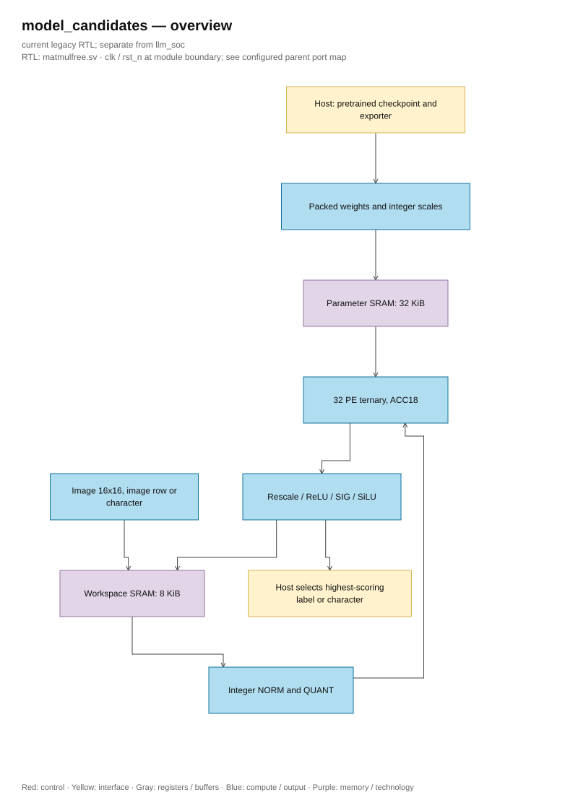

# Model survey for core matmulfree

<!-- reading-navigation:start -->
[Documentation](../../README.md) → [Archive](../../archive/README.md) → This page

| Reading guide | Document |
|---|---|
| New to the subject | [NPU and RTL fundamentals](../../00-start-here/fundamentals.md) · [Glossary](../../00-start-here/glossary.md) |
| Read first | [Legacy architecture](../../design/legacy/architecture.md) |
| Continue / related lookup | [Current evidence](../../verification/optimization_status.md) |
<!-- reading-navigation:end -->

> **Category: LEGACY.**

The document was saved before the update on 10/06/2026. The sentences written
“current” or “running” below belong to the time of writing; the workspace status
can be read at the [current verification page](../../verification/optimization_status.md).

**Updated on 01/10/2026:** RTL passed 9 regression items and demo synthesis. Checkpoint **Binary-MNIST width160_160_160** has been exported, running original CPU/reference integer/RTL correctly labels 10/10 sample images; 40 layers matched bit-exact with integer reference. See [demo checkpoint](<mnist.md>) and [integration report](<../../history/reviews/implementation_review.md>). Added [NanoFable demo](nanofable_hybrid.md): CPU generation 3 prompts × 32 tokens with deterministic repeat, RTL replay 168 real linear steps and 33,792 S32 bit-exact outputs. Full MNIST evaluation or running the full language graph on NPU has not yet been done.

Source inspection date: 28/09/2026. This document supplements the [bit width and SRAM proposal](<../../design/legacy/architecture.md>). The goal is to run the entire model on a small core: 32 processing elements (PE), INT8 activation, ternary weight encoded with 2 bits, 18-bit accumulator (ACC18), K≤512, 32 KiB parameter SRAM, and 8 KiB workspace SRAM. Here, K is the number of elements in a dot product; S16/S32 are signed integers with 16/32-bit width. NORM + QUANT consists of RMS normalization followed by quantizing activation to INT8. A model that runs on a computer may not necessarily run entirely on this ASIC.

**Scope after the latest request:** assume the model has already been trained; the NPU only runs inference. The application goal is a small language model that can generate short sentences. Ternary MLP 256→64→32→10 and Seq64 are supplementary hardware tests. The items about QAT below describe the origin/how the model was created, not a requirement to add a training block to the NPU or to retrain an already compatible checkpoint.

**Keep 32 PEs and the format of the baseline configuration.** The number of PEs determines the level of parallelism, not the language capability or directly the bit-width. The trained model still needs to have its graph, operators, K, memory checked, and be exported according to the correct arithmetic rules of the ASIC. The weight status column below records the actual verification level; the assumption is that the trained model used for hardware evaluation does not replace the verification of the checkpoint.

| Block / data | Format kept after review | When is change needed? |
|---|---|---|
| Activation in core / weight | **S8 / ternary 2 bit** | Checkpoint not suitable for this quantization; conversion must be evaluated first |
| Ternary accumulator | **S18, K≤512** | K≤1024 requires S19; K≤2048 requires S20; splitting into 32 PE rounds does not reduce this requirement |
| State, residual, embedding of Char32 | **S16 with separate scale** | Checkpoint comparison results show range or accuracy insufficient |
| NORM + QUANT | **S16→S8**; ΣX² **U40**, scratch **S24/F16**, mean-square/epsilon **U64** | K increases or checkpoint has different norm; need to review both intermediate and scratch memory |
| Gate / update state | **U16/F15**; accumulate **S32**, total **S33→S16** | Check string error requires different precision; do not change just because the model has been trained |
| Bias / logits | **S32**; logits same scale for argmax | Exporter determines range or error exceeds current capability |
| Token ID | **U8 for Char32 with 128 characters** | With V=4096: minimum U12, recommended store U16; output index U12 and output-count U13 |
| SRAM | **Word 256 bit; parameter 32 KiB + workspace 8 KiB** | Model does not fit: recalculate depth/bank, address and loading schedule; not necessarily increase word width |

The widths of each module, intermediate accumulations, and extended cases are listed in the [design bit table](<../../design/legacy/architecture.md#bit-table-for-each-block>). `F16`/`F15` in the notation above are fractional bit counts, not floating-point.

## Choose a model according to the demo purpose

| Candidate | Weight status | Estimated ASIC footprint | Usage |
|---|---|---|---|
| **FCMNIST ternary 256→64→32→10**, based on [BitNetMCU code](https://github.com/cpldcpu/BitNetMCU/blob/main/models.py) | Training code available; checkpoint not yet verified to have been trained with this configuration | 18,752 weights; **5,440 B** after row-wise padding. Including bias and scale reserves: **5,876 B**, not counting other metadata | Check NORM + QUANT, ternary multiplication and image classification |
| **BitNetMCU Binary-MNIST width160_160_160** in [pinned model data](https://github.com/cpldcpu/BitNetMCU/tree/0715bfc4ed9f2578496e17b4b0e13f2297e3cc0f/modeldata) | Loaded/checked four tensors and ran CPU/reference/RTL on 10 samples | Confirmed **256→160→160→160→10**, 93,760 weights, **31,360 B**, remaining **1,408 B**; runtime descriptor in FF | [Demo completed](<mnist.md>): 10/10 samples correct, 40 bit-exact layers; still a training checkpoint with Binary quantizer |
| **Tiny-MLGRU-Seq64** | Proposed architecture; checkpoint not yet verified | Reserved **11,904 B** for parameters; state 128 B | Checked NORM + QUANT, sigmoid, SiLU, and state update operation |
| **Tiny-Char-MLGRU32** | Proposed architecture; checkpoint not yet verified | Backup **25,504 B** including S16 embedding; state 64 B | Demo inference generating characters in a set of 128 ASCII characters; no conversational quality data yet |
| **[NanoFable-1M-ternary](https://huggingface.co/adrahmana/NanoFable-1M-ternary)** | Ran on CPU and 28 ternary tensors × 6 activation contexts on RTL | 2-bit linear padded: **212,992 B**, largest layer **12,288 B**; full model file about **1.16 MiB** | [Demo](nanofable_hybrid.md): CPU generation; linear RTL stream layer by layer. Affine RMSNorm/RoPE/attention/gating/head still on CPU |

The capacity of the three proposed models is calculated from the sizes of the layers and the way weights are stored in 256-bit SRAM; this is not yet the size of the actual output file. The name “2 bit” does not equate to ternary: `2bitsym` of BitNetMCU has four levels, whereas ternary weights only have {-1, 0, +1}. See [quantization code](https://github.com/cpldcpu/BitNetMCU/blob/main/BitNetMCU.py). The [MMfreeLM-370M](https://github.com/ridgerchu/matmulfreellm) model of the paper's author is too large for this SRAM; it is used as a reference for MLGRU/GLU.

## Core test demo: FCMNIST ternary

FCMNIST allows setting the number of nodes for each hidden layer and omitting the third hidden layer when `network_width3=0`. Initial configuration in the source code:

```python
from models import FCMNIST

model = FCMNIST(
    network_width1=64,
    network_width2=32,
    network_width3=0,
    QuantType="Ternary",
    WScale="PerTensor",
    NormType="RMS",
    num_classes=10,
)
```

The code above only creates the model for training; it does not load the trained weights. The file [trainingparameters.yaml](https://github.com/cpldcpu/BitNetMCU/blob/main/trainingparameters.yaml) currently defaults to selecting CNN and `4bitsym`. To train a ternary MLP, it is necessary to set `model: FCMNIST`, `QuantType: Ternary`, and the three widths 64/32/0.

Assuming the checkpoint has been trained, start by loading the weights, verifying the architecture, and exporting the quantization parameters. Only consider calibration or QAT/fine-tune if the conversion results are unsatisfactory; training is not part of the datapath or the NPU schedule.

| Layer | K→N | Number of weights | 2-bit weights without padding | SRAM after padding in 256-bit words | Computation rounds with 32 PE |
|---|---:|---:|---:|---:|---:|
| Hidden 1 | 256→64 | 16,384 | 4,096 B | 4,096 B | 512 |
| Hidden 2 | 64→32 | 2,048 | 512 B | 1,024 B | 64 |
| Classification | 32→10 | 320 | 80 B | 320 B | 10 |
| **Total** | | **18,752** | **4,688 B** | **5,440 B** | **586** |

The number 586 only counts the number of dot product operations; the time for NORM + QUANT, rescale, SRAM access, and control has not been calculated. Two S16 buffers of 256 elements each, a scratch buffer `z` S32 of 256 elements, the `q` S8 area of 256 elements, and 10 S32 output values require about **2,344 B** before calculating alignment. The model compiler still needs to check the actual allocation scheme in the 8 KiB SRAM workspace.

The exporter and reference model need to handle two points before loading the weights into the ASIC:

1. **NORM + QUANT Arithmetic Match:** BitNetMCU code calculates RMS by taking the square root of the mean of squares and then dividing directly. The ASIC reference version needs to determine `epsilon`, handling vectors that are all zeros, S16 scaling, RNE rounding rules, saturation, and approximate integer calculations. Compare inference before and after export; a trained checkpoint does not automatically guarantee compliance with these rules.
2. **Weight Packing:** Convert {-1, 0, +1} into `11/00/01`, add zeros so that each row matches the boundary of 128 weights/word. Do not directly load BitNetMCU’s base-3 packing type. The design uses 2 bits/weight for simple decoding; the information limit of three values is approximately 1.585 bits/weight, not the actual memory cell width.

Some C inference paths of BitNetMCU use ShiftNorm. Compared to that C path, ShiftNorm must be applied correctly; this result does not prove that ASIC's RMSNorm + QUANT is correct. The proposed MLP demo uses NORM + QUANT and needs accuracy to be measured again. The new ternary example in [BitNetMCU document](https://github.com/cpldcpu/BitNetMCU/blob/main/docs/documentation.md#jan-2-2026-finally-introducing-ternary-158-bit-inference) also has a convolution layer and 4-bit weight layer, so it is not possible to load the entire example into a core that only supports ternary linear layers.

## Available checkpoints to test the core

The public list of BitNetMCU includes the file:

```text
a11_Opt12k_cos_Aug_BitMnist_PerTensor_Binary_RMS_width160_160_160_lr0.001_decay0.1_stepsize10_bs128_epochs60.pth
```

[Pinned checkpoint commit](https://github.com/cpldcpu/BitNetMCU/tree/0715bfc4ed9f2578496e17b4b0e13f2297e3cc0f/modeldata) has been loaded and checked: fc1 (160,256), fc2/fc3 (160,160), fcl (10,160), no bias/affine. The history graph was restored at the commit adding the checkpoint on April 15, 2024, loaded strictly with PyTorch CPU and then exported with the correct quantizer and gain. The 2-bit layout per row confirms 980 words/31,360 B. [Demo report](<mnist.md>) recorded checksum and source provenance.

The Binary quantizer uses `sign(w−mean(w))` and gain `mean(abs(w))`. This CPU float32 version has one weight exactly at the mean, output as code 0; the remaining weights are −1/+1. This is still a training checkpoint with the Binary quantizer. Changing the label `QuantType` to `Ternary` does not produce a model trained for three levels nor guarantee accuracy preservation. Other checkpoints with bias, affine norm, or different sizes need to have their graph and capacity checked.

Parameter/workspace/instruction images have been created and the core was run with NORM→dynamic scale→TM→ReLU. Ten sample images with the correct labels on CPU/reference/RTL; all intermediates of 40 layers in integer form. The full program ran twice consecutively, 20,783 cycles per run for image number 0. This is a hardware demo on a small sample set; checkpoint `.pth` still needs to go through the exporter, cannot be loaded directly into RTL.

## Demo close to the architecture of paper 2406.02528v5

With **Seq64**, consider 28 rows of each MNIST image as 28 time steps. Each row of 28 pixels passes through a 28→64 layer, then through an MLGRU; the state at the final step goes through a 64→10 layer for classification. The model uses RMSNorm without affine parameters, NORM + QUANT, sigmoid LUT, and S16 state. Bias is represented as an integer if the model has bias. This configuration tests the state update in [MatMul-free LM paper](https://arxiv.org/html/2406.02528v5) using a task where accuracy can be measured.

With **Char32**, using a vocabulary of 128 ASCII characters, INT16 embedding, an MLGRU with state dimension 32, a GLU with hidden dimension 96, and a ternary output head 32→128. The checkpoint is assumed to have the ternary output head trained together with the model. Logits are used with the same scale to select the character with the highest score via argmax; greedy decoding does not require softmax. Model size and integer format are optional choices for the demo, not the trained configuration in the paper.

**"No dialogue quality confirmed" does not mean there is a lack of PE to generate a sentence.** The model can repeat inference to generate multiple characters, but whether the sentence matches the prompt must be checked at the checkpoint. The set of 128 ASCII characters does not directly contain Vietnamese characters with diacritics; to demo Vietnamese, you must fix the tokenizer/encoding and then recalculate the vocabulary and embedding. Requesting a short sentence does not automatically decide the number of bits for the datapath.

[NanoFable has been demoed](nanofable_hybrid.md): CPU generation and actual linear replay on RTL. 28 ternary tensors with 6 activation contexts per tensor pass 168 iterations; the largest K is 384. Linear weights have been padded using 212,992 B, the largest layer 12,288 B, and demo workspace 2,560 B. The entire model still has a compressed file of about 1.16 MiB along with affine RMSNorm/RoPE/attention/gating and embedding/output head outside the core. The points not yet met lie in memory, operators, and the export process, not a conclusion that 32 PEs cannot sequentially perform the supported linear layers. If you choose to deploy this model, you need to configure a separate expansion. With a vocabulary of 4096, token IDs can be stored as U16. A larger vocabulary does not automatically require an increase in width of logits; still recommend S32 with the same scale, but need to check the range and error when exporting the checkpoint. Storing the S32 logits vector will require 16 KiB, while streaming argmax for greedy decoding can avoid that buffer; this method does not solve the missing attention operators.



[Editable draw.io — model_candidates — overview](../../diagrams/architecture.drawio) · Page `01_model_candidates_1`.

## How to check the demo

The width and format that need to be changed in each RTL module are listed in the [module conversion table](<../../design/legacy/architecture.md#conversion-table-for-each-existing-rtl-module>). Use the same configuration K_MAX=512, ACC18, and SRAM256 bus for the demos in this document; the scale of each tensor is fixed during calibration/QAT.

- Fix the checkpoint, tokenizer, or input image processing method, and evaluation set. Check the graph, operator, K, vocabulary, and memory before loading. Measure quality before and after exporting to integer.
- Export SRAM image containing weights, scale coefficients, biases, input data, and intermediate values for comparison. Attach version and checksum to the files.
- Compare results at each layer or each time step with the integer reference model. Reset state between two independent input sequences.
- Measure the number of cycles for data loading, NORM + QUANT, and vector processing; record peak SRAM usage and number of saturations. The number of PEs is insufficient to infer latency or power.

**Current status:** [demo Binary-MNIST160](<mnist.md>) completed, using available checkpoint and 10 S8 images from upstream; no retraining. PyTorch 2.5.1+cpu installed separately in `tests/model_demo/packages`, without modifying the global Python. Legacy runner has been removed; report/provenance kept for reference. [NanoFable](nanofable_hybrid.md) ran CPU 3 prompts × 32 tokens, deterministic repeat and RTL 168 real linear cycles, compile/sim 0 error/0 warning. All new cycles use full RTL runner with hardware gate. Full MNIST, Seq64, Char32, or complete NanoFable graph on NPU has not been run yet.

---

[Completed demos](../README.md) · [Interface export](<../../design/legacy/interfaces.md>) · [Back to document table of contents](../../README.md)
