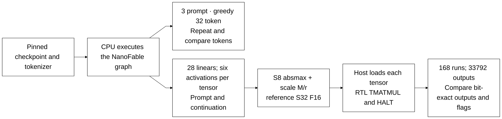

# NanoFable hybrid: kết quả lịch sử

Bản tài liệu được lưu trước đợt cập nhật ngày 06/10/2026. Các câu ghi
“current” hoặc “đang chạy” bên dưới thuộc thời điểm viết; trạng thái workspace
đọc tại [trang kiểm chứng hiện tại](../../verification/optimization_status.md).

[Project](../../../README.md) → [Tài liệu](../../README.md) → [Model demo](../README.md) → **NanoFable**

Đây là bằng chứng hybrid trước, được giữ để tra cứu. [Full RTL graph mới](../../design/full_rtl_language.md)
đã triển khai toàn bộ computation và token selection; chưa chạy pretrained
application vì gate timing >=100 MHz chưa đạt. Dùng [runner có gate](../../../tests/full_rtl/README.md)
cho các lần chạy tiếp theo; CPU continuation dưới đây không phải demo RTL.

Metadata hiện dùng khớp các SHA trong [manifest đã pin](../../../tests/language_demo/upstream_manifest.json):
root checkpoint là seed1, 4 layers/128 channels/4 heads/vocabulary4096; model
được train với context512, còn cấu hình RTL lưu128positions. [Model card đã pin](https://huggingface.co/adrahmana/NanoFable-1M-ternary/blob/8bb40dbf501bbad4a12a11c5697e5ad239744539/README.md)
công bố seed0 như một training replica cùng kiến trúc, đồng thời báo các tiêu
chí coherence/fluency chưa đạt ngưỡng của tác giả. Numeric/token matching sau
export phải được ghi riêng với chất lượng đoạn văn RTL thực sự trả về.
Runner hiện pin seed1; seed0 chưa export/run và một training replica không chứng
minh hỗ trợ kiến trúc model thứ hai. Chỉ chạy checkpoint tiếp theo khi hardware
gates cho source/config hiện tại đạt và exporter kiểm chứng cấu hình phù hợp.

Demo dùng checkpoint đã train **NanoFable-1M-ternary**: chạy toàn graph sinh văn bản trên CPU, sau đó kiểm chứng các linear ternary thật bằng core RTL hiện hành. **168 lượt RTL PASS, 33.792 đầu ra S32 khớp bit-exact với reference số nguyên**, compile và simulation đều **0 error/0 warning**. Toàn graph sinh văn bản chưa chạy trên RTL.

## Checkpoint và graph

| Thuộc tính | Cấu hình được kiểm tra |
|---|---|
| Model | [adrahmana/NanoFable-1M-ternary](https://huggingface.co/adrahmana/NanoFable-1M-ternary/tree/8bb40dbf501bbad4a12a11c5697e5ad239744539) |
| Tham số / checkpoint tensors | 1.377.408 / 38 |
| Transformer | 4 block, width 128, 4 heads, context 512 |
| Tokenizer | ByteLevel BPE, vocabulary 4.096 |
| Graph | RMSNorm có gain, RoPE, causal attention, SwiGLU, residual, embedding/head tied |
| Linear trong block | 28 tensor, mỗi weight thuộc `scale × {-1, 0, +1}`; không bias |
| Checkpoint SHA-256 | `cfa114a8e411c25e89f8b507cb5886785f89132352743f26cd23a7cbaab863ae` |

Checkpoint safetensors lưu weight ternary đã dequantize dưới dạng FP16. CPU nạp các giá trị đó vào graph float32 theo [hướng dẫn upstream đã pin](https://huggingface.co/adrahmana/NanoFable-1M-ternary/blob/8bb40dbf501bbad4a12a11c5697e5ad239744539/README.md), giữ tied head và kiểm tra các key checkpoint. Export giữ nguyên mã ternary và scale của tensor, không train hoặc lượng tử hóa lại weight. [Manifest](../../../tests/language_demo/upstream_manifest.json) pin revision model, source và SHA-256 từng asset; [source graph](https://github.com/adit-rah/nanofable/blob/4bb4ca58421f62652f6804aa4164f5be992779e2/src/nanofable/model.py) là bản dùng trong demo.

## Luồng kiểm chứng



Mỗi prompt cung cấp hai context: prompt ban đầu và prompt nối với 32 token sinh ra. Hook lấy activation của token cuối tại từng linear. Input được lượng tử hóa absmax/127 với nearest-even thành S8; postscale đưa tích ternary về **S32 F16**. Reference dùng tích số nguyên và RNE độc lập; host đọc lại output, trạng thái và flags của core.

RMSNorm gain, RoPE, attention/softmax, residual, SwiGLU và embedding/head được tính trên CPU. Các lượt RTL này kiểm tra TMATMUL trên dữ liệu thật; không chứng minh NORM của core tương đương affine RMSNorm của model, cũng không kiểm tra chất lượng sinh văn bản sau export toàn graph.

## Kết quả

| Kiểm tra | Kết quả |
|---|---|
| CPU text generation | 3 prompt × 32 token mới; chạy lại từng prompt cho cùng token |
| Linear RTL | 28 tensor × 6 activation = 168 lượt PASS |
| Output / host checks / commands | 33.792 / 34.128 / 95.801 |
| Compile / simulation | 0 error, 0 warning ở cả hai bước |
| Sai số so với linear CPU float32 | Relative L2 lớn nhất 1,78%; trung bình 0,288%; absolute lớn nhất 0,02284 |
| Tổng chu kỳ active của 168 lượt | 746.760; không phải latency toàn model ngôn ngữ |

Bản chạy cuối ngày **01/10/2026 lúc 14:30:57 (UTC+7)**. Sai số ở bảng là ảnh hưởng lượng tử hóa activation và postscale tại **linear**, đo trên 168 activation đã lấy. Đầu ra RTL khớp chính xác với reference số nguyên; reference số nguyên có sai số so với CPU float32. Chưa đo perplexity hoặc đánh giá dataset ngôn ngữ.

### Văn bản CPU sinh ra

Greedy argmax, không sampling ngẫu nhiên, không thêm BOS ngoài token của prompt. Token IDs và toàn continuation nằm trong [results](../../../tests/language_demo/results.json); các activation/reference chi tiết được tạo local trong `cpu_reference.json` khi chạy lại. Ví dụ prompt `Lily had a little cat.` cho continuation:

```text
 She was very happy. She was so happy. She was so happy. She was so happy. She was so happy. She was so happy. She was
```

Hai prompt còn lại là `Once upon a time` và `In a small village, a boy`. Model nhỏ có lặp từ/câu và nội dung chưa mạch lạc; demo xác nhận checkpoint thực chạy được và phép linear khớp reference, không đưa ra kết luận về chất lượng model.

## Memory và phạm vi chạy

| Tensor trong mỗi block | K → N | Dung lượng weight 2 bit trên core |
|---|---:|---:|
| q, k, v, o | 128 → 128 | 4.096 byte mỗi tensor |
| gate, up | 128 → 384 | 12.288 byte mỗi tensor |
| down | 384 → 128 | 12.288 byte |

Tổng 28 tensor chiếm **212.992 byte**, bằng 6,5 lần SRAM parameter 32 KiB; chưa tính embedding/head và phần graph còn lại. Mỗi tensor riêng lớn nhất **12.288 byte** và K lớn nhất **384**, phù hợp K≤512. Demo nạp lần lượt tensor qua host, workspace high-water **2.560 byte**. Các lần nạp/readback host không nằm trong chu kỳ active của bảng kết quả.

Để chạy toàn model trên ASIC cần giải quyết memory/streaming và các operator còn thiếu; [model candidates](model_candidates.md) ghi tính tương thích với core hiện tại. Số chu kỳ mô phỏng không xác nhận clock, STA hoặc PPA ASIC.

## Application hiện tại và bằng chứng lịch sử

Runner hybrid cũ đã được loại bỏ. [Asset setup](../../../tests/language_demo/README.md)
giữ checkpoint/tokenizer đã pin; mọi lượt sinh token mới dùng [full RTL runner có gate](../../../tests/full_rtl/README.md).
Kết quả CPU/hybrid ở trên chỉ mô tả snapshot lịch sử, không chứng minh demo RTL toàn graph.
Các script cũ có thể lấy lại từ commit `d9ed7921d42731a198f565785a8ae79b20c7c79e`.

[Regression core](../../verification/README.md) · [Demo MNIST toàn graph](../mnist.md) · [ISA và host](../../design/interfaces.md) · [Về mục lục demo](../README.md)
