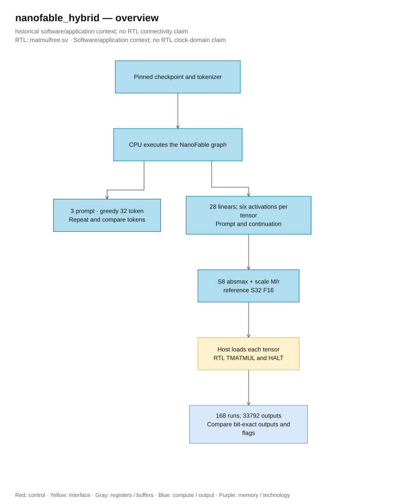

# NanoFable hybrid: historical results

<!-- reading-navigation:start -->
[Documentation](../../README.md) → [Archive](../../archive/README.md) → This page

| Reading guide | Document |
|---|---|
| New to the subject | [NPU and RTL fundamentals](../../00-start-here/fundamentals.md) · [Glossary](../../00-start-here/glossary.md) |
| Read first | [Legacy architecture](../../design/legacy/architecture.md) |
| Continue / related lookup | [Current evidence](../../verification/optimization_status.md) |
<!-- reading-navigation:end -->

> **Category: LEGACY.**

This document was saved before the update on 06/10/2026. The sentences recorded
“current” or “running” below refer to the time of writing; the workspace status
can be read at [current verification page](../../verification/optimization_status.md).

This is the previous hybrid proof, kept for reference. [Full new RTL graph](../../design/full_rtl_language.md)
has implemented all computation and token selection; pretrained
application not yet run because gate timing >=100 MHz not met. Use [runner with gate](../../../tests/full_rtl/README.md)
for subsequent runs; the CPU continuation below is not an RTL demo.

Metadata currently matches SHA in the [pinned manifest](../../../tests/language_demo/upstream_manifest.json):
root checkpoint is seed1, 4 layers/128 channels/4 heads/vocabulary4096; model
was trained with context512, while RTL configuration stores 128 positions. [Pinned model card](https://huggingface.co/adrahmana/NanoFable-1M-ternary/blob/8bb40dbf501bbad4a12a11c5697e5ad239744539/README.md)
publishes seed0 as a training replica with the same architecture, while reporting the
coherence/fluency criteria did not reach the author's threshold. Numeric/token matching post
export must be recorded separately from the actual quality of RTL returned paragraphs.
Runner currently has seed1 loaded; seed0 has not been exported/run and a training replica has not supported the second model architecture. Only run the next checkpoint when the hardware
gates for the current source/config are met and the exporter verifies the configuration is correct.

Demo using trained checkpoint **NanoFable-1M-ternary**: runs the entire text generation graph on CPU, then verifies actual linear ternaries with the current RTL core. **168 RTL PASS cycles, 33,792 S32 outputs match bit-exact with integer reference**, compilation and simulation both **0 error/0 warning**. The entire text generation graph has not yet run on RTL.

## Checkpoint and graph

| Attribute | Verified configuration |
|---|---|
| Model | [adrahmana/NanoFable-1M-ternary](https://huggingface.co/adrahmana/NanoFable-1M-ternary/tree/8bb40dbf501bbad4a12a11c5697e5ad239744539) |
| Parameters / checkpoint tensors | 1,377,408 / 38 |
| Transformer | 4 blocks, width 128, 4 heads, context 512 |
| Tokenizer | ByteLevel BPE, vocabulary 4,096 |
| Graph | RMSNorm with gain, RoPE, causal attention, SwiGLU, residual, embedding/head tied |
| Linear in block | 28 tensors, each weight belongs to `scale × {-1, 0, +1}`; no bias |
| Checkpoint SHA-256 | `cfa114a8e411c25e89f8b507cb5886785f89132352743f26cd23a7cbaab863ae` |

Checkpoint safetensors saves the ternary weight that has been dequantized in FP16 format. The CPU loads these values into the float32 graph according to the [upstream guide it has pinned](https://huggingface.co/adrahmana/NanoFable-1M-ternary/blob/8bb40dbf501bbad4a12a11c5697e5ad239744539/README.md), keeping the tied head and checking the checkpoint keys. Export preserves the original ternary code and tensor scale, without training or re-quantizing the weight. [Manifest](../../../tests/language_demo/upstream_manifest.json) pins the model revision, source, and SHA-256 of each asset; [source graph](https://github.com/adit-rah/nanofable/blob/4bb4ca58421f62652f6804aa4164f5be992779e2/src/nanofable/model.py) is the version used in the demo.

## Verification flow



[Editable draw.io — nanofable_hybrid — overview](../../diagrams/architecture.drawio) · Page `02_nanofable_hybrid_1`.

Each prompt provides two contexts: the original prompt and the prompt concatenated with the 32 generated tokens. The hook takes the activation of the last token at each linear layer. The input is quantized absmax/127 with nearest-even into S8; postscale brings the ternary product to **S32 F16**. Reference uses integer multiplication and independent RNE; the host rereads the core's output, state, and flags.

RMSNorm gain, RoPE, attention/softmax, residual, SwiGLU, and embedding/head are calculated on the CPU. These RTL runs test TMATMUL on real data; they do not prove that the core's NORM is equivalent to the model's affine RMSNorm, nor do they check the text generation quality after exporting the entire graph.

## Results

| Check | Result |
|---|---|
| CPU text generation | 3 prompts × 32 new tokens; rerun each prompt for the same tokens |
| Linear RTL | 28 tensors × 6 activations = 168 PASS rounds |
| Output / host checks / commands | 33.792 / 34.128 / 95.801 |
| Compile / simulation | 0 errors, 0 warnings in both steps |
| Error compared to linear CPU float32 | Maximum relative L2 1.78%; average 0.288%; maximum absolute 0.02284 |
| Total active cycles of 168 rounds | 746,760; not the latency of the entire language model |

Final run at the end of the day **01/10/2026 at 14:30:57 (UTC+7)**. The error in the table is due to the quantization of activation and postscale at **linear**, measured on 168 sampled activations. The RTL output exactly matches the integer reference; the integer reference has an error compared to CPU float32. Perplexity or language dataset evaluation has not been measured yet.

### Text generated by CPU

Greedy argmax, no random sampling, no BOS added other than the prompt's token. Token IDs and the complete continuation are in [results](../../../tests/language_demo/results.json); detailed activation/reference were generated locally in `cpu_reference.json` when rerunning. Example prompt `Lily had a little cat.` for continuation:

```text
 She was very happy. She was so happy. She was so happy. She was so happy. She was so happy. She was so happy. She was
```

The other two prompts are `Once upon a time` and `In a small village, a boy`. The small model has repeated words/sentences and the content is not coherent; the demo confirms the checkpoint runs correctly and the linear operation matches the reference, without drawing conclusions about the model's quality.

## Memory and execution scope

| Tensor in each block | K → N | Weight capacity 2-bit per core |
|---|---:|---:|
| q, k, v, o | 128 → 128 | 4,096 bytes per tensor |
| gate, up | 128 → 384 | 12,288 bytes per tensor |
| down | 384 → 128 | 12.288 byte |

A total of 28 tensors occupy **212,992 bytes**, which is 6.5 times the 32 KiB SRAM parameter; this does not include embedding/head and the remaining part of the graph. The largest individual tensor is **12,288 bytes** and the largest K is **384**, suitable for K≤512. Demo loads tensors sequentially via host, high-water workspace **2,560 bytes**. Host load/readback times are not within the active cycles of the result table.

To run the entire model on ASIC, memory/streaming and missing operators need to be addressed; [model candidates](model_candidates.md) record compatibility with the current core. The number of simulation cycles does not confirm ASIC clock, STA, or PPA.

## Current application and historical evidence

The old hybrid runner has been removed. [Asset setup](../../../tests/language_demo/README.md)
Keep the pinned checkpoint/tokenizer; every new token generation uses [full RTL runner with gate](../../../tests/full_rtl/README.md).
The CPU/hybrid results above only describe historical snapshots, not proving full graph RTL demos.
Old scripts can be retrieved from commit `d9ed7921d42731a198f565785a8ae79b20c7c79e`.

[Regression core](../../verification/README.md) · [Full graph MNIST demo](<mnist.md>) · [ISA and host](<../../design/legacy/interfaces.md>) · [Back to demo table of contents](../README.md)
