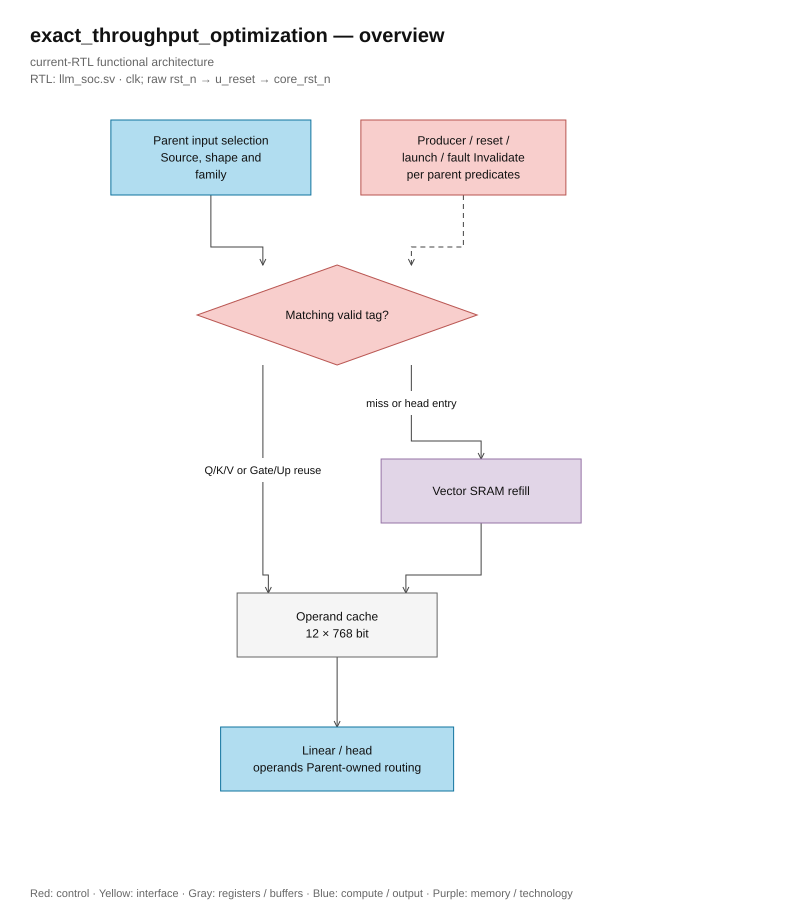
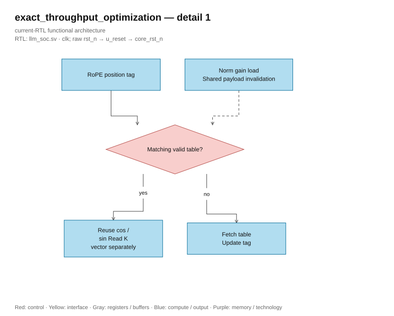

# Optimize throughput and resource usage

<!-- reading-navigation:start -->
[Documentation](../README.md) → [06 · Research](../06-research/README.md) → This page

| Reading guide | Document |
|---|---|
| New to the subject | [NPU and RTL fundamentals](../00-start-here/fundamentals.md) · [Glossary](../00-start-here/glossary.md) |
| Read first | [Architecture and numeric contracts](full_rtl_language.md) |
| Continue / related lookup | [Measured results and evidence](../verification/optimization_status.md) |
<!-- reading-navigation:end -->

> **Category: GUIDE.**

Optimize while keeping the graph geometry fixed: four layers, 128 channels, four heads,
FFN 384 channels, vocabulary 4,096 and context 128. The goal is to reduce compute clocks
and SRAM transactions, while maintaining rounding, saturation, faults, sampling ties
and PRNG update order. Measurement data is in [review version 3](../reviews/rtl_change_review_v3.md).

## Resource ownership

| Owner | Task | Shared resources |
|---|---|---|
| llm_soc | Graph, metadata, operand cache, scaling, vector writes, probability/V pass and sampling | SRAM, SIMD and scalar units |
| llm_linear_engine | One ternary row, two-word prefetch credit, reserved-code fault and response drain | Parameter SRAM, immutable operand cache |
| llm_head_engine | Four int8 chunks in order and S39 row accumulation | Parameter SRAM, cached final hidden vector and SIMD |
| llm_attention_engine | Q/K causal requests, score scaling, score storage and maximum | KV SRAM, held query and SIMD |
| llm_attention_normalize | Exact RNE divide, sign restoration and S24 clamp per batch | Lane 0 shares RMSNorm divider; three additional separate dividers |
| ternary_dot32 | S25 terms and balanced S30 reduction pipeline | Separate logic add/subtract |

Each pass must drain the responses before the parent transfers resource ownership.
SRAM parameter has only one owner issuing requests at a time. The tests check
ownership and limit the linear engine's two-word prefetch.

## Operand cache, scales, and packed stores

A register cache **12 × 768 bits = 9,216 payload bits** shared between linear
and head. Q, O, Gate, and Down preload input; Q/K/V and Gate/Up only reuse when source,
geometry, and family match. Producer writes, reset, launch, faults, or head entry
invalidate the linear cache. Head reloads four rows of the final-normalized vector
in each pass; do not add a separate cache for the head.

The head holds a 256-bit word scale for eight vocabulary rows. Each coefficient has
24 bits in a 32-bit slot. Vocabulary order and PRNG updates remain unchanged. RoPE K
reuses the Q table when the position tag is still valid, while still reading the separate K vector.
Load norm gains into shared table storage, invalidating the RoPE tag.

Linear pack 32 scalar outputs into write_vector_q. Lane 31 is captured before
the next full-mask transaction; completion waits for write drain. Reset probes cover
prefetch, in-flight dot, coefficient processing and the last lane before flush.

## SIMD streaming and replication

llm_math keeps the default legacy mode. With STREAMING=1, `start && in_ready` is possible
accept each clock when the pipeline still has previous transactions. Counting from acceptance E0,
product_valid output in E3, sum_valid in E8, and legacy done in E9. The responses have stages
Separate; the consumer must use the correct valid channel. Reset cancels validity and deasserts ready.

Four sigmoid lanes process a batch of four elements with interpolation/RNE kept unchanged.
Normalizer captures quotient and rounding metadata, then separates rounding, restores the sign
and clamp to the stage registers.

ATTN_DIV_LANES and SIGMOID_LANES are elaboration parameters, supporting powers
two divides evenly into 32: 1, 2, 4, 8, 16, or 32. Default geometry and scope of application of
evidence are recorded in [architecture](full_rtl_language.md) and [status](../verification/optimization_status.md).

## Transaction geometry

The reuse of operand/scale is limited and recording vectors in packed form helps reduce the number of
SRAM transactions. Measurements before/after are in [throughput review dated 2026-10-06](../reviews/rtl_change_review_v3.md);
current measurements and scope of application are recorded in [verification status](../verification/optimization_status.md).

## Source and verification

isqrt_u64 and sram_word_tile have been separated into a shared file. Full-top Quartus file
list does not compile norm, banked_word_ram or sram_256_wrapper legacy. These
modules are still kept for caller and separate regression. Operator IDs needed for
the old fixture are retained; they do not add a new graph operation.

Regression keeps independent S128 reference, checks sustained/sparse streaming,
S24_MIN, reserved ternary code and exact normalization. Approximate
reciprocal is not used in this normalize path. [Verification status](../verification/optimization_status.md)
records proof applied to workspace; application requires all-seven PASS and full-top
timing matches source/config before pretrained execution.

## Cache reuse and ownership

This diagram summarizes the control conditions of the parent; it does not add module instance cache.
The predicates in the source remain the standard source.

[Editable draw.io — exact_throughput_optimization — overview](../diagrams/architecture.drawio) · Page `03_exact_throughput_optimization_1`.

[Editable draw.io — exact_throughput_optimization — detail 1](../diagrams/architecture.drawio) · Page `04_exact_throughput_optimization_2`.
