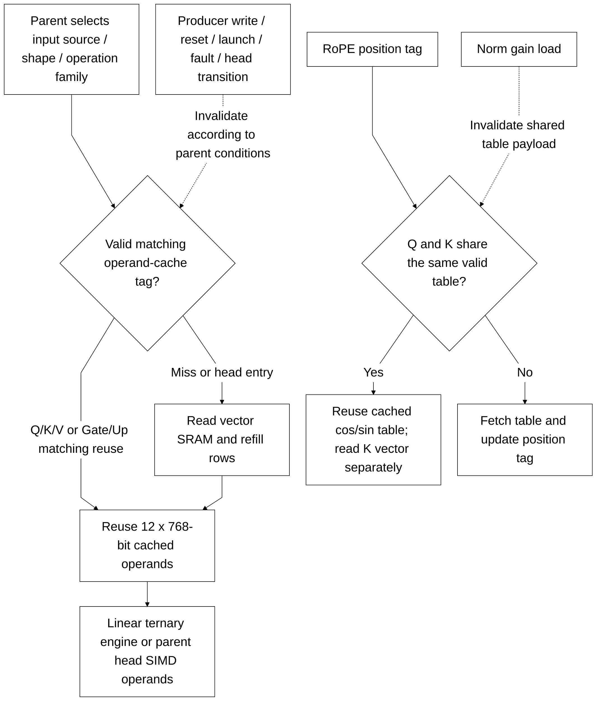

# Tối ưu throughput và quyền dùng tài nguyên

[Tài liệu](../README.md) → [Thiết kế](README.md) → **Throughput**

Tối ưu giữ geometry cố định của graph: bốn layer, 128 channel, bốn head,
FFN 384 channel, vocabulary 4.096 và context 128. Mục tiêu là giảm compute clocks
và SRAM transactions, đồng thời giữ rounding, saturation, faults, sampling ties
và thứ tự cập nhật PRNG. Số liệu đo nằm trong [review version 3](../reviews/rtl_change_review_v3.md).

## Quyền sở hữu tài nguyên

| Owner | Công việc | Tài nguyên dùng chung |
|---|---|---|
| llm_soc | Graph, metadata, operand cache, scaling, vector writes, probability/V pass và sampling | SRAM, SIMD và các scalar units |
| llm_linear_engine | Một ternary row, hai-word prefetch credit, reserved-code fault và response drain | Parameter SRAM, immutable operand cache |
| llm_head_engine | Bốn int8 chunk theo thứ tự và S39 row accumulation | Parameter SRAM, cached final hidden vector và SIMD |
| llm_attention_engine | Q/K causal requests, score scaling, score storage và maximum | KV SRAM, held query và SIMD |
| llm_attention_normalize | Exact RNE divide, sign restoration và S24 clamp theo batch | Lane 0 dùng chung divider RMSNorm; ba divider riêng bổ sung |
| ternary_dot32 | S25 terms và balanced S30 reduction pipeline | Logic add/subtract riêng |

Một pass phải drain các response trước khi parent chuyển resource ownership.
Parameter SRAM chỉ có một owner phát request tại một thời điểm. Các test kiểm
tra ownership và giới hạn hai-word prefetch của linear engine.

## Operand cache, scales và packed stores

Một register cache **12 × 768 bit = 9.216 payload bits** dùng chung cho linear
và head. Q, O, Gate và Down preload input; Q/K/V và Gate/Up chỉ reuse khi source,
geometry và family khớp. Producer writes, reset, launch, faults hoặc head entry
invalidate linear cache. Head nạp lại bốn row của final-normalized vector mỗi
lần vào pass; không thêm cache riêng cho head.

Head giữ một word scale 256 bit cho tám vocabulary row. Mỗi coefficient có
24 bit trong slot 32 bit. Vocabulary order và PRNG updates giữ nguyên. RoPE K
reuse bảng của Q khi position tag còn hợp lệ, đồng thời vẫn đọc K vector riêng.
Nạp norm gains vào table storage dùng chung làm mất validity của RoPE tag.

Linear pack 32 scalar outputs vào write_vector_q. Lane 31 được capture trước
transaction full-mask kế tiếp; completion chờ write drain. Reset probes phủ
prefetch, in-flight dot, coefficient processing và lane cuối trước flush.

## SIMD streaming và replication

llm_math giữ mode legacy mặc định. Với STREAMING=1, `start && in_ready` có thể
accept mỗi clock khi pipeline còn các transaction trước. Tính từ acceptance E0,
product_valid xuất ở E3, sum_valid ở E8 và legacy done ở E9. Các response có stage
riêng; consumer phải dùng đúng valid channel. Reset hủy validity và deassert ready.

Bốn sigmoid lane xử lý batch bốn phần tử với interpolation/RNE giữ nguyên.
Normalizer capture quotient và rounding metadata, rồi tách round, phục hồi dấu
và clamp thành các stage register.

ATTN_DIV_LANES và SIGMOID_LANES là elaboration parameters, hỗ trợ các lũy thừa
hai chia hết 32: 1, 2, 4, 8, 16 hoặc 32. Evidence hiện được đo với mặc định bốn
lane ở cả hai khối, PERF_COUNTERS=0 và ENABLE_DEBUG_INDEX=0. Geometry khác cần
matched evidence riêng.

## Transaction geometry

| Mỗi layer hoặc head invocation | Baseline | Tối ưu |
|---|---:|---:|
| Linear vector reads / layer | 6.656 | 24 |
| Linear vector write transactions / layer | 1.408 | 44 |
| RoPE parameter reads / layer | 4 | 2 |
| Head vector reads / invocation | 16.384 | 4 |
| Head scale reads / invocation | 4.096 | 512 |

Graph tổng hợp gồm hai prompt token, ba token mới và 16 lượt layer đã kiểm tra
77.756 parameter reads, 1.828 vector reads, 1.564 vector writes, 320 KV reads và
128 KV writes. Đây là transaction counts; cycle, area và timing dùng số liệu
trong manifest của checkpoint tương ứng.

## Source và kiểm chứng

isqrt_u64 và sram_word_tile đã tách thành file dùng chung. Full-top Quartus file
list không compile norm, banked_word_ram hoặc sram_256_wrapper legacy. Những
module này vẫn được giữ cho caller và regression riêng. Operator IDs cần cho
fixture cũ được giữ; chúng không thêm một graph operation mới.

Regression giữ reference S128 độc lập, kiểm tra sustained/sparse streaming,
S24_MIN, reserved ternary code và normalization exact. Không dùng approximate
reciprocal trong đường normalize này. [Verification status](../verification/optimization_status.md)
ghi bằng chứng áp dụng cho workspace; application cần all-seven PASS và full-top
timing khớp source/config trước pretrained execution.

## Cache reuse and ownership

This diagram summarizes parent control conditions; it does not introduce a cache module instance. The source predicates remain authoritative.

