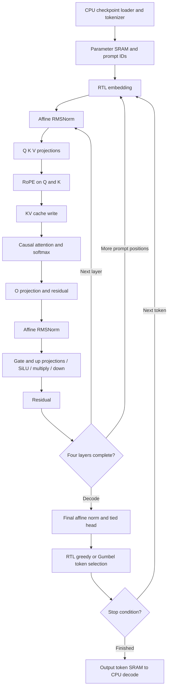

# Autonomous language inference — implementation in progress

[Design hub](architecture.md) · [Demo status](../demos/language.md) · [Timing evidence](../verification/timing/README.md)

This extension is **not yet a verified full graph demo**. The existing language
demo covers isolated ternary linears and uses CPU graph execution. It does not
meet the new full RTL requirement.

## Required execution boundary

CPU loads the checkpoint, static quantization tables and prompt token IDs, and
decodes returned token IDs into text. RTL performs embedding, every transformer
block, affine RMSNorm, RoPE, causal attention and softmax, SwiGLU, residuals,
the tied language head, token selection and the autoregressive loop. Prompt
prefill also executes on RTL. CPU must not supply intermediate activations,
attention results, logits or selected continuation tokens.

## Implemented checkpoint layout and storage

Use the already pinned NanoFable checkpoint, 1,377,408 parameters, four layers,
128 channels, four heads, 384 hidden channels and vocabulary 4,096. Preserve the
checkpoint's trained ternary codes and scales. Quantize the floating embedding
and tied head to per-row S8 codes with a shared row scale. This changes numeric
precision and requires an independent integer reference and a quality check.

| Storage | Payload | RTL representation |
|---|---:|---|
| Parameter SRAM | 768 KiB | 24,576 × 256 bits; embedding, ternary weights, scales, gains, RoPE tables |
| KV cache | 384 KiB | 4 layers × 128 positions × K/V × 128 channels × S24 |
| Vector workspace | 9 KiB | 8 buffers × 384 channels × S24/F16 |
| Prompt and output token buffers | 384 bytes of logical bits | 128 × 12-bit IDs in each buffer; host uses 32-bit words |

The 128-position context allows a short prompt plus a 96-token continuation.
The Quartus memory demo uses Cyclone V `5CGXFC9E6F35C7`; fit and
timing must verify the actual memory packing. The ASIC SRAM boundary remains
generic SystemVerilog with no vendor primitives or synthesis conditionals.

## Graph and execution interfaces

`llm_soc` contains two state machines: `graph` chooses the transformer stage;
`op` sequences memory requests and arithmetic. `llm_math` has 32 signed lanes
with a registered balanced reduction. The sqrt, divider and sigmoid engines
are shared. Parameters remain fixed during inference. One operator runs at a
time and uses registered addresses before asserting SRAM enables.

The host memory map and request/response protocol are defined in the
[full RTL test guide](../../tests/full_rtl/README.md). The ISA-driven legacy
`matmulfree` top remains a separate design, with its own host contract and
timing history. Its timing cannot establish closure for `llm_soc`.

## Numeric contracts

| Quantity | Format and conversion |
|---|---|
| Activations and cache | Signed 24-bit, F16; saturate to −2²³…2²³−1 |
| Embedding and tied head | Signed 8-bit codes with per-row U24/F24 scale |
| Ternary matrices | 2-bit 00/01/11 for 0/+1/−1; U24/F24 coefficient |
| Matrix reduction | Signed 39-bit accumulator; S64 coefficient product; RNE shift 24 |
| RMSNorm | Sum of 128 squares in U64, floor mean, add epsilon 42950 in F32, floor sqrt; RNE reciprocal 2³²/root |
| Norm affine gain | Signed 16-bit/F12; normalized activation rounded and saturated before gain |
| RoPE | Signed 16-bit/F15 cos/sin; S56 products, S64 sum and RNE shift 15 |
| Attention score | Dot rounded by 16, then signed multiply by 11585 and RNE shift 16 (1/√32) |
| Softmax | Subtract maximum; U25/F24 exp table at 1/16 spacing; linear interpolation with half-up rounding; differences ≥16 return zero |
| Attention value reduction | S56 weighted sum; divide magnitude by U32 weight sum, RNE, restore sign |
| SiLU | Activation rounded F16→F12 and clamped S16; sigmoid U16/F15; S56 multiply and RNE15 |
| Sampler | Xorshift32 and S24/F16 Gumbel table; U8/F8 temperature; S32 saturated comparison |

RNE uses ties to even. Special tokens 0 and 2 are excluded from selection;
token 1 (EOS) is excluded until `min_new`. Equal eligible scores preserve the
lowest ID, including when every eligible score is S32_MIN. Selection starts
with the lowest eligible ID; excluded IDs cannot win a saturated tie.
Reserved ternary code `10` raises a format fault. Context bounds require prompt+maximum continuation ≤128. Generation
ends at maximum count, EOS or the final context position. Reset cancels control
transactions; it does not clear SRAM. A new launch starts at position zero and
only reads cache entries already written in that run. Reset must span a rising
clock edge to reset the synchronous operator state as well as asynchronous
host/graph validity controls.

## SRAM replacement boundary and latency

`sram_word_tile` in [banked_word_ram.sv](<../../Verilog%20Source%20code/banked_word_ram.sv>)
is the replaceable leaf. Each tile provides one synchronous read and one
independent write port, up to 1024 words. A read accepted at an edge returns
the pre-write word after that edge, including a same-address collision.
Outputs hold when read enable is low. Contents, output data and tile tags are
unreset; clients must honor response validity and load data before reading.

| Adapter | Read contract | Write contract |
|---|---|---|
| `banked_word_ram` | One edge, tile tag and leaf read captured together, output tile mux after edge | One word at the edge |
| `llm_bank_ram` | Two edges including local lane request capture; reset cancels queued reads/valid | Lane mask, address and data accepted together; leaf writes on the next edge; reset cancels queued writes |
| `sram_256_wrapper` | Two edges from adapter request to valid; host lane/address tags reject stale response | 8 × 32-bit mask; host write priority |
| `llm_math` | Seven subsequent edges after accepting start to done | Busy starts ignored; reset cancels valid pipeline |

Quartus currently infers SRAM behind this boundary. A Quartus IP or ASIC SRAM
macro must implement the same port, latency, collision and reset contracts or
add compensation inside the adapter. It must not change compute equations.
Fit reports, rather than synthesis RAM-segment counts, establish physical M10K
packing. The first full fit used 1111 RAM blocks and 24125 ALMs, with worst
Fmax 70.41 MHz. The next pipeline fit used 23060 ALMs and improved Fmax to
83.58 MHz; both fail setup timing. Local-request source fitted at 22873 ALMs,
23168 registers,1187 RAM blocks and102 DSPs, but still fails at84.49 MHz.
See [full timing evidence](../verification/timing/README.md).

The adapter prevents merging its per-lane address/enable registers with the
Quartus `dont_merge` attribute, keeping request fanout local to each bank.
This physical policy is confined to the replaceable memory boundary; arithmetic
and graph control remain portable. See the [Quartus 18.1 register option](https://docs.altera.com/r/docs/683283/18.1/quartus-prime-standard-edition-user-guide/disable-register-merging/don-t-merge-register?contentId=2sbp49HPEKxMKMzpgzhtuw).

## Verification gates

1. Arithmetic and protocol unit tests with independent wide integer references.
   Nonuniform signed RMSNorm and full-context attention exercise interpolation,
   negative scores and tile boundaries. A synthetic autonomous graph test uses
   host-loaded weights/configuration without CPU intermediate or token inputs.
2. Synthesis and fitter of the top containing the complete graph and its SRAM.
3. All setup, hold, recovery, removal and pulse checks pass at 10 ns, with no
   unconstrained paths. Archive source and configuration hashes with the reports.
4. Only then load the application checkpoint and run full prompt/continuation
   comparison, followed by a paragraph generation demo.

The checkpoint is trained for short stories. Paragraph generation does not by
itself establish instruction following or question-answering quality.

The new nonuniform attention regression exposed an unsigned part-select in
`A_SCALE`: negative scores saturated positive. The explicit signed cast passed
the expanded operator reference. Current main RTL also adds registered capture,
RNE and clamp steps between SIMD and SRAM writes, registers scalar saturation
before lane selection, and uses a proven U25 reciprocal. All payload stages
remain unreset; control cancels their use on reset. Operation latency increases,
while handshake and numeric results remain unchanged. The following revision
uses 93 one-hot operator states, captured shared scalar-multiplier operands,
and local per-lane SRAM requests. Six-group units PASS, including the complete
synthetic graph; its own four-corner timing remains FAIL84.49 MHz. No pretrained
application was run under this failing gate.
