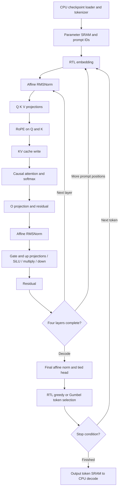
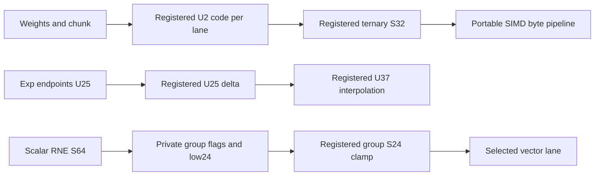

# Autonomous language inference — implementation in progress

[Design hub](architecture.md) · [Demo status](../demos/language.md) · [Timing evidence](../verification/timing/README.md)

This extension is **not yet a verified full graph demo**. The existing language
demo covers isolated ternary linears and uses CPU graph execution. It does not
meet the new full RTL requirement.

## Required execution boundary

CPU loads the checkpoint, static quantization tables and prompt token IDs, and
decodes returned token IDs into text. RTL performs embedding, every transformer
block, affine RMSNorm, RoPE, causal attention and softmax, SwiGLU, residuals,
the tied language head, token selection and the autoregressive loop. Prompt
prefill also executes on RTL. CPU must not supply intermediate activations,
attention results, logits or selected continuation tokens.

## Implemented checkpoint layout and storage

Use the already pinned NanoFable checkpoint, 1,377,408 parameters, four layers,
128 channels, four heads, 384 hidden channels and vocabulary 4,096. Preserve the
checkpoint's trained ternary codes and scales. Quantize the floating embedding
and tied head to per-row S8 codes with a shared row scale. This changes numeric
precision and requires an independent integer reference and a quality check.

| Storage | Payload | RTL representation |
|---|---:|---|
| Parameter SRAM | 768 KiB | 24,576 × 256 bits; embedding, ternary weights, scales, gains, RoPE tables |
| KV cache | 384 KiB | 4 layers × 128 positions × K/V × 128 channels × S24 |
| Vector workspace | 9 KiB | 8 buffers × 384 channels × S24/F16 |
| Prompt and output token buffers | 384 bytes of logical bits | 128 × 12-bit IDs in each buffer; host uses 32-bit words |

The 128-position context allows a short prompt plus a 96-token continuation.
The Quartus memory demo uses Cyclone V `5CGXFC9E6F35C7`; fit and
timing must verify the actual memory packing. The FPGA backend now uses explicit
`altsyncram` M10K IP for parameters, KV and vectors. Compute/control stay portable
SystemVerilog; only the memory technology binding contains a vendor primitive.
No PLL, DSP hardblock or other compute IP is permitted. Multiplication, division,
sqrt and sigmoid map to ordinary logic cells; add/subtract may use carry cells.

## Graph and execution interfaces

`llm_soc` contains two state machines: `graph` chooses the transformer stage;
`op` sequences memory requests and arithmetic. `llm_math` has 32 signed lanes
with a registered balanced reduction. The sqrt, divider and sigmoid engines
are shared. Parameters remain fixed during inference. One operator runs at a
time and uses registered addresses before asserting SRAM enables.

The host memory map and request/response protocol are defined in the
[full RTL test guide](../../tests/full_rtl/README.md). The ISA-driven legacy
`matmulfree` top remains a separate design, with its own host contract and
timing history. Its timing cannot establish closure for `llm_soc`.

## Numeric contracts

| Quantity | Format and conversion |
|---|---|
| Activations and cache | Signed 24-bit, F16; saturate to −2²³…2²³−1 |
| Embedding and tied head | Signed 8-bit codes with per-row U24/F24 scale |
| Ternary matrices | 2-bit 00/01/11 for 0/+1/−1; U24/F24 coefficient |
| Matrix reduction | Signed 39-bit accumulator; S64 coefficient product; RNE shift 24 |
| RMSNorm | Sum of 128 squares in U64, floor mean, add epsilon 42950 in F32, floor sqrt; RNE reciprocal 2³²/root |
| Norm affine gain | Signed 16-bit/F12; normalized activation rounded and saturated before gain |
| RoPE | Signed 16-bit/F15 cos/sin; S56 products, S64 sum and RNE shift 15 |
| Attention score | Dot rounded by 16, then signed multiply by 11585 and RNE shift 16 (1/√32) |
| Softmax | Subtract maximum; U25/F24 exp table at 1/16 spacing; linear interpolation with half-up rounding; differences ≥16 return zero |
| Attention value reduction | S56 weighted sum; divide magnitude by U32 weight sum, RNE, restore sign |
| SiLU | Activation rounded F16→F12 and clamped S16; sigmoid U16/F15; S56 multiply and RNE15 |
| Sampler | Xorshift32 and S24/F16 Gumbel table; U8/F8 temperature; S32 saturated comparison |

RNE uses ties to even. Special tokens 0 and 2 are excluded from selection;
token 1 (EOS) is excluded until `min_new`. Equal eligible scores preserve the
lowest ID, including when every eligible score is S32_MIN. Selection starts
with the lowest eligible ID; excluded IDs cannot win a saturated tie.
Reserved ternary code `10` raises a format fault. Context bounds require prompt+maximum continuation ≤128. Generation
ends at maximum count, EOS or the final context position. Reset cancels control
transactions; it does not clear SRAM. A new launch starts at position zero and
only reads cache entries already written in that run. Reset must span a rising
clock edge to reset the synchronous operator state as well as asynchronous
host/graph validity controls.

## SRAM replacement boundary and latency

`llm_soc.USE_QUARTUS_MEMORY=1` is the FPGA default. The adapters select
[quartus_word_ram](<../../Verilog%20Source%20code/quartus_word_ram.sv>), the sole
explicit vendor IP module, through
[pipelined_word_ram](<../../Verilog%20Source%20code/pipelined_word_ram.sv>).
Each bank has one synchronous read and one independent write port on the same
clock. Raw IP read/write occurs at E2 after adapter request acceptance E1;
registered response is E3, with E4 for ROWS>4096. Same accepted-cycle/address
collision returns OLD_DATA. Storage and payload are unreset/uninitialized; reset
cancels queued enables and response-valid, including writes not yet committed.
A committed word survives reset. Clients load every location before reading it.

`USE_QUARTUS_MEMORY=0` selects a portable tiled behavioral model for ASIC macro
integration and operator fixtures. It is not the FPGA hardware configuration.
ASIC SRAM must provide the same 1R/1W common-clock contract or compensate inside
the adapter. Compute/control equations and public latency remain unchanged.

| Adapter | Read contract | Write contract |
|---|---|---|
| `banked_word_ram` | One edge, tile tag and leaf read captured together, output tile mux after edge | One word at the edge |
| `llm_bank_ram` | Five edges through group/lane/tile/leaf/response stages for current KV/vector depth; reset cancels queue/valid | Lane mask/address/data accepted together; leaf commits on fourth edge; `wr_busy` drains before operator completion |
| `llm_parameter_ram` | Compute four edges for DEPTH≤4096, five for current24576 rows; host lane selection adds one edge before frontend response | Host writes acknowledge after leaf commit; cancelled host reads cannot produce stale valid response |
| `pipelined_word_ram` | Three edges up to four tiles, four edges for more tiles; one request per clock | Capture at first edge, leaf commit second edge; old-data collision at common accepted cycle |
| `sram_256_wrapper` | Two edges from adapter request to valid; host lane/address tags reject stale response | 8 × 32-bit mask; host write priority |
| `llm_math` | Nine subsequent edges after accepting start to done (byte-product revision) | Busy starts ignored; reset cancels valid pipeline |

The FPGA branch instantiates 72 whole-bank RAM IPs: eight parameter lanes,
32 KV lanes and 32 vector lanes. Quartus handles internal M10K banking; the RTL
no longer expands those banks into 352 explicit tiled leaves and response muxes.
Small inferred score/probability/token RAMs are also allowed memory resources.
The baseline already used M10K rather than flop SRAM, so a measured resource
reduction must come from the new fit report, not from this structural count.
`tb_quartus_memory` compares both backends with the actual Intel simulation
library at 96, 4096, 3072 and 24576 rows: 158 checks PASS, read3/4/write2,
consecutive requests, boundaries, OLD_DATA and reset cancellation/retention.
Fit reports, rather than synthesis RAM-segment counts, establish physical M10K
packing. The first full fit used 1111 RAM blocks and 24125 ALMs, with worst
Fmax 70.41 MHz. The next pipeline fit used 23060 ALMs and improved Fmax to
83.58 MHz; both fail setup timing. Local-request source fitted at 22873 ALMs,
23168 registers,1187 RAM blocks and102 DSPs, but still fails at84.49 MHz.
See [full timing evidence](../verification/timing/README.md).

The adapter prevents merging its per-lane address/enable registers with the
Quartus `dont_merge` attribute, keeping request fanout local to each bank.
This physical policy is confined to the replaceable memory boundary; arithmetic
and graph control remain portable. See the [Quartus 18.1 register option](https://docs.altera.com/r/docs/683283/18.1/quartus-prime-standard-edition-user-guide/disable-register-merging/don-t-merge-register?contentId=2sbp49HPEKxMKMzpgzhtuw).

## Verification gates

1. Arithmetic and protocol unit tests with independent wide integer references.
   Nonuniform signed RMSNorm and full-context attention exercise interpolation,
   negative scores and tile boundaries. A synthetic autonomous graph test uses
   host-loaded weights/configuration without CPU intermediate or token inputs.
2. Synthesis and fitter of the top containing the complete graph and its SRAM.
3. All setup, hold, recovery, removal and pulse checks pass at 10 ns, with no
   unconstrained paths. Archive source and configuration hashes with the reports.
4. Only then load the application checkpoint and run full prompt/continuation
   comparison, followed by a paragraph generation demo.

The checkpoint is trained for short stories. Paragraph generation does not by
itself establish instruction following or question-answering quality.

The new nonuniform attention regression exposed an unsigned part-select in
`A_SCALE`: negative scores saturated positive. The explicit signed cast passed
the expanded operator reference. Current main RTL also adds registered capture,
RNE and clamp steps between SIMD and SRAM writes, registers scalar saturation
before lane selection, and uses a proven U25 reciprocal. All payload stages
remain unreset; control cancels their use on reset. Operation latency increases,
while handshake and numeric results remain unchanged. The following revision
uses 93 one-hot operator states, captured shared scalar-multiplier operands,
and local per-lane SRAM requests. That revision's six-group units PASS, including
the synthetic graph; its own four-corner timing remains FAIL84.49 MHz.

Current tree2 source splits SRAM address distribution and tile-response reduction
into registered stages, adds a parameter adapter with host write commit acknowledgement,
and pipelines sigmoid slope/product/integer sum/RNE. Increasing queued-write
latency exposed operator completion before the final KV write; `O_FINISH` now
waits for vector/cache `wr_busy` to clear. Original failure is preserved in
`tests/full_rtl/evidence/tree1_commit_fail`. Existing expected numeric data was
kept; only documented memory-latency bounds changed, with host cancellation
coverage extended from four to ten phases. ModelSim operators17/2820 and legacy
All10 PASS; compiled synthetic graph PASS3701710clocks. The exact-source six groups PASS using five ModelSim units and the unchanged
native Verilator graph. Tree2 fitting completed with24233ALM/34698registers/
1220M10K/252MLAB/102DSP; all-corner timing FAIL91.28MHz. Slow85 setup−0.847ns,
TNS−158.461ns; Slow0−0.955ns/TNS−58.743ns. All other checks pass, unconstrained0.

Select revision uses96one-hot states, parallel fixed RNE4/S16 clamp
before sigmoid, two registered selection levels (8:1 then4:1), and payload
muxes decoding only actual writer states. Host write ACK retains the previously
cleared zero payload to permit output-register packing. QSF selects a physical
2.5V/16mA/fast-slew output driver; SDC remains byte-equivalent at10ns with the
same input/output budgets. This is a demo electrical contract without a supplied
board pinout; see the [Cyclone V IOE documentation](https://docs.altera.com/r/docs/683375/current/cyclone-v-device-handbook-volume-1-device-interfaces-and-integration/programmable-ioe-features-in-cyclone-v-devices).
Select six-group units PASS: math503,RAM28,protocol29/cancel12,selection14,
operators17/checks2820,graph3714190clocks/16layers/3tokens. Five ModelSim units
have zero runtime warnings; compile8SVCHK notices defer checking to vopt.
Native graph logs retain14TIMESCALEMOD,2WIDTHTRUNC and14WIDTHEXPAND notices:
leaf ports are10bits for a96-row vector bank accessed only0..95; address/counter
expressions and unsigned exp arithmetic are context-expanded within their
proven ranges. No warnings are removed from the archived logs. Select3 fitting
PASS0errors/29warnings but timing FAIL92.22MHz: Slow85 setup−0.844ns/TNS−16.608ns,
Slow0−0.560ns/TNS−13.116ns; all other checks pass and unconstrained0. Scalar
broadcast→lane write and output clock/pad setup are the remaining reported cones.

Group candidate uses eight lane-qualified S24 saturation registers, each serving
four lanes, plus an unconditional public host_rdata register behind the FSM's
transaction payload. H_DONE retains ACK/data alignment. QSF no longer forces
I/O register packing and disables automatic shift-register RAM inference for
shallow queues; SRAM leaves remain inferred storage. SDC and C7 device stay
unchanged. Group1 syntax failure is retained; group2 moves genvar declarations
outside generate-loop initialization for Quartus18.1. Five ModelSim units for that archived pre-IP revision
PASS; its graph was cancelled when the memory backend changed. Group2 A&S0/7,fit0/3 but timing FAIL81.53MHz; Slow85
setup−2.265ns/TNS−46.475ns and hold−0.072ns/TNS−0.175ns. Fit26534ALM/39945registers/
1187M10K/0MLAB/102DSP. Output LAB-register→pin is now worst, while scalar group
fanout4 still crosses the device. Keep this regression evidence and the earlier
92.22MHz snapshot; further locality/clock/I/O work is required.
Native graph executable was blocked by Windows Application Control;
ModelSim with `-L altera_mf_ver` is used for the current FPGA memory configuration.
Six units PASS for memoryip2; its actual-IP graph was cancelled for the next measured timing revision.
`fullrtl100_memoryip2` synthesis/fit completed, timingFAIL87.49MHz. `memoryip1` preserves a QSF parser failure for unsupported MAX_DSP_BLOCKS;
the retry keeps AUTO_DSP_RECOGNITION OFF and DSP_BLOCK_BALANCING LOGIC ELEMENTS.
FAST_OUTPUT_REGISTER is restored; SDC remains unchanged. No pretrained
application has run. A&S reports0errors/13warnings and0DSP/0PLL;
Fit confirms0DSP/0PLL,29115ALM/34716registers/1187M10K.
All hold/recovery/removal/pulse checksPASS and unconstrained0; setupFAIL at
Slow85−1.430/TNS−157.190ns and Slow0−1.253/TNS−250.719ns. No100MHz claim.

## Current byte-product timing candidate

The memory-IP milestone is committed/pushed as d3825b2: fit0DSP/0PLL and
87.49MHz timingFAIL for its archived source. The active source now preserves
per-bank write payload FF copies only at the replaceable memory boundary.
SIMD uses S24×U8/S8 byte products (S33), pair sumsS41 and productS56 before
the same balanced S61 reduction. Valid length10 gives exact9-clock done;
503S128 transactions/9reset phases and all513LUT entries PASS. Numeric
expectations are unchanged. Shared scalar S39×S25 uses low U8/U8 and high S9
partialsS48, pairS56 and reconstructed S64 over three states; SC_PAIR/SC_SUM
append two states, total98, preserving all prior state indices. Operators
add128independent S128 signed-extreme/random scalar checks. Graph numeric/token,
visits and causal assertions stay unchanged; compute watchdog changes4M→5M
for the additional stages, with100ms total bound (196619host commands≤19edges
plus5M compute clocks<90ms). All six unit groups PASS; operators17/checks3076/
scalar128. Bytes1 fitting completes0errors/4warnings, with0DSP/0PLL, but timing
FAIL89.60MHz (setup/hold). Its graph was cancelled to apply the reported fixes;
no functional assertion failure or seven-group acceptance was recorded.
The obsolete memoryip2 graph was cancelled for this necessary timing revision;
its six completed groups/logs remain archived. No application has run.

## Current control/locality timing candidate

`fullrtl100_control1` keeps the same device,10ns SDC and all numeric formulas.
Four states append to102total: L_DECODE, A_EXP_DELTA, L_FLAGS and A_FLAGS.
Ternary input capture selects a U2 code; the next edge decodes it to S32 before
math start. Reserved10 still faults at L_INPUT. Exp LUT endpoints feed a U25
registered difference before U25×U12 interpolation; half-up rounding is unchanged.
Each scalar output group captures high/low saturation predicates and low24,
then selects S24 on a separate edge. Linear overflow reads the selected group's
flags; attention preserves its original overflow behavior. Payload flags are
unreset but each consumer follows its matching capture state. The extra states
remain within the existing5M compute/100ms graph bound; no expected values or
token/phase/causal assertions change. Memory-only dont_merge now also preserves
group and IP read/write enables. Memory latency and reset contract are unchanged.

QSF selects an ordinary LVDS input buffer for clk, feeding direct GCLK without
PLL, DLL, SERDES or ALTLVDS. This requires a100MHz differential source and a
physical clk(n) companion pin, recorded by Fitter. Output electrical contract
remains2.5V/16mA/fast slew. Actual board pins/termination are not specified;
the FPGA demo cannot claim board or ASIC signoff. The input-buffer delay benefit
was a hypothesis; control1 fit reaches92.75MHz but fails setup/hold/recovery,
with ordinary output clock/pad and reset routing now critical. Input receiver
0.907ns is essentially unchanged from earlier0.917ns. Fit31573ALM/42133FF/
1187M10K/128pins/DSP-PLL-DLL-HSSI0. Six groupsPASS including3460operatorchecks,
scalar128/clamp128. Graph cancelled for a necessary measured host mux fix;
its log and all six groups remain archived, no assertion failure or seven-group
PASS claimed. See timing hub for all corners. See the
[clock input handbook](https://docs.altera.com/r/docs/683375/current/cyclone-v-device-handbook-volume-1-device-interfaces-and-integration/dedicated-clock-input-pins)
and [differential pin guide](https://docs.altera.com/r/docs/683492/18.1/intel-quartus-prime-standard-edition-user-guide-design-constraints/assigning-differential-pins).
Only altsyncram is explicitly instantiated vendor IP. Quartus may lower portable
arithmetic operators to internal LPM representations; those are synthesized into
ordinary logic cells, with forbidden DSP/PLL/DLL/HSSI counts checked in fit.summary.
