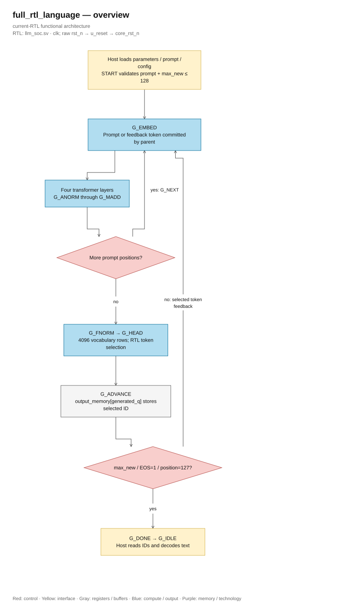
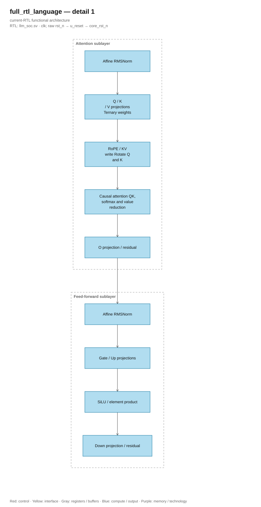

# llm_soc architecture: all language graph

<!-- reading-navigation:start -->
[Documentation](../README.md) → [01 · System](../01-system/README.md) → This page

| Reading guide | Document |
|---|---|
| New to the subject | [NPU and RTL fundamentals](../00-start-here/fundamentals.md) · [Glossary](../00-start-here/glossary.md) |
| Read first | [Quickstart](../00-start-here/quickstart.md) |
| Continue / related lookup | [Full RTL graph](../source_guide/full_graph.md) |
<!-- reading-navigation:end -->

> **Category: CURRENT.**

## Before the details

This page describes the complete current machine, not a software model and not
the older instruction-driven core. `llm_soc` contains control state that walks a
fixed transformer graph, while specialized engines and shared memories perform
the work. The host loads inputs and starts the run; it does not schedule every
matrix or attention operation.

If terms such as S24/F16, pipeline, causal attention, or timing evidence are new,
read [NPU and RTL fundamentals](../00-start-here/fundamentals.md). In the tables
below, *geometry* means compile-time model sizes, *contract* means behavior that
callers and verification rely on, and *ownership* identifies the one block that
may update a resource at a given stage.

`llm_soc.sv` is the current top. The host loads parameters, prompt token IDs, and configuration;
RTL performs the entire prefill, transformer blocks, language head, token selection
and autoregressive decode. Tokenizer and the step of decoding token into text run on the host.

## Configuration and memory

| Component | Geometry |
|---|---|
| Pinned model | NanoFable-1M-ternary seed1, 1,377,408 parameters |
| Transformer | 4 layers; hidden width 128; 4 heads × 32 channels |
| Feed-forward | 384 channels; Gate, Up, and Down |
| Vocabulary | 4,096 IDs; embedding and head share codes/scales |
| Context | 128 positions, including prompt and newly requested tokens |
| Parameter SRAM | 24,576 × 256 bits = 768 KiB |
| KV cache | 4,096 × 768 bits = 384 KiB |
| Vector workspace | 96 × 768 bits = 9 KiB, contains 8 buffers × 384 S24 elements |
| Prompt/output buffer | Each buffer 128 × 12-bit IDs; host transmits 32-bit words |

Default configuration includes `ATTN_DIV_LANES=4`, `SIGMOID_LANES=4`,
`PERF_COUNTERS=0`, `ENABLE_DEBUG_INDEX=0` and `USE_QUARTUS_MEMORY=0` (portable RAM for server).
Evidence has been measured as applied to the configuration recorded in the manifest; changing parameters requires
re-verify according to [verification guide](../verification/README.md).

## Inference Flow

[Editable draw.io — full_rtl_language — overview](../diagrams/architecture.drawio) · Page `05_full_rtl_language_1`.

[Editable draw.io — full_rtl_language — detail 1](../diagrams/architecture.drawio) · Page `06_full_rtl_language_2`.

1. Host writes parameters and prompt, then writes configuration and START.
2. RTL takes the embedding of the token at the current position.
3. Each layer runs affine RMSNorm → Q/K/V → RoPE for Q/K → write KV → causal
   attention/softmax → O projection and residual.
4. FFN branch runs affine RMSNorm → Gate/Up → SiLU and elementwise multiplication → Down
   → residual. Then move to the next layer or position.
5. At the position where a token needs to be generated, RTL runs final norm and tied language head, scans
   the vocabulary in order, then selects a token.
6. The token is written to the output buffer. RTL uses the selected token for the next round,
   stopping when the count limit is reached, a valid EOS, or the end of the context.

Graph FSM selects the inference stage. Operator FSM and engines coordinate
memory/arithmetic of that stage. The host does not provide hidden activations, logits
or continuation IDs to the DUT. The reference CPU used in the application only
provides expected values for the testbench comparison.

## Ownership of control and resources

The Graph FSM selects inference phases; the operator FSM owns the routing of
shared resources, scalar processing and vector write. Responsibilities of each engine/module are
listed in [full graph](../source_guide/full_graph.md). [Contract cache and streaming](exact_throughput_optimization.md)
explain the reuse mechanism and limited requests.

Linear execution only allows a maximum of one next row in the coefficient/round/store section
tail of the current row. Parent holds the accumulator and faults until they are consumed
in the correct order; start protection and draining prevent cross-contamination between rows. This mechanism
does not create additional linear engines or output streams.

## Arithmetic Contracts

`S24/F16` means a signed 24-bit integer with 16 fractional bits: the real value equals
raw integer / 2^16. `U` is unsigned. RNE is rounding to nearest, ties to even.

| Quantity | Format and conversion |
|---|---|
| Activations, vectors, and KV | S24/F16; saturation in the range -2^23…2^23-1 |
| Embedding and tied head | S8 codes, scale each row U24/F24 |
| Ternary weight | 00/01/11 corresponds to 0/+1/-1; code 10 causes format fault |
| Linear/head reduction | S39 accumulation; S64 coefficient product; RNE shift 24 |
| RMSNorm | U64 sum of squares; floor mean, epsilon 42.950 in F32, floor sqrt; RNE reciprocal 2^32/root |
| Norm affine gain | S16/F12; normalized activation is rounded/clamped before gain |
| RoPE | S16/F15 cos/sin; S56 product; S64 sum; RNE shift 15 |
| Attention score | Dot RNE16, multiply by constant 11.585 then RNE16 to scale 1/sqrt(32) |
| Softmax | Subtract maximum; exp U25/F24, step table 1/16 and half-up interpolation; difference ≥16 return 0 |
| Value reduction | S56 weighted sum; divide magnitude by U32 weight sum using RNE, then restore the sign |
| SiLU | RNE F16→F12, clamp S16; sigmoid U16/F15; product and RNE15 |
| Sampling | Xorshift32, Gumbel S24/F16; temperature U8/F8; comparison S32 with saturation |

Some rounding methods have their own rules like the exp interpolation above; do not change
they use the same rounding mode. IDs 0 and 2 are excluded from sampling; EOS ID 1 is
type up to `min_new`. When the scores are equal, the smallest valid ID wins, including S32_MIN.
When the temperature is 0, selection skips the noise/sample states but still advances
PRNG once for each vocabulary row, including the excluded IDs. Therefore, when transferring back
During sampling, the random stream is still preserved.

The exporter keeps the trained ternary weights and quantizes the embedding/head; token
matching is compared with the reference integer of this layout.

## Memory, pipeline and reset

| Interface | Current contract |
|---|---|
| pipelined_word_ram | Read 3 edges with up to 4 tiles, 4 edges when there are more tiles; write commit on the 2nd edge |
| llm_parameter_ram | Compute read 5 edges at the current depth; host adds lane selection step; write ACK after leaf commit |
| llm_bank_ram | Read 5 edges; lane-mask/address/data go together; write commit on the 4th edge, wr_busy signals drain |
| llm_math streaming | Accept at E0; product_valid E3, sum_valid E8, legacy done E9 |

Two FFs in `reset_release` release internal reset after two rising edges. Reset cancels
control/validity and uncommitted writes, while retaining written SRAM data.
Invalid payloads are not consumed. Reset needs to go through one rising edge to
cancel all synchronized operator states.

Only technology leaf `quartus_word_ram` instantiates `altsyncram`. Branch
`USE_QUARTUS_MEMORY=0` uses portable behavioral memory for elaboration and fixture;
ASIC requires an SRAM binding with the same latency/collision/reset contract or part
offset in the adapter. The [SRAM binding guide](asic_memory_binding.md) details this.

## Verification and running the model

Synthetic regression checks operators, protocols, selection, memory, and the entire
graph. The [Verification status](../verification/optimization_status.md) specifies the source,
configuration, and scope of each PASS. Applications use real checkpoints only
after the gate unit/graph and all-corner post-fit timing requirements are met.

- [Host map and START sequence](host_interface.md)
- [NanoFable run commands](../demos/language.md)
- [Development history](../history/full_rtl_development.md)
