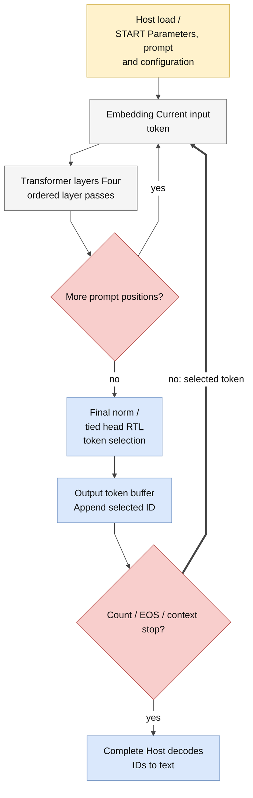
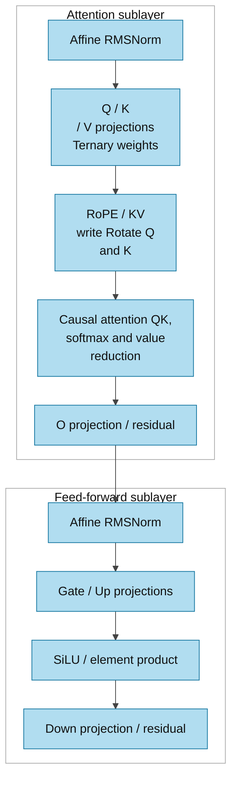

# Kiến trúc llm_soc: toàn graph ngôn ngữ

> **Category: CURRENT.**

[Tài liệu](../README.md) → [Thiết kế](README.md) → **llm_soc**

`llm_soc.sv` là top hiện tại. Host nạp parameters, prompt token IDs và cấu hình;
RTL thực hiện toàn bộ prefill, transformer blocks, language head, token selection
và autoregressive decode. Tokenizer và bước decode token thành chữ chạy trên host.

## Cấu hình và bộ nhớ

| Thành phần | Geometry |
|---|---|
| Model đã pin | NanoFable-1M-ternary seed1, 1.377.408 parameters |
| Transformer | 4 layer; hidden width 128; 4 head × 32 channel |
| Feed-forward | 384 channel; Gate, Up và Down |
| Vocabulary | 4.096 ID; embedding và head dùng chung codes/scales |
| Context | 128 vị trí, gồm prompt và số token mới yêu cầu |
| Parameter SRAM | 24.576 × 256 bit = 768 KiB |
| KV cache | 4.096 × 768 bit = 384 KiB |
| Vector workspace | 96 × 768 bit = 9 KiB, chứa 8 buffer × 384 phần tử S24 |
| Prompt/output buffer | Mỗi buffer 128 × 12-bit ID; host truyền word 32 bit |

Cấu hình mặc định có `ATTN_DIV_LANES=4`, `SIGMOID_LANES=4`,
`PERF_COUNTERS=0`, `ENABLE_DEBUG_INDEX=0` và `USE_QUARTUS_MEMORY=0` (portable RAM cho server).
Evidence đã đo áp dụng cho cấu hình được ghi trong manifest; đổi tham số cần
kiểm chứng lại theo [verification guide](../verification/README.md).

## Luồng inference

1. Host ghi parameters và prompt, rồi ghi cấu hình và START.
2. RTL lấy embedding của token ở vị trí hiện tại.
3. Mỗi layer chạy affine RMSNorm → Q/K/V → RoPE cho Q/K → ghi KV → causal
   attention/softmax → O projection và residual.
4. Nhánh FFN chạy affine RMSNorm → Gate/Up → SiLU và phép nhân phần tử → Down
   → residual. Sau đó chuyển layer hoặc vị trí tiếp theo.
5. Ở vị trí cần sinh token, RTL chạy final norm và tied language head, duyệt
   vocabulary theo thứ tự, rồi chọn token.
6. Token được ghi vào output buffer. RTL dùng token vừa chọn cho vòng tiếp theo,
   dừng khi đạt giới hạn count, EOS hợp lệ hoặc cuối context.

Graph FSM chọn giai đoạn inference. Operator FSM và các engine điều phối
memory/arithmetic của giai đoạn đó. Host không cấp hidden activations, logits
hay continuation IDs cho DUT. Reference CPU dùng trong application chỉ cung
cấp giá trị kỳ vọng cho testbench so sánh.

## Quyền sở hữu control và tài nguyên

Graph FSM chọn các phase inference; operator FSM sở hữu việc định tuyến tài nguyên
dùng chung, xử lý scalar và ghi vector. Trách nhiệm của từng engine/module được
liệt kê trong [full graph](../source_guide/full_graph.md). [Contract cache và streaming](exact_throughput_optimization.md)
giải thích cơ chế reuse và request có giới hạn.

Linear execution chỉ cho phép tối đa một next row trong phần coefficient/round/store
tail của row hiện tại. Parent giữ accumulator và fault cho đến khi chúng được tiêu
thụ đúng thứ tự; start protection và draining ngăn nhiễm chéo giữa các row. Cơ chế
này không tạo thêm linear engine hoặc output stream.

## Hợp đồng số học

`S24/F16` nghĩa là số nguyên signed 24 bit có 16 bit phần lẻ: giá trị thực bằng
raw integer / 2^16. `U` là unsigned. RNE là làm tròn nearest, ties to even.

| Đại lượng | Format và phép chuyển |
|---|---|
| Activations, vectors và KV | S24/F16; saturation trong khoảng -2^23…2^23-1 |
| Embedding và tied head | S8 codes, scale mỗi hàng U24/F24 |
| Ternary weight | 00/01/11 tương ứng 0/+1/-1; mã 10 gây format fault |
| Linear/head reduction | S39 accumulation; S64 coefficient product; RNE shift 24 |
| RMSNorm | U64 tổng bình phương; floor mean, epsilon 42.950 ở F32, floor sqrt; RNE reciprocal 2^32/root |
| Norm affine gain | S16/F12; normalized activation được round/clamp trước gain |
| RoPE | S16/F15 cos/sin; S56 product; S64 sum; RNE shift 15 |
| Attention score | Dot RNE16, nhân hằng 11.585 rồi RNE16 để scale 1/sqrt(32) |
| Softmax | Trừ maximum; exp U25/F24, bảng bước 1/16 và nội suy half-up; chênh lệch ≥16 trả 0 |
| Value reduction | S56 weighted sum; chia magnitude cho U32 weight sum bằng RNE, rồi phục hồi dấu |
| SiLU | RNE F16→F12, clamp S16; sigmoid U16/F15; product và RNE15 |
| Sampling | Xorshift32, Gumbel S24/F16; temperature U8/F8; so sánh S32 có saturation |

Một số phép làm tròn có quy tắc riêng như exp interpolation ở trên; không thay
chúng bằng cùng một rounding mode. ID 0 và 2 bị loại khỏi sampling; EOS ID 1 bị
loại đến `min_new`. Khi score bằng nhau, ID hợp lệ nhỏ nhất thắng, kể cả S32_MIN.
Khi temperature bằng 0, selection bỏ qua các state noise/sample nhưng vẫn advance
PRNG một lần cho mỗi vocabulary row, kể cả các ID bị loại. Vì vậy, khi chuyển lại
sang sampling, random stream vẫn được bảo toàn.

Exporter giữ ternary weights đã train và lượng tử hóa embedding/head; token
matching được đối chiếu với reference integer của layout này.

## Memory, pipeline và reset

| Interface | Hợp đồng hiện tại |
|---|---|
| pipelined_word_ram | Read 3 edge với tối đa 4 tile, 4 edge khi nhiều tile hơn; write commit ở edge thứ 2 |
| llm_parameter_ram | Compute read 5 edge ở depth hiện tại; host thêm bước chọn lane; write ACK sau leaf commit |
| llm_bank_ram | Read 5 edge; lane-mask/address/data đi cùng nhau; write commit edge thứ 4, wr_busy báo drain |
| llm_math streaming | Accept ở E0; product_valid E3, sum_valid E8, legacy done E9 |

Hai FF trong `reset_release` nhả internal reset sau hai rising edge. Reset hủy
control/validity và những write chưa commit, đồng thời giữ dữ liệu SRAM đã ghi.
Payload không hợp lệ không được tiêu thụ. Reset cần đi qua một rising edge để
hủy cả trạng thái operator đồng bộ.

Chỉ technology leaf `quartus_word_ram` instantiate `altsyncram`. Nhánh
`USE_QUARTUS_MEMORY=0` dùng portable behavioral memory cho elaboration và fixture;
ASIC cần một binding SRAM có cùng latency/collision/reset contract hoặc phần
bù trong adapter. [SRAM binding guide](asic_memory_binding.md) ghi chi tiết.

## Kiểm chứng và chạy model

Regression tổng hợp kiểm tra các operator, protocol, selection, memory và toàn
graph. [Trạng thái kiểm chứng](../verification/optimization_status.md) nêu source,
configuration và phạm vi của từng PASS. Application dùng checkpoint thật chỉ
chạy sau khi gate unit/graph và all-corner post-fit timing đạt yêu cầu.

- [Host map và trình tự START](host_interface.md)
- [Lệnh chạy NanoFable](../demos/language.md)
- [Lịch sử phát triển](../history/full_rtl_development.md)
