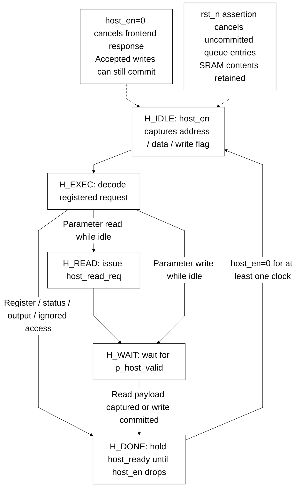

# Host interface của llm_soc

> **Category: GUIDE.**

[Tài liệu](../README.md) → [Thiết kế](README.md) → **Host interface**

Host và DUT dùng cùng `clk`. Mọi địa chỉ bên dưới là byte address, căn chỉnh
4 byte. Core matmulfree có host contract riêng trong [interface legacy](<legacy/interfaces.md>).

## Ports

| Signal | Vai trò |
|---|---|
| clk, rst_n | Clock và reset active-low |
| host_en, host_we | Có request; 1=write, 0=read |
| host_addr, host_wdata | Address và write data, mỗi tín hiệu 32 bit |
| host_ready, host_rdata | ACK và read data 32 bit |
| running, ready | Graph đang chạy hoặc idle, xuất qua register |
| error, overflow_out | Lỗi graph/format/bounds và cờ saturation/overflow |
| pc_debug, instr_debug | Position 9 bit và phase/debug word 13 bit |

## Memory map

| Window/register | Address | Nội dung |
|---|---|---|
| Parameters | 0x00000000…0x000BFFFC | 768 KiB, 32-bit host lanes của word 256 bit |
| Prompt IDs | 0x00100000…0x001001FC | 128 slot; lấy 12 bit thấp của word |
| Output IDs | 0x00200000…0x002001FC | Continuation IDs; đọc khi graph idle |
| Status | 0x00400000 | Running, ready, error, overflow và output count |
| Prompt count | 0x00400004 | Số prompt token, ghi 8 bit thấp; mặc định 0 |
| Maximum new tokens | 0x00400008 | Số token mới tối đa; mặc định 96 |
| Start | 0x0040000C | Ghi bit 0=1 khi idle |
| Temperature | 0x00400010 | U8/F8, mặc định 166; 0 chọn greedy |
| Random seed | 0x00400014 | Xorshift32 seed; 0 được đổi thành 1 |
| Minimum new tokens | 0x00400018 | Mask EOS trước count này; mặc định 64 |

Status dùng bits 0=running, 1=ready, 2=error, 3=overflow và bits 11:4=output
count. Chỉ đọc các register/window mà RTL hỗ trợ; không giả định config writes
có register readback. KV và vector workspace do graph sở hữu.

## Một transaction

1. Đặt address, write flag và data; assert `host_en`.
2. Giữ các signal request ổn định cho đến khi `host_ready=1`.
3. Với read, lấy `host_rdata` tại ACK.
4. Deassert `host_en` ít nhất một clock rồi bắt đầu request kế tiếp.

Parameters được đọc đồng bộ qua adapter. Write ACK chờ leaf commit; thời gian
ACK có thể khác giữa memory và register access. Writes trong lúc graph running
không sửa parameters/config/prompt. Status vẫn dùng để polling tiến độ.

Deassert enable trước execution edge hủy write. Sau khi write đã được accepted,
deassert enable hủy response nhưng write có thể commit. Reset hủy queue entries
chưa commit và giữ các word đã commit; host không được giả định rollback.

## Trình tự chạy graph

1. Reset và chờ internal reset release sau hai rising edge.
2. Khi idle, ghi đầy đủ parameter image qua parameter window.
3. Ghi prompt IDs theo thứ tự, bắt đầu tại 0x00100000.
4. Ghi prompt count, maximum new tokens, temperature, seed và minimum new tokens.
5. Ghi START; polling status đến khi graph idle, kiểm tra error và output count.
6. Đọc continuation IDs từ output window rồi decode bằng tokenizer đã pin.

Điều kiện launch: prompt count >0, maximum new tokens >0 và tổng của chúng ≤128.
Exporter giới hạn new tokens trong 1…127 và kiểm tra tokenized prompt trước khi
mô phỏng. Chọn `MinNew ≤ NewTokens` trong demo để cấu hình EOS dễ hiểu.

Testbench application đã thực hiện host sequence này. Dùng
[hướng dẫn NanoFable](../demos/language.md) để chạy từ PowerShell thay vì tự ghi bus.
[Protocol và cancellation evidence](../verification/optimization_status.md) ghi
các trường hợp handshake, reset và ACK đã kiểm chứng.
