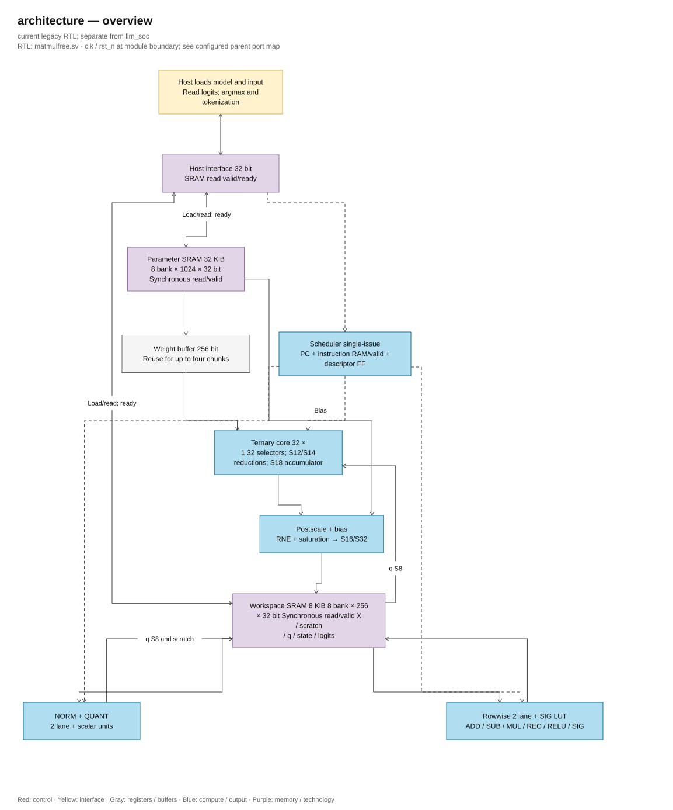

# Small ASIC inference with ternary weights and 256-bit SRAM

> **Category: LEGACY.**

> **Legacy scope:** this page describes the matmulfree core.
> The current llm_soc top has [architecture](<../full_rtl_language.md>) and
> [host interface](<../host_interface.md>) separately.

[Project](<../../../README.md>) → [Documentation](<../../README.md>) → **Architecture**

This page describes the instruction-driven core `matmulfree` and architectural decisions
made earlier. The current top language and memory/latency/number format are in
[full RTL language](<../full_rtl_language.md>). With the new top, area is not a priority;
SRAM and pipeline are increased to meet correctness and >=100 MHz for the whole graph.

Page table of contents

- [Review results according to the latest request](#review-results-according-to-the-latest-requirements)
- [Core configuration](#core-configuration)
- [What is kept from the paper and what is reduced](#what-is-kept-from-the-paper-and-what-is-scaled-down)
- [Bit table for each block](#bit-table-for-each-block)
- [Scale, bias and state update](#scale-bias-and-state-update)
- [NORM + QUANT with integers](#norm--quant-with-integers)
- [Sigmoid and SiLU with small LUT](#sigmoid-and-silu-with-small-lut)
- [SRAM and data flow](#sram-and-data-stream)
- [Suitable demo model](#suitable-demo-models)
- [Demo sequence and verification method](#demo-sequence-and-verification-method)
- [Local run model that has been cross-checked](#the-locally-running-model-has-been-cross-checked)
- [Conversion table for each existing RTL module](#conversion-table-for-each-existing-rtl-module)
- [Verification scope](#scope-of-verification)

Architecture configuration as of 28/09/2026 for the small ASIC inference target, prioritizing area and power. The chip only runs small ternary models; the training process is performed on a computer. This document replaces the previous BF16/FP32 approach and focuses on hardware configuration, bit width, SRAM, and demo models.

**Documents and RTL updated on 01/10/2026, after review/optimization and agreed implementation.** Core uses the same RTL for simulation and synthesis, without selecting branches based on tool macros. Quartus is used for FPGA synthesis and timing demonstration; see [review report](<../../history/reviews/implementation_review.md>), [critical path/Fmax](<../../verification/timing/README.md>), and [current hierarchy diagram](<../../source_guide/legacy/README.md>). The ASIC target table below still serves as a guide for resource sharing/macro PDK; it does not guarantee the entire chip uses only two 16×16 multipliers.

**Current implementation:** sqrt radix-4 maintains 32 stages, NORM divider U55 and compose divider 48/25 fit the RNE filter; rowwise shares two scale/RNE paths, latching operand/product/raw/rounded result to divide the critical path. Sigmoid uses coordinate S45 and interpolation product U34. NORM shares two multipliers S25×S25 for square/norm/quant, latching operand/product S48/RNE; coefficients reuse norm_r/quant_r/quant_d already latched in PREP. This is sharing within NORM; it is not decomposing the entire chip into two 16×16 multipliers. Parameter/workspace SRAM and instruction RAM always use synchronous read/valid; frontend host latches request/response: control/descriptor read on both edges, SRAM/imem read on four edges up to ready. The backend adapter still read-valid on both edges. The scheduler waits for the instruction to be valid, adding two fetch cycles per instruction compared to the old combinational model. The sigmoid always uses a constant ROM table. The [review report](<../../history/reviews/design_review.md>) includes the scope of verification and the data of each snapshot; the dispatcher waits for busy/done, so it accepts the latency of a new word.

**Base configuration:** 32 input elements × 1 output element, corresponding to 32 ternary processing elements (PE); activation INT8; weight 2-bit; signed 18-bit accumulator for K≤512; signed 16-bit state and residual, each tensor has its own scale; unsigned 16-bit gate; 2-lane vector unit using 16×16 multiplication; scalar unit uses multiple cycles for normalization and rescaling. Each SRAM word is 256 bits wide. Initial estimate includes 32 KiB parameter SRAM and 8 KiB workspace SRAM, not including ROM, control circuitry, and macro memory auxiliary parts.

The datapath inference of this configuration does not use BF16, FP16, or FP32. Values with decimal parts are represented using **integers and scale**. Some calculations use a custom fixed-point format, but the entire chip is not forced to Q4.12. The software for exporting models and verifying on a computer can use floating-point; the ASIC does not require a floating-point unit (FPU). This is a design choice for compatible models, not a rule that all model inferences will run correctly when floating-point is omitted.

## Review results according to the latest requirements

**Keep the base configuration of 32 PEs and the existing bit-widths in the proposal.** According to the latest request, assume the model has been trained; work on the NPU only involves inference. This assumption itself does not change the value domain, scale, or operators of the model. When loading the checkpoint, it is still necessary to export and verify arithmetic with the ASIC format. The goal is to generate short sentences without forcing an increase in PEs, using FP16, or converting all activations to INT16.

| Content in the exchange history | Current decision | Impact on the bit table |
|---|---|---|
| Want a small ASIC, inference only | Use integers and scale; no FPU in the base configuration | Keep S8 for activation into ternary core, S16 for state, 2-bit weight |
| Do not want to be bound by Q4.12 | Scale separately according to tensor and format separately according to operation | Do not return to common Q4.12; gate remains U16/F15, scratch NORM remains S24/F16 |
| Reduce from K_MAX=2048 to 512 | Keep K_MAX=512 | ACC20→ACC18, sum of squares U42→U40 and workspace 16→8 KiB previously updated |
| Discussion about increasing to 32×4 or 32×8 PE | This is a method to increase throughput; 32×1 configuration has not been chosen | Did not increase the number of PE or number of accumulators; increasing PE does not automatically change the bit width of each accumulator |
| Assume all models have been trained | Evaluate inference capability and checkpoint compatibility | Do not use untrained status as a reason to increase bit width or remove computing capability of 32 PE |
| Want to run a small language model, generate short sentences | NanoFable has run generation on CPU and linear replay on RTL; MLP/Seq64 support hardware checking | There is no full language model running on the base core yet; partial demo does not automatically finalize configurations larger |
| Consider NanoFable | Verified 28 ternary tensors × 6 activation contexts = 168 linear RTL rounds | The whole graph still runs on CPU; need to expand operators/memory to run the full model |

**32 PEs are sufficient to sequentially perform the supported dot products.** Conditions to run the full model also include K of each calculation, operator, format, memory, and scheduling. The quality of responses depends on the model's capability and post-quantization error; it cannot be inferred from the number of PEs. The current number of PEs and bit-width also do not demonstrate the actual token generation speed.

## Core configuration

| Parameter | Choice for first version | Reason |
|---|---:|---|
| DOT_LANES | **32** | Reads 32 INT8 values of vector `q` per cycle, equivalent to 256 bits |
| OUT_PAR | **1** | Calculates one output element per cycle, using 32 PEs |
| STATE_W / ACT_W / WEIGHT_W | **16 / 8 / 2** | Width of state, activation, and weight |
| ACC_W | **18** | Enough margin for INT8 dot product with K≤512 |
| K_MAX | **512** | The three demo models need K≤256; 512 is for small expansion |
| VEC_LANES | **2** | Reuses two 16×16 multipliers and adder/subtractor circuit |
| SRAM_DATA_W | **256** | Data width of SRAM word; does not include ECC if present |
| Parameter SRAM | **1024×256 = 32 KiB** | Contains weights, embeddings, biases, and metadata |
| Workspace SRAM | **256×256 = 8 KiB** | Contains activations, state, `q`, and intermediate NORM area |
| SIG LUT | **257×16 usable bits** | 514 B; can be arranged as ROM 512×16 = 1 KiB |
| Host interface | **32-bit** registers and data, **32-bit** address window | Load model/input and read results |
| Run mode | One request per core | No need for multi-request scheduling in the initial version |

A 256-bit SRAM word contains 128 ternary weights. The core uses 32 weights per turn, so this word can be reused for up to **4 computation turns**. The core processes each output row sequentially; each row requires `ceil(K/32)` dot product turns. Increasing the number of output rows does not automatically increase ACC_W, but K for each row must still be ≤512, and data must be allocated or loaded according to an appropriate schedule.

An SRAM word can store 16 INT16 values, but the vector unit has only two lanes and two 16×16 multipliers. Therefore, just processing these 16 elements requires at least 8 turns; complex operations may require additional micro-instructions.

Compared to the previous proposal, K_MAX decreased from 2048 to 512, the accumulator from 20 to 18 bits, the sum of squares from U42 to U40, and workspace SRAM from 16 to 8 KiB. Keep parameter SRAM at 32 KiB because the character generation demo requires about 25 KiB after calculating padding and embedding. If only making a 256→64→32→10 classifier, a smaller configuration can be used: K_MAX=256, ACC17, sum of squares U39, parameter SRAM 8 KiB, and workspace SRAM 4 KiB. This smaller configuration cannot accommodate the two demos using MLGRU with the current data layout.

A 16×16 image has 256 INT8 **elements**, totaling 256 B, read through 8 SRAM words. Each input value is only 8 bits wide; the 256-bit figure is the width of an SRAM word. INT16 state serves MLGRU models and the results after rescaling; the input to the dot product is still INT8.

## What is kept from the paper and what is scaled down

According to [Scalable MatMul-free Language Modeling v5](https://arxiv.org/html/2406.02528v5), the design keeps the ternary linear layers, quantizes activations down to 8-bit, uses RMSNorm + QUANT before BitLinear, rescales after the dot product, and includes MLGRU/GLU in the sequence generation demo. Arithmetic width, SRAM capacity, and number of PEs are optional choices for this small ASIC, not mandatory parameters from the paper.

The MLGRU equations in [the PDF version of the paper](<../../history/references/2406.02528v5.pdf>) include bias. The design supports bias with integers and ignores this addition if the model has no bias. You cannot remove the bias of one model just because another BitNet model does not use it.

The checkpoint suitable for the demo configuration must use RMSNorm **without affine parameters**, according to Appendix A. The initial version does not support learnable scaling or normalization bias per channel. If a checkpoint has these parameters, the corresponding processing must be added or a different model used; removing them will alter the model.

The quantization rules are finalized as follows: coefficient 127, round-to-nearest-even (RNE), clamped to [-128, 127], and zero-point=0. RNE rounds to the nearest integer; when exactly in the middle of two integers, the even one is chosen. This choice follows Algorithm 1 and the author's code. Appendix A, however, records Q_b=128; the description of normalization in Algorithm 1 also differs from RMSNorm in some details. The reference model uses RMSNorm based on mean-square, without subtracting the mean. The formulations in the paper are not considered bit-exact equivalent.

## Bit table for each block

This is the **base bit table after review**, applied for 32 PEs, K≤512, and the listed demos. S/U correspond to signed/unsigned integers respectively; for example, S16 is a 16-bit signed integer, including the sign bit. `S24/F16` is a total of 24 bits with 16 fractional bits, not FP16. Scalar divider and sqrt use multiple cycles; current tensor multiplications use combinational multipliers according to the declared width of each engine. Combining all wide multiplications from two shared 16×16 multipliers across the chip is still an architectural goal. The design does not have 32 64-bit multipliers or FPUs.

| Block / data | Bit selection | Role / intermediate | 256-bit SRAM packing |
|---|---:|---|---|
| Input image before MLP | **S8** after host processing | Exporter determines scale; core receives symmetric INT8 | 32 elements |
| Activation `x`, residual and candidate `c` | **S16** | Each tensor has its own scale, not default Q4.12 | 16 elements |
| State stored across steps `h` | **S16** | Maintain stable scale between time steps | 16 elements |
| Describe scale state | **F_t 5 bit**, in 32-bit metadata | x_real=x_raw×2^(-F_t), F_t=0..24; chosen during calibration or QAT | Metadata |
| NORM input | **S16** | Process enough K elements using two lanes reusing multipliers | 16 elements |
| Absolute and maximum value | **U16** | Can represent abs(-32768)=32768 | Scalar |
| Square X² | **U32** | 16×16 signed product; max value is 2^30 | Do not store the entire squared vector |
| Sum of squares ΣX² | **U40** | Sufficient for K≤512; for K≤256 configuration only U39 is needed | A scalar accumulator |
| Mean square and `epsilon` | **U64** | 32 fractional bits in raw² domain; exporter checks the limit | Scalar |
| Square root result `R` | **U32** | 16 fractional bits in raw RMS domain; computed over multiple cycles | Scalar |
| Intermediate range after NORM, `z` | **S24, 16 fractional bits** | Range [-128,128); with K≤512, ideal margin ≤√K≈22.63; reserve extra bits | Stored in 32-bit cell: 8 elements |
| Maximum absolute value of `z` | **U24** | Computed over the entire vector after NORM | Scalar |
| Inverse coefficient and requantization | **M U24 + shift U6** | Coefficient≈M/2^r, r=0..47; pack two flags into 32 bits | 8 describe 32 bits |
| NORM multiplication | **S16×U24→S40** | Useful value S40; RTL shares multiplier S25×S25→S48 with square/QUANT | Internal |
| QUANT multiplication | **S24×U24→S48** | Round, shift, and clamp once to INT8 | Internal |
| Quantized activation `q` | **S8** | Input of ternary dot product | **32 elements** |
| Ternary weight | **2 bit** | 00=0, 01=+1, 11=-1; 10 reserved | **128 weight** |
| Ternary term +q/0/-q | **S9** | Sign-extend before negating; can hold +128 | 32 internal terms |
| Sum of 32 terms | **S14** | Range ±4096 | One partial sum |
| Dot-product accumulator | **S18** | Full INT8 range: ±128K, K≤512 | One accumulator; when writing, extended SRAM sign to 32 bits |
| CSA if continuing to use RTL CSA circuit | **2×18 bit/output** | Two branches sum and carry; final addition to S18 | 36-bit register |
| Stored bias | **S32** | In output units after rescale | **8 values** |
| Postscale multiply | **S18×U24→S42** | Multiply accumulator by rescale factor, then round and add bias | Internal |
| Add bias and round | **RNE S42, add bias S43** | Product/RNE has register in ternary engine; do not truncate to 16 bits before adding bias | Internal |
| Add/subtract state | **S16 in/out, S17 intermediate** | Bring two sources to the same scale then saturate the output | 16 elements/word per source |
| Multiply each element | **S16×S16→S32** | Shift and round according to output scale, then back to S16 | Two lanes |
| Sigmoid gate `f`, `g` | **U16, 15 fractional bits** | Raw value 0..32768 representing [0,1], including 1 | 16 values |
| Complement `1-f` | **U16** | 32768-f_raw; check valid gate value | 16 elements |
| Sigmoid LUT and interpolation | **Sample point U16/F15; sample address U9** | S45 coordinate holds 24 fractional bits; difference between two consecutive samples ≤512 uses U10; interpolation multiply U10×U24→U34 | Small ROM |
| SiLU | **S16 × U16 → 32-bit signed product** | Multiply by gate value then round according to destination scale | Two lanes or sequential |
| Update state `f*h+(1-f)*c` | **S32 product, S33 sum → S16** | `h` and `c` have the same scale; only round after addition | 16 elements/word |
| Logits / argmax | **S32** | Keep the same scale for comparison; softmax not required | 8 values |
| Character code/label | **U8 in base configuration** | Demo uses 128 characters or 10 image classes; not applied by default for large vocabulary | 32 codes/word |
| Local SRAM address | **10 bits for parameters; 8 bits for working area** | Word address; counter may need extra bits to represent depth | Control |

The M24 coefficient and bit shift use integer arithmetic, not floating-point: each activation has no exponent field, and the chip has no IEEE FP adder/multiplier. The `z` region has 16 fractional bits and the gate value has 15 fractional bits due to the requirements of each operation; this is not a chip-wide common Q format.

The 18-bit accumulator is sufficient for K≤512 because 128×512=65536, while S17 only represents up to +65535. The sum of squares requires U40 because 512×32768²=2^39, exceeding U39 by exactly one unit. If K≤256, the two minimum levels correspond to S17 and U39. The bias is added after rescaling, not directly into the dot-product accumulator. The K limit applies to **the entire dot product**; splitting the input into groups of 32 elements does not reduce the accumulator width.

### Bit-widths only change when selecting a specific extension

The lines below are extended conditions, **not replacing the base configuration**. K is the number of elements summed in a dot product; V is the number of tokens in the vocabulary. The total number of model parameters is not K or V.

| Case | Block to change | Bit-width / format to use |
|---|---|---|
| 512<K≤1024 | Accumulator, NORM squared sum, postscale, and K counter | **ACC S19; ΣX² U41; postscale S43**, bias addition uses S44 safely; K length U11, element index U10 |
| 1024<K≤2048 | Corresponding blocks | **ACC S20; ΣX² U42; postscale S44**, bias addition uses S45 safely; K length U12, element index U11 |
| Vocabulary V=4096 | Token ID, output row index, and output count | Minimum ID/index **U12**; choose **U16 to store token ID**; counter containing all 4096 completed values requires **U13**. The output head K still determines ACC_W |
| V=4096, greedy decoding | Output head / argmax and buffer logits | Keep **logits S32 with scale**; can use streaming argmax. Storing all 4096 logits requires **16 KiB**, exceeding 8 KiB workspace; streaming argmax only keeps best score, best ID, and control state |
| Model with more weights or states | SRAM and address | Keep **256-bit word**; recalculate depth/bank, address, and load schedule. Word-address requires `ceil(log2(depth))` bits; sufficient capacity cannot be inferred only from 256-bit bus |
| Checkpoint with affine norm, attention, or embedding/head floating-point | Operator and export process | Must confirm implementation method and conversion error before choosing bit-width. Increasing PE or changing S8 to S16 does not automatically supply missing operators |

With full S8 input and ternary weight, the conservative limit is `|ACC|≤128K`; the minimum signed bit is `1+ceil(log2(128K+1))`. With NORM S16 input, `ΣX²≤K×2^30`; the minimum unsigned bit is `ceil(log2(K×2^30+1))`. The above levels are calculated based on the maximum K limit of each line.

Extending K also requires changing the scratch memory, descriptor, and the full vector loop of NORM + QUANT. Only the three regions X S16, z stored as S32, and q S8 already required **7K bytes**: 7 KiB when K=1024, 14 KiB when K=2048, not including other states and tensors. It is not possible to just increase ACC_W and assume an 8 KiB workspace is still sufficient.

## Scale, bias, and state update

State and intermediate data store code `x_raw` S16 along with scale in the form 2^(-F_t). Each tensor can use a different `F_t`; `h` and `c` must be brought to the same unit before updating the state. The exporter selects the scale during calibration or QAT training, while also checking for saturation. If the scale of `h` changes between time steps, the stored state must also be converted.

The output of the linear layer has the form y = s_x * s_w * a + b, where `a` is the result of the dot product of integer codes. The ASIC computes the output in the integer domain:

`C = s_x*s_w / s_y ≈ M_out / 2^r_out`

`b_raw = RNE(b/s_y)` — calculated when exporting the model and saved in S32 format.

`y_raw = saturate_dest(RNE(a*M_out / 2^r_out) + b_raw)`.

The bias is added **after converting the result to the output unit**, so `b_raw` does not depend on the activation scale changing at each step. The coefficient `M_out` may change after NORM + QUANT; the exporter provides the required fixed coefficients, while the scalar unit combines them with the scale of `q`. SRAM does not store coefficients in floating-point format.

The coefficient must be representable in M24 and the number of shifted bits 0..47 within the finalized error limit. If not, the exporter must choose a different scale or report as unsupported; wrapping around or truncating bits is not allowed. The rounding circuit requires guard/sticky bits and handles negative numbers according to the RNE rule, instead of just performing arithmetic right shift.

The gate value uses scale `raw/32768`, so:

`H_new = sat16(RNE((F*H_old + (32768-F)*C_raw) / 32768))`.

For example, `f=0.9999` corresponds approximately to code 32765 and still allows minor partial updates. The S16 state may lose very small changes during rounding, so the demo needs to check a multi-step sequence. 16-bit width is not guaranteed to be correct for all feedback models.

## NORM + QUANT with integers

Use RMSNorm without affine parameters before BitLinear. NORM can be skipped if the model was trained that way. For models with RMSNorm, replacing this operation with a single bit shift will change the model.

The following reference sequence retains enough intermediate bits; all on-chip calculations use integers:

1. Take the vector `X_raw` S16 and compute `S=ΣX_raw²` using U40 across all K elements.
2. Compute the mean square in the raw² domain with 32 fractional bits using the scalar unit. Split the computation to avoid needing a 72-bit bus for `S<<32`:

   `Q=S//K; T=S%K`

   `V=(Q<<32)+((T<<32)//K)+E_raw32`.

   `E_raw32=RNE(epsilon_real * 2^(2F_x+32))` is a U64 constant created by the exporter. Check that `V` does not exceed U64. If `epsilon` is smaller than this resolution, the model export configuration must be changed rather than simply setting it to 0.
3. Compute `R=isqrt(V)` as U32. `R` represents the RMS of the raw input with 16 fractional bits. A scalar unit/division circuit uses multiple cycles for the whole vector.
4. If the vector is all 0, set `q=0`; output the linear layer then equal to bias. For vectors other than 0 and K≤512, `R>0` even if `epsilon=0`. Calculate the `C_norm=2^32/R ≈ M_norm/2^r_norm`, and then read the `X_raw` again to create a `z_raw=RNE(X_raw*C_norm)` in S24/F16 format. Save `z` and find the largest absolute value.
5. Set the `D=max(max(abs(z_raw)), delta_raw)`, where `delta_raw≥1` is peg when exporting the model. Calculate the `C_quant=127/D ≈ M_q/2^r_q`, and then read the `z` again to create the `q=clamp(RNE(z_raw*C_quant),-128,127)` as S8.
6. The actual scale of `q` is `D/(127*2^16)`. The scalar unit combines it with the weight and output coefficients to create `M_out` and `r_out` through integer division and bit shifting. No floating-point coefficients are generated on-chip.

The RTL currently shares two S25×S25 multipliers and two RNE paths in NORM; rowwise uses two 16×16 multipliers and two scale/RNE paths. These engines lock the operand, product, and rounded result to divide the critical path; NORM adds **8 × ceil(K/2)** cycles compared to the previous timing-optimized version. Postscale and scale compose have their own multipliers. The next goal is to share two 16×16 multipliers across the entire chip and combine 16×24, 24×24, 18×24 products in multiple steps; this decomposition has not yet been implemented. Divider/square root is sequential; there is no 64×64 multiplier.

This sequence reads a K-element vector three times, plus the setup time of the scalar unit. **Do not infer that the latency is 3K/2 cycles**: FSM request/wait/process/write, SRAM ports, and scalar divide/square root all contribute to the time. Future decomposition multipliers will require additional scheduling. The reference model must describe approximate factors, integer roots, rounding, and saturation. Registers have been added according to the critical path of the post-fit demo; extending to the next lane requires measuring timing and model cycles.

Vector `z` is in the workspace SRAM, not written to off-chip memory; NORM and QUANT share this intermediate area. The initial version keeps the steps separated for easier verification. Only simplify the RMS operation if it is proven that the output, scale, `epsilon`, and saturation limits remain equivalent.

With K_MAX=512, the `X_raw` region requires 1 KiB, the `z` region stored in the S32 cell requires 2 KiB, and the `q` region requires 512 B. The total of the three regions is 3.5 KiB, leaving 4.5 KiB for state and other tensors in the SRAM workspace. When K=256, the three regions require 1,792 B. The model compiler must check the memory used simultaneously; K≤512 does not guarantee that all models will fit in 8 KiB.

## Sigmoid and SiLU with small LUT

The design uses 257 sample points of the sigmoid over the interval [-8, 8], spaced 1/16 apart. Each sample value has the U16/F15 format. When looking up the table, convert the input to a position on the integer grid, clip values outside the interval, and linearly interpolate between the two nearest points. The sample points are generated when exporting the model; the chip does not compute the exponential function using floating-point.

RTL uses a constant table lookup address for two sample points in two consecutive cycles. The interpolation multiplication is in `sigmoid`, not yet sharing multipliers across engines. The table data needs 514 B; estimated 1 KiB if binding ROM 512×16 macro. Value range and sampling step are finalized in RTL; still need to measure gate error, SiLU, and model accuracy after QAT.

The first version does not require exponential or general vector division instructions. NORM + QUANT still need inversion, division, and square root in the scalar unit. Element-wise multiplication and rescale use a small integer multiplier.

## SRAM and data stream

[Editable draw.io — architecture — overview](../../diagrams/architecture.drawio) · Page `08_architecture_1`.

This is the data flow diagram; the scheduler runs each instruction, using workspace request mux/response demux to connect the active engine. `q`, scratch, state, and logits are areas within the same 8 KiB workspace. TMATMUL writes S16/S32 into the workspace; rowwise reads/writes the workspace via separate instructions. The host reads logits and performs argmax/tokenization. [Full hierarchy diagram](<../../source_guide/legacy/README.md#2-the-currently-running-overall-architecture-diagram>) shows the actual control/data paths. When computing ternary dot product, workspace SRAM supplies data `q`, while parameter SRAM provides weights. Reads of bias, output writes, and other accesses need to be scheduled through buffers or separate cycles; do not assume SRAM is a single-port that can read from multiple sources and write in the same cycle.

A 256-bit word contains 16 S16 values, 32 `q` S8 values, 128 ternary weights, or 8 S32 values. A 256-element vector occupies 512 B if using S16, or 256 B if using S8. The `h` state with 64 elements requires 128 B for each layer and each request.

The weight of each output element starts at the 256-bit SRAM word boundary; a word contains up to 128 weights. Missing positions at the end of the row are filled with code 0. The core only calculates `ceil(K/32)` a group of 32 useful elements per row:

`weight_word_addr = base + output_row*ceil(K/128) + floor(input_col/128)`.

The position of the group in the buffer weight is 0, 64, 128, or 192 bits. Activations are taken from the `q` region according to the column index. Short rows can waste many buffer bits, so the demo capacity table has calculated this part. Packing across row boundaries can save SRAM but makes the control circuit more complicated.

If the model only needs SRAM parameter, the host or flash only needs to be loaded once and can then run multiple samples. Larger models must be loaded layer by layer, accepting increased latency and still meeting the calculations, K_MAX, and bit width supported by the core. The 32+8 KiB capacity is the **logic capacity already implemented in RTL**. Each SRAM has eight 32-bit banks, separate write-enable per lane, and a common synchronous read port for host/compute. The backend adapter returns read-valid after two rising edges; the frontend top latches request/response so the host SRAM keeps enable/read/address through four rising edges until ready. The descriptor uses 1,024-bit registers. See [SRAM diagram and contract](<../../source_guide/blocks/sram_256_wrapper.sv.md>). The wrapper is an adapter for binding. SRAM macro, does not contain primitives or Quartus memory attributes. There is no SRAM library or PDK to validate single-block macros of 1024×256 and 256×256. If the library only has 64-bit wide macros, four macros of the same depth can be combined into a 256-bit word, then access ports, latency, and timing can be checked. Area or power cannot be inferred from this logic capacity.

## Suitable demo models

To evaluate hardware according to current requirements, **assume the three configurations below already have trained weights and are exported in the correct ASIC format**. MLP and Seq64 check the computation blocks; Char32 illustrates character generation inference. Regarding the actual state, checkpoints or running these configurations on the design have not been verified. Assumptions used to calculate bits/memory do not confirm that a compatible checkpoint exists.

| Demo | Configuration | Number of ternary weights | 2-bit capacity before/after SRAM padding | Purpose |
|---|---|---:|---:|---|
| **Ternary-MLP-16x16** | MNIST reduced to 16×16; 256→64→32→10; NORM + QUANT before linear layer, ReLU in hidden layers | **18,752** | **4.688 / 5.440 B** | Test SRAM, NORM + QUANT, ternary core and classification |
| **Tiny-MLGRU-Seq64** | 28 image rows are 28 time steps; first layer 28→64; one 64-dimensional MLGRU; classification head 64→10 | **18.816** | **4.704 / 10.560 B** | Test sigmoid gate, SiLU, and recurrent state |
| **Tiny-Char-MLGRU32** | 128 ASCII characters; one 32-dimensional MLGRU, GLU hidden layer 96; embedding S16; ternary output head 32→128 | **17.408** | **4.352 / 15.360 B** | Demonstrate small character sequence generation |

- **MLP:** host downscales images to 16×16 and processes input values. Parameter-free RMSNorm and INT8 quantization are used before each ternary linear layer. Training and reference models must use the same `epsilon`, zero vector handling, and rounding rules. This demo does not check MLGRU gate or state.
- **Seq64:** weight includes input layer 28→64, four 64×64 layers of MLGRU, and a classification head. State `h` requires 128 B. The result in the final step is used for classification; this demo does not have GLU.
- **Char32:** one block with four 32×32 layers of MLGRU and GLU consisting of layers 32→96, 32→96, 96→32; plus an output head 32→128. Hidden dimension 96 is a **new training** choice for the demo, not the checkpoint size in the paper. Embedding 128×32×16 bit requires **8 KiB**; state `h` requires **64 B**. The output head is trained ternary from scratch. The character with the highest score across outputs at the same scale is selected, no softmax on-chip needed. This is a character generation demo, not intended to produce high-quality conversational text.

If bias S32 is reserved for all linear layers and a 32-bit scale coefficient description for each matrix, the corresponding parameter sizes are approximately **5,876 B**, **11,904 B**, and **25,504 B**, not including additional metadata or alignment. All three can fit in a 32 KiB parameter SRAM, but the exporter still needs to check the final file size. Embedding, bias, and padding between rows must all be considered.

The minimum number of dot product operations for a 32×1 core, excluding NORM + QUANT, vector processing, pipeline, and SRAM access:

- MLP: 586 ops/image.
- Seq64: 576 ops/step; 28 steps and 20 ops in the final classification head → **16,148 ops/image**.
- Char32: **544 ops/character** for the listed linear layers.

This is the number of computations, not the number of cycles, latency, or measured throughput. With very small models, NORM + QUANT over many cycles can take up most of the runtime.

[BitNetMCU](https://github.com/cpldcpu/BitNetMCU) provides QAT code and exports small models, and also has [inference guidance with ternary weights](https://github.com/cpldcpu/BitNetMCU/blob/main/docs/documentation.md#jan-2-2026-finally-introducing-ternary-158-bit-inference). The accuracies reported for the 4-bit or NF4 configurations in that project are not the results of the three models proposed here. MLGRU/GLU refers to [the author's MatMul-free LM code](https://github.com/ridgerchu/matmulfreellm).

## Demo sequence and verification method

1. Select a trained checkpoint, check the graph, K, vocabulary, operator, and memory used simultaneously. Export weight, bias, and scale to ASIC format; compare inference with the original checkpoint.
2. Use MLP/Seq64 if you need to separately check NORM + QUANT, gate, and state. Compare outputs of each layer or each step with the integer reference model; measure accuracy and number of saturations.
3. With a compatible language checkpoint, run a prompt and then loop inference, select tokens and update the state until encountering a stop condition. Measure sentence generation quality and separate cycles/tokens; do not infer these two quantities from the number of PEs.
4. Load the packaged weights along with the test vectors into RTL/FPGA, then compare bit-exactly with the integer reference model. After that, measure the synthesis results, timing, SRAM mapping method, area, and power.

Constants according to the model such as `epsilon`, `delta_raw`, scale, bias unit, rounding rule, saturation, and LUT must have the same version as the exporter. It is necessary to test the smallest negative value of the signed type and weight code `10` for reservation. The state must be reset at the start of a new sequence, but preserved correctly between steps in the same sequence.

## The locally running model has been cross-checked

Details about the checkpoint, how to run it on a computer, and the parts that need to be converted are in the [demo model selection table](<../../demos/candidates.md>). **FCMNIST/Ternary 256→64→32→10** and Seq64 are supplementary hardware tests; the current application goal is small trained language model inference. [NanoFable](<../../demos/language.md>) has run generation on CPU and linear replay on RTL; there is no language checkpoint that runs fully on the basic configuration yet.

Checkpoint BitNetMCU **Binary width160_160_160** has confirmed graph 256→160→160→160→10, no bias/affine, including 93,760 weights. Layout 2-bit per row uses 31,360 B; runtime descriptors/scales in FF. Exporter keeps float32 quantizer and gain per layer; one weight exactly at mean is coded as 0, the rest −1/+1. [Demo on RTL](<../../demos/legacy/mnist.md>) passed 10/10 sample images and 40 layer bit-exact runs, two full graph program executions take 20,783 clocks per run for digit 0 image. Full MNIST accuracy has not been measured. `2bitsym` configuration of BitNetMCU has four levels, so it cannot be loaded like ternary weights.

[Demo NanoFable-1M-ternary](<../../demos/language.md>) using trained checkpoint: CPU generates 32 tokens greedily for each of 3 prompts and repeats with the same result. From 6 actual activation contexts of each in 28 ternary tensors, RTL passes 168 linear iterations and produces 33,792 S32 bit-exact outputs. The largest K is 384. 2-bit weights for linear layers are supported using 212,992 B after padding; the largest layer is 12,288 B, so each layer can be streamed into 32 KiB parameter SRAM, while the demo workspace uses 2,560 B. Affine RMSNorm, RoPE, attention, gating, and output head are still on CPU. This is the linear verification of the real model; the full graph has not run on NPU. Compressed full model file is about 1.16 MiB and does not yet fit in current SRAM.

## Conversion table for each existing RTL module

This table records the **pre-integration RTL v1** comparison with the configuration K_MAX=512, 32 ternary PEs, 2-lane vector unit, 256-bit SRAM. The columns “Current RTL” in the table are v1 snapshots, kept for change tracking; they do not describe RTL v2 currently in the main project. The latest implementation status is in the report dated 09/29/2026 at the beginning of the document. Do not use `.bak` files as a source.

**Format convention:** `S<n>` is a signed n-bit two's-complement; `U<n>` is unsigned n-bit. `S16 × 2^(-F_t)` means INT16 code with a separate scale for each tensor, `F_t=0..24`. `S24/F16` has a total of 24 bits and 16 fractional bits, not FP16. Gate `U16/F15` has a total of 16 bits, scale 2^-15, and valid code 0..32768. These widths already include the sign bit if any.

### Datapath and operations

| File / module v1 (history) | RTL v1 before conversion | Configuration to be converted to | Number format and changes to make |
|---|---|---|---|
| `ternary_mul.sv` — `ternary_mul` | 16-bit activation; 2-bit weight code; 17-bit term; ACC26; 512-bit input/output bus; 16-bit per element output | **S8 activation; 2-bit weight; S9 term; S18 accumulator; 256-bit SRAM bus; retain 32 PE** | Activation uses scale `s_q` from QUANT; weight code `00/01/11` corresponds to `0/+1/-1`, weight scale stored separately. Dot output must retain S18 until postscale; then converted to S16 state or S32 logits. Do not directly cut dot output to S8/S16 |
| `acc_mul.sv` — `acc_mul` | Default input16, 512 input, ACC25; when called in `ternary_mul`, the CSA stages use ACC26 | **Core sum/carry branches use 18 bits**, total CSA state is **2×18 bits** | The first stage receives term S9 and sign-extends to 18 bits; subsequent stages receive two 18-bit carry-save branches. The binary sum of 32 terms only needs S14 at the boundary, but does not reduce each CSA branch to S14 and sign-extend arbitrarily |
| `rowwise_op.sv` — `rowwise_op` | 32 lanes, each operand and output 16 bits; replicate ADD/SIG/EXP, call MUL/DIV 32 lanes | **2 lanes × 16 bits**; each SRAM word holds 16 elements of 16 bits | Becomes a multi-cycle vector unit. Supports state S16 and gate U16/F15 depending on the type of operation; must add busy/done or ready/valid, cannot assume ALU returns result combinationally immediately |
| `addsub.sv` — `addsub` | a/b/sum 16 bit, with carry/overflow | **S16 +/− S16 → S17 → S16** | Both inputs must have the same scale before addition. RNE/rescale if necessary and saturate output. Use two lanes, not 32 copies. ADD gate has its own unsigned range, do not interpret 32768 as a negative number |
| `mul.sv` — `mul` | 32 lane 16×16→32; output16, cut bits according to Q4.12 intention | **2 lane; S16×S16→S32→S16** | Output scale is determined by the descriptor; replace the current bit-cutting logic with rescale + RNE + saturation. State×gate operation uses **S16×U16/F15**, do not cast gate to S16; within gate range 0..32768, the product is preserved as S32 |
| `div.sv` — `div` | 32 signed16/16→16 divisions, combinational | **Remove DIV vector; use a multi-cycle scalar divider with operand/result register up to 64 bits** | Serve setting NORM/QUANT/postscale coefficients using integers. Format each operand according to the calculation; no longer a common Q4.12. Width of remainder/guard must be finalized when choosing the divider algorithm |
| `exp.sv` — `exp_row` | Input/output16, ROM512×16; `rowwise_op` creates 32 copies | **Remove EXP block from the initial datapath** | Sigmoid uses LUT; greedy argmax does not need exp/softmax. No need to choose a new EXP format for the proposed demos |
| `sigmoid.sv` — `sigmoid` | Input/output 16-bit in Q4.12 format; ROM 1024×16; take address from x[15:6] | **Input S16 with F_t; output U16/F15; LUT 257×16**, ROM budget 512×16 | Output range [0,1], code 0..32768. Replace fixed address mapping by scaling input to the grid [-8,8], step 1/16, and interpolation. LUT has 257 points, so sample address needs **9 bits**, including the last point |
| `norm.sv` — `Norm_Square_ROM` | Cut input16 Q4.12 into 10 bits; ROM 1024×19 | **Remove square ROM; use S16×S16→U32** | Square full raw code; do not cut x[15:6]. Reuse two 16×16 multipliers |
| `norm.sv` — `norm` | 32 input/output16 Q4.12; square19; sum24; radicand32; RMS16 | **Replace with NORM + QUANT: input S16 → output S8**, statistics for all K≤512 | Sum of squares **U40**; mean-square/epsilon **U64 with 32 fractional bits in raw² domain**; RMS **U32/F16 in raw domain**; scratch `z` **S24/F16** stored in slot32; absmax **U24**. QUANT outputs INT8 with scale information |
| `norm_dispatch.sv` — `norm_dispatch` | Bus512; word address10; word_index4; run NORM independently for 16 words, each word32 elements | **Bus256; workspace address8; K length U10; element index U9** | Control multiple scans on the same vector K. Do not calculate RMS/absmax for each word separately. With K=512: input S16 uses 32 words, scratch32 uses 64 words, qS8 uses 16 words; count contains completion value requiring sequentially **6/7/5 bits** |

In RTL v1, `ternary_mul` forces the bus width into `DATA_WIDTH*LANES`. During conversion, `ACT_W=8`, `STATE_W=16`, `SRAM_W=256`, and `OUT_W` must be separated, instead of just modifying `DATA_WIDTH=8`. A word weight256 contains 128 codes, the core uses 32 codes per cycle, so there are four cycles; output256 contains 16 S16 states or 8 S32 logits. The fixed loops of 512 and the integer division `MATRIX_COLS/LANES` also need to support real K, tail mask, and padding to run K=28, 64, 96, 160, or 256.

### Memory, pipeline, and control

This table records the historical v1 migration proposal. The unused pipeline,
`ctrl_unit`, `hazard_detect`, and `mem_burst` modules have since been removed;
the current schedulers directly own state and handshakes. Current code is in
the [source guide](<../../source_guide/blocks/README.md>).

| File / module v1 (history) | RTL v1 before conversion | Recommended configuration | Format and meaning |
|---|---|---|---|
| `regfile.sv` — `register` | 1024×512 bit = 64 KiB declaration; bus512; logical register ID3; internal pointer19, NORM address10 | **Used as workspace SRAM256×256 = 8 KiB; bus256; physical address8** | Raw packed bits according to tensor: 32×S8, 16×S16/U16 or 8×S32 per word. Skip fixed decode for each 16-word register; use base/length/format descriptor. Logical ID3 can hold 8 slots. Counting total depth256 needs 9 bits. This workspace is exactly the 8 KiB already budgeted, without adding another workspace |
| `mem_mapping.sv` — `mem_mapping` | MEM_DEPTH=2^19 word512 =32 MiB; pointer19; logical address3; stream shape512×512 fixed | **Parameter SRAM1024×256 =32 KiB; address10; connects workspace 8 KiB via wrapper** | Parameter SRAM contains weight2, biasS32, embeddingS16 and metadata32. Workspace address8 used independently. If using a shared address, suggest **1 bank bit +10 word-address bit**; the two high bits of workspace address must be 0. Count for total parameter depth1024 needs 11 bits |
| `mem_burst.v` — `mem_burst` | Default data512, address28, burst-length10; DDR controller type interface; must not be instantiated in current `matmulfree` | **Do not put DDR burst controller into the initial ASIC demo** | Use host interface32 and word256 pack/unpack. If keeping the module for FPGA testing, the width belongs to the FPGA system, do not assume address28 as SRAM10/8-bit address |
| `de_reg.sv` — `de_reg` | Two payload512; instruction13, PC9, ALU select3, and flag1 | **Payload256 per source; keep instruction13 and PC9** in the ISA plan below | Payloads are packed bits, no common Q-format. Transmit along or keep descriptor/format stable until the end of the transaction |
| `em_reg.sv` — `em_reg` | ALU payload512 and store payload512; instruction13, PC9 | **Each payload256; instruction13, PC9** | Vector result is packed before being transferred over the bus; S18 accumulator is not truncated through this pipeline |
| `mw_reg.sv` — `mw_reg` | Memory/ALU payload512; instruction13, PC9 | **Each payload256; instruction13, PC9** | Writeback according to destination format; by default a word does not always consist of 32 16-bit values |
| `PC.sv` — `PC` | PC9 bit | **Keep U9** if the program ≤ 512 instructions | Instruction address, not fixed-point. Program size is checked after compiler/scheduler |
| `ins_mem.sv` — `ins_mem` | 512×13 bit | **Keep 512×13 bit** for the ISA retention option | 832 B usable, outside the 40 KiB SRAM40 budget. Metadata for K, scale, and base address are in a separate descriptor |
| `fd_reg.sv` — `fd_reg` | Instruction13, PC9, enable1 | **Keep 13/9/1 bit** | Does not contain activation or Q-format numbers |
| `ctrl_unit.sv` — `ctrl_unit` | Instruction13; opcode4; IDs3; ALU select3; control flag1 | **Keep instruction13, opcode4, ID3; local select3 and flag1 can be kept** | NORM changes to NORM + QUANT; modify decode and scheduler for multi-cycle blocks. K/format/scale are not inserted into the ID3 field but taken from the descriptor |
| `hazard_detect.sv` — `hazard_detect` | Instruction13 at the stages; stall/ready/busy flag1 | **Keep instruction13 and flag1** | Update stall/retire conditions according to vector unit and NORM + QUANT across multiple cycles; changing width does not automatically fix hazards |
| `matmulfree.sv` — `matmulfree` | Connect payload512, ALU32×16, debug memory512; instruction13/PC9 | **Payload/debug memory256; ALU2×16; ternary input32×8; instruction13/PC9** | Top-level must separate SRAM bus, compute lanes and format each block; add connections for descriptor, postscale and handshake |
| `matmul_wrap.sv` — `matmul_wrap` | FPGA clock/reset and 3 status LEDs | **No numeric datapath needs width change** | Keep wrapper for FPGA; ASIC needs host32 wrapper, separate reset/clock and SRAM macro interface |

The history table above records the steps of transitioning from v1. The current source already has bus256, descriptor, single-issue scheduler, dynamic scale, NORM + QUANT, and handshake; legacy pipeline registers are not instantiated in the top. See [current source table of contents](<../../source_guide/blocks/README.md>). Keep instruction13/PC9 as the **minimum implementation option recommended in this table**, not as a conclusion that the current ISA fully represents the model. The descriptor contains base address, K/length, format, and scale; these fields may be in multiple word32s. If the number of slots or program length is insufficient, only then expand the ISA/PC along with the compiler. SRAM address is an unsigned index, do not assign INT8/INT16 data format to it.

### Functions that need to be added or merged into the current module

| Function | Width and format to be finalized | Suggested position |
|---|---|---|
| Coefficient/scale descriptor | **M U24 + r U6**, pack32 with 2 flags; `C≈M/2^r`; tensor `F_t` needs 5 bits for 0..24 | Scalar unit and descriptor memory; `M, r` pair encodes coefficient as integer, not FP |
| Postscale + bias | **S18×U24→S42**, add bias in output domain requires **S43**; use scalar register64; bias stored **S32** | After `ternary_mul`, before output pack. Bias=`RNE(b/s_y)`, do not add to ACC18 |
| QUANT after NORM | `z` **S24/F16**, coefficient **U24**, product **S48**, output **S8** | Integrate within NORM + QUANT; do not write back `z` as old NORM final output |
| SiLU and recurrence | State **S16×2^(-F_t)**; gate **U16/F15**; product **S32**, recurrence sum **S33**, output **S16** | Reuse `mul`/vector unit; keep full product and sum before rounding |
| Logits / argmax | **S32** with same scale; label/token ID **U8** for demo ≤128 characters | After output head; no need for softmax for greedy decoding |

The specific F_t of each tensor **cannot be finalized into a single Q-format** without calibration/QAT on the checkpoint. The hardware width is fixed at 16 bits; F_t scale is a model parameter. Fixed internal formats such as gate U16/F15 and scratch S24/F16 have been specified for RTL implementation. This entire datapath has no FP16/BF16/FP32.

## Scope of verification

Used Python to check the number of weights, padding, capacity, number of computations, and arithmetic parameters. Bit-exact regression uses a synthetic tensor, including NORM→TMATMUL and LUT. The RTL version, after review, passed 10 test items at 14:31:18 on 01/10; compiled with 0 errors/0 warnings. Demo Analysis & Synthesis after timing optimization passed at 14:31:44, 0 errors/0 warnings, 7.390 FF, 11.906 ALUT, 334,336 bit block RAM and 7 DSP. Details in [review report](<../../history/reviews/design_review.md>). Added [demo checkpoint Binary-MNIST160](<../../demos/legacy/mnist.md>) on 10 images and measured inference cycles, separated host load/readback. Added [demo NanoFable CPU + linear RTL](<../../demos/language.md>): deterministic CPU generation and 168 replay linear bit-exact. The full MNIST accuracy is not available, dialogue quality is evaluated, the entire language graph runs on NPU or synthesis/STA ASIC. FPGA timing after Fitter is recorded in [timing hub](<../../verification/timing/README.md>); FPGA figures do not confirm ASIC latency.

RTL v2 has separated state/activation, processes NORM + QUANT in full vector, adds dynamic scale, integer bias, gate LUT, REC single rounding, and host interface. An exporter for the Binary-MNIST160 demo is already available; full-chip resource sharing, SRAM PDK binding, and exporters for other graphs are still the next steps of implementation. It cannot be concluded that the area budget is met solely based on bit-width.

**Recommended configuration after review:** core 32×1, INT8×ternary, ACC18, K_MAX=512, state/gate 16 bit, 2-lane vector unit, 256-bit SRAM with 32 KiB for parameters and 8 KiB for working memory. Retain these formats for checkpoint compatibility; only expand after determining the graph, tensor size, and the latency requirements of the model to run. Datapath does not use BF16/FP16/FP32; integers with scale can still represent values with fractional parts.

---

[Read more: ISA and host](<interfaces.md>) · [RTL diagram](<../../source_guide/legacy/README.md>) · [About the document table of contents](<../../README.md>)
