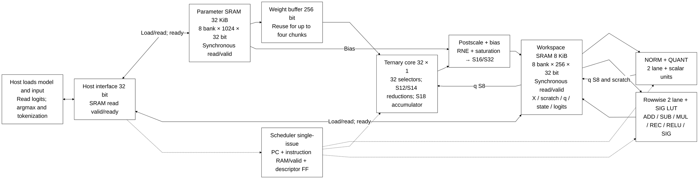

# ASIC inference nhỏ với weight ternary và SRAM 256 bit

> **Category: LEGACY.**

> **Phạm vi legacy:** trang này mô tả core matmulfree.
> Top hiện tại llm_soc có [kiến trúc](<../full_rtl_language.md>) và
> [host interface](<../host_interface.md>) riêng.

[Project](<../../../README.md>) → [Tài liệu](<../../README.md>) → **Kiến trúc**

Trang này mô tả core instruction-driven `matmulfree` và quyết định kiến trúc
trước. Top ngôn ngữ hiện tại và memory/latency/format số nằm ở
[full RTL language](<../full_rtl_language.md>). Với top mới, area không phải ưu tiên;
SRAM và pipeline được tăng để đáp ứng correctness và >=100 MHz toàn graph.

Mục lục trang

- [Kết quả rà soát theo yêu cầu mới nhất](#kết-quả-rà-soát-theo-yêu-cầu-mới-nhất)
- [Cấu hình core](#cấu-hình-core)
- [Những gì giữ từ bài báo và những gì được thu nhỏ](#những-gì-giữ-từ-bài-báo-và-những-gì-được-thu-nhỏ)
- [Bảng bit cho từng khối](#bảng-bit-cho-từng-khối)
- [Scale, bias và cập nhật state](#scale-bias-và-cập-nhật-state)
- [NORM + QUANT bằng số nguyên](#norm--quant-bằng-số-nguyên)
- [Sigmoid và SiLU bằng LUT nhỏ](#sigmoid-và-silu-bằng-lut-nhỏ)
- [SRAM và luồng dữ liệu](#sram-và-luồng-dữ-liệu)
- [Mô hình demo phù hợp](#mô-hình-demo-phù-hợp)
- [Trình tự demo và cách kiểm chứng](#trình-tự-demo-và-cách-kiểm-chứng)
- [Mô hình chạy cục bộ đã đối chiếu](#mô-hình-chạy-cục-bộ-đã-đối-chiếu)
- [Bảng chuyển đổi từng module RTL hiện có](#bảng-chuyển-đổi-từng-module-rtl-hiện-có)
- [Phạm vi kiểm chứng](#phạm-vi-kiểm-chứng)

Cấu hình kiến trúc chốt ngày 28/09/2026 cho mục tiêu ASIC inference nhỏ, ưu tiên diện tích và điện năng. Chip chỉ chạy các mô hình ternary nhỏ; quá trình huấn luyện diễn ra trên máy tính. Tài liệu này thay thế phương án BF16/FP32 trước đó và tập trung vào cấu hình phần cứng, độ rộng bit, SRAM và mô hình demo.

**Tài liệu và RTL cập nhật 01/10/2026, sau rà soát/tối ưu và thống nhất implementation.** Core dùng cùng RTL trong mô phỏng và synthesis, không chọn nhánh theo macro của công cụ. Quartus dùng để demo tổng hợp và timing FPGA; xem [báo cáo kiểm tra](<../../history/reviews/implementation_review.md>), [critical path/Fmax](<../../verification/timing/README.md>) và [sơ đồ hierarchy hiện hành](<../../source_guide/legacy/README.md>). Bảng mục tiêu ASIC bên dưới vẫn là định hướng resource sharing/macro PDK; chưa bảo đảm toàn chip chỉ dùng hai multiplier 16×16.

**Implementation hiện tại:** sqrt radix-4 giữ 32 bước, NORM divider U55 và compose divider 48/25 có fit filter RNE; rowwise dùng chung hai scale/RNE paths, chốt operand/product/raw/rounded result để chia critical path. Sigmoid dùng coordinate S45 và tích nội suy U34. NORM dùng chung hai multiplier S25×S25 cho square/norm/quant, chốt operand/product S48/RNE; hệ số dùng lại norm_r/quant_r/quant_d đã chốt ở PREP. Đây là sharing trong NORM; không phải decomposition toàn chip thành hai multiplier 16×16. Parameter/workspace SRAM và instruction RAM luôn dùng synchronous read/valid; frontend host chốt request/response: control/descriptor read hai cạnh lên, SRAM/imem read bốn cạnh lên đến ready, backend adapter vẫn read-valid hai cạnh lên. Scheduler chờ instruction valid, thêm hai chu kỳ fetch mỗi instruction so với mô hình tổ hợp cũ. Sigmoid luôn dùng bảng ROM hằng. [Báo cáo rà soát](<../../history/reviews/design_review.md>) có phạm vi kiểm chứng và số liệu của từng snapshot; dispatcher chờ busy/done nên chấp nhận latency word mới.

**Cấu hình cơ sở:** 32 phần tử đầu vào × 1 phần tử đầu ra, tương ứng 32 phần tử xử lý ternary (PE); activation INT8; weight 2 bit; accumulator có dấu 18 bit cho K≤512; state và residual có dấu 16 bit, mỗi tensor có scale riêng; gate unsigned 16 bit; vector unit 2 lane dùng phép nhân 16×16; scalar unit dùng nhiều chu kỳ cho chuẩn hóa và rescale. Mỗi word SRAM rộng 256 bit. Dự toán ban đầu gồm parameter SRAM 32 KiB và workspace SRAM 8 KiB, chưa tính ROM, mạch điều khiển và phần phụ trợ của macro nhớ.

Datapath inference của cấu hình này không dùng BF16, FP16 hoặc FP32. Các giá trị có phần thập phân được biểu diễn bằng **số nguyên và scale**. Một số phép tính dùng định dạng fixed-point riêng, nhưng không ép toàn chip theo Q4.12. Phần mềm xuất mô hình và đối chiếu trên máy tính có thể dùng floating-point; ASIC không cần floating-point unit (FPU). Đây là lựa chọn thiết kế cho model tương thích, không phải quy tắc rằng mọi model inference đều chạy đúng khi bỏ floating-point.

## Kết quả rà soát theo yêu cầu mới nhất

**Giữ cấu hình cơ sở 32 PE và các bit-width hiện có trong đề xuất.** Theo yêu cầu mới nhất, giả định model đã train; công việc trên NPU chỉ gồm inference. Giả định này không tự làm thay đổi miền giá trị, scale hoặc các operator của model. Khi nạp checkpoint, vẫn cần export và đối chiếu số học với định dạng ASIC. Mục tiêu sinh câu ngắn không tự buộc tăng PE, dùng FP16 hoặc đổi mọi activation thành INT16.

| Nội dung trong lịch sử trao đổi | Quyết định hiện tại | Ảnh hưởng đến bảng bit |
|---|---|---|
| Muốn ASIC nhỏ, chỉ inference | Dùng số nguyên và scale; không có FPU trong cấu hình cơ sở | Giữ S8 cho activation vào ternary core, S16 cho state, weight 2 bit |
| Không muốn bị ràng buộc bởi Q4.12 | Scale riêng theo tensor và format riêng theo phép toán | Không trở lại Q4.12 chung; gate vẫn U16/F15, scratch NORM vẫn S24/F16 |
| Thu nhỏ từ K_MAX=2048 xuống 512 | Giữ K_MAX=512 | ACC20→ACC18, tổng bình phương U42→U40 và workspace 16→8 KiB đã được cập nhật trước đó |
| Thảo luận tăng thành 32×4 hoặc 32×8 PE | Đây là phương án tăng throughput; chưa chọn thay cấu hình 32×1 | Chưa tăng số PE hay số accumulator; tăng PE cũng không tự đổi số bit của mỗi accumulator |
| Giả định tất cả model đã train | Đánh giá khả năng inference và tính tương thích của checkpoint | Không dùng việc chưa train làm lý do tăng bit hoặc loại bỏ khả năng tính toán của 32 PE |
| Muốn chạy model ngôn ngữ nhỏ, sinh câu ngắn | NanoFable đã chạy generation trên CPU và linear replay trên RTL; MLP/Seq64 bổ trợ kiểm tra phần cứng | Chưa có toàn model ngôn ngữ chạy trên core cơ sở; demo partial không tự chốt cấu hình lớn hơn |
| Cân nhắc NanoFable | Đã kiểm chứng 28 tensor ternary × 6 activation context = 168 lượt linear RTL | Toàn graph vẫn chạy CPU; cần mở rộng operator/memory để chạy toàn model |

**32 PE đủ để lần lượt thực hiện các dot product được hỗ trợ.** Điều kiện chạy trọn model còn gồm K của từng phép tính, operator, format, memory và lịch chạy. Chất lượng câu trả lời thuộc khả năng của model và sai số sau quantization; không thể suy ra từ số PE. Số PE và bit-width hiện tại cũng chưa chứng minh tốc độ sinh token thực tế.

## Cấu hình core

| Thông số | Chọn cho bản đầu | Lý do |
|---|---:|---|
| DOT_LANES | **32** | Mỗi lượt đọc 32 giá trị INT8 của vector `q`, tương ứng 256 bit |
| OUT_PAR | **1** | Tính một phần tử đầu ra mỗi lượt, dùng 32 PE |
| STATE_W / ACT_W / WEIGHT_W | **16 / 8 / 2** | Độ rộng state, activation và weight |
| ACC_W | **18** | Đủ biên cho dot product INT8 với K≤512 |
| K_MAX | **512** | Ba mô hình demo cần K≤256; mức 512 dành cho mở rộng nhỏ |
| VEC_LANES | **2** | Dùng lại hai bộ nhân 16×16 và mạch cộng/trừ |
| SRAM_DATA_W | **256** | Độ rộng dữ liệu của word SRAM; chưa tính ECC nếu có |
| Parameter SRAM | **1024×256 = 32 KiB** | Chứa weight, embedding, bias và metadata |
| Workspace SRAM | **256×256 = 8 KiB** | Chứa activation, state, `q` và vùng trung gian NORM |
| SIG LUT | **257×16 bit hữu dụng** | 514 B; có thể bố trí ROM 512×16 = 1 KiB |
| Giao tiếp host | Thanh ghi và dữ liệu **32 bit**, cửa sổ địa chỉ 32 bit | Nạp mô hình/đầu vào và đọc kết quả |
| Chế độ chạy | Một yêu cầu trên một core | Không cần lập lịch nhiều yêu cầu ở bản đầu |

Một word SRAM 256 bit chứa 128 weight ternary. Core dùng 32 weight mỗi lượt, nên có thể tái sử dụng word này qua tối đa **4 lượt tính**. Core lần lượt xử lý từng hàng đầu ra; mỗi hàng cần `ceil(K/32)` lượt dot product. Tăng số hàng đầu ra không tự làm tăng ACC_W, nhưng K của mỗi hàng vẫn phải ≤512 và dữ liệu phải được cấp phát hoặc nạp theo lịch phù hợp.

Một word SRAM chứa được 16 giá trị INT16, nhưng vector unit chỉ có hai lane và hai bộ nhân 16×16. Vì vậy, riêng việc xử lý 16 phần tử cần ít nhất 8 lượt; các phép toán phức tạp có thể cần thêm vi lệnh.

So với đề xuất trước, K_MAX giảm từ 2048 xuống 512, accumulator từ 20 xuống 18 bit, tổng bình phương từ U42 xuống U40 và workspace SRAM từ 16 xuống 8 KiB. Giữ parameter SRAM 32 KiB vì demo sinh ký tự cần khoảng 25 KiB sau khi tính padding và embedding. Nếu chỉ làm bộ phân loại 256→64→32→10, có thể dùng cấu hình nhỏ hơn: K_MAX=256, ACC17, tổng bình phương U39, parameter SRAM 8 KiB và workspace SRAM 4 KiB. Cấu hình nhỏ này không chứa được hai demo dùng MLGRU theo cách xếp dữ liệu hiện tại.

Ảnh 16×16 có 256 **phần tử** INT8, tổng cộng 256 B, đọc qua 8 word SRAM. Mỗi giá trị đầu vào chỉ rộng 8 bit; con số 256 bit là độ rộng một word SRAM. State INT16 phục vụ các mô hình MLGRU và kết quả sau rescale; đầu vào của phép dot product vẫn là INT8.

## Những gì giữ từ bài báo và những gì được thu nhỏ

Theo [Scalable MatMul-free Language Modeling v5](https://arxiv.org/html/2406.02528v5), thiết kế giữ các linear layer ternary, lượng tử hóa activation xuống 8 bit, RMSNorm + QUANT trước BitLinear, rescale sau dot product và MLGRU/GLU trong demo sinh chuỗi. Độ rộng số học, dung lượng SRAM và số PE là lựa chọn riêng cho ASIC nhỏ này, không phải thông số bắt buộc của bài báo.

Các phương trình MLGRU trong [bản PDF của bài báo](<../../history/references/2406.02528v5.pdf>) có bias. Thiết kế hỗ trợ bias bằng số nguyên và bỏ qua phép cộng này nếu mô hình không có bias. Không thể bỏ bias của một mô hình chỉ vì mô hình BitNet khác không dùng nó.

Checkpoint phù hợp với cấu hình demo phải dùng RMSNorm **không có tham số affine**, theo Phụ lục A. Bản đầu chưa hỗ trợ hệ số nhân hoặc độ lệch chuẩn hóa học được theo từng kênh. Nếu một checkpoint có các tham số đó, cần bổ sung phép xử lý tương ứng hoặc dùng mô hình khác; bỏ chúng đi sẽ làm thay đổi mô hình.

Quy tắc quantization được chốt như sau: hệ số 127, round-to-nearest-even (RNE), clamp vào [-128, 127] và zero-point=0. RNE làm tròn đến số nguyên gần nhất; khi nằm đúng giữa hai số nguyên thì chọn số chẵn. Lựa chọn này bám theo Thuật toán 1 và mã của tác giả. Phụ lục A lại ghi Q_b=128; phần mô tả normalization trong Thuật toán 1 cũng khác RMSNorm ở một số chi tiết. Reference model dùng RMSNorm dựa trên mean-square, không trừ mean. Các cách viết trong bài báo không được coi là tương đương bit-exact.

## Bảng bit cho từng khối

Đây là **bảng bit cơ sở sau khi rà soát**, áp dụng cho 32 PE, K≤512 và các demo đã liệt kê. S/U lần lượt chỉ số nguyên có dấu/không dấu; chẳng hạn S16 là số nguyên có dấu 16 bit, đã gồm sign bit. `S24/F16` là tổng 24 bit với 16 bit phần lẻ, không phải FP16. Divider và sqrt vô hướng dùng nhiều chu kỳ; các tích tensor hiện dùng multiplier tổ hợp theo độ rộng khai báo của từng engine. Ghép mọi tích rộng từ hai multiplier 16×16 dùng chung toàn chip vẫn là mục tiêu kiến trúc. Thiết kế không có 32 bộ nhân 64 bit hoặc FPU.

| Khối / dữ liệu | Bit chọn | Vai trò / trung gian | Đóng gói SRAM 256 bit |
|---|---:|---|---|
| Ảnh đầu vào trước MLP | **S8** sau xử lý trên host | Exporter xác định scale; core nhận INT8 đối xứng | 32 phần tử |
| Activation `x`, residual và candidate `c` | **S16** | Mỗi tensor có scale riêng, không mặc định Q4.12 | 16 phần tử |
| State lưu qua các bước `h` | **S16** | Giữ scale ổn định giữa các bước thời gian | 16 phần tử |
| Mô tả scale state | **F_t 5 bit**, trong metadata 32 bit | x_real=x_raw×2^(-F_t), F_t=0..24; chọn khi calibration hoặc QAT | Metadata |
| Đầu vào NORM | **S16** | Xử lý đủ K phần tử bằng hai lane tái sử dụng bộ nhân | 16 phần tử |
| Trị tuyệt đối và cực đại | **U16** | Biểu diễn được abs(-32768)=32768 | Vô hướng |
| Bình phương X² | **U32** | Tích 16×16 có dấu; giá trị lớn nhất là 2^30 | Không lưu toàn bộ vector bình phương |
| Tổng bình phương ΣX² | **U40** | Đủ cho K≤512; cấu hình K≤256 chỉ cần U39 | Một scalar accumulator |
| Trung bình bình phương và `epsilon` | **U64** | Có 32 bit phần lẻ trong miền raw²; exporter kiểm tra giới hạn | Vô hướng |
| Kết quả căn bậc hai `R` | **U32** | Có 16 bit phần lẻ trong miền RMS raw; tính nhiều chu kỳ | Vô hướng |
| Vùng trung gian sau NORM, `z` | **S24, 16 bit phần lẻ** | Khoảng [-128,128); với K≤512, biên lý tưởng ≤√K≈22,63; chừa bit dự phòng | Lưu trong ô 32 bit: 8 phần tử |
| Trị tuyệt đối lớn nhất của `z` | **U24** | Tính trên toàn vector sau NORM | Vô hướng |
| Hệ số nghịch đảo và requantization | **M U24 + dịch U6** | Hệ số≈M/2^r, r=0..47; đóng cùng hai cờ vào 32 bit | 8 mô tả 32 bit |
| Phép nhân NORM | **S16×U24→S40** | Giá trị hữu ích S40; RTL dùng chung multiplier S25×S25→S48 với square/QUANT | Nội bộ |
| Phép nhân QUANT | **S24×U24→S48** | Làm tròn, dịch và chặn một lần về INT8 | Nội bộ |
| Activation đã quantize `q` | **S8** | Đầu vào của phép dot product ternary | **32 phần tử** |
| Weight ternary | **2 bit** | 00=0, 01=+1, 11=-1; 10 để dành | **128 weight** |
| Hạng tử ternary +q/0/-q | **S9** | Mở rộng dấu trước khi đổi dấu; chứa được +128 | 32 hạng tử nội bộ |
| Tổng của 32 hạng tử | **S14** | Biên ±4096 | Một partial sum |
| Dot-product accumulator | **S18** | Biên INT8 đầy đủ: ±128K, K≤512 | Một accumulator; khi ghi SRAM mở rộng dấu lên 32 bit |
| CSA nếu tiếp tục dùng mạch CSA của RTL | **2×18 bit/đầu ra** | Hai nhánh tổng và carry; cộng cuối về S18 | 36 bit thanh ghi |
| Bias lưu trữ | **S32** | Theo đơn vị của đầu ra sau rescale | **8 giá trị** |
| Postscale multiply | **S18×U24→S42** | Nhân accumulator với hệ số rescale, sau đó làm tròn và cộng bias | Nội bộ |
| Cộng bias và làm tròn | **RNE S42, cộng bias S43** | Product/RNE có register trong ternary engine; không cắt xuống 16 bit trước khi cộng bias | Nội bộ |
| Cộng/trừ state | **S16 vào/ra, S17 trung gian** | Đưa hai nguồn về cùng scale rồi bão hòa đầu ra | 16 phần tử/word mỗi nguồn |
| Nhân từng phần tử | **S16×S16→S32** | Dịch và làm tròn theo scale đầu ra, sau đó về S16 | Hai lane |
| Sigmoid gate `f`, `g` | **U16, 15 bit phần lẻ** | Giá trị raw 0..32768 biểu diễn [0,1], kể cả 1 | 16 giá trị |
| Phần bù `1-f` | **U16** | 32768-f_raw; kiểm tra giá trị gate hợp lệ | 16 phần tử |
| Sigmoid LUT và nội suy | **Điểm mẫu U16/F15; địa chỉ mẫu U9** | Coordinate S45 giữ 24 fractional bits; chênh hai mẫu kế tiếp ≤512 dùng U10; tích nội suy U10×U24→U34 | ROM nhỏ |
| SiLU | **S16 × U16 → tích có dấu 32 bit** | Nhân với giá trị gate rồi làm tròn theo scale đích | Hai lane hoặc tuần tự |
| Cập nhật state `f*h+(1-f)*c` | **Tích S32, tổng S33 → S16** | `h` và `c` cùng scale; chỉ làm tròn sau phép cộng | 16 phần tử/word |
| Logits / argmax | **S32** | Giữ cùng scale để so sánh; không cần softmax | 8 giá trị |
| Mã ký tự/nhãn | **U8 trong cấu hình cơ sở** | Demo dùng 128 ký tự hoặc 10 lớp ảnh; không áp dụng mặc định cho vocabulary lớn | 32 mã/word |
| Địa chỉ SRAM cục bộ | **10 bit cho tham số; 8 bit cho vùng làm việc** | Địa chỉ word; bộ đếm có thể cần thêm bit để biểu diễn depth | Điều khiển |

Hệ số M24 và phép dịch bit dùng số học nguyên, không phải floating-point: mỗi activation không có trường số mũ, và chip không có bộ cộng/nhân IEEE FP. Vùng `z` có 16 bit phần lẻ và giá trị gate có 15 bit phần lẻ vì yêu cầu của từng phép toán; đây không phải một định dạng Q dùng chung toàn chip.

Accumulator 18 bit đủ cho K≤512 vì 128×512=65536, còn S17 chỉ biểu diễn đến +65535. Tổng bình phương cần U40 vì 512× 32768²=2^39, vượt U39 đúng một đơn vị. Nếu K≤256, hai mức tối thiểu tương ứng là S17 và U39. Bias được cộng sau khi rescale, không cộng trực tiếp vào dot-product accumulator. Giới hạn K áp dụng cho **toàn bộ phép dot product**; chia đầu vào thành các nhóm 32 phần tử không làm giảm độ rộng accumulator.

### Những bit-width chỉ đổi khi chọn mở rộng cụ thể

Các dòng dưới đây là điều kiện mở rộng, **chưa thay thế cấu hình cơ sở**. K là số phần tử cộng trong một dot product; V là số token trong vocabulary. Tổng số tham số của model không phải K hay V.

| Trường hợp | Khối cần đổi | Bit-width / format cần dùng |
|---|---|---|
| 512<K≤1024 | Accumulator, tổng bình phương NORM, postscale và bộ đếm K | **ACC S19; ΣX² U41; postscale S43**, phép cộng bias dùng S44 an toàn; K length U11, element index U10 |
| 1024<K≤2048 | Các khối tương ứng | **ACC S20; ΣX² U42; postscale S44**, phép cộng bias dùng S45 an toàn; K length U12, element index U11 |
| Vocabulary V=4096 | Token ID, chỉ số output row và bộ đếm số output | ID/index tối thiểu **U12**; chọn **U16 để lưu token ID**; bộ đếm chứa cả giá trị hoàn tất 4096 cần **U13**. K của output head vẫn quyết định ACC_W |
| V=4096, greedy decoding | Output head / argmax và buffer logits | Giữ **logits S32 cùng scale**; có thể dùng streaming argmax. Lưu cả 4096 logits cần **16 KiB**, vượt workspace 8 KiB; streaming argmax chỉ giữ best score, best ID và trạng thái điều khiển |
| Model có nhiều weight hoặc state hơn | SRAM và địa chỉ | Giữ **word 256 bit**; tính lại depth/bank, địa chỉ và lịch nạp. Word-address cần `ceil(log2(depth))` bit; không suy ra dung lượng đủ chỉ từ bus 256 bit |
| Checkpoint có affine norm, attention hoặc embedding/head floating-point | Operator và quá trình export | Phải xác nhận cách thực thi và sai số chuyển đổi trước khi chọn bit-width. Tăng PE hoặc đổi S8 thành S16 không tự bổ sung các operator còn thiếu |

Với đầu vào S8 đầy đủ và weight ternary, giới hạn bảo thủ là `|ACC|≤128K`; số bit có dấu tối thiểu là `1+ceil(log2(128K+1))`. Với đầu vào NORM S16, `ΣX²≤K×2^30`; số bit unsigned tối thiểu là `ceil(log2(K×2^30+1))`. Các mức trên tính theo giới hạn K lớn nhất của từng dòng.

Mở rộng K còn cần đổi scratch memory, descriptor và vòng lặp toàn vector của NORM + QUANT. Chỉ ba vùng X S16, z lưu S32 và q S8 đã cần **7K byte**: 7 KiB khi K=1024, 14 KiB khi K=2048, chưa có state và tensor khác. Không thể chỉ tăng ACC_W rồi coi workspace 8 KiB vẫn đủ.

## Scale, bias và cập nhật state

State và dữ liệu trung gian lưu mã `x_raw` S16 cùng scale dạng 2^(-F_t). Mỗi tensor có thể dùng `F_t` khác nhau; `h` và `c` phải được đưa về cùng đơn vị trước khi cập nhật state. Exporter chọn scale khi calibration hoặc huấn luyện QAT, đồng thời kiểm tra bão hòa. Nếu thay đổi scale của `h` giữa các bước thời gian, phải chuyển đổi cả state đã lưu.

Đầu ra của linear layer có dạng y=s_x*s_w*a+b, trong đó `a` là kết quả dot product của các mã số nguyên. ASIC tính đầu ra trong miền số nguyên:

`C = s_x*s_w / s_y ≈ M_out / 2^r_out`

`b_raw = RNE(b/s_y)` — tính khi xuất mô hình và lưu dưới dạng S32.

`y_raw = saturate_dest(RNE(a*M_out / 2^r_out) + b_raw)`.

Bias được cộng **sau khi đưa kết quả về đơn vị đầu ra**, nên `b_raw` không phụ thuộc vào scale của activation thay đổi theo từng bước. Hệ số `M_out` có thể thay đổi sau NORM + QUANT; exporter cung cấp các hệ số cố định cần thiết, còn scalar unit kết hợp chúng với scale của `q`. SRAM không lưu hệ số dưới dạng floating-point.

Hệ số phải biểu diễn được bằng M24 và số bit dịch 0..47 trong giới hạn sai số đã chốt. Nếu không, exporter phải chọn lại scale hoặc báo không hỗ trợ; không được tự cuộn vòng hay cắt bớt bit. Mạch làm tròn cần các bit guard/sticky và xử lý số âm theo quy tắc RNE, thay vì chỉ dịch phải số học.

Giá trị gate dùng scale `raw/32768`, nên:

`H_new = sat16(RNE((F*H_old + (32768-F)*C_raw) / 32768))`.

Ví dụ, `f=0.9999` tương ứng mã gần 32765 và vẫn cho phép một phần cập nhật nhỏ. State S16 có thể mất những thay đổi rất nhỏ khi làm tròn, vì vậy demo cần kiểm tra cả chuỗi nhiều bước. Độ rộng 16 bit chưa bảo đảm đúng cho mọi mô hình hồi tiếp.

## NORM + QUANT bằng số nguyên

Dùng RMSNorm không có tham số affine trước BitLinear. Có thể bỏ qua NORM nếu mô hình được huấn luyện như vậy. Với mô hình có RMSNorm, thay phép này bằng một lần dịch bit sẽ làm thay đổi mô hình.

Trình tự tham chiếu dưới đây giữ đủ bit trung gian; mọi phép tính trên chip đều dùng số nguyên:

1. Nhận vector `X_raw` S16 và tính `S=ΣX_raw²` bằng U40 trên toàn K phần tử.
2. Tính trung bình bình phương trong miền raw² với 32 bit phần lẻ bằng scalar unit. Tách phép tính để không cần bus 72 bit cho `S<<32`:

   `Q=S//K; T=S%K`

   `V=(Q<<32)+((T<<32)//K)+E_raw32`.

   `E_raw32=RNE(epsilon_real * 2^(2F_x+32))` là hằng U64 do exporter tạo. Kiểm tra `V` không vượt U64. Nếu `epsilon` nhỏ hơn độ phân giải này, phải thay đổi cấu hình xuất mô hình thay vì tự đưa về 0.
3. Tính căn nguyên `R=isqrt(V)` dưới dạng U32. `R` biểu diễn RMS của đầu vào raw với 16 bit phần lẻ. Một mạch căn/chia vô hướng dùng nhiều chu kỳ cho cả vector.
4. Nếu vector toàn số 0, đặt `q=0`; đầu ra linear layer khi đó bằng bias. Với vector khác 0 và K≤512, `R>0` ngay cả khi `epsilon=0`. Tính `C_norm=2^32/R ≈ M_norm/2^r_norm`, rồi đọc lại `X_raw` để tạo `z_raw=RNE(X_raw*C_norm)` ở định dạng S24/F16. Lưu `z` và tìm trị tuyệt đối lớn nhất.
5. Đặt `D=max(max(abs(z_raw)), delta_raw)`, trong đó `delta_raw≥1` được chốt khi xuất mô hình. Tính `C_quant=127/D ≈ M_q/2^r_q`, rồi đọc lại `z` để tạo `q=clamp(RNE(z_raw*C_quant),-128,127)` dưới dạng S8.
6. Scale thực của `q` là `D/(127*2^16)`. Scalar unit kết hợp nó với các hệ số của weight và đầu ra để tạo `M_out` và `r_out` bằng phép chia và dịch bit số nguyên. Không tạo hệ số floating-point trên chip.

RTL hiện dùng chung hai multiplier S25×S25 và hai đường RNE trong NORM; rowwise dùng hai multiplier 16×16 và hai đường scale/RNE. Các engine này chốt operand, product và kết quả làm tròn để chia critical path; NORM thêm **8 × ceil(K/2)** chu kỳ so với bản trước tối ưu timing. Postscale và scale compose có multiplier riêng. Mục tiêu tiếp theo là chia sẻ hai multiplier 16×16 toàn chip và ghép các tích 16×24, 24×24, 18×24 qua nhiều bước; chưa triển khai decomposition này. Divider/căn đã tuần tự; không có multiplier 64× 64.

Trình tự này đọc vector K phần tử ba lượt, cộng thêm thời gian thiết lập của scalar unit. **Không suy ra latency là 3K/2 chu kỳ**: FSM request/wait/process/write, cổng SRAM và chia/căn vô hướng đều đóng góp thời gian. Decomposition multiplier trong tương lai sẽ cần thêm lịch xử lý. Reference model phải mô tả hệ số gần đúng, căn nguyên, làm tròn và bão hòa. Register đã được thêm theo critical path của demo post-fit; mở rộng lane tiếp theo cần đo timing và chu kỳ model.

Vector `z` nằm trong workspace SRAM, không ghi ra bộ nhớ ngoài chip; NORM và QUANT dùng chung vùng trung gian này. Bản đầu giữ các bước tách bạch để dễ kiểm chứng. Chỉ rút gọn phép RMS nếu đã chứng minh đầu ra, scale, `epsilon` và giới hạn bão hòa vẫn tương đương.

Với K_MAX=512, vùng `X_raw` cần 1 KiB, vùng `z` lưu trong ô S32 cần 2 KiB và vùng `q` cần 512 B. Tổng ba vùng là 3,5 KiB, còn 4,5 KiB cho state và các tensor khác trong workspace SRAM. Khi K=256, ba vùng cần 1.792 B. Model compiler phải kiểm tra lượng bộ nhớ dùng đồng thời; K≤512 không bảo đảm mọi mô hình đều vừa 8 KiB.

## Sigmoid và SiLU bằng LUT nhỏ

Thiết kế dùng 257 điểm mẫu của sigmoid trên đoạn [-8, 8], cách nhau 1/16. Mỗi giá trị mẫu có định dạng U16/F15. Khi tra bảng, đổi đầu vào về vị trí trên lưới số nguyên, chặn các giá trị ngoài đoạn và nội suy tuyến tính giữa hai điểm gần nhất. Các điểm mẫu được tạo khi xuất mô hình; chip không tính hàm mũ bằng floating-point.

RTL dùng một địa chỉ tra bảng hằng cho hai điểm mẫu trong hai chu kỳ liên tiếp. Phép nhân nội suy nằm trong `sigmoid`, chưa dùng chung multiplier xuyên các engine. Dữ liệu bảng cần 514 B; dự toán 1 KiB nếu bind macro ROM 512×16. Miền giá trị và bước lấy mẫu đã chốt trong RTL; vẫn cần đo sai số của gate, SiLU và độ chính xác mô hình sau QAT.

Bản đầu không cần lệnh hàm mũ hoặc chia vector tổng quát. NORM + QUANT vẫn cần phép nghịch đảo, chia và căn nguyên trong scalar unit. Các phép nhân từng phần tử và rescale dùng bộ nhân số nguyên nhỏ.

## SRAM và luồng dữ liệu

Đây là sơ đồ luồng dữ liệu; scheduler chạy từng instruction, dùng workspace request mux/response demux để nối engine đang hoạt động. `q`, scratch, state và logits là các vùng trong cùng workspace 8 KiB. TMATMUL ghi S16/S32 vào workspace; rowwise đọc/ghi workspace qua lệnh riêng. Host đọc logits và thực hiện argmax/tokenization. [Sơ đồ hierarchy đầy đủ](<../../source_guide/legacy/README.md#2-sơ-đồ-kiến-trúc-tổng-quan-đang-chạy>) thể hiện các đường control/data thực tế. Khi tính dot product ternary, workspace SRAM cấp dữ liệu `q`, còn parameter SRAM cấp weight. Các lần đọc bias, ghi đầu ra và truy cập khác phải được sắp lịch qua buffer hoặc những chu kỳ riêng; không giả định SRAM một cổng vừa đọc nhiều nguồn vừa ghi trong cùng chu kỳ.

Một word 256 bit chứa 16 giá trị S16, 32 giá trị `q` S8, 128 weight ternary hoặc 8 giá trị S32. Vector 256 phần tử chiếm 512 B nếu dùng S16, hoặc 256 B nếu dùng S8. State `h` dài 64 phần tử cần 128 B cho mỗi tầng và mỗi yêu cầu.

Weight của mỗi phần tử đầu ra bắt đầu tại ranh giới word SRAM 256 bit; một word chứa tối đa 128 weight. Các vị trí thiếu ở cuối hàng được điền mã 0. Core chỉ tính `ceil(K/32)` nhóm 32 phần tử hữu ích cho mỗi hàng:

`weight_word_addr = base + output_row*ceil(K/128) + floor(input_col/128)`.

Vị trí của nhóm trong buffer weight là 0, 64, 128 hoặc 192 bit. Activation được lấy từ vùng `q` theo chỉ số cột. Hàng ngắn có thể lãng phí nhiều bit đệm, nên bảng dung lượng demo đã tính phần này. Đóng gói xuyên qua ranh giới hàng có thể tiết kiệm SRAM nhưng làm mạch điều khiển phức tạp hơn.

Nếu mô hình vừa parameter SRAM, host hoặc flash chỉ cần nạp một lần rồi có thể chạy nhiều mẫu. Mô hình lớn hơn phải nạp từng tầng, chấp nhận tăng latency và vẫn phải đáp ứng các phép toán, K_MAX và độ rộng bit mà core hỗ trợ. Dung lượng 32+8 KiB là **dung lượng logic đã triển khai trong RTL**. Mỗi SRAM có tám bank 32 bit, write-enable riêng theo lane và một cổng đọc synchronous chung cho host/compute. Backend adapter trả read-valid sau hai cạnh lên; frontend top chốt request/response nên host SRAM giữ enable/read/address qua bốn cạnh lên đến ready. Descriptor dùng 1.024 bit thanh ghi. Xem [sơ đồ và hợp đồng SRAM](<../../source_guide/blocks/sram_256_wrapper.sv.md>). Wrapper là adapter để bind SRAM macro, không chứa primitive hoặc thuộc tính memory của Quartus. Chưa có thư viện SRAM hoặc PDK để xác nhận macro đơn khối 1024×256 và 256×256. Nếu thư viện chỉ có macro rộng 64 bit, có thể ghép bốn macro cùng độ sâu thành một word 256 bit, sau đó kiểm tra cổng truy cập, latency và timing. Không thể suy ra diện tích hay công suất từ dung lượng logic này.

## Mô hình demo phù hợp

Để đánh giá phần cứng theo yêu cầu hiện tại, **giả định ba cấu hình dưới đây đã có weight được train và xuất đúng định dạng ASIC**. MLP và Seq64 kiểm tra các khối tính toán; Char32 minh họa inference sinh ký tự. Về trạng thái thực tế, chưa xác minh checkpoint hoặc chạy các cấu hình này trên thiết kế. Giả định dùng để tính bit/memory không phải xác nhận đã có checkpoint tương thích.

| Demo | Cấu hình | Số weight ternary | Dung lượng 2 bit trước / sau padding theo SRAM | Mục đích |
|---|---|---:|---:|---|
| **Ternary-MLP-16x16** | MNIST thu về 16×16; 256→64→32→10; NORM + QUANT trước linear layer, ReLU ở các hidden layer | **18.752** | **4.688 / 5.440 B** | Kiểm tra SRAM, NORM + QUANT, core ternary và phân loại |
| **Tiny-MLGRU-Seq64** | 28 hàng ảnh là 28 bước thời gian; tầng đầu 28→64; một MLGRU chiều 64; classification head 64→10 | **18.816** | **4.704 / 10.560 B** | Kiểm tra sigmoid gate, SiLU và state hồi tiếp |
| **Tiny-Char-MLGRU32** | 128 ký tự ASCII; một MLGRU chiều 32, GLU hidden layer 96; embedding S16; output head ternary 32→128 | **17.408** | **4.352 / 15.360 B** | Trình diễn sinh chuỗi ký tự nhỏ |

- **MLP:** host thu ảnh về 16×16 và xử lý giá trị đầu vào. RMSNorm không có tham số affine và QUANT xuống INT8 được dùng trước mỗi linear layer ternary. Huấn luyện và reference model phải dùng cùng `epsilon`, cách xử lý vector 0 và quy tắc làm tròn. Demo này chưa kiểm tra gate hoặc state MLGRU.
- **Seq64:** weight gồm tầng đầu vào 28→64, bốn tầng 64× 64 của MLGRU và classification head. State `h` cần 128 B. Kết quả ở bước cuối dùng để phân loại; demo này chưa có GLU.
- **Char32:** một khối có bốn tầng 32× 32 của MLGRU và GLU gồm các tầng 32→96, 32→96, 96→32; thêm output head 32→128. Chiều ẩn 96 là lựa chọn **huấn luyện mới** cho demo, không phải kích thước của checkpoint trong bài báo. Embedding 128× 32×16 bit cần **8 KiB**; state `h` cần **64 B**. Output head được huấn luyện ternary từ đầu. Chọn ký tự có điểm số cao nhất trên các đầu ra cùng scale, không cần softmax trên chip. Đây là demo sinh ký tự, chưa nhằm tạo văn bản hội thoại chất lượng cao.

Nếu dự phòng bias S32 cho mọi linear layer và một mô tả hệ số scale 32 bit cho mỗi ma trận, dung lượng tham số tương ứng là khoảng **5.876 B**, **11.904 B** và **25.504 B**, chưa tính metadata phụ hoặc alignment. Cả ba có thể nằm trong parameter SRAM 32 KiB, nhưng exporter vẫn phải kiểm tra dung lượng tệp cuối cùng. Embedding, bias và padding giữa các hàng đều phải được tính.

Số lượt tính dot product tối thiểu của core 32×1, chưa tính NORM + QUANT, xử lý vector, pipeline và truy cập SRAM:

- MLP: 586 lượt/ảnh.
- Seq64: 576 lượt/bước; 28 bước và 20 lượt ở classification head cuối → **16.148 lượt/ảnh**.
- Char32: **544 lượt/ký tự** cho các linear layer đã liệt kê.

Đây là số lần tính, không phải số chu kỳ, latency hoặc throughput đã đo. Với mô hình rất nhỏ, NORM + QUANT nhiều chu kỳ có thể chiếm phần lớn thời gian chạy.

[BitNetMCU](https://github.com/cpldcpu/BitNetMCU) cung cấp mã QAT và xuất mô hình nhỏ, đồng thời có [phần hướng dẫn inference với weight ternary](https://github.com/cpldcpu/BitNetMCU/blob/main/docs/documentation.md#jan-2-2026-finally-introducing-ternary-158-bit-inference). Những độ chính xác được công bố cho cấu hình 4 bit hoặc NF4 trong dự án đó không phải kết quả của ba mô hình đề xuất ở đây. MLGRU/GLU tham khảo [mã của tác giả MatMul-free LM](https://github.com/ridgerchu/matmulfreellm).

## Trình tự demo và cách kiểm chứng

1. Chọn checkpoint đã train, kiểm tra graph, K, vocabulary, operator và bộ nhớ dùng đồng thời. Export weight, bias và scale sang định dạng ASIC; đối chiếu inference với checkpoint gốc.
2. Dùng MLP/Seq64 nếu cần kiểm tra riêng NORM + QUANT, gate và state. So đầu ra từng tầng hoặc từng bước với reference model số nguyên; đo độ chính xác và số lần bão hòa.
3. Với checkpoint ngôn ngữ tương thích, chạy prompt rồi lặp inference, chọn token và cập nhật state đến khi gặp điều kiện dừng. Đo chất lượng câu sinh và số chu kỳ/token riêng; không suy ra hai đại lượng này từ số PE.
4. Nạp cùng weight đã đóng gói và vector kiểm thử vào RTL/FPGA, rồi đối chiếu bit-exact với reference model số nguyên. Sau đó mới đo kết quả synthesis, timing, cách ánh xạ SRAM, diện tích và công suất.

Các hằng số theo mô hình như `epsilon`, `delta_raw`, scale, đơn vị bias, quy tắc làm tròn, bão hòa và LUT phải có cùng phiên bản với exporter. Cần kiểm thử giá trị âm nhỏ nhất của kiểu có dấu và mã weight `10` để dành. State phải được đặt lại khi bắt đầu một chuỗi mới, nhưng được giữ đúng giữa các bước trong cùng chuỗi.

## Mô hình chạy cục bộ đã đối chiếu

Chi tiết về checkpoint, cách chạy trên máy tính và phần cần chuyển đổi nằm trong [bảng chọn mô hình demo](<../../demos/candidates.md>). **FCMNIST/Ternary 256→64→32→10** và Seq64 là các bài kiểm tra phần cứng bổ trợ; mục tiêu ứng dụng hiện tại là inference model ngôn ngữ nhỏ đã train. [NanoFable](<../../demos/language.md>) đã chạy generation trên CPU và linear replay trên RTL; chưa có checkpoint ngôn ngữ chạy trọn trên cấu hình cơ sở.

Checkpoint BitNetMCU **Binary width160_160_160** đã xác nhận graph 256→160→160→160→10, không bias/affine, gồm 93.760 weight. Layout 2 bit theo từng hàng dùng 31.360 B; các descriptor/scale runtime ở FF. Exporter giữ quantizer float32 và gain từng tầng; một weight đúng mean mang mã 0, còn lại −1/+1. [Demo trên RTL](<../../demos/legacy/mnist.md>) pass 10/10 ảnh mẫu và 40 lượt tầng bit-exact, hai lần chạy chương trình toàn graph 20.783 clock/lần cho ảnh số 0. Chưa đo accuracy toàn MNIST. Cấu hình `2bitsym` của BitNetMCU có bốn mức nên không thể nạp như weight ternary.

[Demo NanoFable-1M-ternary](<../../demos/language.md>) dùng checkpoint đã train: CPU sinh 32 token greedy cho mỗi trong 3 prompt và lặp lại cùng kết quả. Từ 6 activation context thực của mỗi trong 28 tensor ternary, RTL pass 168 lượt linear và 33.792 output S32 bit-exact. K lớn nhất là 384. Weight 2 bit cho các linear được hỗ trợ dùng 212.992 B sau padding; tầng lớn nhất 12.288 B nên có thể stream từng tầng vào parameter SRAM 32 KiB, còn workspace demo dùng2.560 B. Affine RMSNorm, RoPE, attention, gating và output head vẫn ở CPU. Đây là kiểm chứng linear của model thực; toàn graph chưa chạy trên NPU. Tệp nén toàn model khoảng 1,16 MiB và chưa vừa SRAM hiện tại.

## Bảng chuyển đổi từng module RTL hiện có

Bảng này ghi lại đối chiếu **RTL v1 trước khi tích hợp** với cấu hình K_MAX=512, 32 ternary PE, vector unit 2 lane, SRAM 256 bit. Các cột “RTL hiện tại” trong bảng là snapshot v1, được giữ để truy vết thay đổi; không mô tả RTL v2 hiện nằm trong project chính. Trạng thái triển khai mới nhất nằm trong báo cáo ngày 29/09/2026 ở đầu tài liệu. Không dùng các file `.bak` làm nguồn.

**Quy ước format:** `S<n>` là signed two's-complement n bit; `U<n>` là unsigned n bit. `S16 × 2^(-F_t)` nghĩa là mã INT16 có scale riêng cho mỗi tensor, `F_t=0..24`. `S24/F16` có tổng 24 bit và 16 fractional bits, không phải FP16. Gate `U16/F15` có tổng 16 bit, scale 2^-15 và mã hợp lệ 0..32768. Các width này đã tính cả sign bit nếu có.

### Datapath và các phép toán

| File / module v1 (lịch sử) | RTL v1 trước chuyển đổi | Cấu hình cần chuyển sang | Format số và thay đổi cần làm |
|---|---|---|---|
| `ternary_mul.sv` — `ternary_mul` | Activation 16 bit; weight code 2 bit; term 17 bit; ACC26; bus vào/ra 512 bit; output mỗi phần tử 16 bit | **Activation S8; weight 2 bit; term S9; accumulator S18; bus SRAM 256 bit; giữ 32 PE** | Activation dùng scale `s_q` từ QUANT; weight code `00/01/11` ứng với `0/+1/-1`, scale weight lưu riêng. Dot output phải giữ S18 tới postscale; sau đó mới ra state S16 hoặc logits S32. Không cắt dot output trực tiếp về S8/S16 |
| `acc_mul.sv` — `acc_mul` | Default input16, 512 input, ACC25; khi được gọi trong `ternary_mul`, các tầng CSA dùng ACC26 | **Các nhánh sum/carry của core dùng 18 bit**, tổng state CSA là **2×18 bit** | Tầng đầu nhận term S9 và sign-extend lên 18 bit; các tầng sau nhận hai nhánh carry-save 18 bit. Tổng nhị phân của 32 term chỉ cần S14 về mặt biên, nhưng không thu riêng từng nhánh CSA xuống S14 rồi sign-extend tùy ý |
| `rowwise_op.sv` — `rowwise_op` | 32 lane, mỗi toán hạng và output 16 bit; nhân bản ADD/SIG/EXP, gọi MUL/DIV 32 lane | **2 lane × 16 bit**; mỗi word SRAM chứa 16 phần tử 16 bit | Trở thành vector unit nhiều chu kỳ. Hỗ trợ state S16 và gate U16/F15 theo loại phép toán; phải thêm busy/done hoặc ready/valid, không giữ giả định ALU trả kết quả combinational ngay |
| `addsub.sv` — `addsub` | a/b/sum 16 bit, có carry/overflow | **S16 +/− S16 → S17 → S16** | Hai đầu vào phải cùng scale trước phép cộng. RNE/rescale nếu cần và saturate output. Dùng hai lane, không phải 32 bản sao. ADD gate có miền unsigned riêng, không diễn giải mã 32768 như số âm |
| `mul.sv` — `mul` | 32 lane 16×16→32; output16, cắt bit theo ý định Q4.12 | **2 lane; S16×S16→S32→S16** | Output scale do descriptor quyết định; thay logic cắt bit hiện tại bằng rescale + RNE + saturation. Phép state×gate dùng **S16×U16/F15**, không cast gate thành S16; trong miền gate 0..32768, tích giữ được bằng S32 |
| `div.sv` — `div` | 32 phép chia signed16/16→16, combinational | **Bỏ vector DIV; dùng scalar divider nhiều chu kỳ với operand/result register tối đa 64 bit** | Phục vụ thiết lập hệ số NORM/QUANT/postscale bằng số nguyên. Format từng operand theo phép tính; không còn một Q4.12 chung. Width của remainder/guard phải được chốt khi chọn thuật toán divider |
| `exp.sv` — `exp_row` | Input/output16, ROM512×16; `rowwise_op` tạo 32 bản sao | **Bỏ khối EXP khỏi datapath bản đầu** | Sigmoid dùng LUT; greedy argmax không cần exp/softmax. Không cần chọn một format EXP mới cho các demo đã đề xuất |
| `sigmoid.sv` — `sigmoid` | Input/output16 theo Q4.12; ROM1024×16; lấy địa chỉ từ x[15:6] | **Input S16 với F_t; output U16/F15; LUT257×16**, budget ROM512×16 | Miền output [0,1], mã 0..32768. Thay ánh xạ địa chỉ cố định bằng chuyển scale input sang lưới [-8,8], bước 1/16 và nội suy. LUT có 257 điểm nên địa chỉ mẫu cần **9 bit**, kể cả điểm cuối |
| `norm.sv` — `Norm_Square_ROM` | Cắt input16 Q4.12 thành 10 bit; ROM1024×19 | **Bỏ square ROM; dùng S16×S16→U32** | Bình phương mã raw đầy đủ; không cắt x[15:6]. Dùng lại hai multiplier 16×16 |
| `norm.sv` — `norm` | 32 input/output16 Q4.12; square19; tổng24; radicand32; RMS16 | **Thay bằng NORM + QUANT: input S16 → output S8**, thống kê toàn K≤512 | Tổng bình phương **U40**; mean-square/epsilon **U64 với 32 fractional bits trong miền raw²**; RMS **U32/F16 trong miền raw**; scratch `z` **S24/F16** lưu trong slot32; absmax **U24**. QUANT xuất INT8 cùng thông tin scale |
| `norm_dispatch.sv` — `norm_dispatch` | Bus512; địa chỉ word10; word_index4; chạy NORM độc lập cho 16 word, mỗi word32 phần tử | **Bus256; địa chỉ workspace8; K length U10; element index U9** | Điều khiển nhiều lượt quét trên cùng vector K. Không tính RMS/absmax riêng từng word. Với K=512: input S16 dùng32 word, scratch32 dùng64 word, qS8 dùng16 word; count chứa cả giá trị hoàn tất cần lần lượt **6/7/5 bit** |

Trong RTL v1, `ternary_mul` buộc độ rộng bus vào `DATA_WIDTH*LANES`. Khi chuyển đổi phải tách `ACT_W=8`, `STATE_W=16`, `SRAM_W=256` và `OUT_W`, thay vì chỉ sửa `DATA_WIDTH=8`. Một word weight256 chứa128 mã, core dùng32 mã/lượt nên có bốn lượt; output256 chứa16 state S16 hoặc8 logits S32. Các loop cố định 512 và phép chia nguyên `MATRIX_COLS/LANES` cũng cần hỗ trợ K thực, tail mask và padding để chạy K=28, 64, 96, 160 hoặc256.

### Memory, pipeline và control

This table records the historical v1 migration proposal. The unused pipeline,
`ctrl_unit`, `hazard_detect` and `mem_burst` modules have since been removed;
the current schedulers directly own state and handshakes. Current code is in
the [source guide](<../../source_guide/blocks/README.md>).

| File / module v1 (lịch sử) | RTL v1 trước chuyển đổi | Cấu hình đề xuất | Format và ý nghĩa |
|---|---|---|---|
| `regfile.sv` — `register` | 1024×512 bit =64 KiB khai báo; bus512; logical register ID3; pointer nội bộ19, NORM address10 | **Dùng làm workspace SRAM256×256 =8 KiB; bus256; physical address8** | Raw packed bits theo tensor: 32×S8, 16×S16/U16 hoặc8×S32 mỗi word. Bỏ decode cố định mỗi register16 word; dùng base/length/format descriptor. Logical ID3 có thể giữ cho8 slot. Count toàn depth256 cần9 bit. Workspace này chính là8 KiB đã dự toán, không cộng thêm một workspace khác |
| `mem_mapping.sv` — `mem_mapping` | MEM_DEPTH=2^19 word512 =32 MiB; pointer19; logical address3; stream shape512×512 cố định | **Parameter SRAM1024×256 =32 KiB; address10; kết nối workspace8 KiB qua wrapper** | Parameter SRAM chứa weight2, biasS32, embeddingS16 và metadata32. Workspace address8 dùng độc lập. Nếu dùng địa chỉ chung, đề xuất **1 bank bit +10 word-address bit**; hai bit cao của workspace address phải bằng0. Count toàn parameter depth1024 cần11 bit |
| `mem_burst.v` — `mem_burst` | Default data512, address28, burst-length10; giao tiếp dạng DDR controller; không được instantiate trong `matmulfree` hiện tại | **Không đưa DDR burst controller vào ASIC demo đầu** | Dùng host interface32 và bộ ghép/tách word256. Nếu giữ module để thử FPGA thì width thuộc hệ thống FPGA, không tự xem address28 là địa chỉ SRAM10/8 bit |
| `de_reg.sv` — `de_reg` | Hai payload512; instruction13, PC9, ALU select3 và flag1 | **Payload256 mỗi nguồn; giữ instruction13 và PC9** trong phương án ISA dưới đây | Payload là packed bits, không có một Q-format chung. Truyền kèm hoặc giữ ổn định descriptor/format tới hết transaction |
| `em_reg.sv` — `em_reg` | ALU payload512 và store payload512; instruction13, PC9 | **Mỗi payload256; instruction13, PC9** | Kết quả vector được pack trước khi chuyển qua bus; S18 accumulator không bị truncate qua pipeline này |
| `mw_reg.sv` — `mw_reg` | Memory/ALU payload512; instruction13, PC9 | **Mỗi payload256; instruction13, PC9** | Writeback theo format đích; không mặc định một word luôn gồm32 giá trị16 bit |
| `PC.sv` — `PC` | PC9 bit | **Giữ U9** nếu chương trình≤512 instruction | Địa chỉ instruction, không phải fixed-point. Kích thước chương trình được kiểm tra sau khi có compiler/scheduler |
| `ins_mem.sv` — `ins_mem` | 512×13 bit | **Giữ 512×13 bit** cho phương án giữ ISA | 832 B hữu dụng, ngoài budget data SRAM40 KiB. Metadata cho K, scale và base address nằm trong descriptor riêng |
| `fd_reg.sv` — `fd_reg` | Instruction13, PC9, enable1 | **Giữ 13/9/1 bit** | Không chứa activation hay số Q-format |
| `ctrl_unit.sv` — `ctrl_unit` | Instruction13; opcode4; các ID3; ALU select3; control flag1 | **Giữ instruction13, opcode4, ID3; local select3 và flag1 có thể giữ** | NORM chuyển thành NORM + QUANT; đổi decode và scheduler cho các khối nhiều chu kỳ. K/format/scale không nhét vào trường ID3 mà lấy từ descriptor |
| `hazard_detect.sv` — `hazard_detect` | Instruction13 ở các stage; stall/ready/busy flag1 | **Giữ instruction13 và flag1** | Cập nhật điều kiện stall/retire theo vector unit và NORM + QUANT nhiều chu kỳ; thay width không tự sửa được hazard |
| `matmulfree.sv` — `matmulfree` | Nối payload512, ALU32×16, debug memory512; instruction13/PC9 | **Payload/debug memory256; ALU2×16; ternary input32×8; instruction13/PC9** | Top-level phải tách bus SRAM, lane compute và format từng khối; bổ sung kết nối descriptor, postscale và handshake |
| `matmul_wrap.sv` — `matmul_wrap` | FPGA clock/reset và3 LED trạng thái | **Không có numeric datapath cần đổi width** | Giữ wrapper cho FPGA; ASIC cần wrapper host32, reset/clock và SRAM macro interface riêng |

Bảng lịch sử trên ghi các bước chuyển từ v1. Source hiện hành đã có bus256, descriptor, scheduler single-issue, scale động, NORM + QUANT và handshake; các pipeline register legacy không được instantiate trong top. Xem [mục lục source hiện hành](<../../source_guide/blocks/README.md>). Giữ instruction13/PC9 là **phương án triển khai tối thiểu được đề xuất ở bảng này**, không phải kết luận rằng ISA hiện tại đã biểu diễn đủ model. Descriptor chứa base address, K/length, format và scale; các trường này có thể nằm trong nhiều word32. Nếu số slot hoặc chiều dài chương trình không đủ, mới mở rộng ISA/PC cùng compiler. SRAM address là unsigned index, không gán format INT8/INT16 của dữ liệu cho nó.

### Các chức năng cần bổ sung hoặc ghép vào module hiện có

| Chức năng | Width và format cần chốt | Vị trí đề xuất |
|---|---|---|
| Coefficient/scale descriptor | **M U24 + r U6**, pack32 với2 flag; `C≈M/2^r`; tensor `F_t` cần5 bit cho0..24 | Scalar unit và descriptor memory; cặp `M, r` mã hóa hệ số bằng số nguyên, không phải FP |
| Postscale + bias | **S18×U24→S42**, cộng bias trong miền output cần **S43**; dùng scalar register64; bias lưu **S32** | Sau `ternary_mul`, trước pack output. Bias=`RNE(b/s_y)`, không cộng vào ACC18 |
| QUANT sau NORM | `z` **S24/F16**, coefficient **U24**, tích **S48**, output **S8** | Ghép trong NORM + QUANT; không writeback `z` như output cuối của NORM cũ |
| SiLU và recurrence | State **S16×2^(-F_t)**; gate **U16/F15**; tích **S32**, recurrence sum **S33**, output **S16** | Tái sử dụng `mul`/vector unit; giữ đủ tích và cộng trước khi làm tròn |
| Logits / argmax | **S32** cùng scale; label/token ID **U8** cho demo≤128 ký tự | Sau output head; không cần softmax cho greedy decoding |

F_t cụ thể của mỗi tensor **chưa thể chốt thành một Q-format duy nhất** khi chưa calibration/QAT trên checkpoint. Width phần cứng được chốt là16 bit; scale F_t là tham số của model. Các format nội bộ cố định như gate U16/F15 và scratch S24/F16 đã được chỉ rõ để triển khai RTL. Toàn bộ datapath này không có FP16/BF16/FP32.

## Phạm vi kiểm chứng

Đã dùng Python kiểm tra số weight, padding, dung lượng, số lượt tính và biên số học. Regression bit-exact dùng tensor tổng hợp, bao gồm NORM→TMATMUL và LUT. Bản RTL sau rà soát pass 10 mục kiểm tra lúc 14:31:18 ngày 01/10; compile 0 error/0 warning. Demo Analysis & Synthesis sau tối ưu timing pass lúc 14:31:44, 0 error/0 warning, 7.390 FF, 11.906 ALUT, 334.336 bit block RAM và 7 DSP. Chi tiết trong [báo cáo rà soát](<../../history/reviews/design_review.md>). Đã thêm [demo checkpoint Binary-MNIST160](<../../demos/legacy/mnist.md>) trên 10 ảnh và đo chu kỳ inference, tách host load/readback. Đã thêm [demo NanoFable CPU + linear RTL](<../../demos/language.md>): generation CPU deterministic và 168 replay linear bit-exact. Chưa có accuracy toàn bộ MNIST, chất lượng hội thoại được đánh giá, toàn graph ngôn ngữ chạy trên NPU hoặc synthesis/STA ASIC. Timing FPGA sau Fitter được ghi trong [timing hub](<../../verification/timing/README.md>); số liệu FPGA không xác nhận latency ASIC.

RTL v2 đã tách state/activation, xử lý NORM + QUANT toàn vector, bổ sung scale động, bias số nguyên, gate LUT, REC single rounding và host interface. Đã có exporter cho demo Binary-MNIST160; resource sharing toàn chip, binding SRAM PDK và exporter cho các graph khác vẫn là phần triển khai tiếp theo. Không suy ra đã đạt ngân sách diện tích chỉ từ bit-width đúng.

**Cấu hình khuyến nghị sau rà soát:** core 32×1, INT8×ternary, ACC18, K_MAX=512, state/gate 16 bit, vector unit 2 lane, SRAM 256 bit với 32 KiB tham số và 8 KiB làm việc. Giữ các format này cho checkpoint tương thích; chỉ mở rộng sau khi xác định graph, kích thước tensor và yêu cầu latency của model cần chạy. Datapath không dùng BF16/FP16/FP32; số nguyên cùng scale vẫn biểu diễn được các giá trị có phần thập phân.

---

[Đọc tiếp: ISA và host](<interfaces.md>) · [Sơ đồ RTL](<../../source_guide/legacy/README.md>) · [Về mục lục tài liệu](<../../README.md>)
