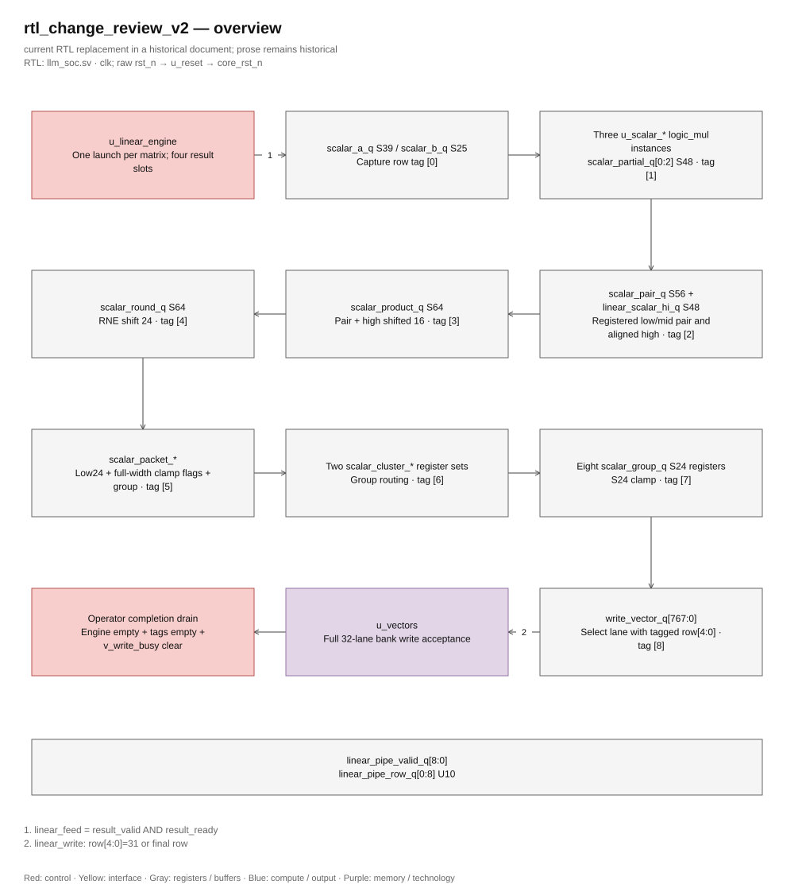

# RTL change review — version 2

> **Category: HISTORICAL SNAPSHOT — see dated checkpoints below.** This snapshot must not determine current architecture, live status or active tasks.

Status: IMPLEMENTED / HISTORICAL. The approval below applies only to the recorded milestone. The user approved the presented ARCH_RESEARCH.md section 18 P1–P4 with: "Do plan above and report result for me".

RTL root: D:\2151097_Nguyen Nhut Khanh\Verilog Source code. Top: llm_soc. Written original specification not supplied; required behavior is derived from RTL, numerical/protocol tests and existing architecture documents. Baseline: current npu100_a3 candidate, captured in docs/verification/npu100_b1_baseline. Internal latency changes are authorized. Preserve external protocol and numerical outputs. The files/strategy/checks below are the approved scope; no pretrained execution is authorized.

## 18. Detailed plan to reach 100 MHz from npu100_a3

### 18.1 Scope, target and experiment order

**Status: proposed, not implemented.** The user allows internal latency changes
while requiring numerical results and external protocol behavior to remain
correct. The starting point is the current tiled adapter plus unchanged
ca82b2f compute/control, not a checkout of an older revision. Preserve the
correct cache split, early accumulator clear, reset release, structural
arithmetic, LUT contents and all historical evidence.

The recommended next candidate contains **P1 through P4 below**. All four
families already have negative slack, so repairing only the scalar worst path
does not provide a credible full-top closure candidate. Implement and validate
the changes in that order, recording each delta, then run one source-matched
full-top fit. The user's previous instruction to stop at the first frequency
result must not turn into an unbounded sequence of tuning runs: report the
completed result and stop; any further iteration needs subsequent direction.
This document itself starts no implementation or EDA run.

| Work item | Minimum improvement to reach zero on its current worst path | Engineering target | Principal files |
|---|---:|---|---|
| P1: scalar distribution | 0.971 ns | Registered hops with limited fanout; target at least +0.20 ns setup margin | `llm_soc.sv`, scalar-clamp/operator fixtures |
| P2: token fetch | 0.631 ns at 85°C; 0.418 ns at 0°C | Separate graph decision, local prompt read and token commit | `llm_soc.sv`, graph/protocol/operator fixtures |
| P3: rounding control | 0.265 ns | Remove the 1601-load shared rounding node; preserve current rounding edges | `llm_soc.sv`, QSF for local-copy preservation, operator fixtures |
| P4: scalar return owner | 0.047 ns | A register controlled by its three actual writer states | `llm_soc.sv`, scalar/operator/selection fixtures |

These are measured deficits and design targets, **not predicted timing gains**.
The +0.20 ns margin is a preferred robustness target under the original 10 ns
constraint, not an altered clock constraint or a replacement for the required
nonnegative-slack gate. New placement, clock skew and previously hidden paths
can change the limiting family.

### 18.2 P1 — pipeline scalar completion and local distribution

**Source:** `llm_soc.sv`, declarations around lines 263–279,
`g_scalar_output` at lines 653–669, linear completion at lines 803–809 and
attention completion at lines 936–943. These line numbers refer to npu100_a3.

Currently `L_FLAGS` or `A_FLAGS` sends the shared S64 `scalar_round_q` to eight
group-local low-data/clip registers. `L_SAT/A_SAT` then produces the selected
S24 `scalar_group_q`, which four nearby SIMD lanes can consume. The selected
group has a distinct enable, but a data bit can still travel a long route from
the shared source. Merely duplicating the whole S64 register eight times adds
load and does not define a timing boundary.

Use a **26-bit completion packet**: low 24 bits plus signed high/low clamp
flags. Compute flags from the full S64 value using the existing bounds
`+8388607` and `−8388608`, before discarding any upper bits. Register the packet
once with its 3-bit destination group and linear/attention kind. Route it
through two registered clusters: groups 0–3 and groups 4–7. Each cluster
accepts only its tagged result and feeds four local S24 result registers.
Retain the existing group-to-four-lanes output structure.

| Edge / state before edge | Current behavior | Proposed behavior |
|---|---|---|
| E0: `L_ROUND` or successful `A_DIV_WAIT` | Produce S64 rounded result | Unchanged |
| E1: `L_FLAGS` / `A_FLAGS` | Capture low bits/flags in selected output group | Capture central packet, group tag and kind |
| E2: new `SC_ROUTE` | Currently the SAT edge | Capture packet and local group tag in selected cluster |
| E3: `L_SAT` / `A_SAT` | Currently STORE/PACK | Select min/max/low bits into selected `scalar_group_q`; apply existing linear overflow behavior |
| E4: `L_STORE` / `A_PACK` | Subsequent continuation | Existing write-vector capture and continuation |

This adds **one clock per linear output row or attention output lane**. Append
`SC_ROUTE` at a new operator index rather than renumbering existing indices;
increase `OP_COUNT` consistently. The 7-bit debug index still has capacity.
The captured kind selects the existing L or A SAT continuation after routing.
Keep the states, payload registers, tags and valid control explicitly visible
in ordinary RTL, with one sequential owner per register.

Implementation details and correctness obligations:

1. The destination is `matrix_row_q[4:2]` for linear output and `lane_q[4:2]`
   for attention. Capture it with the packet; do not reconstruct it from an
   advanced row/lane counter. Freeze the original counter until STORE/PACK
   exactly as in the current schedule.
2. The central packet drives two cluster payload banks instead of eight
   separated group banks. Each cluster has its own qualified write event.
   Remove superseded group-local low-data/clip storage only after replacing
   every consumer, including the selected-group overflow test in `L_SAT`.
3. Keep `scalar_round_q` and its other uses unchanged. Attention score scaling,
   score-memory updates, head logits, sampling and signed division completion
   must not consume this S24 packet in place of their existing wide value.
4. Linear saturation must set the existing sticky `overflow_out`; attention
   saturation must retain its current behavior without setting that flag.
   Do not clear an earlier overflow when a later packet is in range.
5. Reset cancels packet/cluster validity and pending consumption. Payload FFs
   can remain unreset. A stale cluster value must never cause a store or an
   overflow after reset, an aborted operation or a fresh launch.
6. Check the mapped copies and routed hops. If synthesis merges intended
   locality, use narrowly scoped backend preservation after inspecting actual
   node names. Do not add device attributes to portable compute RTL.

Directed verification must cover both consumers, all eight groups and all
four lane positions within a group; exact limits and one count beyond each;
S64 extremes; large upper bits with misleading low-24-bit patterns; alternating
positive/negative/in-range packets; sticky overflow; and reset at E1/E2/E3.
Assert that only the tagged group/lane changes and the expected write mask,
address and payload reach the memory interface once.

The existing `check_scalar_clamp` fixture currently waits two clocks after
depositing FLAGS. Change its explicit expectation to the documented three
clocks through ROUTE and SAT; retain the independent S128 clamp and overflow
comparisons. This is an authorized latency update, not removal of a check.

### 18.3 P2 — register prompt addressing and token commit

**Source:** the graph owner at `llm_soc.sv` lines 485–543, host prompt writes
around lines 374–376 and embedding dispatch around line 700. The fitted
`graph[3]` name is a mapped state node; do not infer a source state solely
from the bit number.

The current token register shares the graph block and selects three sources:
`prompt_memory[0]` at launch, `prompt_memory[position_q + 1]` for prefill and
`best_token_q` for generated-token feedback. A graph decision, address/control
selection and large combinational prompt read all reach the token register in
one cycle. Separate these boundaries while retaining the 24 existing graph
state IDs and their architectural phase transitions.

Add a small explicit token-fetch pipeline alongside the graph FSM. Keep graph
entry into `G_EMBED` at the same decision edge, but gate its operator dispatch
until `token_valid_q` is set. Use registered request metadata and a held selected
token for decode feedback. No new graph enum values are needed; public graph
debug IDs and graph-visit assertions can remain unchanged.

| Edge | Token-fetch work | Graph/operator behavior |
|---|---|---|
| T0: accepted token-change event | Register prompt address, prompt/feedback selector and feedback payload where applicable; clear prior token-valid | Enter existing `G_EMBED`; do not issue an embedding memory request yet |
| T1 | Read eight local 16-token prompt groups into eight U12 bank-response registers | Keep embedding dispatch waiting |
| T2 | Select the tagged bank response or held feedback token into `token_q`; assert token-valid | Continue to hold embedding dispatch on this edge |
| T3 | Consume token-valid when starting embedding | Existing embedding parameter request uses the committed token |

This adds **two clocks per embedding entry** relative to the current T1
dispatch. The prompt storage remains the same 128 × U12 host-written array.
Express the eight 16-entry read groups with structural `generate for`; a
constant bank and registered four-bit local address select each bank word.
Register the high three address bits with the read validity, then use an
eight-way bank select at T2. Thus graph decode and the full 128-word selection
do not share a cycle. This is ordinary register/mux RTL, without vendor RAM IP
in the controller. The additional bank-response payload is 96 FF bits plus
small metadata; actual fitted area must be reported, not inferred from that
logical count.

There are exactly three request events, with the original priority and guards:

| Event | Request contents and preserved behavior |
|---|---|
| Valid idle launch | Address 0; layer/position/generated reset as today; invalid prompt/max/context combinations still report error and do not start embedding |
| End of layer 3 while another prompt token remains | Address is the **old** `position_q + 1`; increment position and reset layer once; other `G_NEXT` cases do not request a token |
| Continuing `G_ADVANCE` | Hold `best_token_q`; increment position/reset layer once; preserve the output-memory write and generated-count increment at the original edge |

The terminal `G_ADVANCE` cases—maximum generated count, EOS token 1, or
position 127—must not request another embedding. Preserve the graph block's
`op_fault_q` and `op_done` priorities when deriving request events; a simple
unqualified `graph == G_NEXT` expression is not equivalent. `token_q` and all
fetch-valid registers must each have one owner. Reset/fault cancels pending
validity, and a new accepted launch cannot consume an earlier response.

Host writes to prompts/configuration are already excluded by `core_running`;
retain that arbitration and all host ACK behavior. Keep the original ready,
running, output-read restrictions and completed-token semantics. Internal
stall clocks must not advance PRNG state, layer/position counters or outputs.

Verification must exercise prompt indices 0, 15/16, 31/32 and 126/127;
single-token and multi-token prefill; last-layer transitions; feedback with a
different best token each time; EOS/length/context termination; invalid starts;
and reset during each fetch phase followed by a new prompt. Assert no embedding
parameter request before token-valid, and exactly one request sequence per
eligible embedding entry. Keep all existing graph visit counts, token outputs,
causal checks and host responses.

The standalone embedding fixture forces `G_EMBED` and preloads `token_q`,
bypassing the real graph launch. Update that fixture to establish the new
token-valid precondition explicitly, and separately test the real host-driven
fetch path. Do not infer integration correctness from a forced-register test.

### 18.4 P3 — isolate lane owners and prepare local round commands

**Source:** `g_simd` at `llm_soc.sv` lines 550–635 and normalization states
around lines 845–850. The measured endpoint is a rounded-data register, but
the failing launch signal is control, not the RNE adder. The fitted
`WideOr318~0` fanout of 1601 is the immediate target.

Split the broad per-lane case into explicit owners for `math_a_q`, `math_b_q`,
`ternary_code_q`, `lane_raw_q`, `lane_round_q`, `rotation_cos_q`,
`attention_acc_q`, `sigmoid_inputs_q` and `sigmoid_values_q`. Each block lists
only the states that write its register. Preserve all RHS expressions,
qualifiers, hold behavior and edge ordering; retain the existing independent
cache operand and write-vector owners. Remove original assignments when moving
them so no register gains a second driver.

Owner separation alone does not guarantee control locality. For the measured
shift-by-16 branch, introduce **eight registered round commands**, one per
four-lane group, prepared on the existing predecessor edge:

| Edge | Operator state before edge | Payload action | Local control action |
|---|---|---|---|
| R0 | `N_RECIP` or `B_CALC` | Existing `lane_raw_q <= extend56(math_product)` | Each group's round16 command captures true |
| R1 | `NR_ROUND` or `B_ROUND` | Round the R0 raw value by 16 into `lane_round_q`, using its group's command | Command returns low unless another legitimate predecessor occurs |
| R2 | `NR_CLAMP` or `B_CLAMP` | Existing clamp/operand or write-vector capture | No stale round request may remain |

Both predecessor transitions are unconditional in current RTL. This prepares
the enable one edge early without sampling data early and adds **zero clocks**.
The round command must match the current NR/B round phase on every reachable
sequence; reset clears all commands. Data and commands must not be delayed
independently or gated by unaccepted math starts. Add a directed assertion of
this phase relationship, including reset and restart.

Use the group-local command only for the shift-16 branch of the dedicated
round owner. Keep the other exact source/shift mappings:

| Writer | Source / operation |
|---|---|
| `E_ROUND` | S64 raw, RNE shift 8 |
| `NR_ROUND`, `B_ROUND` | S64 raw, RNE shift 16 |
| `N_ROUND` | S64 raw, RNE shift 12 |
| `R_ROUND`, `S_ROUND` | S64 raw, RNE shift 15 |
| `S_INPUT` | Sign-extended S24 vector input, RNE shift 4 |

Identical local command FFs can otherwise be merged. Preserve these eight
intentional copies with exact, scoped `DONT_MERGE_REGISTER` assignments in the
Quartus backend; verify the fitted netlist retains them and each drives its
own four-lane group. Keep device settings out of portable RTL. Do not clone
the complete 102/103-bit FSM per lane or introduce vendor control IP.

Check whether the 1601-load shared node disappears and whether a predecessor
control, raw-data enable or another rounding mode becomes limiting. If it
does, use its new detailed path to choose the next change. Do not assume
source-code separation or a preservation assignment proves physical locality.

Verification retains full S128 references and covers all lane groups; positive
and negative ties with even/odd retained LSB; values around zero and clamp
bounds; normalization reciprocal-clamp-gain ordering; residual/GMUL/SiLU/RoPE
operations; accepted-start/done alignment; and cancellation between R0/R1/R2.
The early `A_QUERY` accumulator clear and accepted cache-response sampling
edges must remain exactly as before.

### 18.5 P4 — give scalar-return state its own register owner

**Source:** `return_scalar` declaration at line 229, its writes at lines 787,
887 and 1008, and its consumption at `SC_SUM`, line 801. `L_SAT` at index 79
does not write this register, yet the fitted path from it is six levels deep.

Move the three writes from the main operator case into a dedicated sequential
block, under the same `core_rst_n` qualification:

| Actual writer | Held return value |
|---|---|
| `L_COEFF` | `L_ROUND` |
| `A_SCALE` | `A_SCORE` |
| `H_COEFF` | `H_ROUND` |

Preserve the one-hot return representation and hold in every other state;
do not change the scalar multiply/pair/sum pipeline or its consumption edge.
The payload is currently unreset and assigned before use; preserve that
contract rather than adding an unnecessary wide reset load. This adds no
states or latency and leaves the scalar fixture's deliberate `O_IDLE` return
injection usable.

Require the mapped return-register cone to depend on these writer events,
without the unrelated L_SAT-wide priority/hold qualification. Verify each
return path through the existing scalar and operator tests plus the head
selection tests. A debug encoder rewrite or binary return re-encoding is not
part of this candidate; consider it only if a new measured path justifies it.

### 18.6 Latency, throughput and implementation boundaries

P1 adds one edge per scalar completion. P2 adds two edges per embedding entry.
P3 and P4 preserve operation latency. Parameter/vector/KV adapter latency,
memory throughput, host transaction protocol, SIMD accepted-start latency,
divider/sqrt completion and arithmetic definitions remain unchanged.

For the existing two-prompt/three-output synthetic fixture, there are 16 layer
executions. Each layer produces 1,408 linear rows (five 128-row and two
384-row projections) plus 128 attention output lanes. P1 therefore adds
`16 × (1408 + 128) = 24576` clocks. Four embedding entries add eight clocks
under P2. The planned increase is **24,584 compute clocks** if no other stalls
change. Using the historical 4,229,462-clock reference gives an expected
4,254,046 clocks; this is a scheduling estimate, **not a new measured PASS**.
The current 5,000,000-clock graph bound should remain sufficient. Do not
increase watchdog limits to hide a deadlock or unexplained extra iterations.

The first candidate should change portable control/datapath only in
`llm_soc.sv`, the narrowly scoped backend command-copy assignments, and tests
required for the explicit new schedule and boundary coverage. Keep packages,
LUTs, arithmetic helpers, structural multipliers/divider, SRAM leaf and tiled
adapter unchanged. Do not move clamps, narrow accumulators, approximate RNE,
change ternary decoding or change sampling policy to obtain frequency.

The small added packet/token/control banks may replace existing low-data/flag
banks; logical FF counts do not predict final ALMs or registers. Report the
fresh fitted totals against 54,651 ALMs and 56,075 FFs. The already high
1186/1220 RAM-block use is a reason to avoid speculative new SRAM replication.
Physical constraints and any technology replacement remain backend concerns.

### 18.7 Verification and evidence sequence for a later implementation

1. **Freeze inputs before editing.** Keep npu100_a3 and all failed/cancelled
   archives immutable. Record current RTL/test/backend hashes, source archive,
   Git status and planned files. Use new evidence and work-library tags; do not
   reuse the existing `npu100_a*` directories or reset the workspace.
2. **Implement P1–P4 with local validation between changes.** Inspect register
   ownership and transition tables; compile the whole design and run the
   affected numerical/protocol fixtures after each meaningful delta. Assertions
   must cover tags, validity, reset and the documented additional edges. Keep
   all old numerical, mask, causal and handshake expectations.
3. **Run the complete exact-current synthetic regression before the fit.** Use
   [run_units.ps1](<../../../tests/full_rtl/run_units.ps1>), an unused `WorkLibraryName` and
   `EvidenceTag`, and the installed verified memory-model binding. Do not use
   `-UnitsOnly` for the final record. All seven groups, including the full graph,
   must complete PASS on the frozen candidate; a partial or cancelled graph
   cannot inherit the older PASS. Record the actual compute-clock count.
4. **Verify technology binding and cancellation.** Run the actual vendor-leaf
   memory tests, current-source vendor-free full-top elaboration, and the
   additional host-cancellation probe. The prepared
   [portable runner](<../../../tests/full_rtl/run_portable_100mhz.ps1>) and
   [cancellation runner](<../../../tests/full_rtl/run_host_cancel_100mhz.ps1>) are currently
   unexecuted helpers; inspect and validate them as part of that run. Confirm
   that only the SRAM technology leaf instantiates vendor IP and that the
   portable elaboration has no vendor-memory design units.
5. **Freeze the verified candidate and run one full-top fit.** Explicitly pass
   `-Project 'quartus/llm_soc'` to [run.ps1](<../../../tools/timing/run.ps1>), whose default
   is the legacy top. Use the same Cyclone V device, seed 1, SPEED/STANDARD FIT,
   10.000 ns clock, clock uncertainty and existing I/O budgets. Do not introduce
   false paths, multicycle exceptions or reset/host path exclusions. Append a
   unique tag such as `npu100_b1` only if unused at execution time.
6. **Collect and audit the completed result.** Archive map/fit/STA logs, source
   and configuration, all four PVT models, Fmax/restricted Fmax, setup, hold,
   recovery, removal, pulse and unconstrained reports. Capture detailed paths
   for the four old families and the new global worst paths, plus fitted copy
   counts/fanout and resources. Request a larger bounded path sample, e.g. 200
   per model, in the new evidence set so the old top-40 cutoff is not mistaken
   for complete path coverage. Check hashes before/after the run and the strict
   gate result. Never edit the older reports to append new extraction results.
7. **Stop at the frequency result.** Report measured Fmax at every corner,
   worst slack/TNS, all check categories, resource deltas, functional status
   and exact report links. Do not launch a second fit or pretrained application
   automatically. If timing fails, identify the new limiting cone and retain
   the failure as the evidence for a subsequent decision.

Running functional verification before the fit makes the requested frequency
stop compatible with a completed graph result, unlike the prior interrupted
parallel run. Any RTL, numeric-asset or constraint edit after verification
invalidates the corresponding exact-current evidence and requires the affected
checks again. Documentation-only edits do not change RTL equivalence.

### 18.8 Closure criteria and contingencies

**100 MHz closure requires all conditions below together:**

- Full-top `llm_soc` post-fit Fmax and restricted Fmax are at least 100 MHz
  at slow 85°C, slow 0°C, fast 85°C and fast 0°C, all at 1100 mV.
- Setup, hold, recovery, removal and minimum-pulse slack are nonnegative;
  TNS is zero for every corner/check; every unconstrained-path category is zero.
- The same RTL/numeric sources have all-seven synthetic PASS, correct actual
  memory behavior and the required reset/host checks; no stale artifact is
  substituted for a new-source result.
- The mapped design uses no runtime multiply/divide or vendor arithmetic/control
  IP, retains the portable SRAM boundary, and fits the demonstration device.
  Report backend warnings and actual resource use alongside timing.

If another path limits the first candidate, the next decision follows that
evidence. Known watch points are the attention division rounding path
(`div_denominator_q[21] → scalar_round_q[62]`, +0.018 ns at slow 0°C), sampler
noise logic (`random_q[30] → noise_product_q[32]`, +0.122 ns there), host outputs,
KV address generation and reset recovery/removal. These near-critical or
historical paths are **not yet justification for speculative arithmetic changes**.
For a later measured division-completion failure, a separate rounding-decision,
quotient-increment and signed-result sequence would need its own exact
remainder/tie/sign analysis and done/valid schedule. Do not move those operations
or relax their test references in the current candidate.

A successful full fit or a passing arithmetic submodule alone is insufficient.
Even a passing Quartus result demonstrates closure only for this backend and
constraint set; foundry-cell and SRAM timing, DFT, physical design and ASIC
signoff remain separate work. Pretrained execution remains prohibited until
the complete exact-current functional and timing gate passes, and is outside
this requested analysis-and-plan task.

## Implementation record before full-top timing

P1–P4 are implemented in `Verilog Source code/llm_soc.sv`. Scalar FLAGS now capture a full-width-checked completion packet, SC_ROUTE captures one of two local clusters, SAT captures the selected S24 group, and STORE/PACK consumes it. Token requests capture an address or feedback token, eight prompt-bank registers capture the local read, token commit asserts validity, and G_EMBED dispatch consumes that validity. Each SIMD payload has an explicit owner; eight round16 commands are prepared on the N_RECIP/B_CALC edge. The three scalar-return writers are isolated. Existing graph state IDs, scalar arithmetic, numerical assets, memory leaf/adapter behavior, cache sampling and attention clear remain unchanged.

`quartus/llm_soc.qsf` preserves the eight exact ordinary round-command register copies. `tb_operators.sv`, `tb_protocol.sv` and `tb_graph.sv` verify the new schedule and additional boundary/reset cases. The timing runner and extractor add a bounded optional report-path count (default 40); the approved candidate requests 200. This reporting support changes report coverage, not constraints or the routed implementation. Original runner/extractor inputs were captured before editing.

Current source-matched six-group evidence: `tests/full_rtl/evidence/npu100_b1_six/results.json`. Memory: 464 checks. Math: 503 transactions with S128 reference. RAM: 28 checks. Protocol: 175 transactions, 12 original cancellations and 15 token-pipeline cases. Selection: 14 checks. Operators: 17 operators, 4944 checks, 128 scalar products, 516 scalar clamp cases, 6 scalar reset cases, 2 directed round cases and 6 rounding reset cases. Completed compile/runtime diagnostics are clean. Full graph, portable elaboration, host cancellation and post-fit timing are pending at this record; no frequency or all-seven PASS is claimed yet.

Task-specific RTL accounting against the captured starting tree: **(186 added + 93 deleted) / 5072 baseline RTL code lines × 100 = 5.5008%**. Only `llm_soc.sv` enters the numerator. Tests, Markdown, reporting scripts, blank/comment-only lines, numeric MEM assets and the pre-existing adapter edits are excluded. The raw record is `docs/verification/npu100_b1_baseline/change_accounting.json`.

Intermediate failures were preserved. The first P1 fixture used `$deposit` to inject a phase, which did not propagate to an optimized state consumer; force/release injection passed every original numerical check and the added phase assertions. The first P2 fixture had multiple direct deposits that Questa rejected under always_ff ownership; transient force/release seeding retained the RTL's sole writers. These corrections affect stimulus injection, not expected arithmetic or protocol values. The corrected P1 and P2 directed results are archived separately. The complete P1–P4 regression uses fresh libraries and input hashes.

### Implemented stage schedule

The two sequences below are independent. T0 denotes the FLAGS edge for a scalar result, or the graph decision edge for a token request.

| Edge | Scalar completion | Token fetch |
|---|---|---|
| T0 | Capture S24 low payload, full-S64 clamp flags, destination group, kind and validity | Capture prompt address, feedback source and held feedback token |
| T1 | SC_ROUTE captures the selected cluster and local group tag | Eight prompt banks capture their 16-entry selection; capture bank tag |
| T2 | L_SAT/A_SAT writes the selected S24 group; L_SAT updates sticky overflow | Commit selected prompt/feedback token and assert token validity |
| T3 | L_STORE/A_PACK writes the selected workspace lane | G_EMBED dispatch consumes token validity |

Current RTL replacement; surrounding discussion is historical.

[Editable draw.io — rtl_change_review_v2 — overview](../../diagrams/architecture.drawio) · Page `13_rtl_change_review_v2_1`.

P1 adds one edge per linear row or attention output lane; P2 adds two edges per embedding dispatch. P3 and P4 add no operator latency. The graph's expected compute count is 4,229,462 + 24,576 + 8 = **4,254,046 clocks**; the completed regression must supply the actual count. The unchanged 5,000,000-clock watchdog remains in force.

Post-fit extraction now also emits `implemented_registers.rpt` with physical register names, copy counts, direct fanout-edge counts and locations. A separate bounded 20-path sample per changed family supplements the global 200-path sample at each corner. These queries do not change the netlist, constraints or placement; fitted copy preservation remains to be measured.
