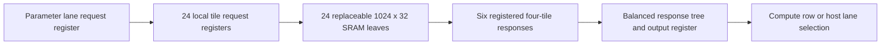

# NPU 100 MHz microarchitecture change review

Plan version: 1. Date: 2026-10-05, Asia/Saigon.

Status: **Stage A implemented and measured; stopped at the user's requested frequency result. Worst full-top Fmax 91.15 MHz; 100 MHz target not met. Functional verification is partial: six groups PASS; full graph cancelled at the requested stop.**

The user approved implementation and instructed execution to stop once a frequency result is available. Accordingly, this run measures stage A only; stages B/C remain future candidates.

## 1. Decision and scope

Recommend retaining the autonomous fixed-point graph and its arithmetic engines, replacing the deep parameter-memory distribution with explicitly tiled storage, and isolating register ownership in the lane controller. Address the remaining measured control paths through narrowly scoped retiming if they persist after these changes. This is a timing-oriented evolution of the current NPU, with bit-exact numerical behavior as an acceptance requirement.

The target is the complete `llm_soc` at a 10.000 ns clock period. Acceptance requires at least 100 MHz at every reported corner, nonnegative setup, hold, recovery, removal and pulse-width slack, zero TNS for every check, and zero unconstrained paths. No new implementation has achieved this target yet.

The user confirmed these inputs:

- RTL root: `D:/2151097_Nguyen Nhut Khanh/Verilog Source code`.
- Architectural research: `D:/2151097_Nguyen Nhut Khanh/ARCH_RESEARCH.md`.
- Internal latency may change when numerical results and external protocol behavior remain preserved.

No separate authoritative original specification was supplied. Baseline behavior is derived from RTL, the existing verification contracts, and repository design documentation. Research is supporting evidence; RTL, pinned diffs and raw reports resolve discrepancies.

The reviewed Git head is `ca82b2f39ade227ee5e015f9ed02e9d7df6d5f67`. At inspection, Git reported two untracked inputs: `ARCH_RESEARCH.md` and `docs/verification/timing/fullrtl100_cache2/`. There were no reported tracked source changes. Both untracked inputs must be preserved. This review does not claim a fresh hash audit of historical archives.

The active top is the fixed four-layer, 128-channel language graph, with four 32-channel heads, 384-channel feed-forward layers, a 4,096-entry vocabulary and a 128-position context. The separate legacy `matmulfree` core is not the timing target. Quartus remains a demonstration backend; an ASIC frequency claim requires standard-cell libraries, selected SRAM views and physical implementation at the actual ASIC corners.

## 2. Evidence and diagnosis

The latest local full-top evidence is [cache2 manifest](../verification/timing/fullrtl100_cache2/manifest.json), corroborated by its raw [85 C setup report](../verification/timing/fullrtl100_cache2/slow_1100mv_85c_setup.rpt), [0 C setup report](../verification/timing/fullrtl100_cache2/slow_1100mv_0c_setup.rpt), and [fit summary](../verification/timing/fullrtl100_cache2/llm_soc.fit.summary).

| Corner | Restricted Fmax | Setup slack / TNS, ns | Other four checks |
|---|---:|---:|---|
| Slow, 1.1 V, 85 C | 90.61 MHz | -1.036 / -15.220 | Nonnegative slack, TNS 0 |
| Slow, 1.1 V, 0 C | 94.71 MHz | -0.559 / -4.996 | Nonnegative slack, TNS 0 |
| Fast, 1.1 V, 85 C | 137.51 MHz | +2.728 / 0 | Nonnegative slack, TNS 0 |
| Fast, 1.1 V, 0 C | 159.74 MHz | +3.740 / 0 | Nonnegative slack, TNS 0 |

All reported unconstrained categories are zero. The fit uses 52,322 ALMs, 49,383 registers and 1,186 of 1,220 RAM blocks; DSP, PLL, DLL and HSSI counts are zero. Tool-stage success does not establish timing closure.

The worst setup path is parameter lane 0 `g_ip.read_address_q[2]` to an internal SRAM address register. It has zero combinational logic levels, 10.819 ns data delay, 10.192 ns routing delay and -0.117 ns clock skew. Approximately 94% of its data delay is routing. Adding arithmetic pipeline stages alone cannot directly remove this path. The recommendations explicitly identify address bits 2 and 12 for duplication.

Correction to the research summary: the first path in the slow 0 C raw report is address bit **2**, at -0.559 ns; the summary describes bit 12. The conclusion about parameter address distribution remains valid. This review leaves the supplied research file intact.

Secondary negative paths in the slow 85 C report are already visible:

| Measured source and destination | Slack, ns | Source-grounded interpretation |
|---|---:|---|
| `position_q[3] -> k_address_q[10]` | -0.189 | A completion comparison and request selection influence the shared KV address update cone |
| `chunk_q[1] -> op[98]~SynDup_1` | -0.183 | Ternary word selection/reserved-code detection participates in entry to `L_DECODE` |
| `op[80] -> attention_acc_q[...]` | -0.132 | A shared lane procedural block exposes unrelated control dependencies; RTL index 80 is `NR_ROUND`, subject to mapped-state tracing |
| `op[7] -> u_math.b_q[...]` | -0.101 | Math-start acceptance fans out to captured operands |
| `lane_round_q[22][27] -> math_a_q[22][23]` | -0.072 | Saturation and operand update selection |
| `graph[4] -> math_b_q[...]` | -0.029 | Graph-dependent binary-operation operand selection |

A memory-only improvement does not guarantee closure because these paths can remain or move after placement. Mapped control naming and logic cones must be inspected before assigning a physical path exclusively to a source-level state.

The research records seven-group synthetic regression PASS and vendor-free elaboration PASS for the current RTL family. They are historical evidence, not checks executed during this review. No pretrained application PASS is established.

## 3. Historical alternatives and retained decisions

Read-only local Git inspection covered the memory adapter introduction `d3825b2`, continuous SIMD payload change `0fd04be`, early attention clear `a2fa161`, independent KV payload change `41eea1a`, and the reset-routing correction `70c794d..ca82b2f`.

- `d3825b2` introduced a useful portable topology: 1,024-row tiles, registered local requests, groups of four responses, then final response registration. Its Quartus branch instead instantiates one large memory per lane. Reuse the topology while retaining the single vendor-IP leaf boundary.
- `0fd04be` removed validity enables from the arithmetic payload stages while retaining accepted operand capture. Preserve both decisions: busy-time input changes must not corrupt an accepted operation.
- `a2fa161` moved accumulator clear to `A_QUERY`. Preserve this earlier clear; no weighted-value sum depends on its previous contents.
- `41eea1a` separated cache payload from the held binary operand. Preserve `cache_operand_q` and `second_q` ownership and valid-response alignment.
- The broad forced-global reset request failed at 73.97 MHz; removing it produced the current 90.61 MHz result. Do not reinstate it as an assumed timing improvement.

The early autonomous graph used runtime multiplication and shorter memory/operator pipelines. Its arithmetic implementation does not meet the current structural RTL policy and is not a suitable replacement baseline.

## 4. Requirements and preservation contract

| Requirement | Prior specification status / current evidence | Intended behavior |
|---|---|---|
| 100 MHz full top | No separate old spec; cache2 fails both slow-corner setup checks | All four corners and all five timing checks pass under the existing SDC |
| Autonomous graph | `llm_soc.sv:485` graph sequencing | Same graph operations, dimensions, token feedback and causal bounds |
| Numerical equivalence | `llm_math.sv`, `llm_pkg.sv`, `npu_pkg.sv`; lane/controller operations | Identical values at architectural writes, token selection, error and overflow boundaries |
| Arithmetic structure | `logic_mul.sv`, divider and sqrt; AGENTS.md | Structural multiply/divide, permitted portable operations, no vendor compute/control IP |
| Parameter storage | `llm_parameter_ram.sv:1`; word-adapter contract | Same capacity, host layout, lane mapping, read order and acknowledged commit semantics |
| SRAM collisions | `quartus_word_ram.sv:1`; `tb_memory_ip.sv` | Common-clock 1R1W, OLD_DATA for same accepted-address read/write, one request per clock |
| Reset and cancellation | `llm_soc.sv:321`, `reset_release.sv`; protocol tests | Immediate assertion, two-edge release, immediate public read-data zero, no stale response, retained committed storage |
| Completion | `llm_soc.sv:731` and `O_FINISH` | Consume matching valid/done; drain writes before operation completion |
| Latency | User allows internal changes | Preserve memory and math boundary latency in stages A/B; only the explicitly listed stage-C changes may add internal cycles |
| Evidence | AGENTS.md and existing runners | Capture exact inputs and immutable results per candidate; no false-path/multicycle masking or relaxed expected values |

The arithmetic contract includes S24/F16 vector lanes, S24-by-S32 SIMD multiplication, S33 byte partials, S41 pair sums, S56 products, S57 through S61 reductions, S39 linear accumulation, S64 rounding operands, and S56 attention accumulation. Preserve every sign extension, truncation, RNE tie rule and clamp boundary. Keep RMS epsilon 42950, floor square root, reciprocal rounding, exp interpolation, RoPE scaling, sigmoid behavior and all LUT contents. Keep xorshift evolution, zero-seed handling, temperature scaling, exclusions, minimum-length/EOS rules and stable lowest-ID tie behavior. No precision reduction or reassociation across rounding/saturation boundaries is proposed.

## 5. Ranked implementation strategies

| Rank | Strategy | Functional coverage and compatibility | Change size / complexity | Principal risk |
|---|---|---|---|---|
| 1, recommended | Explicit parameter tiles, independent lane register owners, then measured control retiming | Entire graph and numerical contract preserved; stage A/B cycle-compatible; bounded internal latency changes in C | Moderate memory edit; small-to-moderate controller edit; focused verification extensions | Extra registers/muxes and RAM fragmentation may move the physical bottleneck |
| 2 | Backend-only address-driver duplication/locality | All RTL behavior and latency unchanged | Smallest change; no new microarchitecture | Existing automatic duplication and fanout tuning have not closed the design; effectiveness is fitter-dependent |
| 3 | Fully distributed per-engine controllers and command/result queues | Can preserve values and external protocol with substantial sequencing verification | Large redesign across shared operator scheduling and interfaces | Broad verification burden and new queue/reset hazards without evidence that such scope is necessary |

Strategy 1 directly changes the measured distribution structure and retains the already verified arithmetic. Backend-only duplication is a useful comparator, but is not the recommended architectural solution. Strategy 3 is deferred.

## 6. Proposed architecture

### Stage A: parameter SRAM locality with unchanged boundary latency

Modify only the deep-memory Quartus branch of `pipelined_word_ram` (`USE_QUARTUS_MEMORY && ROWS > 4096`). Preserve the existing portable branch and the short vector/KV technology branches. The selected full-top geometry is eight 32-bit lanes, each containing 24 tiles of 1,024 rows. Group four tiles per registered response, yielding six response groups per lane.

Each tile owns registered 10-bit read and write addresses and decoded read/write enables. High address bits select the tile; address bits that formerly drove a deep monolithic SRAM become local address bits or small tile-select decoders. Capture payload continuously; reset only enables/validity. Replicate write-data capture once per four-tile group, giving each 32-bit copy four tile destinations rather than duplicating it for every tile. Instantiate `quartus_word_ram` at the tiles; only that leaf contains `altsyncram`.

Use the existing two response edges for a masked four-input local response and a balanced six-group final response. Unselected groups must contribute zero for the current transaction even though individual leaf outputs hold previous values. Align the registered tile-select with the returning data; never use the newest request's selection to route an earlier response. Use structural generated mux/OR trees and explicit register ownership. Support a final partial tile and partial response group with elaboration constants and zero padding.



For an adapter request accepted at edge E1:

| Edge | Read transaction | Write transaction |
|---|---|---|
| E1 | Local address, tile enable and request validity captured | Address, group data and tile write enable captured |
| E2 | Selected leaf performs synchronous read; selection advances | Selected leaf commits; `wr_valid` asserts |
| E3 | Four-tile group responses captured using E2 selection | No additional commit for a one-cycle request |
| E4 | Balanced group result captured; `rd_valid` asserts | — |

The outer parameter lane capture precedes this table, so compute reads remain five edges and host lane selection retains its extra edge. Short adapters remain three-edge reads, with two-edge writes. Consequently `llm_parameter_ram` validity pipelines, host cancellation and vector/cache write-drain logic require no stage-A changes.

Same-cycle collision behavior follows from common E1 capture and common E2 leaf access, using OLD_DATA within the selected tile. Different-tile reads/writes proceed independently. Reset before E2 must cancel an uncommitted write; reset after E2 retains its committed contents and cancels any pending response. Preserve one accepted read/write request per clock and the adapter's output hold behavior between valid responses.

A structural estimate, before synthesis optimization, is approximately 6,720 additional FF bits across all eight lanes: per lane, 24 x (20 address + 2 enable + 1 delayed select) + 6 x 32 group write-data + 6 x 32 group response + 32 final response = 968 bits, versus 128 bits in the present deep-IP branch. Shared validity stages are excluded from both sides. Actual fitted register and ALM differences may be very different because of merging and physical duplication. Preserve needed locality using scoped backend synthesis assignments, not device-specific compute RTL.

The logical SRAM capacity is unchanged. A nominal four-M10K implementation of each 1024 x 32 tile would use 24 x 4 x 8 = 768 parameter M10Ks, but this is a packing estimate, not a measured result. With only 34 blocks free in the current full fit, RAM packing is an early rejection criterion. Fitting must show that local drivers survive optimization and that the address route actually shortens.

### Stage B: independent lane register owners

In `llm_soc.g_simd`, separate the current shared `unique case` into independent sequential owners for math operands, ternary codes, raw results, rounded results, rotation payload, attention accumulators and sigmoid payload. Retain exactly the original per-register write states, expression widths, reset qualifications and update edges. Do not move the FSM into a function or task.

The attention accumulator owner needs only `A_QUERY` clear and `A_ACC` add/hold. It should not depend on rounding or operand-selection states. The existing separate `write_vector_q` owner provides a local precedent. This is a cone-isolation change, not arithmetic redesign; it targets the measured path from an unrelated control bit into the accumulator. Independent blocks must never introduce a second writer to any register.

Keep `llm_math` unchanged in stages A/B. In particular, do not unconditionally recapture its input operands while busy: doing so would violate its accepted-start contract even though its downstream payload registers run continuously.

### Stage C: bounded retiming, only for residual measured paths

After stages A/B are fitted, apply only the following items whose corresponding path families remain negative. Each candidate gets separate evidence. Stop adding changes as soon as the complete acceptance gate passes.

1. **KV request preparation.** Add `A_K_SETUP` and a one-bit key/value selector. `A_QUERY`, nonfinal `A_NEXT_SCORE`, final `A_EXP_STORE`, and nonfinal `A_ACC` prepare time/key-value/continuation and enter `A_K_SETUP`. An independent owner captures `{layer_q, time_q, kv_select_q, head_q}` during that state, which then advances to `O_K_REQ`. Remove all previous competing `k_address_q` assignments. This adds one edge per key/value read, cuts completion comparison and time increment away from address capture, and preserves the causal address sequence. Keep cache write addressing unchanged. Per head at position p, the overhead is exactly 2(p+1) edges; across four heads/four layers it is 32(p+1) edges per processed position.
2. **Ternary validation after code capture.** `L_INPUT` captures the existing 32 two-bit codes and transitions to `L_DECODE`. Compute reserved-code detection from those registered codes. In `L_DECODE`, detect code `10` before issuing a math start; fault and finish on error, otherwise continue normally. Valid operations retain their cycle count and ternary values. Invalid-code fault detection shifts one edge later, within the user-authorized internal-latency change; no invalid accumulation or write may occur. Remove the old chunk-indexed validation cone.
3. **Normalization clamp separation.** Add `NR_FLAGS` between `NR_ROUND` and `NR_CLAMP`. Each lane captures the rounded result's low 24 bits and signed comparisons against +8388607/-8388608. `NR_CLAMP` selects the exact saturation result using those flags and captures the existing gain operand. This adds one edge per normalization row, preserves the clamp before gain multiplication, and uses the existing scalar flags/saturate design as precedent. It does not change overflow reporting or any numerical expectation.

Append new state indices so existing debug indices retain their values. Extend the one-hot width and continuation types consistently. New states also require reset cancellation and watchdog analysis, not suppressed assertions. The public debug bus remains the registered current graph/state index; the newly added internal states necessarily become observable through that diagnostic field.

If math input capture remains critical after these scoped changes, first inspect the actual accepted-start fanout and backend duplication. A replacement math handshake or additional math input pipeline is outside version 1 and requires a revised plan; silently sampling live inputs later is prohibited.

## 7. File and module map

Line references describe the current baseline, not future line numbers.

| File / region | Planned change | Scope |
|---|---|---|
| `Verilog Source code/pipelined_word_ram.sv`, `g_ip` branch around lines 30-57 | Deep-IP tiled request/response structure with grouped data copies | Stage A |
| `Verilog Source code/llm_soc.sv:550`, generated lane owner | Split per-register ownership, retaining expression and update timing | Stage B |
| `Verilog Source code/llm_soc.sv:250`, state declarations, KV reads around 880-927, normalization around 845-849 | Registered-code validation; KV setup; normalization flags as independently justified above | Conditional stage C |
| `quartus/llm_soc.qsf` | Scoped preservation/duplication for new memory-local drivers, only when needed; inspect assignment effectiveness | Backend support; SDC/device/I/O budgets stay fixed |
| `tests/full_rtl/tb_memory_ip.sv` | Add all tile/group boundary transitions, sustained traffic, partial deep geometry and mixed-bank collision tests | Stage A verification |
| `tests/full_rtl/host_cancel_contract.sv:17` | Update physical leaf observation to the corresponding tile; retain own-commit-before-ACK assertion and all expectations | Stage A verification |
| `tests/full_rtl/tb_operators.sv` | Focused reset, reserved-code, clamp-boundary and causal-address assertions for stage C; preserve every prior expected value | Conditional stage C verification |
| New `tests/full_rtl/run_portable_100mhz.ps1` | Reuse current compiled library for vendor-free full-top elaboration, archive fresh commands/binding/logs | Verification support |
| New `tests/full_rtl/run_host_cancel_100mhz.ps1` | Reproduce existing host probe with a fresh library, explicit vendor model and immutable logs | Verification support |
| New candidate evidence directories under `docs/verification/` and `tests/full_rtl/evidence/` | Source/config snapshots, logs, all-corner reports and final gate results | No overwriting historical evidence |
| `rtl_change_review.md` | Final traceability, measured results and source-change accounting | Review/report |

No edits are planned to `llm_math`, `logic_mul`, arithmetic packages, LUTs, SRAM technology-leaf semantics, `llm_bank_ram`, `llm_parameter_ram`, reset release, model/reference code, pretrained assets or legacy RTL. Stage A preserves portable-model hierarchy because operator tests seed its leaf write ports directly. The host probe's existing monolithic-IP observation must be updated rather than removed.

## 8. Validation plan, not executed

Before editing, preserve a byte-exact source/config/test snapshot against this reviewed baseline, record hashes and capture nonblank/non-comment RTL line counts. Keep every candidate's frozen inputs and failed results. No source or configuration edits while a tool run uses them. Check that no existing Quartus/Questa job owns the same project/library; respect the single Questa license.

For each stage-A/B/C candidate, use unused evidence tags and libraries, run the full seven groups, vendor-free elaboration, host commit/cancellation probe and full-top fit/STA. Tests must include sustained reads/writes across all 24 parameter tiles, all six response groups and lane boundaries; OLD_DATA collisions; reset at every request/response stage; held disabled outputs; no extra responses; and one committed write per accepted write. Add a partial deep-memory geometry to exercise padding. Retain the existing 96/3072/4096/24576-row cases.

The seven-group runner already covers actual vendor memory, math, RAM, protocol, selection, operators and the synthetic full graph. All existing independent numerical values, token expectations, causal checks and host transaction assertions remain. Stage C requires additional signed clamp extremes, stale-flag alternation, invalid ternary codes at chunk boundaries, new-state reset cancellation and observed KV address ordering. Existing host timeout (16 edges) and graph watchdog (5M compute edges) remain unchanged in version 1; failure requires diagnosis, not a larger timeout.

The following commands are proposed for approval; replace the stage suffix only with a fresh, unused candidate tag. Run from the repository root. These commands have not been executed for this design.

```powershell
./tests/full_rtl/run_units.ps1 -SimBin C:/altera_lite/25.1std/questa_fse/win64 -Questa -MemoryModelManifest tests/full_rtl/build/questa25_model/manifest.json -TimingManifest docs/verification/timing/fullrtl100_cache2/manifest.json -WorkLibraryName npu100_a_work -EvidenceTag npu100_a_all
./tests/full_rtl/run_portable_100mhz.ps1 -WorkLibraryName npu100_a_work -EvidenceTag npu100_a_portable
./tests/full_rtl/run_host_cancel_100mhz.ps1 -WorkLibraryName npu100_a_host_work -EvidenceTag npu100_a_host
./tools/timing/run.ps1 -Project quartus/llm_soc -Tag npu100_a -QuartusBin C:/altera_lite/25.1std/quartus/bin64
& 'C:/Users/khanh/.cache/codex-runtimes/codex-primary-runtime/dependencies/python/python.exe' tools/timing/archive_sources.py --evidence docs/verification/timing/npu100_a --rtl-dir 'Verilog Source code'
& 'C:/Users/khanh/.cache/codex-runtimes/codex-primary-runtime/dependencies/python/python.exe' tests/full_rtl/check_gate.py docs/verification/timing/npu100_a/manifest.json
```

The historical timing manifest argument to the unit runner identifies the installed vendor memory model; it is not accepted as timing evidence for changed RTL. The final gate must reference the new full-top manifest and exact-current RTL, configuration and test hashes. The two proposed helper scripts are supporting files to be authored after approval, based on the existing portable-elaboration archive and README host-probe commands. They must preserve logs on failure and may not suppress warnings or modify expectations.

Inspect mapped RAM count, fitted registers/ALMs, local-driver retention, actual path routing delay, reported ignored assignments, and every corner/check. Compare against cache2 using the same device, seed, clock and I/O constraints. Report clock count alongside Fmax so added cycles cannot be mistaken for improved application throughput. A useful engineering objective is positive setup margin beyond a barely passing result, but the required acceptance threshold remains the user's 100 MHz under unchanged constraints.

Run the unchanged strict gate only after the full evidence set exists. No pretrained execution is part of this review or proposed validation; such execution remains prohibited until the required gate passes. No ASIC signoff is claimed from Quartus.

## 9. Risks, assumptions and completion accounting

- Tiling bounds the logical destination set; it cannot guarantee physical placement. The new address source can become a bottleneck, and extra local FFs/response logic can increase congestion or power. Actual post-fit evidence is decisive.
- Only 34 M10Ks are currently free. Tile packing must fit the selected backend device without reducing model capacity or changing formats.
- Separating lane owners assumes legal one-hot sequencing, as the current implementation does. Do not broaden this into an undocumented illegal-state recovery redesign. Reset and operation transition checks must prevent stale data use.
- Internal retiming is permitted by the user. Memory/host/math handshakes remain as specified above. New debug indices and the one-edge-later invalid-code fault detection are explicit compatibility effects of conditional stage C.
- No area/power ceiling or throughput floor was supplied. Report those costs rather than claiming that higher Fmax necessarily improves token rate.
- A foundry SRAM may have a different shape or latency. Its binding must preserve the selected adapter contract or trigger a separate latency/integration review. Foundry macro selection, DFT and ASIC physical signoff are outside this plan.
- Any change outside the listed files, strategies, contracts and validation scope requires an updated review before implementation.

Only this review document was added during analysis. No RTL, tests or backend configuration were edited; no simulation, synthesis, timing run, elaboration or application execution was performed. Existing reports were read, not regenerated.

Implementation change accounting will use `(added code lines + deleted code lines) / baseline RTL code lines * 100`, relative to the preserved task baseline across the complete supplied RTL tree. Replacements count once in each direction; comments, blank lines, tests, reports, generated evidence and pre-existing changes are excluded from the numerator. At review time there are **0 RTL lines added and 0 deleted**; the measured denominator and implementation percentage are deferred until the approved baseline capture. No estimated percentage is claimed.

Approval requested: version 1, recommended strategy 1, stage A followed by stage B only if needed, and the explicitly bounded stage-C items only when their residual path families remain failing. Approval includes the listed RTL/supporting files and validation commands. Stop adding changes once exact-current functional verification and the complete 100 MHz timing gate pass. If additional architectural scope is necessary, return with measured evidence and a revised plan.

## 10. Approved stage-A execution record

Approval: the user's reply, "Approve, do it and stop when having frequency result." The stopping instruction supersedes the original plan's continuation through later candidates.

Baseline preserved in [baseline manifest](../verification/npu100_a_baseline/manifest.json) and its byte-exact ZIP before editing. The implementation changes only `pipelined_word_ram.sv` among RTL files. The deep technology branch now has per-tile read/write address registers, per-four-tile write payload registers, registered masked group responses and a padded balanced final response tree. All vendor IP instances remain inside the unchanged `quartus_word_ram` leaf. The host probe observes tile 0 of lane 0; its original checks and expected values remain intact. Actual-memory verification adds a fifth, partial 5123-row case and sustained old-data traffic across every tile start/end.

Scoped register preservation was added to the backend QSF for tile address and group write-data registers. The assignment meaning was checked against the official [Quartus settings reference](https://www.intel.com/programmable/technical-pdfs/683296.pdf): `DONT_MERGE_REGISTER` prevents merging of the selected registers. This does not guarantee physical placement; actual mapping and timing must be inspected. Clock, I/O budgets, reset behavior, seed and device are preserved.

Attempt `npu100_a` failed Quartus parsing on inline generate-loop `genvar` declarations, although Questa accepted the same syntax. Its source ZIP, snapshot and failure log remain preserved in [failed timing attempt](../verification/timing/npu100_a/failure_summary.json). The regression was cancelled before changing frozen source; its [freshness audit](../../tests/full_rtl/evidence/npu100_a_cancelled/freshness_audit.json) excludes inherited old graph logs from the broad log capture. This cancelled attempt is not all-seven PASS.

The repair moves the three generate indices to module-level declarations without changing hardware behavior. Fresh timing tag `npu100_a2`, unit tag `npu100_a2_all`, and library `npu100_a2_work` identify the repaired inputs. Completed source capture: [source archive](../verification/timing/npu100_a2/source_archive.json). No inputs will change while these runs execute.

RTL change accounting for the repaired stage A is **(58 added + 2 deleted) / 5016 baseline code lines = 1.1962%**. [Raw counts and exact current hashes](../verification/npu100_a_baseline/stage_a2_change_accounting.json) record the comparison. The denominator includes all `.sv`, `.v` and `.svh` code in the supplied RTL tree; `.mem` data, comments and blank lines are excluded. Test, QSF, helper and report changes are excluded from the numerator.

All six non-graph groups pass: memory 464 checks, math 503 transactions/9 reset phases/513 LUT checks/1536 structural-product checks, RAM 28 checks, protocol 29 transactions/12 cancellations, selection 14 checks, and operators 17 operations/3460 checks/128 scalar cases/128 clamp cases. [Exact-current six-group archive](../../tests/full_rtl/evidence/npu100_a2_six/results.json). The full graph was subsequently stopped at the frequency result; six-group status is not aggregate PASS.

The sandboxed `npu100_a2` synthesis attempt then failed with a QSYN internal error while opening child-process pipes. Its [failure record](../verification/timing/npu100_a2/failure_summary.json) and complete source archive are preserved. An automatically approved elevated retry uses timing tag `npu100_a3` with identical RTL/configuration. It completed analysis/synthesis with zero errors, 12 warnings, 53,740 mapped registers, unchanged 9,515,648 block-memory bits, and zero DSP/PLL/DLL/HSSI resources. [Synthesis archive](../verification/synthesis/npu100_a3/manifest.json). The existing index-width, unused technology-port, inferred-output-memory and constant-output diagnostic families remain visible and unsuppressed. Completed physical and all-corner results follow in section 11.

## 11. Final first-frequency result and stopping record

The first post-fit slow 85 C frequency report established **91.15 MHz** and **-0.971 ns setup slack**. The graph was interrupted at that stopping point, as instructed. Its last printed progress was 500,000 compute clocks, position 0, generated count 0; this is an observed progress marker, not its exact cancellation clock. It had no reported warning, error or fatal assertion, but did not produce a graph PASS. No further architecture stage or hardware build was launched. The already running timing extraction completed and its results were archived.

Final evidence: [full-top manifest](../verification/timing/npu100_a3/manifest.json), [decision and provenance audit](../verification/timing/npu100_a3/decision_summary.json), [source ZIP metadata](../verification/timing/npu100_a3/source_archive.json), [six-group PASS](../../tests/full_rtl/evidence/npu100_a2_six/results.json), and [graph stopping record](../../tests/full_rtl/evidence/npu100_a2_stopped/results.json).

### All-corner timing

All slack/TNS entries below are in ns. The clock period and I/O constraints are unchanged; the SDC bytes match the task-start baseline exactly.

| Corner | Restricted Fmax, MHz | Setup slack / TNS | Hold slack / TNS | Recovery slack / TNS | Removal slack / TNS | Pulse slack / TNS |
|---|---:|---:|---:|---:|---:|---:|
| Slow 1.1 V 85 C | **91.15** | **-0.971 / -5.989** | 0.252 / 0 | 0.413 / 0 | 1.642 / 0 | 3.600 / 0 |
| Slow 1.1 V 0 C | 95.99 | **-0.418 / -1.784** | 0.238 / 0 | 0.597 / 0 | 3.708 / 0 | 3.548 / 0 |
| Fast 1.1 V 85 C | 144.36 | 3.073 / 0 | 0.132 / 0 | 4.633 / 0 | 2.317 / 0 | 3.798 / 0 |
| Fast 1.1 V 0 C | 167.11 | 4.016 / 0 | 0.115 / 0 | 5.570 / 0 | 0.951 / 0 | 3.787 / 0 |

Eighteen of twenty corner/check combinations pass. Both slow-corner setup checks fail. All reported unconstrained categories contain zero setup/hold paths. `check_gate.py` was executed against the new manifest and exited 1 with `AssertionError: Fmax is below 100 MHz`; [captured gate log](../verification/timing/npu100_a3/application_gate.log). The cancelled graph independently prevents aggregate all-seven PASS. No pretrained application was executed.

Map, fit and STA tool stages completed with zero errors and respectively 12, 4 and 2 warnings. The two STA warnings remain the explicit timing-requirements-not-met diagnostic 332148. Fitting completed at 2026-10-05 01:33:12 Asia/Saigon. Quartus remains an FPGA demonstration backend; this is not ASIC signoff.

### Area and comparison

| Metric | Cache2 baseline | Tiled stage A | Difference |
|---|---:|---:|---:|
| Worst restricted Fmax | 90.61 MHz | 91.15 MHz | +0.54 MHz |
| Worst setup slack | -1.036 ns | -0.971 ns | +0.065 ns |
| Slow 85 C setup TNS | -15.220 ns | -5.989 ns | +9.231 ns |
| Fitted ALMs | 52,322 | 54,651 | +2,329 |
| Fitted registers | 49,383 | 56,075 | +6,692 |
| Physical RAM blocks | 1,186 / 1,220 | 1,186 / 1,220 | 0 |
| Block-memory bits | 9,515,648 | 9,515,648 | 0 |
| Fitted DSP / PLL / DLL / HSSI | 0 | 0 | 0 |
| Fitted pins | 186 | 186 | 0 |

The fit confirms that tiling preserves physical RAM capacity on this backend. The register cost is substantial compared with the small overall frequency increase. These are full-top results using the same device, seed, optimization policy and timing budgets; they do not isolate every placement effect.

### Remaining measured bottleneck

The slow 85 C worst path is now `scalar_round_q[9]~DUPLICATE -> g_scalar_output[4].low_data_q[9]`, with 10.722 ns data delay, -0.149 ns clock skew, one logic level and -0.971 ns slack. The slow 0 C worst path is `graph[3]~DUPLICATE -> token_q[9]`, at -0.418 ns slack. The negative-path sample also contains `op[80] -> lane_round_q[...]` paths.

The previous monolithic parameter address route is no longer the reported worst path. This is evidence that the dominant bottleneck changed; it is not proof that every possible SRAM path has positive margin. Version 1's deferred controller-owner isolation remains a relevant candidate, but the newly dominant scalar-result and graph/token distribution paths require source-grounded scope review before additional retiming. No such change was implemented during this run.

### Actual changes and verification limits

- `pipelined_word_ram.sv`: the only changed RTL file; deep-IP tiling, grouped payload capture and balanced response selection. Word-adapter read/write timing is retained and tested.
- `quartus/llm_soc.qsf`: three scoped register-merging prevention assignments; existing SDC/device/seed/I/O budgets preserved.
- `tb_memory_ip.sv`: expanded from four to five geometries; every tile start/end, sustained old-data traffic, independent read/write and disabled-output hold checks added; prior checks retained.
- `host_cancel_contract.sv`: physical observation path updated to tile 0. This additional probe was not run before the requested stop.
- `run_portable_100mhz.ps1` and `run_host_cancel_100mhz.ps1`: supporting runners authored, but not executed or validated in this run. Vendor-free full-top elaboration is therefore not claimed for the current source.
- Source snapshots, failed-attempt evidence, synthesis/timing reports and test stopping records were preserved in fresh directories. The prior source baseline and cache2 evidence remain intact.

Functional evidence is limited to the six completed groups and the partial graph run. Arithmetic outputs and prior numerical expectations were not changed; however, full-graph numerical equivalence is not established for this candidate until a complete exact-current graph regression passes. No current application gate or pretrained quality result is established. The modified host probe and new supporting runners also remain unexecuted.

The final provenance audit verifies all 34 current RTL assets against timing inputs, all 63 archived report hashes, the commands hash, all 37 source/config ZIP members and canonical current configuration hashes. No Quartus or Questa process remained active after the measurement was recorded. No reset/revert, test relaxation, timing exception or later-stage RTL edit was performed.

Final RTL change percentage: **(58 added + 2 deleted) / 5016 baseline RTL code lines x 100 = 1.1962%**. Replacements count as deletion plus addition. Scope and raw counts are in [change accounting](../verification/npu100_a_baseline/stage_a2_change_accounting.json).

Completion status: **first-stage implementation and requested frequency measurement complete; execution stopped as instructed. The 100 MHz design objective and full functional validation remain incomplete.**
