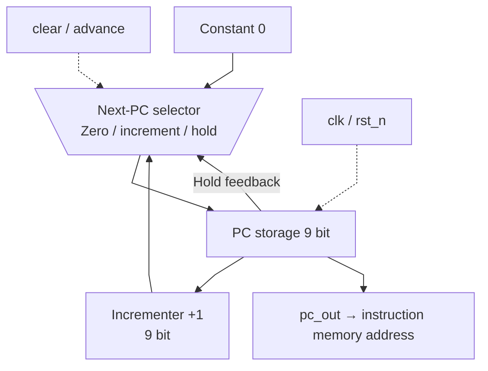

# PC.sv — Program counter

[Tài liệu](../../README.md) → [Hierarchy RTL](../README.md) → [Mục lục từng file](README.md)

**Trạng thái:** Đang dùng.

**Source:** [PC.sv](<../../../Verilog%20Source%20code/PC.sv>). **Số dòng:** 16. **SHA-256:** `b387df21642a26a7ebdbe9c405a2d6db201ef042692f94fe125504784f4d33dd`.

## Khối này làm gì?

PC 9 bit chọn một trong 512 instruction. Clear đưa về 0, advance tăng1; khi cả hai có hiệu lực, clear ưu tiên. Không có branch/jump trong module này.

## Sơ đồ kiến trúc tổng quan



MUX dùng hình thang rộng ở phía nhiều ngõ vào và thu hẹp về ngõ ra; decoder/demux dùng hình thang ngược lại, mở rộng về phía nhiều ngõ ra. Hình chữ nhật có các vạch ngang biểu diễn bộ nhớ hoặc bank descriptor. Các hình chữ nhật thường là datapath, thanh ghi đơn hoặc giao diện. Nét liền là đường dữ liệu, nét đứt là điều khiển/cấu hình. Mũi tên hồi tiếp biểu diễn kết nối phần cứng. Sơ đồ không biểu diễn thứ tự chu kỳ, trạng thái FSM hoặc các tầng pipeline CPU.

## Cách hoạt động chi tiết

Reset active-low asynchronous. Clear là điều kiện synchronous tại cạnh clk; advance chỉ được top phát sau instruction hoàn tất. Bản thân phép cộng 9 bit có thể wrap, nhưng scheduler chặn advance tại511.

1. Reset active-low asynchronous đưa PC về zero ngay khi `rst_n=0`.
2. Clear được xét ở cạnh clock và ưu tiên hơn advance; top dùng clear khi start chương trình.
3. Advance tăng PC sau khi instruction hoàn tất. Không có control thì flip-flop giữ giá trị.
4. Phép cộng 9 bit có thể wrap, nhưng top chặn advance tại PC 0x1FF (511).

**Quy ước RTL.** Nhánh `if (!rst_n)` chỉ reset asynchronous; `else if (clear)` là clear synchronous riêng, ưu tiên hơn advance. Không gộp clear vào điều kiện reset bất đồng bộ.

## Các nhóm logic trong source

Source được chia theo chức năng. Mỗi nhóm giữ nguyên phạm vi dòng để đối chiếu, nhưng phần giải thích tập trung vào quan hệ giữa các câu lệnh thay vì lặp lại từng dấu ngoặc, khai báo hoặc phép gán.


### [Dòng 1–7: Giao diện](<../../../Verilog%20Source%20code/PC.sv#L1>)

<!-- source-range:1:7 -->
```systemverilog
module PC(
    input logic clk,
    input logic rst_n,
    input logic clear,
    input logic advance,
    output logic [8:0] pc_out
);
```

**Mục đích.** clk/reset và hai control clear/advance.

**Cách phần code hoạt động.** Nhóm này định nghĩa giao diện, độ rộng, kiểu hoặc tín hiệu trung gian. Nó tạo cấu trúc để các nhóm xử lý sau sử dụng, chưa tự biểu diễn một bước runtime riêng.

**Tín hiệu và dữ liệu chính.** `clear`: đưa PC về 0; `advance`: tăng PC lên instruction kế tiếp; `pc_out`: register PC9 bit.


### [Dòng 8–16: Register PC](<../../../Verilog%20Source%20code/PC.sv#L8>)

<!-- source-range:8:16 -->
```systemverilog
    always_ff @(posedge clk or negedge rst_n) begin
        if (!rst_n)
            pc_out <= 9'h000;
        else if (clear)
            pc_out <= 9'h000;
        else if (advance)
            pc_out <= pc_out + 9'h001;
    end
endmodule
```

**Mục đích.** Reset hoặc clear về 0; nếu chỉ advance thì tăng; nếu không có control thì giữ giá trị.

**Cách phần code hoạt động.** Có logic tuần tự: register/FSM chỉ cập nhật tại cạnh clock; nonblocking assignment đọc giá trị cũ ở vế phải rồi chốt đồng thời.

**Tín hiệu và dữ liệu chính.** `clear`: đưa PC về 0; `pc_out`: register PC9 bit; `advance`: tăng PC lên instruction kế tiếp.

