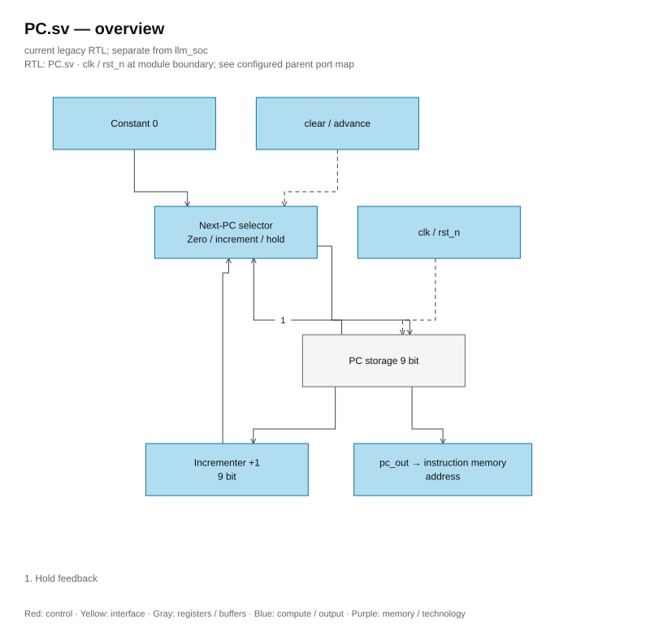

# PC.sv — Program counter

<!-- reading-navigation:start -->
[Documentation](../../README.md) → [Archive · Legacy](../../archive/README.md) → [Module catalog](README.md)

| Reading guide | Document |
|---|---|
| New to the subject | [NPU and RTL fundamentals](../../00-start-here/fundamentals.md) · [Glossary](../../00-start-here/glossary.md) |
| Read first | [Legacy architecture](../../design/legacy/architecture.md) |
| Related implementation | [ins_mem.sv](ins_mem.sv.md) |
<!-- reading-navigation:end -->

> **Category: GUIDE. Scope: LEGACY.** RTL is authoritative; diagrams use the [shared visual style](../../diagrams/diagram_style.md).

**Status:** In use.

**Source:** [PC.sv](<../../../Verilog%20Source%20code/PC.sv>).

## At a glance

| Item | Description |
|---|---|
| Responsibility | 9-bit PC selects one of 512 instructions. Clear resets to 0, advance increments by 1; when both are active, clear has priority. No branch/jump in this module. |

## Overall architecture diagram

[Editable draw.io — PC.sv — overview](../../diagrams/architecture.drawio) · Page `49_PC.sv_1`.

## Main flow

Reset active-low asynchronous. Clear is a synchronous condition at the clock edge; advance is only allowed by the top after the instruction completes. The 9-bit addition itself can wrap, but the scheduler blocks advance at 511.

1. Active-low asynchronous reset brings the PC to zero immediately when `rst_n=0`.
2. Clear is checked at the clock edge and has priority over advance; the top uses clear when starting the program.
3. Advance increments the PC after the instruction completes. Without control, the flip-flop holds its value.
4. The 9-bit addition can wrap, but the top blocks advance at PC 0x1FF (511).

**RTL conventions.** Branch `if (!rst_n)` only resets asynchronously; `else if (clear)` is a separate synchronous clear, prioritized over advance. Do not combine clear into asynchronous reset conditions.

## Important state / datapath groups

### [Lines 1–7: Interface](<../../../Verilog%20Source%20code/PC.sv#L1>)

**Purpose.** clk/reset and two control signals clear/advance.

**How the code works.** This group defines the interface, width, type, or intermediary signals. It creates a structure for later processing groups to use, not representing a separate runtime step itself.

**Key signals and data.** `clear`: reset PC to 0; `advance`: increment PC to the next instruction; `pc_out`: 9-bit PC register.

### [Lines 8–16: Register PC](<../../../Verilog%20Source%20code/PC.sv#L8>)

**Purpose.** Reset or clear to 0; if only advancing, then increment; if no control, then hold the value.

**How the code works.** There is sequential logic: register/FSM only updates on the clock edge; nonblocking assignment reads the old value on the right-hand side then latches simultaneously.

**Main signals and data.** `clear`: bring PC to 0; `pc_out`: 9-bit PC register; `advance`: increment PC to the next instruction.
