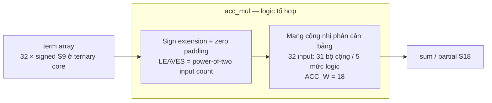
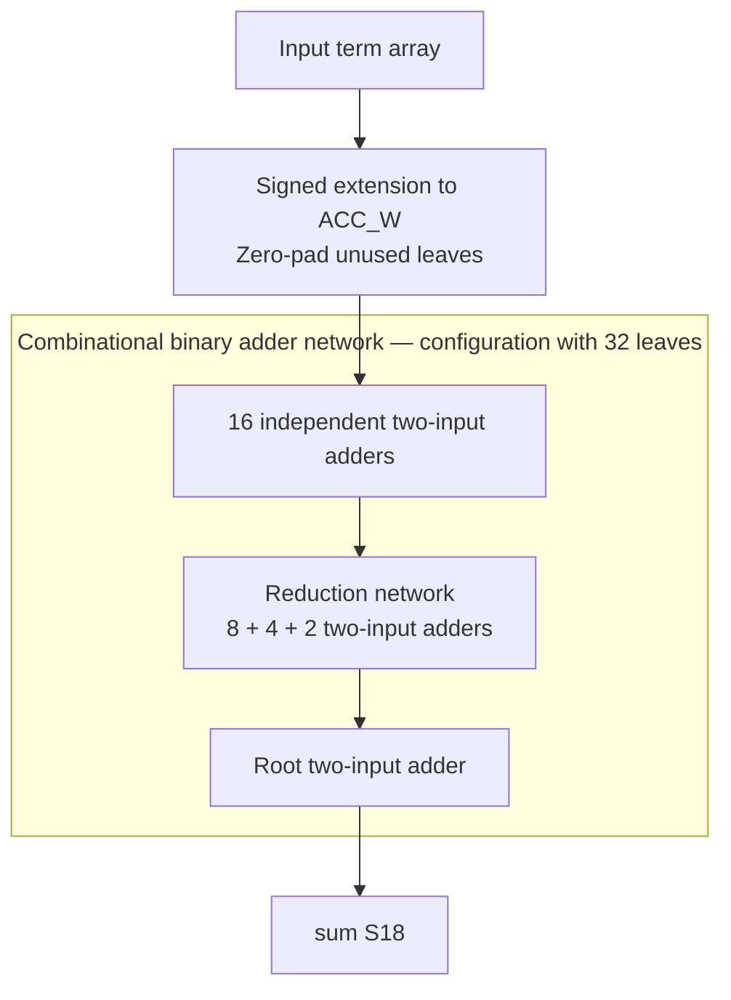

# acc_mul.sv — Cây cộng 32 term ternary

[Tài liệu](../../README.md) → [Hierarchy RTL](../README.md) → [Mục lục từng file](README.md)

**Trạng thái:** Đang dùng — trong ternary_mul.

**Source:** [acc_mul.sv](<../../../Verilog%20Source%20code/acc_mul.sv>). **Số dòng:** 31. **SHA-256:** `a7d47855e1ba2d0cfd74df2f6dd0610d8bea76e684f6049ad052a48b0841b108`.

## Khối này làm gì?

Tên file có “mul”, nhưng module này chỉ reduction bằng cộng. Với NUM_INPUTS=32, cây có 32 lá và 31 nút cộng. Mỗi term S9 được sign-extend lên ACC_W=18 trước khi cộng; sum là kết quả chunk, chưa phải tổng toàn K.

## Sơ đồ kiến trúc tổng quan



MUX dùng hình thang rộng ở phía nhiều ngõ vào và thu hẹp về ngõ ra; decoder/demux dùng hình thang ngược lại, mở rộng về phía nhiều ngõ ra. Hình chữ nhật có các vạch ngang biểu diễn bộ nhớ hoặc bank descriptor. Các hình chữ nhật thường là datapath, thanh ghi đơn hoặc giao diện. Nét liền là đường dữ liệu, nét đứt là điều khiển/cấu hình. Mũi tên hồi tiếp biểu diễn kết nối phần cứng. Sơ đồ không biểu diễn thứ tự chu kỳ, trạng thái FSM hoặc các tầng pipeline CPU.

## Cách hoạt động chi tiết

Nạp lá vào nửa cuối mảng tree, padding 0 nếu cần đến lũy thừa 2. Vòng lặp từ dưới lên tính parent=left+right. Đây là cây tổ hợp không có clock; với 32 lá có 5 tầng cộng về mặt cấu trúc, không phải 31 cycle.

1. Các term S9 được sign-extend lên S18, giữ đúng số âm và giá trị +128 sinh từ đổi dấu −128.
2. Mảng tree biểu diễn cây nhị phân; nếu số input không là lũy thừa hai, lá dư được pad zero.
3. Với 32 input, năm tầng cộng tạo một partial sum. Vòng for mô tả mạng logic, không phải 31 cycle tuần tự.
4. Module không có pipeline register, nên toàn bộ cây nằm trên combinational timing path.

## Các nhóm logic trong source

Source được chia theo chức năng. Mỗi nhóm giữ nguyên phạm vi dòng để đối chiếu, nhưng phần giải thích tập trung vào quan hệ giữa các câu lệnh thay vì lặp lại từng dấu ngoặc, khai báo hoặc phép gán.


### [Dòng 1–14: Kích thước cây](<../../../Verilog%20Source%20code/acc_mul.sv#L1>)

<!-- source-range:1:14 -->
```systemverilog
module acc_mul #(
    parameter int TERM_W = 9,
    parameter int NUM_INPUTS = 32,
    parameter int ACC_W = 18
) (
    input logic signed [TERM_W - 1 : 0] term [NUM_INPUTS - 1 : 0],
    output logic signed [ACC_W - 1 : 0] sum
);
    localparam int LEVELS = $clog2(NUM_INPUTS);
    localparam int LEAVES = 2 ** LEVELS;
    // Each tree level needs just one extra sign bit. Capping at ACC_W keeps
    // the original modulo-2^ACC_W behavior when the caller requests truncation.
    genvar level, n;
    generate
```

**Mục đích.** LEAVES làm tròn NUM_INPUTS lên lũy thừa 2; tree có 2×LEAVES−1 node.

**Cách phần code hoạt động.** Nhóm này định nghĩa giao diện, độ rộng, kiểu hoặc tín hiệu trung gian. Nó tạo cấu trúc để các nhóm xử lý sau sử dụng, chưa tự biểu diễn một bước runtime riêng.

**Tín hiệu và dữ liệu chính.** `term`: mảng các term ternary S9 cần cộng; `sum`: tổng của chunk 32 term; `tree`: các node S18 của cây cộng cân bằng.


### [Dòng 15–31: Reduction](<../../../Verilog%20Source%20code/acc_mul.sv#L15>)

<!-- source-range:15:31 -->
```systemverilog
    for (level = 0; level <= LEVELS; level = level + 1) begin : g_level
        localparam int WIDTH = (TERM_W + level < ACC_W) ? TERM_W + level : ACC_W;
        localparam int COUNT = LEAVES >> level;
        logic signed [WIDTH - 1:0] node [0:COUNT - 1];
        for (n = 0; n < COUNT; n = n + 1) begin : g_node
            if (level == 0) begin : g_leaf
                if (n < NUM_INPUTS) assign node[n] = term[n];
                else assign node[n] = '0;
            end else begin : g_add
                assign node[n] = $signed(g_level[level - 1].node[2 * n]) +
                    $signed(g_level[level - 1].node[2 * n + 1]);
            end
        end
    end
    endgenerate
    assign sum = g_level[LEVELS].node[0];
endmodule
```

**Mục đích.** Sign-extend lá, cộng hai con vào cha, lấy tree[0]. Vòng for ở đây tạo logic song song khi elaboration/synthesis, không phải CPU loop.

**Cách phần code hoạt động.** Có logic tổ hợp: output/intermediate được tính từ input hiện tại; các giá trị mặc định đầu khối giúp tránh suy ra latch.

**Tín hiệu và dữ liệu chính.** `tree`: các node S18 của cây cộng cân bằng; `term`: mảng các term ternary S9 cần cộng; `sum`: tổng của chunk 32 term.

**Điểm cần đọc kỹ.** Vòng for thứ hai đi từ node cuối về node gốc để mỗi parent đọc hai child đã được gán. Khi synthesis, đây là cây dây/cổng song song chứ không phải một bộ cộng dùng lặp 31 lần.

#### Sơ đồ khối phần cứng của nhóm



