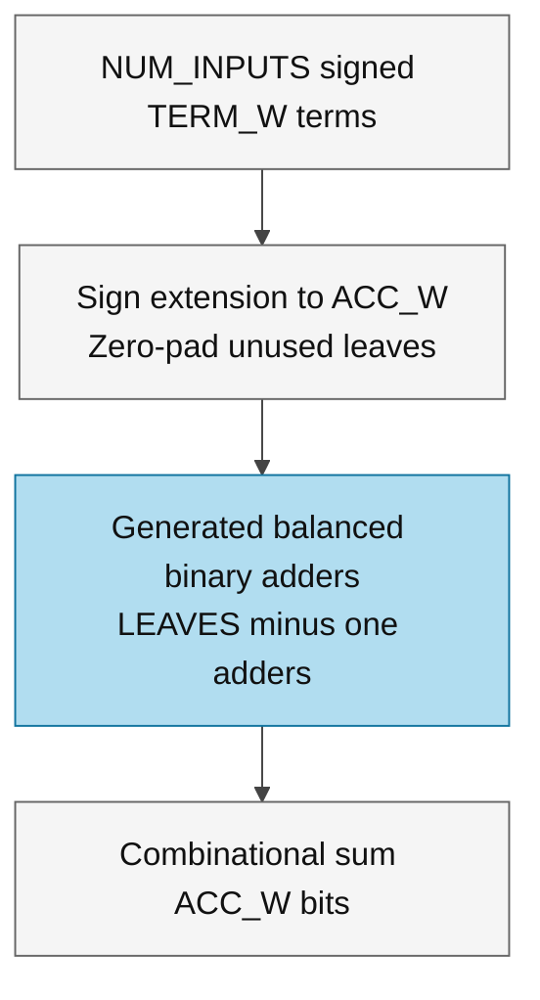
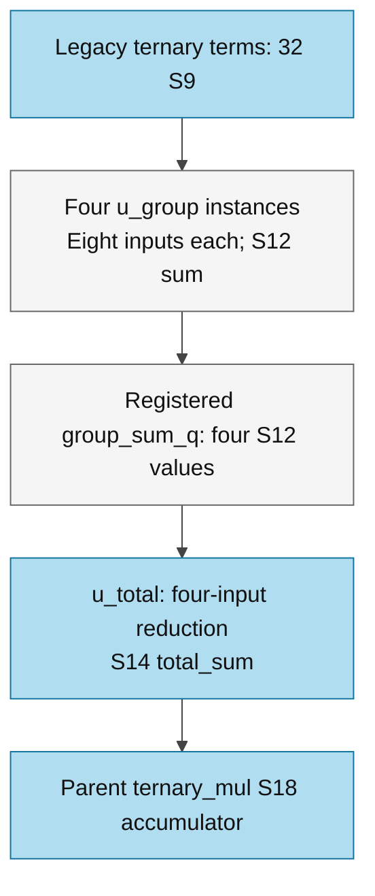

# acc_mul.sv — Cây cộng 32 term ternary

> **Category: GUIDE. Scope: LEGACY.** RTL is authoritative; diagrams use the [shared visual style](../../diagrams/diagram_style.md).
[Tài liệu](../../README.md) → [Hierarchy RTL](<../legacy/README.md>) → [Mục lục từng file](README.md)

**Trạng thái:** Đang dùng — trong ternary_mul.

**Source:** [acc_mul.sv](<../../../Verilog%20Source%20code/acc_mul.sv>).

## At a glance

| Item | Description |
|---|---|
| Responsibility | Parameterized combinational signed reduction. Sign-extend input terms, pad to a power of two and instantiate explicit generated adders. Current legacy ternary_mul uses four S9-to-S12 eight-input reductions and one S12-to-S14 four-input reduction; its S18 accumulator is outside acc_mul. |

## Sơ đồ kiến trúc tổng quan

## Main flow

Nạp lá vào nửa cuối mảng tree, padding 0 nếu cần đến lũy thừa 2. Vòng lặp từ dưới lên tính parent=left+right. Đây là cây tổ hợp không có clock; với 32 lá có 5 tầng cộng về mặt cấu trúc, không phải 31 cycle.

1. Các term S9 được sign-extend lên S18, giữ đúng số âm và giá trị +128 sinh từ đổi dấu −128.
2. Mảng tree biểu diễn cây nhị phân; nếu số input không là lũy thừa hai, lá dư được pad zero.
3. Với 32 input, năm tầng cộng tạo một partial sum. Vòng for mô tả mạng logic, không phải 31 cycle tuần tự.
4. Module không có pipeline register, nên toàn bộ cây nằm trên combinational timing path.

## Important state / datapath groups

### [Dòng 1–14: Kích thước cây](<../../../Verilog%20Source%20code/acc_mul.sv#L1>)

**Mục đích.** LEAVES làm tròn NUM_INPUTS lên lũy thừa 2; tree có 2×LEAVES−1 node.

**Cách phần code hoạt động.** Nhóm này định nghĩa giao diện, độ rộng, kiểu hoặc tín hiệu trung gian. Nó tạo cấu trúc để các nhóm xử lý sau sử dụng, chưa tự biểu diễn một bước runtime riêng.

**Tín hiệu và dữ liệu chính.** `term`: mảng các term ternary S9 cần cộng; `sum`: tổng của chunk 32 term; `tree`: các node S18 của cây cộng cân bằng.

### [Dòng 15–31: Reduction](<../../../Verilog%20Source%20code/acc_mul.sv#L15>)

**Mục đích.** Sign-extend lá, cộng hai con vào cha, lấy tree[0]. Vòng for ở đây tạo logic song song khi elaboration/synthesis, không phải CPU loop.

**Cách phần code hoạt động.** Có logic tổ hợp: output/intermediate được tính từ input hiện tại; các giá trị mặc định đầu khối giúp tránh suy ra latch.

**Tín hiệu và dữ liệu chính.** `tree`: các node S18 của cây cộng cân bằng; `term`: mảng các term ternary S9 cần cộng; `sum`: tổng của chunk 32 term.

**Điểm cần đọc kỹ.** Vòng for thứ hai đi từ node cuối về node gốc để mỗi parent đọc hai child đã được gán. Khi synthesis, đây là cây dây/cổng song song chứ không phải một bộ cộng dùng lặp 31 lần.

#### Sơ đồ khối phần cứng của nhóm

