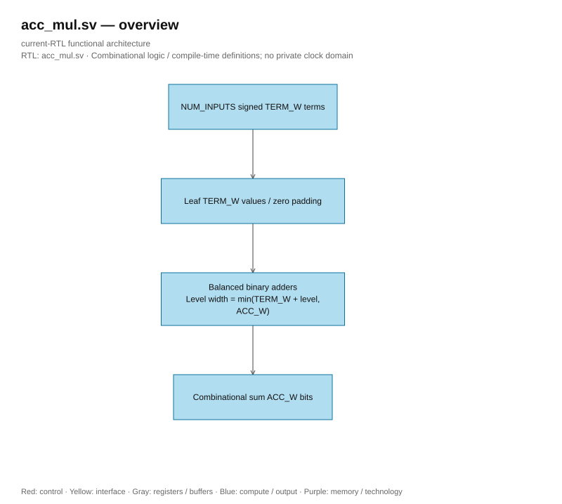
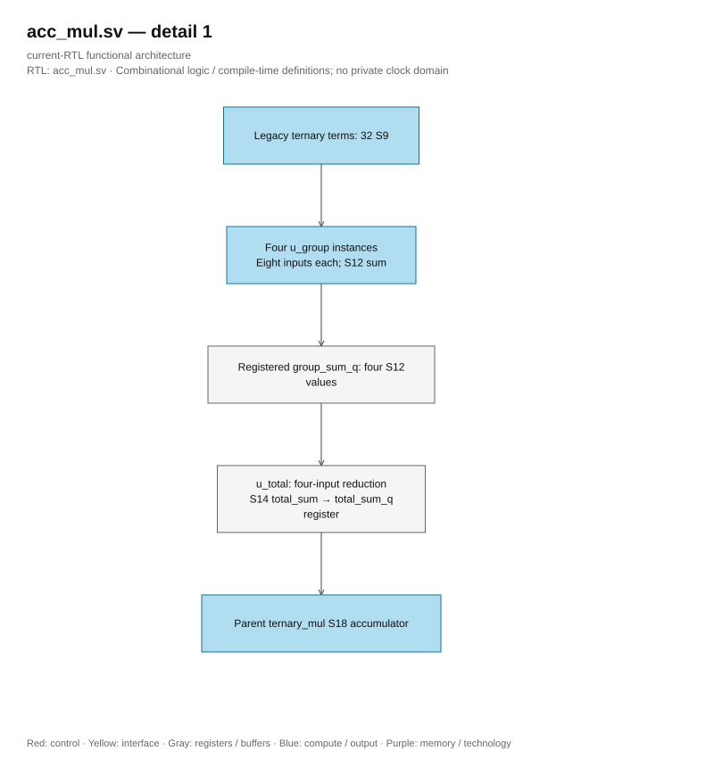

# acc_mul.sv — 32-term tertiary adder tree

<!-- reading-navigation:start -->
[Documentation](../../README.md) → [Archive · Legacy](../../archive/README.md) → [Module catalog](README.md)

| Reading guide | Document |
|---|---|
| New to the subject | [NPU and RTL fundamentals](../../00-start-here/fundamentals.md) · [Glossary](../../00-start-here/glossary.md) |
| Read first | [Legacy architecture](../../design/legacy/architecture.md) |
| Related implementation | [ternary_mul.sv](ternary_mul.sv.md) |
<!-- reading-navigation:end -->

> **Category: GUIDE. Scope: LEGACY.** RTL is authoritative; diagrams use the [shared visual style](../../diagrams/diagram_style.md).

**Status:** In use — in ternary_mul.

**Source:** [acc_mul.sv](<../../../Verilog%20Source%20code/acc_mul.sv>).

## At a glance

| Item | Description |
|---|---|
| Responsibility | Parameterized combinational signed reduction. Sign-extend input terms, pad to a power of two and instantiate explicit generated adders. Current legacy ternary_mul uses four S9-to-S12 eight-input reductions and one S12-to-S14 four-input reduction; its S18 accumulator is outside acc_mul. |

## Overview architecture diagram

[Editable draw.io — acc_mul.sv — overview](../../diagrams/architecture.drawio) · Page `14_acc_mul.sv_1`.

## Main flow

Load leaves into the second half of the tree array, padding with 0 if needed to reach a power of 2. Loop from bottom to top calculating parent = left + right. This is a combinational tree without a clock; with 32 leaves there are 5 structural levels, not 31 cycles.

1. The S9 terms are sign-extended to S18, preserving the negative numbers and the value +128 generated from negating -128.
2. The tree array represents a binary tree; if the number of inputs is not a power of two, the extra leaves are padded with zero.
3. With 32 inputs, five adder stages create a partial sum. The for loop describes a logic network, not 31 sequential cycles.
4. The module has no pipeline registers, so the entire tree lies on the combinational timing path.

## Important state / datapath groups

### [Lines 1–14: Tree size](<../../../Verilog%20Source%20code/acc_mul.sv#L1>)

**Purpose.** LEAVES round NUM_INPUTS up to the next power of 2; the tree has 2×LEAVES−1 nodes.

**How the code works.** This section defines interfaces, widths, types, or intermediate signals. It creates a structure for subsequent processing groups to use, without representing a standalone runtime step.

**Main signals and data.** `term`: array of ternary terms S9 to be added; `sum`: sum of a 32-term chunk; `tree`: S18 nodes of the balanced addition tree.

### [Lines 15–31: Reduction](<../../../Verilog%20Source%20code/acc_mul.sv#L15>)

**Purpose.** Sign-extend the leaf, add two children into the parent, take tree[0]. The for loop here creates parallel logic during elaboration/synthesis, not a CPU loop.

**How the code works.** There is combinational logic: output/intermediate is calculated from the current input; default values at the block's start help avoid latch inference.

**Main signals and data.** `tree`: S18 nodes of the balanced add tree; `term`: array of ternary S9 terms to be added; `sum`: sum of 32-term chunk.

**Points to read carefully.** The second for loop goes from the last node to the root node so that each parent reads two already assigned children. During synthesis, this is a parallel wire/gate tree, not an adder reused 31 times.

#### Hardware block diagram of the group

[Editable draw.io — acc_mul.sv — detail 1](../../diagrams/architecture.drawio) · Page `15_acc_mul.sv_2`.
