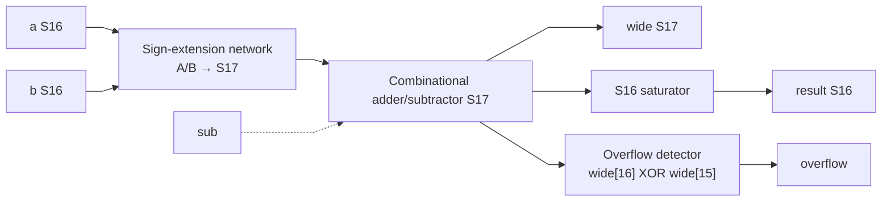

# addsub.sv — Helper cộng/trừ có saturation

[Về mục lục](README.md) · [Về tổng quan](../README.md)

**Trạng thái:** Helper — không instantiate trong top hiện tại.

**Source:** [addsub.sv](<../../../Verilog%20Source%20code/addsub.sv>). **Số dòng:** 17. **SHA-256:** `14484f9f2777b2662cfa8538ab92149d0e7f80be1012d21fc0906d8ea45d3b98`.

## Khối này làm gì?

Helper minh họa phép cộng/trừ hai S16 trong S17. Rowwise_op hiện tự thực hiện phép tương ứng với đổi scale, nên file này không phải một ALU bổ sung đang chạy trong core.

## Sơ đồ kiến trúc tổng quan



MUX dùng hình thang rộng ở phía nhiều ngõ vào và thu hẹp về ngõ ra; decoder/demux dùng hình thang ngược lại, mở rộng về phía nhiều ngõ ra. Hình chữ nhật có các vạch ngang biểu diễn bộ nhớ hoặc bank descriptor. Các hình chữ nhật thường là datapath, thanh ghi đơn hoặc giao diện. Nét liền là đường dữ liệu, nét đứt là điều khiển/cấu hình. Mũi tên hồi tiếp biểu diễn kết nối phần cứng. Sơ đồ không biểu diễn thứ tự chu kỳ, trạng thái FSM hoặc các tầng pipeline CPU. Sơ đồ riêng của module legacy/helper; module này không được instantiate trong hierarchy matmulfree hiện tại.

## Cách hoạt động chi tiết

Mở rộng dấu a/b, chọn cộng b hoặc cộng −b. wide giữ kết quả17 bit; XOR hai bit trên phát hiện kết quả không còn biểu diễn được bằng S16. sat_s16 clamp output.

1. A và B được sign-extend S16 lên S17 trước cộng/trừ để giữ carry và dấu thật.
2. `sub` chọn cộng B hoặc cộng đối của B; `wide` giữ kết quả chưa clamp.
3. Hai bit cao khác nhau nghĩa kết quả S17 không vừa S16, nên overflow lên 1.
4. `sat_s16` clamp về miền S16. Helper không biết F_t; rowwise_op hiện xử lý thêm việc đổi scale.

## Các nhóm logic trong source

Source được chia theo chức năng. Mỗi nhóm giữ nguyên phạm vi dòng để đối chiếu, nhưng phần giải thích tập trung vào quan hệ giữa các câu lệnh thay vì lặp lại từng dấu ngoặc, khai báo hoặc phép gán.


### [Dòng 1–10: Giao diện](<../../../Verilog%20Source%20code/addsub.sv#L1>)

<!-- source-range:1:10 -->
```systemverilog
module addsub (
    input logic signed [15:0] a,
    input logic signed [15:0] b,
    input logic sub,
    output logic signed [16:0] wide,
    output logic signed [15:0] result,
    output logic overflow
);
    import npu_pkg::*;
    logic signed [16:0] b_ext;
```

**Mục đích.** sub=1 là trừ; wide và result có độ rộng khác nhau.

**Cách phần code hoạt động.** Nhóm này định nghĩa giao diện, độ rộng, kiểu hoặc tín hiệu trung gian. Nó tạo cấu trúc để các nhóm xử lý sau sử dụng, chưa tự biểu diễn một bước runtime riêng.

**Tín hiệu và dữ liệu chính.** `a`: operand A; `b`: operand B; `sub`: chọn trừ khi bằng 1; `wide`: kết quả mở rộng S17; `result`: kết quả đã saturation; `overflow`: cờ kết quả vượt miền số; và 1 tín hiệu phụ khác trong đoạn code.


### [Dòng 11–17: Datapath tổ hợp](<../../../Verilog%20Source%20code/addsub.sv#L11>)

<!-- source-range:11:17 -->
```systemverilog
    always_comb begin
        b_ext = {b[15], b};
        wide = {a[15], a} + (sub ? - b_ext : b_ext);
        overflow = wide[16] ^ wide[15];
        result = sat_s16({{47{wide[16]}}, wide});
    end
endmodule
```

**Mục đích.** Không clock/start/done. Helper không tự rescale nguồn/đích.

**Cách phần code hoạt động.** Có logic tổ hợp: output/intermediate được tính từ input hiện tại; các giá trị mặc định đầu khối giúp tránh suy ra latch.

**Tín hiệu và dữ liệu chính.** `b_ext`: operand B mở rộng dấu S17; `b`: operand B; `wide`: kết quả mở rộng S17; `a`: operand A; `sub`: chọn trừ khi bằng 1; `overflow`: cờ kết quả vượt miền số; và 1 tín hiệu phụ khác trong đoạn code.

