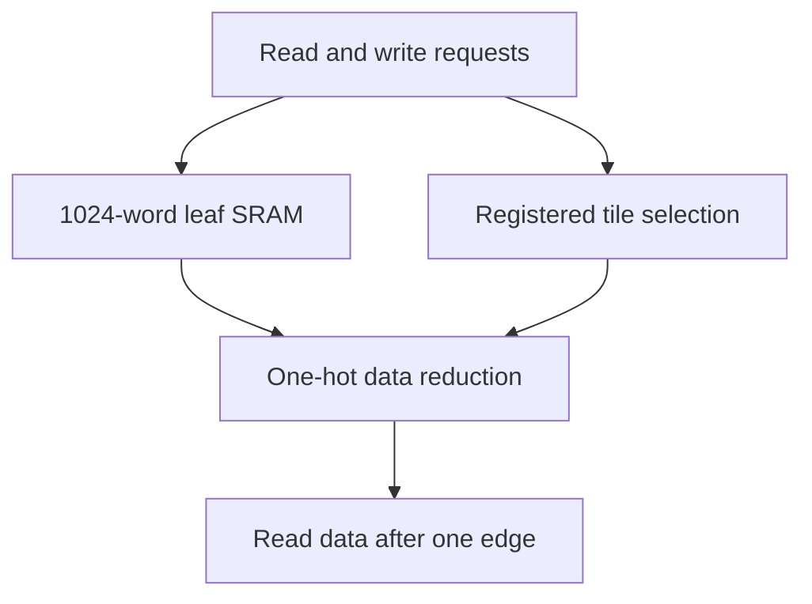

# banked_word_ram.sv — SRAM tiles và mux đọc

[Tài liệu](../../README.md) → [Source guide](../README.md) → [Mục lục](README.md)

**Source:** [banked_word_ram.sv](<../../../Verilog%20Source%20code/banked_word_ram.sv>). **Số dòng:** 55. **SHA-256:** `bb7a3bb83e0aef84c030403bcd675e4853f190ea79d9851ad742a5a0d02d2409`.

## Khối này làm gì?

Một read port đồng bộ và một write port độc lập, old-data khi cùng địa chỉ. Mỗi tile tối đa 1024 word; read_tile_q giữ tag để mux output đúng tile. Nội dung và output không reset; client dùng valid riêng. ASIC macro hoặc Quartus IP có thể thay sram_word_tile sau cùng hợp đồng.

## Sơ đồ kiến trúc



## Cách hoạt động chi tiết

Một read port đồng bộ và một write port độc lập, old-data khi cùng địa chỉ. Mỗi tile tối đa 1024 word; read_tile_q giữ tag để mux output đúng tile. Nội dung và output không reset; client dùng valid riêng. ASIC macro hoặc Quartus IP có thể thay sram_word_tile sau cùng hợp đồng.

## Các nhóm logic trong source

### [Dòng 1–20: Leaf SRAM](<../../../Verilog%20Source%20code/banked_word_ram.sv#L1>)

<!-- source-range:1:20 -->
```systemverilog
// Portable SRAM organization with bounded, reusable word-bank instances.
// Tiling keeps memory elaboration and address routing local as depth grows.
module sram_word_tile #(
    parameter int WIDTH = 32,
    parameter int ROWS = 1024
) (
    input logic clk, rd_en, wr_en,
    input logic [9:0] rd_addr, wr_addr,
    input logic [WIDTH - 1:0] wr_data,
    output logic [WIDTH - 1:0] rd_data
);
    logic [WIDTH - 1:0] memory [0:ROWS - 1];
    always_ff @(posedge clk) begin
        if (wr_en) memory[wr_addr] <= wr_data;
        if (rd_en) rd_data <= memory[rd_addr];
    end
endmodule

module banked_word_ram #(
    parameter int WIDTH = 32,
```

Hai nonblocking assignment trả dữ liệu trước write khi read/write cùng địa chỉ. Không initialize hoặc reset memory.

### [Dòng 21–33: Bank organization](<../../../Verilog%20Source%20code/banked_word_ram.sv#L21>)

<!-- source-range:21:33 -->
```systemverilog
    parameter int ROWS = 4096,
    parameter int ADDR_W = $clog2(ROWS)
) (
    input logic clk, rd_en, wr_en,
    input logic [ADDR_W - 1:0] rd_addr, wr_addr,
    input logic [WIDTH - 1:0] wr_data,
    output logic [WIDTH - 1:0] rd_data
);
    localparam int TILES = (ROWS + 1023) / 1024;
    logic [WIDTH - 1:0] tile_data [0:TILES - 1];
    logic [TILES - 1:0] read_tile_q;
    genvar tile;
    generate
```

Chia ROWS thành tile; tile cuối có thể ngắn hơn. ADDR_W phải đủ cho ROWS và client chỉ phát địa chỉ hợp lệ.

### [Dòng 34–49: Tile decoding](<../../../Verilog%20Source%20code/banked_word_ram.sv#L34>)

<!-- source-range:34:49 -->
```systemverilog
    for (tile = 0; tile < TILES; tile = tile + 1) begin : g_tile
        localparam int TILE_ROWS = (ROWS - tile * 1024 < 1024) ? ROWS - tile * 1024 : 1024;
        sram_word_tile #(.WIDTH(WIDTH), .ROWS(TILE_ROWS)) u_tile(
            .clk(clk), .rd_en(rd_en && (rd_addr >> 10) == tile),
            .wr_en(wr_en && (wr_addr >> 10) == tile),
            .rd_addr(10'(rd_addr)), .wr_addr(10'(wr_addr)),
            .wr_data(wr_data), .rd_data(tile_data[tile]));
        always_ff @(posedge clk)
            if (rd_en) read_tile_q[tile] <= (rd_addr >> 10) == tile;
    end
    endgenerate
    wire [WIDTH - 1:0] read_mux [0:TILES];
    genvar mux_tile;
    assign read_mux[0] = '0;
    generate
    for (mux_tile = 0; mux_tile < TILES; mux_tile = mux_tile + 1) begin : g_read_mux
```

High address bits chọn tile, low 10 bits chọn word; tag đọc được chốt cùng cạnh với SRAM.

### [Dòng 50–55: Read output](<../../../Verilog%20Source%20code/banked_word_ram.sv#L50>)

<!-- source-range:50:55 -->
```systemverilog
        assign read_mux[mux_tile + 1] = read_mux[mux_tile] |
            (tile_data[mux_tile] & {WIDTH{read_tile_q[mux_tile]}});
    end
    endgenerate
    assign rd_data = read_mux[TILES];
endmodule
```

OR của các output được mask bằng tag one-hot. Latency logic là một cạnh; mux cuối vẫn phải đáp ứng STA.
