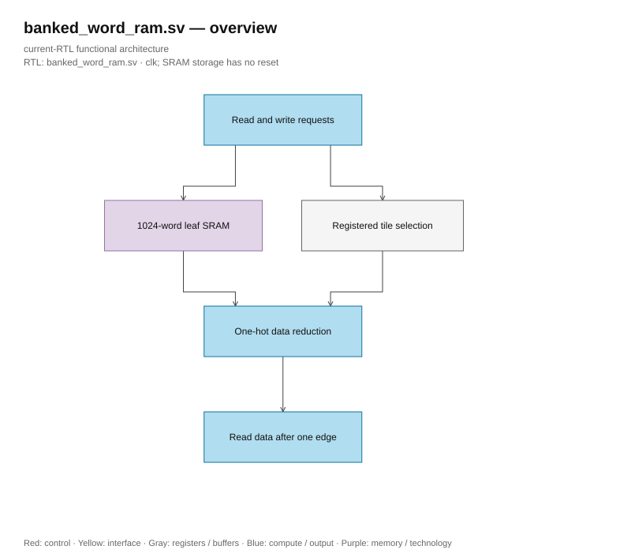

# banked_word_ram.sv

> **Category: GUIDE. Scope: LEGACY.** RTL is authoritative; diagrams use the [shared visual style](../../diagrams/diagram_style.md).
[Documentation](../../README.md) → [Source guide](../full_graph.md) → [RTL index](README.md)

**Source:** [banked_word_ram.sv](<../../../Verilog%20Source%20code/banked_word_ram.sv>).

## At a glance

| Item | Description |
|---|---|
| Responsibility | Legacy three-pass RMS normalization and quantization. Two shared structural multipliers, one divider and the separately defined isqrt_u64 serve the explicit pass controller. Workspace scratch and final quantized values are packed in 256-bit words. |

## Sơ đồ kiến trúc

[Editable draw.io — banked_word_ram.sv — overview](../../diagrams/architecture.drawio) · Page `16_banked_word_ram.sv_1`.
