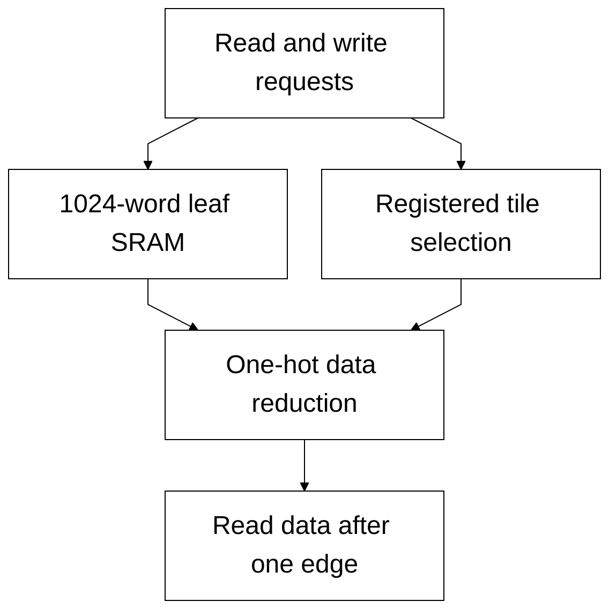

# banked_word_ram.sv

[Documentation](../../README.md) → [Source guide](../full_graph.md) → [RTL index](README.md)

**Source:** [banked_word_ram.sv](<../../../Verilog%20Source%20code/banked_word_ram.sv>). **Số dòng:** 39. **SHA-256:** `3f62befc5ff4942b92708e1fca7c54e61ae64781839e2efd2e6108ed0cc9a08e`.

## Khối này làm gì?

Legacy three-pass RMS normalization and quantization. Two shared structural multipliers, one divider and the separately defined isqrt_u64 serve the explicit pass controller. Workspace scratch and final quantized values are packed in 256-bit words.

## Sơ đồ kiến trúc



## Cách hoạt động chi tiết

Legacy three-pass RMS normalization and quantization. Two shared structural multipliers, one divider and the separately defined isqrt_u64 serve the explicit pass controller. Workspace scratch and final quantized values are packed in 256-bit words.

## Các nhóm logic trong source

### [Dòng 1–15: Portable bank interface and tile geometry](<../../../Verilog%20Source%20code/banked_word_ram.sv#L1>)

<!-- source-range:1:15 -->
```systemverilog
// Portable SRAM organization with bounded, reusable word-bank instances.
// Tiling keeps memory elaboration and address routing local as depth grows.
module banked_word_ram #(
    parameter int WIDTH = 32,
    parameter int ROWS = 4096,
    parameter int ADDR_W = $clog2(ROWS)
) (
    input logic clk, rd_en, wr_en,
    input logic [ADDR_W - 1:0] rd_addr, wr_addr,
    input logic [WIDTH - 1:0] wr_data,
    output logic [WIDTH - 1:0] rd_data
);
    localparam int TILES = (ROWS + 1023) / 1024;
    logic [WIDTH - 1:0] tile_data [0:TILES - 1];
    logic [TILES - 1:0] read_tile_q;
```

### [Dòng 16–29: Generated SRAM leaves and read tags](<../../../Verilog%20Source%20code/banked_word_ram.sv#L16>)

<!-- source-range:16:29 -->
```systemverilog
    genvar tile;
    generate
    for (tile = 0; tile < TILES; tile = tile + 1) begin : g_tile
        localparam int TILE_ROWS = (ROWS - tile * 1024 < 1024) ? ROWS - tile * 1024 : 1024;
        sram_word_tile #(.WIDTH(WIDTH), .ROWS(TILE_ROWS)) u_tile(
            .clk(clk), .rd_en(rd_en && (rd_addr >> 10) == tile),
            .wr_en(wr_en && (wr_addr >> 10) == tile),
            .rd_addr(10'(rd_addr)), .wr_addr(10'(wr_addr)),
            .wr_data(wr_data), .rd_data(tile_data[tile]));
        always_ff @(posedge clk)
            if (rd_en) read_tile_q[tile] <= (rd_addr >> 10) == tile;
    end
    endgenerate
    wire [WIDTH - 1:0] read_mux [0:TILES];
```

### [Dòng 30–39: Read reduction network](<../../../Verilog%20Source%20code/banked_word_ram.sv#L30>)

<!-- source-range:30:39 -->
```systemverilog
    genvar mux_tile;
    assign read_mux[0] = '0;
    generate
    for (mux_tile = 0; mux_tile < TILES; mux_tile = mux_tile + 1) begin : g_read_mux
        assign read_mux[mux_tile + 1] = read_mux[mux_tile] |
            (tile_data[mux_tile] & {WIDTH{read_tile_q[mux_tile]}});
    end
    endgenerate
    assign rd_data = read_mux[TILES];
endmodule
```
