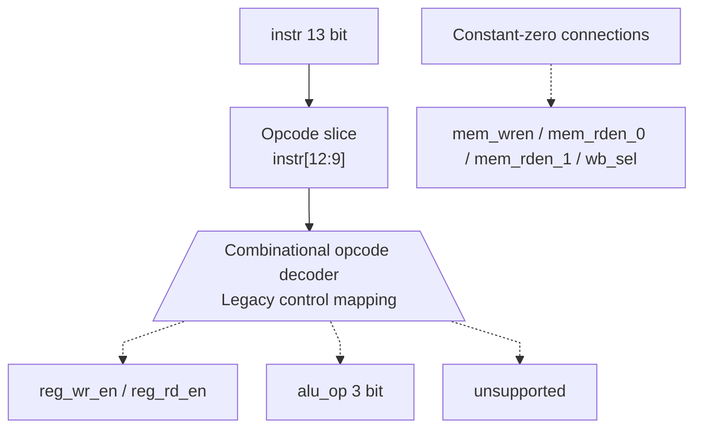

# ctrl_unit.sv — Decoder giữ lại từ cấu trúc cũ

[Về mục lục](README.md) · [Về tổng quan](../README.md)

**Trạng thái:** Legacy — không dùng trong scheduler v2.

**Source:** [ctrl_unit.sv](<../../../Verilog%20Source%20code/ctrl_unit.sv>). **Số dòng:** 23. **SHA-256:** `b4daf5e7d1b059306d11a907e2512c917d60ec46c4dd68267a1190ed1f579968`.

## Khối này làm gì?

Decoder này chuyển opcode sang control kiểu pipeline: reg read/write, ALU select và memory enables. Nó không phải decoder đang quyết định REC/RELU/HALT trong matmulfree.

## Sơ đồ kiến trúc tổng quan



MUX dùng hình thang rộng ở phía nhiều ngõ vào và thu hẹp về ngõ ra; decoder/demux dùng hình thang ngược lại, mở rộng về phía nhiều ngõ ra. Hình chữ nhật có các vạch ngang biểu diễn bộ nhớ hoặc bank descriptor. Các hình chữ nhật thường là datapath, thanh ghi đơn hoặc giao diện. Nét liền là đường dữ liệu, nét đứt là điều khiển/cấu hình. Mũi tên hồi tiếp biểu diễn kết nối phần cứng. Sơ đồ không biểu diễn thứ tự chu kỳ, trạng thái FSM hoặc các tầng pipeline CPU. Sơ đồ riêng của module legacy/helper; module này không được instantiate trong hierarchy matmulfree hiện tại.

## Cách hoạt động chi tiết

Đặt default tất cả output trước case để không tạo latch. ADD/SUB/MUL/SIG chọn ALU và bật đọc/ghi; NORM chọn 7; TMATMUL bật reg controls. LDV/STV/DIV/EXP báo unsupported. Default giữ0; không được dùng decoder này thay scheduler để suy luận toàn ISA v2.

1. Khối đặt control mặc định zero trước case để opcode không khớp không tạo latch/enable ngẫu nhiên.
2. ADD/SUB/MUL/SIG bật đọc/ghi register và chuyển opcode thấp sang `alu_op`.
3. NORM chọn alu_op 111; TMATMUL chỉ bật control register theo interface cũ.
4. LDV/STV/DIV/EXP đặt unsupported. Decoder không chứa REC/RELU/HALT đầy đủ của v2.
5. Matmulfree tự decode bằng scheduler, nên file này chỉ mô tả pipeline lịch sử.

## Các nhóm logic trong source

Source được chia theo chức năng. Mỗi nhóm giữ nguyên phạm vi dòng để đối chiếu, nhưng phần giải thích tập trung vào quan hệ giữa các câu lệnh thay vì lặp lại từng dấu ngoặc, khai báo hoặc phép gán.


### [Dòng 1–12: Port và opcode](<../../../Verilog%20Source%20code/ctrl_unit.sv#L1>)

<!-- source-range:1:12 -->
```systemverilog
module ctrl_unit(
    input logic [12:0] instr,
    output logic reg_wr_en,
    output logic reg_rd_en,
    output logic [2:0] alu_op,
    output logic mem_wren,
    output logic mem_rden_0,
    output logic mem_rden_1,
    output logic wb_sel,
    output logic unsupported
);
    localparam logic [3:0] ADD = 4'h1, SUB = 4'h2, MUL = 4'h3, DIV_OP = 4'h4, EXP_OP = 4'h5, SIG = 4'h6, NORM = 4'h7, TMATMUL = 4'h8, LDV = 4'h9, STV = 4'ha;
```

**Mục đích.** Các tín hiệu memory/wb được giữ vì interface cũ.

**Cách phần code hoạt động.** Nhóm này định nghĩa giao diện, độ rộng, kiểu hoặc tín hiệu trung gian. Nó tạo cấu trúc để các nhóm xử lý sau sử dụng, chưa tự biểu diễn một bước runtime riêng.

**Tín hiệu và dữ liệu chính.** `instr`: instruction đọc từ program; `reg_wr_en`: cho phép ghi register kiểu pipeline cũ; `reg_rd_en`: cho phép đọc register kiểu pipeline cũ; `alu_op`: chọn phép ALU kiểu cũ; `mem_wren`: cho phép memory write kiểu cũ; `mem_rden_0`: cho phép memory read0 kiểu cũ; và 3 tín hiệu phụ khác trong đoạn code.


### [Dòng 13–23: Decode](<../../../Verilog%20Source%20code/ctrl_unit.sv#L13>)

<!-- source-range:13:23 -->
```systemverilog
    always_comb begin
        reg_wr_en = 0;reg_rd_en = 0;alu_op = 0;mem_wren = 0;mem_rden_0 = 0;mem_rden_1 = 0;wb_sel = 0;unsupported = 0;
        case (instr[12:9])
            ADD, SUB, MUL, SIG : begin reg_wr_en = 1;reg_rd_en = 1;alu_op = instr[11:9];end
            NORM : begin reg_wr_en = 1;reg_rd_en = 1;alu_op = 3'b111;end
            TMATMUL : begin reg_wr_en = 1;reg_rd_en = 1;end
            LDV, STV, DIV_OP, EXP_OP : unsupported = 1;
            default : ;
        endcase
    end
endmodule
```

**Mục đích.** Điều khiển tổ hợp, không chứa pipeline FSM hay memory transaction.

**Cách phần code hoạt động.** Có logic tổ hợp: output/intermediate được tính từ input hiện tại; các giá trị mặc định đầu khối giúp tránh suy ra latch.

**Tín hiệu và dữ liệu chính.** `reg_wr_en`: cho phép ghi register kiểu pipeline cũ; `reg_rd_en`: cho phép đọc register kiểu pipeline cũ; `alu_op`: chọn phép ALU kiểu cũ; `mem_wren`: cho phép memory write kiểu cũ; `mem_rden_0`: cho phép memory read0 kiểu cũ; `mem_rden_1`: cho phép memory read1 kiểu cũ; và 3 tín hiệu phụ khác trong đoạn code.

