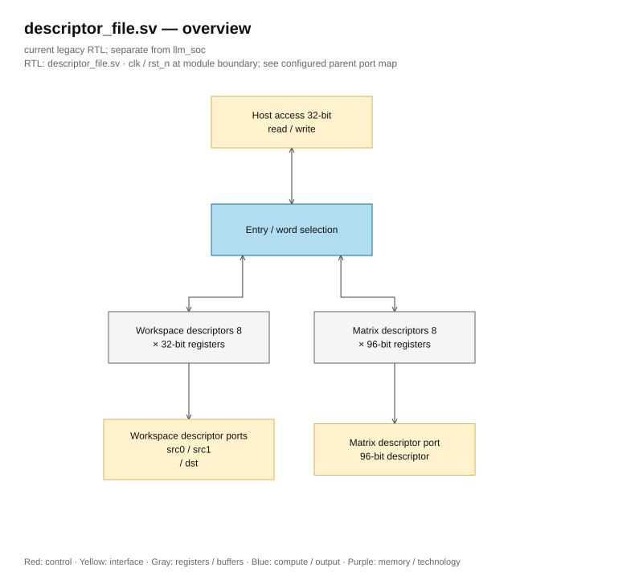

# descriptor_file.sv — Table describing tensors and matrices

<!-- reading-navigation:start -->
[Documentation](../../README.md) → [Archive · Legacy](../../archive/README.md) → [Module catalog](README.md)

| Reading guide | Document |
|---|---|
| New to the subject | [NPU and RTL fundamentals](../../00-start-here/fundamentals.md) · [Glossary](../../00-start-here/glossary.md) |
| Read first | [Legacy architecture](../../design/legacy/architecture.md) |
| Related implementation | [rowwise_dispatch.sv](rowwise_dispatch.sv.md) |
<!-- reading-navigation:end -->

> **Category: GUIDE. Scope: LEGACY.** RTL is authoritative; diagrams use the [shared visual style](../../diagrams/diagram_style.md).

**Status:** In use.

**Source:** [descriptor_file.sv](<../../../Verilog%20Source%20code/descriptor_file.sv>).

## At a glance

| Item | Description |
|---|---|
| Responsibility | Eight 32-bit workspace descriptors and eight 96-bit matrix descriptors help short instructions still describe tensors with address, length, and scale. Reading descriptors is combinational; the host writes synchronously by 32-bit word. Three workspace ports read independently for two sources and a destination. |

## Overview Architecture Diagram

[Editable draw.io — descriptor_file.sv — overview](../../diagrams/architecture.drawio) · Page `17_descriptor_file.sv_1`.

## Main flow

The host selects the type using host_is_matrix, and the ID using host_id. Workspace records one word. Matrix records three words: low 31:0, middle 63:32, high 95:64. Reset clears the descriptor; tensor data in SRAM still needs to be loaded separately by the host.

1. There are eight workspace descriptors and eight matrix descriptors. Reset clears metadata but does not erase SRAM contents.
2. Three workspace IDs read combinations of source0, source1, and destination for the current instruction.
3. Matrix ID reads a 96-bit descriptor. Host reads/writes matrix through three 32-bit slices: low, middle, and high.
4. Host write to workspace replaces the entire descriptor; matrix write only replaces the selected slice, so all three words need to be loaded before start.
5. File does not validate content; each execution unit checks the descriptor according to its operation.

The descriptor is represented by a 1,024-bit register with reset and combinational read. The matrix has a 96-bit layout; the implementation uses three 32-bit registers per entry, writing the entire word with a constant index from the generate. Slice reading with a variable index is a combinational mux.

## Important state / datapath groups

The sections below cover the full text of the current source, in line order.

### [Lines 1–22: Interface and descriptor arrays](<../../../Verilog%20Source%20code/descriptor_file.sv#L1>)

**Purpose.** Eight 32-bit workspace descriptors and eight 96-bit matrix descriptors.

**How the code part works.** The packed type preserves the host/ISA layout. Workspace ports read source0/source1/destination; matrix reads through mat_id.

**Main signals and data.** `ws[0:7]`, `md[0:7]`, `ws_desc_t`, `mat_desc_t`, the host and compute IDs.

### [Lines 23–40: Reading combined descriptor](<../../../Verilog%20Source%20code/descriptor_file.sv#L23>)

**Purpose.** Select host entry and word without adding latency.

**How the code part works.** Continuous assignment selects compute descriptor by ID. Host mux workspace or one of three matrix slices; word_sel beyond 0..2 returns zero.

**Main signals and data.** `ws_id0/1/2`, `mat_id`, `host_id`, `host_word_sel`, `host_rdata`.

### [Lines 41–70: Generate FF and write the entire word](<../../../Verilog%20Source%20code/descriptor_file.sv#L41>)

**Purpose.** Describes a register bank with whole-word write and constant index; each entry has a clear reset and separate word-enable.

**How the code works.** The outer generate creates eight workspace entries with separate write-enable. The inner generate creates three 32-bit word_q for each matrix. Each clock process writes only the whole word; constant slices combine matrix_bits then cast into mat_desc_t. Active-low reset clears all 256 + 768 bits of metadata.

**Main signals and data.** `g_descriptor`, `g_word`, `word_q`, `matrix_bits`, `host_id == 3'(entry)`, `host_word_sel == 2'(word_index)`.

**Points to read carefully.** `genvar` is declared before the loop and has `generate/endgenerate` clearly according to SystemVerilog generate syntax. The entries are generated in parallel during elaboration; the generate loop does not run through eight entries in eight clocks. The host still has to write all three matrix words before starting.
