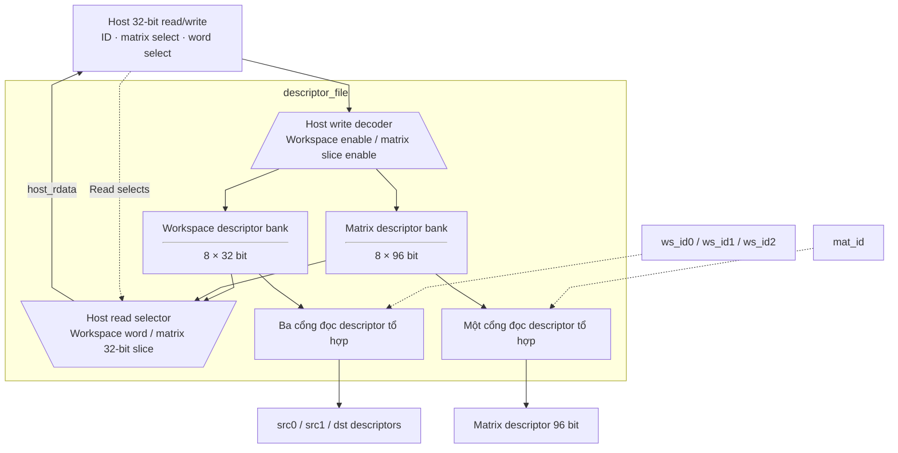

# descriptor_file.sv — Bảng mô tả tensor và ma trận

[Về mục lục](README.md) · [Về tổng quan](../README.md)

**Trạng thái:** Đang dùng.

**Source:** [descriptor_file.sv](<../../../Verilog%20Source%20code/descriptor_file.sv>). **Số dòng:** 62. **SHA-256:** `192d5c622186b585ab162869f9885053cd23f453e569f3b8925f4513603516c4`.

## Khối này làm gì?

Tám workspace descriptor 32 bit và tám matrix descriptor 96 bit giúp instruction ngắn vẫn mô tả tensor có địa chỉ, length và scale. Đọc descriptor là combinational; host ghi đồng bộ theo word 32. Ba cổng workspace đọc độc lập cho hai nguồn và đích.

## Sơ đồ kiến trúc tổng quan



MUX dùng hình thang rộng ở phía nhiều ngõ vào và thu hẹp về ngõ ra; decoder/demux dùng hình thang ngược lại, mở rộng về phía nhiều ngõ ra. Hình chữ nhật có các vạch ngang biểu diễn bộ nhớ hoặc bank descriptor. Các hình chữ nhật thường là datapath, thanh ghi đơn hoặc giao diện. Nét liền là đường dữ liệu, nét đứt là điều khiển/cấu hình. Mũi tên hồi tiếp biểu diễn kết nối phần cứng. Sơ đồ không biểu diễn thứ tự chu kỳ, trạng thái FSM hoặc các tầng pipeline CPU.

## Cách hoạt động chi tiết

Host chọn loại bằng host_is_matrix, ID bằng host_id. Workspace ghi một word. Matrix ghi ba word: thấp 31:0, giữa63:32, cao95:64. Reset xóa descriptor; tensor data trong SRAM vẫn phải được host nạp riêng.

1. Có tám workspace descriptor và tám matrix descriptor. Reset xóa metadata nhưng không xóa nội dung SRAM.
2. Ba workspace ID đọc tổ hợp source0, source1 và destination cho instruction hiện tại.
3. Matrix ID đọc descriptor 96 bit. Host đọc/ghi matrix qua ba slice 32 bit thấp, giữa và cao.
4. Host write workspace thay toàn bộ descriptor; matrix write chỉ thay slice được chọn, nên phải nạp đủ ba word trước start.
5. File không validate nội dung; từng execution unit kiểm tra descriptor theo phép toán của nó.

## Các nhóm logic trong source

Source được chia theo chức năng. Mỗi nhóm giữ nguyên phạm vi dòng để đối chiếu, nhưng phần giải thích tập trung vào quan hệ giữa các câu lệnh thay vì lặp lại từng dấu ngoặc, khai báo hoặc phép gán.


### [Dòng 1–22: Giao diện và mảng](<../../../Verilog%20Source%20code/descriptor_file.sv#L1>)

<!-- source-range:1:22 -->
```systemverilog
module descriptor_file (
    input logic clk,
    input logic rst_n,
    input logic host_we,
    input logic [2:0] host_id,
    input logic host_is_matrix,
    input logic [1:0] host_word_sel,
    input logic [31:0] host_wdata,
    output logic [31:0] host_rdata,

    input logic [2:0] ws_id0,
    input logic [2:0] ws_id1,
    input logic [2:0] ws_id2,
    output npu_pkg::ws_desc_t ws_desc0,
    output npu_pkg::ws_desc_t ws_desc1,
    output npu_pkg::ws_desc_t ws_desc2,
    input logic [2:0] mat_id,
    output npu_pkg::mat_desc_t mat_desc
);
    import npu_pkg::*;
    ws_desc_t ws [0:7];
    mat_desc_t md [0:7];
```

**Mục đích.** ws chứa metadata activation/state, md chứa metadata weight/bias/scale.

**Cách phần code hoạt động.** Nhóm này định nghĩa giao diện, độ rộng, kiểu hoặc tín hiệu trung gian. Nó tạo cấu trúc để các nhóm xử lý sau sử dụng, chưa tự biểu diễn một bước runtime riêng.

**Tín hiệu và dữ liệu chính.** `host_we`: host chọn ghi thay vì đọc; `host_id`: ID descriptor0…7; `host_is_matrix`: chọn matrix thay vì workspace descriptor; `host_word_sel`: chọn slice32 của matrix descriptor; `host_wdata`: data 32 host muốn ghi; `host_rdata`: data 32 trả về host; và 8 tín hiệu phụ khác trong đoạn code.


### [Dòng 23–40: Đọc](<../../../Verilog%20Source%20code/descriptor_file.sv#L23>)

<!-- source-range:23:40 -->
```systemverilog

    assign ws_desc0 = ws[ws_id0];
    assign ws_desc1 = ws[ws_id1];
    assign ws_desc2 = ws[ws_id2];
    assign mat_desc = md[mat_id];

    always_comb begin
        if (!host_is_matrix)
            host_rdata = ws[host_id];
        else begin
            case (host_word_sel)
                2'h0 : host_rdata = md[host_id][31:0];
                2'h1 : host_rdata = md[host_id][63:32];
                2'h2 : host_rdata = md[host_id][95:64];
                default : host_rdata = '0;
            endcase
        end
    end
```

**Mục đích.** Chọn descriptor bằng ID hoặc slice32 cho host; word_sel ngoài 0…2 trả 0.

**Cách phần code hoạt động.** Có logic tổ hợp: output/intermediate được tính từ input hiện tại; các giá trị mặc định đầu khối giúp tránh suy ra latch. Có continuous assignment: biểu thức luôn lái tín hiệu đích, không cần start hoặc cạnh clock.

**Tín hiệu và dữ liệu chính.** `ws_desc0`: descriptor source0 đọc ra; `ws_id0`: ID descriptor source0; `ws_desc1`: descriptor source1 đọc ra; `ws_id1`: ID descriptor source1; `ws_desc2`: descriptor destination đọc ra; `ws_id2`: ID descriptor destination; và 6 tín hiệu phụ khác trong đoạn code.


### [Dòng 41–62: Reset và ghi](<../../../Verilog%20Source%20code/descriptor_file.sv#L41>)

<!-- source-range:41:62 -->
```systemverilog

    integer i;
    always_ff @(posedge clk or negedge rst_n) begin
        if (!rst_n) begin
            for (i = 0;i < 8;i = i + 1) begin
                ws[i] <= '0;
                md[i] <= '0;
            end
        end else if (host_we) begin
            if (!host_is_matrix)
                ws[host_id] <= ws_desc_t'(host_wdata);
            else begin
                case (host_word_sel)
                    2'h0 : md[host_id][31:0] <= host_wdata;
                    2'h1 : md[host_id][63:32] <= host_wdata;
                    2'h2 : md[host_id][95:64] <= host_wdata;
                    default : ;
                endcase
            end
        end
    end
endmodule
```

**Mục đích.** Reset đủ 8 entry. Host write chỉ sửa loại/word được chọn.

**Cách phần code hoạt động.** Có logic tuần tự: register/FSM chỉ cập nhật tại cạnh clock; nonblocking assignment đọc giá trị cũ ở vế phải rồi chốt đồng thời.

**Tín hiệu và dữ liệu chính.** `host_we`: host chọn ghi thay vì đọc; `host_is_matrix`: chọn matrix thay vì workspace descriptor; `host_id`: ID descriptor0…7; `host_wdata`: data 32 host muốn ghi; `host_word_sel`: chọn slice32 của matrix descriptor.

