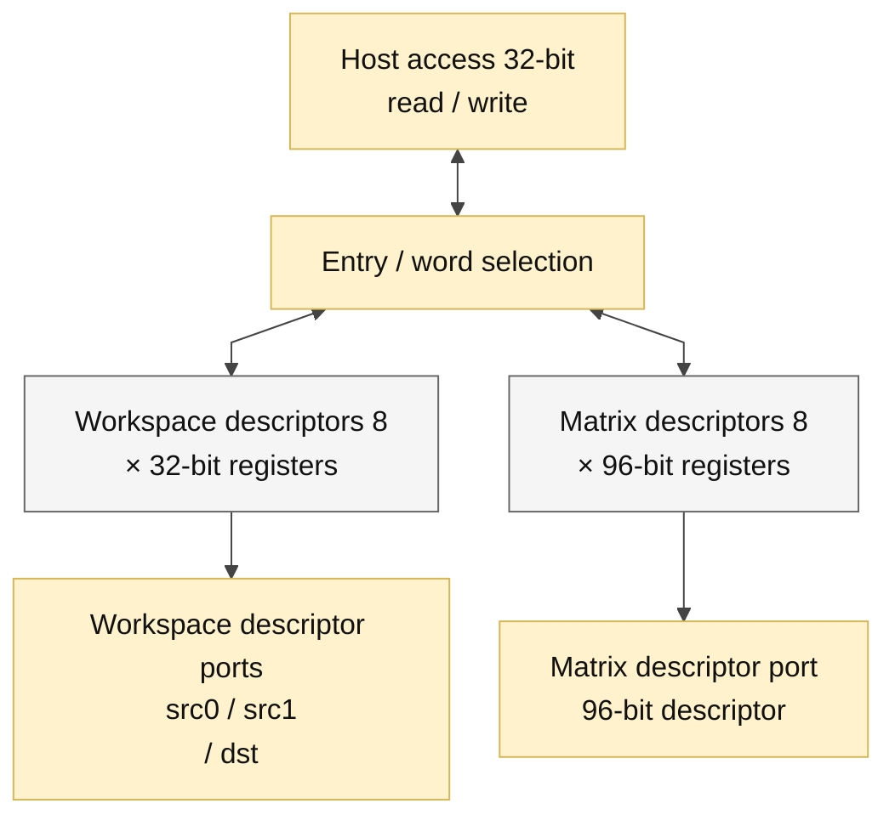

# descriptor_file.sv — Bảng mô tả tensor và ma trận

> **Category: GUIDE. Scope: LEGACY.** RTL is authoritative; diagrams use the [shared visual style](../../diagrams/diagram_style.md).
[Tài liệu](../../README.md) → [Hierarchy RTL](<../legacy/README.md>) → [Mục lục từng file](README.md)

**Trạng thái:** Đang dùng.

**Source:** [descriptor_file.sv](<../../../Verilog%20Source%20code/descriptor_file.sv>).

## At a glance

| Item | Description |
|---|---|
| Responsibility | Tám workspace descriptor 32 bit và tám matrix descriptor 96 bit giúp instruction ngắn vẫn mô tả tensor có địa chỉ, length và scale. Đọc descriptor là combinational; host ghi đồng bộ theo word 32. Ba cổng workspace đọc độc lập cho hai nguồn và đích. |

## Sơ đồ kiến trúc tổng quan

## Main flow

Host chọn loại bằng host_is_matrix, ID bằng host_id. Workspace ghi một word. Matrix ghi ba word: thấp 31:0, giữa63:32, cao95:64. Reset xóa descriptor; tensor data trong SRAM vẫn phải được host nạp riêng.

1. Có tám workspace descriptor và tám matrix descriptor. Reset xóa metadata nhưng không xóa nội dung SRAM.
2. Ba workspace ID đọc tổ hợp source0, source1 và destination cho instruction hiện tại.
3. Matrix ID đọc descriptor 96 bit. Host đọc/ghi matrix qua ba slice 32 bit thấp, giữa và cao.
4. Host write workspace thay toàn bộ descriptor; matrix write chỉ thay slice được chọn, nên phải nạp đủ ba word trước start.
5. File không validate nội dung; từng execution unit kiểm tra descriptor theo phép toán của nó.

Descriptor được biểu diễn bằng 1.024 bit thanh ghi với reset và đọc tổ hợp. Matrix có layout 96 bit; implementation dùng ba thanh ghi 32 bit cho mỗi entry, ghi nguyên word với index hằng từ generate. Đọc slice bằng index thay đổi là mux tổ hợp.

## Important state / datapath groups

Các đoạn dưới đây bao phủ nguyên văn toàn bộ source hiện tại, theo thứ tự dòng.

### [Dòng 1–22: Giao diện và descriptor arrays](<../../../Verilog%20Source%20code/descriptor_file.sv#L1>)

**Mục đích.** Tám workspace descriptor 32 bit và tám matrix descriptor 96 bit.

**Cách phần code hoạt động.** Kiểu packed giữ nguyên layout host/ISA. Các port workspace đọc source0/source1/destination; matrix đọc qua mat_id.

**Tín hiệu và dữ liệu chính.** `ws[0:7]`, `md[0:7]`, `ws_desc_t`, `mat_desc_t`, các host và compute IDs.

### [Dòng 23–40: Đọc descriptor tổ hợp](<../../../Verilog%20Source%20code/descriptor_file.sv#L23>)

**Mục đích.** Chọn entry và word host mà không thêm latency.

**Cách phần code hoạt động.** Continuous assignment chọn descriptor compute theo ID. Host mux workspace hoặc một trong ba slice matrix; word_sel ngoài 0..2 trả zero.

**Tín hiệu và dữ liệu chính.** `ws_id0/1/2`, `mat_id`, `host_id`, `host_word_sel`, `host_rdata`.

### [Dòng 41–70: Generate FF và ghi nguyên word](<../../../Verilog%20Source%20code/descriptor_file.sv#L41>)

**Mục đích.** Mô tả bank thanh ghi bằng whole-word write và index hằng; mỗi entry có reset rõ ràng và word-enable riêng.

**Cách phần code hoạt động.** Generate ngoài tạo tám entry workspace với write-enable riêng. Generate trong tạo ba word_q 32 bit mỗi matrix. Mỗi process clock chỉ ghi nguyên word; constant slices ghép matrix_bits rồi cast thành mat_desc_t. Reset active-low xóa đủ 256 + 768 bit metadata.

**Tín hiệu và dữ liệu chính.** `g_descriptor`, `g_word`, `word_q`, `matrix_bits`, `host_id == 3'(entry)`, `host_word_sel == 2'(word_index)`.

**Điểm cần đọc kỹ.** `genvar` được khai báo trước vòng lặp và có `generate/endgenerate` rõ ràng theo cú pháp generate SystemVerilog. Các entry được tạo song song khi elaboration; vòng generate không chạy qua tám entry trong tám clock. Host vẫn phải ghi đủ ba matrix word trước khi start.
