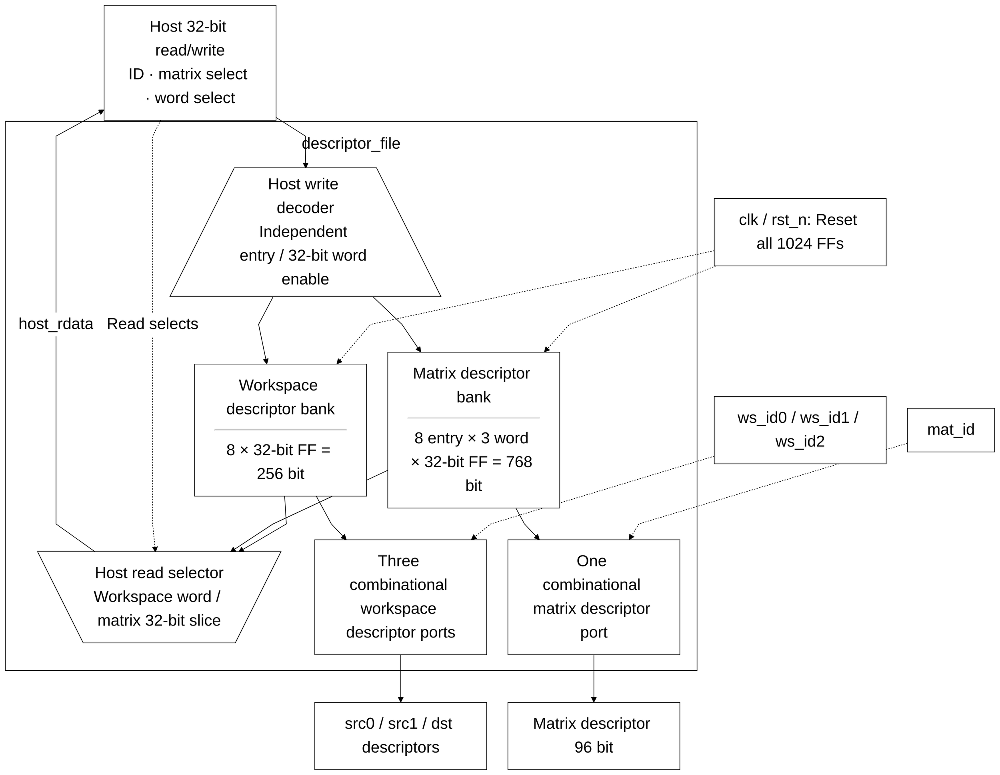

# descriptor_file.sv — Bảng mô tả tensor và ma trận

[Tài liệu](../../README.md) → [Hierarchy RTL](../README.md) → [Mục lục từng file](README.md)

**Trạng thái:** Đang dùng.

**Source:** [descriptor_file.sv](<../../../Verilog%20Source%20code/descriptor_file.sv>). **Số dòng:** 70. **SHA-256:** `7b30587206cd4f7d3896f2e7ea7beb871aa854875de64d6bc19947a8b990d618`.

## Khối này làm gì?

Tám workspace descriptor 32 bit và tám matrix descriptor 96 bit giúp instruction ngắn vẫn mô tả tensor có địa chỉ, length và scale. Đọc descriptor là combinational; host ghi đồng bộ theo word 32. Ba cổng workspace đọc độc lập cho hai nguồn và đích.

## Sơ đồ kiến trúc tổng quan



MUX dùng hình thang rộng ở phía nhiều ngõ vào và thu hẹp về ngõ ra; decoder/demux dùng hình thang ngược lại, mở rộng về phía nhiều ngõ ra. Hình chữ nhật có các vạch ngang biểu diễn bộ nhớ hoặc bank descriptor. Các hình chữ nhật thường là datapath, thanh ghi đơn hoặc giao diện. Nét liền là đường dữ liệu, nét đứt là điều khiển/cấu hình. Mũi tên hồi tiếp biểu diễn kết nối phần cứng. Sơ đồ không biểu diễn thứ tự chu kỳ, trạng thái FSM hoặc các tầng pipeline CPU.

## Cách hoạt động chi tiết

Host chọn loại bằng host_is_matrix, ID bằng host_id. Workspace ghi một word. Matrix ghi ba word: thấp 31:0, giữa63:32, cao95:64. Reset xóa descriptor; tensor data trong SRAM vẫn phải được host nạp riêng.

1. Có tám workspace descriptor và tám matrix descriptor. Reset xóa metadata nhưng không xóa nội dung SRAM.
2. Ba workspace ID đọc tổ hợp source0, source1 và destination cho instruction hiện tại.
3. Matrix ID đọc descriptor 96 bit. Host đọc/ghi matrix qua ba slice 32 bit thấp, giữa và cao.
4. Host write workspace thay toàn bộ descriptor; matrix write chỉ thay slice được chọn, nên phải nạp đủ ba word trước start.
5. File không validate nội dung; từng execution unit kiểm tra descriptor theo phép toán của nó.


Descriptor được biểu diễn bằng 1.024 bit thanh ghi với reset và đọc tổ hợp. Matrix có layout 96 bit; implementation dùng ba thanh ghi 32 bit cho mỗi entry, ghi nguyên word với index hằng từ generate. Đọc slice bằng index thay đổi là mux tổ hợp.

## Các nhóm logic trong source

Các đoạn dưới đây bao phủ nguyên văn toàn bộ source hiện tại, theo thứ tự dòng.

### [Dòng 1–22: Giao diện và descriptor arrays](<../../../Verilog%20Source%20code/descriptor_file.sv#L1>)

<!-- source-range:1:22 -->
```systemverilog
module descriptor_file (
    input logic clk,
    input logic rst_n,
    input logic host_we,
    input logic [2:0] host_id,
    input logic host_is_matrix,
    input logic [1:0] host_word_sel,
    input logic [31:0] host_wdata,
    output logic [31:0] host_rdata,

    input logic [2:0] ws_id0,
    input logic [2:0] ws_id1,
    input logic [2:0] ws_id2,
    output npu_pkg::ws_desc_t ws_desc0,
    output npu_pkg::ws_desc_t ws_desc1,
    output npu_pkg::ws_desc_t ws_desc2,
    input logic [2:0] mat_id,
    output npu_pkg::mat_desc_t mat_desc
);
    import npu_pkg::*;
    ws_desc_t ws [0:7];
    mat_desc_t md [0:7];
```

**Mục đích.** Tám workspace descriptor 32 bit và tám matrix descriptor 96 bit.

**Cách phần code hoạt động.** Kiểu packed giữ nguyên layout host/ISA. Các port workspace đọc source0/source1/destination; matrix đọc qua mat_id.

**Tín hiệu và dữ liệu chính.** `ws[0:7]`, `md[0:7]`, `ws_desc_t`, `mat_desc_t`, các host và compute IDs.


### [Dòng 23–40: Đọc descriptor tổ hợp](<../../../Verilog%20Source%20code/descriptor_file.sv#L23>)

<!-- source-range:23:40 -->
```systemverilog

    assign ws_desc0 = ws[ws_id0];
    assign ws_desc1 = ws[ws_id1];
    assign ws_desc2 = ws[ws_id2];
    assign mat_desc = md[mat_id];

    always_comb begin
        if (!host_is_matrix)
            host_rdata = ws[host_id];
        else begin
            case (host_word_sel)
                2'h0 : host_rdata = md[host_id][31:0];
                2'h1 : host_rdata = md[host_id][63:32];
                2'h2 : host_rdata = md[host_id][95:64];
                default : host_rdata = '0;
            endcase
        end
    end
```

**Mục đích.** Chọn entry và word host mà không thêm latency.

**Cách phần code hoạt động.** Continuous assignment chọn descriptor compute theo ID. Host mux workspace hoặc một trong ba slice matrix; word_sel ngoài 0..2 trả zero.

**Tín hiệu và dữ liệu chính.** `ws_id0/1/2`, `mat_id`, `host_id`, `host_word_sel`, `host_rdata`.


### [Dòng 41–70: Generate FF và ghi nguyên word](<../../../Verilog%20Source%20code/descriptor_file.sv#L41>)

<!-- source-range:41:70 -->
```systemverilog

    // Constant array indexes and whole-word writes avoid Quartus 18.1
    // treating partial writes to a dynamically indexed packed struct as latches.
    genvar entry, word_index;
    generate
    for (entry = 0; entry < 8; entry = entry + 1) begin : g_descriptor
        logic [95:0] matrix_bits;
        assign md[entry] = mat_desc_t'(matrix_bits);

        always_ff @(posedge clk or negedge rst_n) begin
            if (!rst_n)
                ws[entry] <= '0;
            else if (host_we && !host_is_matrix && host_id == 3'(entry))
                ws[entry] <= ws_desc_t'(host_wdata);
        end

        for (word_index = 0; word_index < 3; word_index = word_index + 1) begin : g_word
            logic [31:0] word_q;
            assign matrix_bits[word_index * 32 +: 32] = word_q;
            always_ff @(posedge clk or negedge rst_n) begin
                if (!rst_n)
                    word_q <= '0;
                else if (host_we && host_is_matrix && host_id == 3'(entry) &&
                         host_word_sel == 2'(word_index))
                    word_q <= host_wdata;
            end
        end
    end
    endgenerate
endmodule
```

**Mục đích.** Mô tả bank thanh ghi bằng whole-word write và index hằng; mỗi entry có reset rõ ràng và word-enable riêng.

**Cách phần code hoạt động.** Generate ngoài tạo tám entry workspace với write-enable riêng. Generate trong tạo ba word_q 32 bit mỗi matrix. Mỗi process clock chỉ ghi nguyên word; constant slices ghép matrix_bits rồi cast thành mat_desc_t. Reset active-low xóa đủ 256 + 768 bit metadata.

**Tín hiệu và dữ liệu chính.** `g_descriptor`, `g_word`, `word_q`, `matrix_bits`, `host_id == 3'(entry)`, `host_word_sel == 2'(word_index)`.

**Điểm cần đọc kỹ.** `genvar` được khai báo trước vòng lặp và có `generate/endgenerate` rõ ràng theo cú pháp generate SystemVerilog. Các entry được tạo song song khi elaboration; vòng generate không chạy qua tám entry trong tám clock. Host vẫn phải ghi đủ ba matrix word trước khi start.
