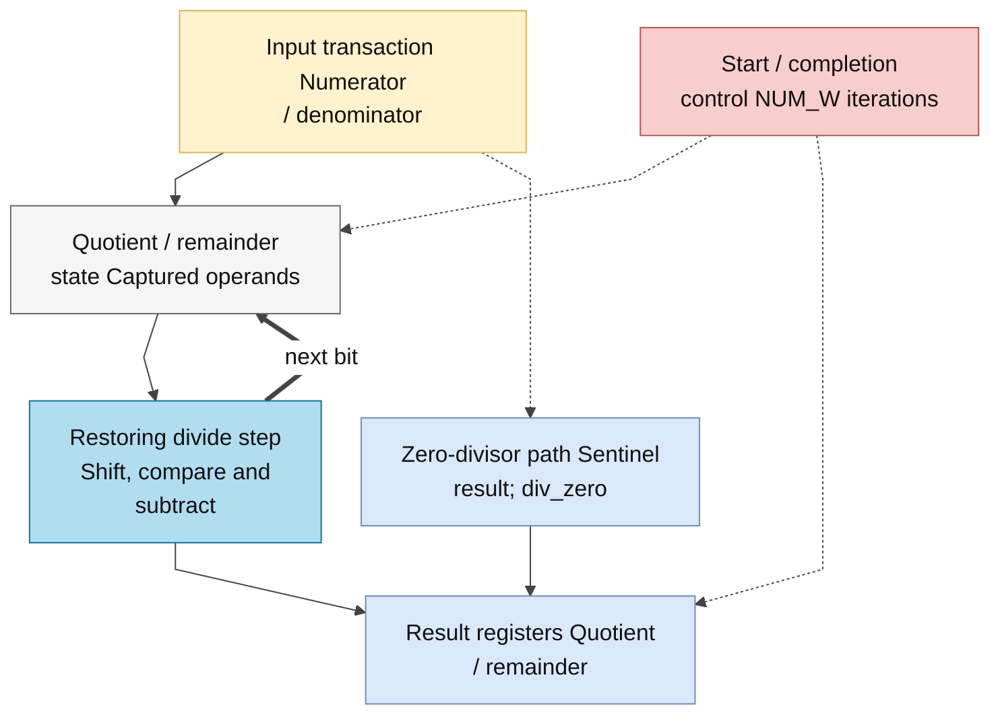
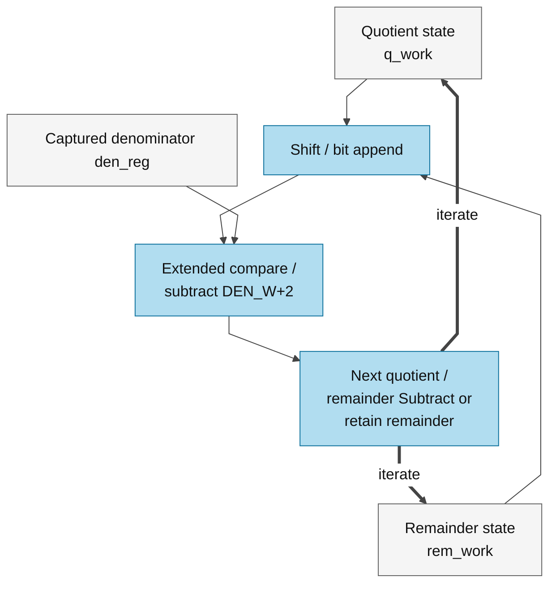

# div.sv — Divider unsigned tuần tự

> **Category: GUIDE. Scope: CURRENT (may also have legacy callers).** RTL is authoritative; diagrams use the [shared visual style](../../diagrams/diagram_style.md).
[Tài liệu](../../README.md) → [Source guide](../README.md) → [Mục lục từng file](README.md)

**Trạng thái:** Đang dùng — scalar nội bộ.

**Source:** [div.sv](<../../../Verilog%20Source%20code/div.sv>).

## At a glance

| Item | Description |
|---|---|
| Responsibility | Đây là divider unsigned kiểu restoring, không phải vector DIV instruction. Mỗi bước dịch một bit của numerator sang remainder, thử trừ denominator và sinh một bit quotient. Current `llm_soc` and attention-normalization instances use NUM_W=64/DEN_W=32. Legacy NORM uses 55/32; scale_compose uses 48/25. Parameter mặc định 64/32 được giữ cho helper generic và verification. |

## Sơ đồ kiến trúc tổng quan

## Main flow

Start khi rảnh chốt numerator/denominator. Mỗi cycle busy tiến một bit, sau NUM_W bước trả quotient/remainder và done. Chia0 trả quotient toàn1, remainder nhận numerator cast về DEN_W bit, div_zero=1; caller phải xử lý cờ lỗi, không dùng đó như kết quả toán học hợp lệ.

1. Divider là unsigned; phép signed phải xử lý dấu/magnitude ở caller. Start chỉ được nhận khi không busy.
2. `q_work` ban đầu chứa numerator. Mỗi chu kỳ, một bit được kéo sang `rem_shift`.
3. Nếu remainder đủ lớn, phần cứng trừ denominator và đặt quotient bit mới bằng 1; ngược lại bit mới bằng 0.
4. Sau NUM_W bước, quotient và remainder cuối được chốt cùng pulse done.
5. Chia zero kết thúc ngay với `div_zero=1`; quotient toàn 1 chỉ là quy ước phần cứng, không phải thương hợp lệ.

**Quy ước RTL.** Counter khởi tạo bằng `CW'(NUM_W)` để chỉ rõ độ rộng chứa số bước; vòng lặp làm việc với NUM_W bit numerator. Remainder của chia zero dùng `DEN_W'(numerator)`, tránh part-select vượt range khi denominator rộng hơn numerator. Divider vẫn trả quotient/remainder bằng thuật toán tuần tự; divide-by-zero và giao tiếp start/busy/done không đổi.

## Important state / datapath groups

### [Dòng 1–25: Giao diện và độ rộng](<../../../Verilog%20Source%20code/div.sv#L1>)

**Mục đích.** Remainder trung gian rộng DEN_W+1 để không mất carry khi dịch.

**Cách phần code hoạt động.** Nhóm này định nghĩa giao diện, độ rộng, kiểu hoặc tín hiệu trung gian. Nó tạo cấu trúc để các nhóm xử lý sau sử dụng, chưa tự biểu diễn một bước runtime riêng.

**Tín hiệu và dữ liệu chính.** `start`: yêu cầu bắt đầu giao dịch; `numerator`: tử số phép chia; `denominator`: mẫu số phép chia; `busy`: khối đang xử lý; `done`: xung báo hoàn tất; `div_zero`: divider báo mẫu bằng 0; và 8 tín hiệu phụ khác trong đoạn code.

### [Dòng 26–37: Một bước chia](<../../../Verilog%20Source%20code/div.sv#L26>)

**Mục đích.** Dịch remainder và quotient, nếu đủ lớn thì trừ mẫu và đặt bit quotient mới=1.

**Cách phần code hoạt động.** Có logic tổ hợp: output/intermediate được tính từ input hiện tại; các giá trị mặc định đầu khối giúp tránh suy ra latch.

**Tín hiệu và dữ liệu chính.** `rem_shift`: remainder sau dịch/thử trừ ở bước hiện tại; `rem_work`: remainder đang tích lũy; `q_work`: thanh ghi numerator/quotient trong vòng chia; `q_next`: quotient sau một bước divider; `den_reg`: denominator đã chốt.

**Điểm cần đọc kỹ.** Đây là một bước của restoring division. `q_work` vừa giữ các bit numerator chưa xử lý, vừa dần trở thành quotient khi mỗi bit mới được dịch vào từ phía thấp.

#### Sơ đồ khối phần cứng của nhóm

### [Dòng 38–58: Reset/start](<../../../Verilog%20Source%20code/div.sv#L38>)

**Mục đích.** Bắt trường hợp denominator=0 trước vòng lặp; nếu hợp lệ giữ denominator và bộ đếm.

**Cách phần code hoạt động.** Có logic tuần tự: register/FSM chỉ cập nhật tại cạnh clock; nonblocking assignment đọc giá trị cũ ở vế phải rồi chốt đồng thời.

**Tín hiệu và dữ liệu chính.** `busy`: khối đang xử lý; `done`: xung báo hoàn tất; `div_zero`: divider báo mẫu bằng 0; `quotient`: thương; `remainder`: phần dư; `q_work`: thanh ghi numerator/quotient trong vòng chia; và 6 tín hiệu phụ khác trong đoạn code.

### [Dòng 59–72: Vòng lặp](<../../../Verilog%20Source%20code/div.sv#L59>)

**Mục đích.** Chốt q_next/rem_shift, giảm count. Khi count cũ=1, xuất kết quả của bước cuối.

**Cách phần code hoạt động.** Các câu lệnh thuộc cùng một nhánh/pha xử lý và phải được đọc liền nhau; tách riêng từng dòng sẽ làm mất quan hệ điều kiện và dữ liệu.

**Tín hiệu và dữ liệu chính.** `busy`: khối đang xử lý; `q_work`: thanh ghi numerator/quotient trong vòng chia; `q_next`: quotient sau một bước divider; `rem_work`: remainder đang tích lũy; `rem_shift`: remainder sau dịch/thử trừ ở bước hiện tại; `count`: bộ đếm bước lặp; và 3 tín hiệu phụ khác trong đoạn code.
