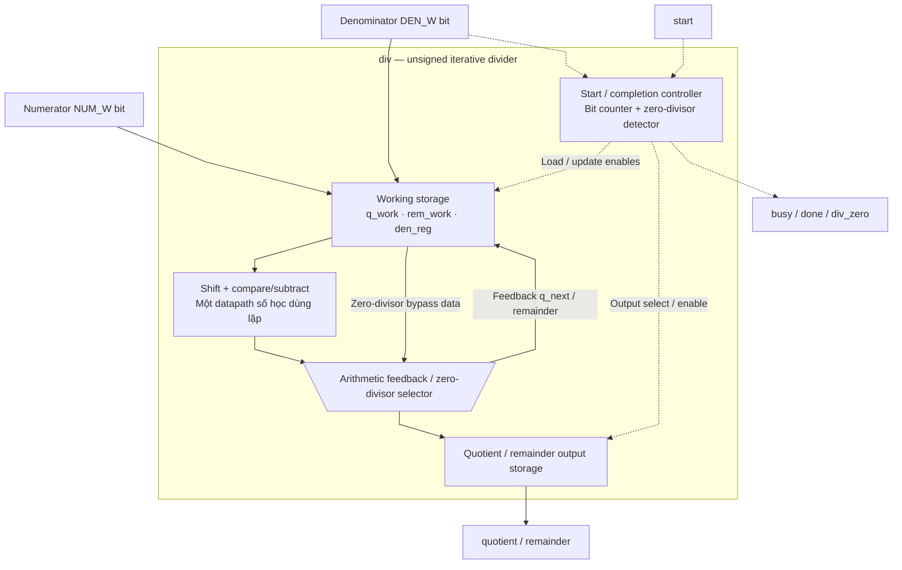
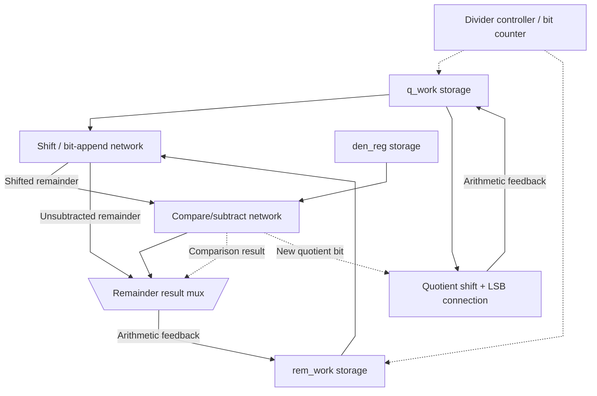

# div.sv — Divider unsigned tuần tự

[Tài liệu](../../README.md) → [Hierarchy RTL](../README.md) → [Mục lục từng file](README.md)

**Trạng thái:** Đang dùng — scalar nội bộ.

**Source:** [div.sv](<../../../Verilog%20Source%20code/div.sv>). **Số dòng:** 72. **SHA-256:** `ddb1191f9879b7d3643d82a544ea14c30e7df999a3af5d913f354259363aa228`.

## Khối này làm gì?

Đây là divider unsigned kiểu restoring, không phải vector DIV instruction. Mỗi bước dịch một bit của numerator sang remainder, thử trừ denominator và sinh một bit quotient. Các instance NORM dùng NUM_W=55/DEN_W=32; scale_compose dùng NUM_W=48/DEN_W=25. Parameter mặc định 64/32 được giữ cho helper generic và verification.

## Sơ đồ kiến trúc tổng quan



MUX dùng hình thang rộng ở phía nhiều ngõ vào và thu hẹp về ngõ ra; decoder/demux dùng hình thang ngược lại, mở rộng về phía nhiều ngõ ra. Hình chữ nhật có các vạch ngang biểu diễn bộ nhớ hoặc bank descriptor. Các hình chữ nhật thường là datapath, thanh ghi đơn hoặc giao diện. Nét liền là đường dữ liệu, nét đứt là điều khiển/cấu hình. Mũi tên hồi tiếp biểu diễn kết nối phần cứng. Sơ đồ không biểu diễn thứ tự chu kỳ, trạng thái FSM hoặc các tầng pipeline CPU.

## Cách hoạt động chi tiết

Start khi rảnh chốt numerator/denominator. Mỗi cycle busy tiến một bit, sau NUM_W bước trả quotient/remainder và done. Chia0 trả quotient toàn1, remainder nhận numerator cast về DEN_W bit, div_zero=1; caller phải xử lý cờ lỗi, không dùng đó như kết quả toán học hợp lệ.

1. Divider là unsigned; phép signed phải xử lý dấu/magnitude ở caller. Start chỉ được nhận khi không busy.
2. `q_work` ban đầu chứa numerator. Mỗi chu kỳ, một bit được kéo sang `rem_shift`.
3. Nếu remainder đủ lớn, phần cứng trừ denominator và đặt quotient bit mới bằng 1; ngược lại bit mới bằng 0.
4. Sau NUM_W bước, quotient và remainder cuối được chốt cùng pulse done.
5. Chia zero kết thúc ngay với `div_zero=1`; quotient toàn 1 chỉ là quy ước phần cứng, không phải thương hợp lệ.

**Quy ước RTL.** Counter khởi tạo bằng `CW'(NUM_W)` để chỉ rõ độ rộng chứa số bước; vòng lặp làm việc với NUM_W bit numerator. Remainder của chia zero dùng `DEN_W'(numerator)`, tránh part-select vượt range khi denominator rộng hơn numerator. Divider vẫn trả quotient/remainder bằng thuật toán tuần tự; divide-by-zero và giao tiếp start/busy/done không đổi.

## Các nhóm logic trong source

Source được chia theo chức năng. Mỗi nhóm giữ nguyên phạm vi dòng để đối chiếu, nhưng phần giải thích tập trung vào quan hệ giữa các câu lệnh thay vì lặp lại từng dấu ngoặc, khai báo hoặc phép gán.


### [Dòng 1–25: Giao diện và độ rộng](<../../../Verilog%20Source%20code/div.sv#L1>)

<!-- source-range:1:25 -->
```systemverilog
// Small sequential unsigned divider used by the scalar unit.
// Signed operations are formed outside this block from magnitudes/signs.
module div #(
    parameter int NUM_W = 64,
    parameter int DEN_W = 32
) (
    input logic clk,
    input logic rst_n,
    input logic start,
    input logic [NUM_W - 1 : 0] numerator,
    input logic [DEN_W - 1 : 0] denominator,
    output logic busy,
    output logic done,
    output logic div_zero,
    output logic [NUM_W - 1 : 0] quotient,
    output logic [DEN_W - 1 : 0] remainder
);
    localparam int CW = $clog2(NUM_W + 1);
    logic [NUM_W - 1 : 0] q_work;
    logic [DEN_W : 0] rem_work;
    logic [DEN_W - 1 : 0] den_reg;
    logic [CW - 1 : 0] count;
    logic [DEN_W : 0] rem_shift;
    logic [NUM_W - 1 : 0] q_next;
    logic [DEN_W + 1 : 0] difference;
```

**Mục đích.** Remainder trung gian rộng DEN_W+1 để không mất carry khi dịch.

**Cách phần code hoạt động.** Nhóm này định nghĩa giao diện, độ rộng, kiểu hoặc tín hiệu trung gian. Nó tạo cấu trúc để các nhóm xử lý sau sử dụng, chưa tự biểu diễn một bước runtime riêng.

**Tín hiệu và dữ liệu chính.** `start`: yêu cầu bắt đầu giao dịch; `numerator`: tử số phép chia; `denominator`: mẫu số phép chia; `busy`: khối đang xử lý; `done`: xung báo hoàn tất; `div_zero`: divider báo mẫu bằng 0; và 8 tín hiệu phụ khác trong đoạn code.


### [Dòng 26–37: Một bước chia](<../../../Verilog%20Source%20code/div.sv#L26>)

<!-- source-range:26:37 -->
```systemverilog

    always_comb begin
        rem_shift = {rem_work[DEN_W - 1 : 0], q_work[NUM_W - 1]};
        q_next = q_work << 1;
        // One extended subtraction provides both the borrow and remainder.
        // A separate magnitude comparator would precede the same carry chain.
        difference = {1'b0, rem_shift} - {2'b00, den_reg};
        if (!difference[DEN_W + 1]) begin
            rem_shift = difference[DEN_W : 0];
            q_next[0] = 1'b1;
        end
    end
```

**Mục đích.** Dịch remainder và quotient, nếu đủ lớn thì trừ mẫu và đặt bit quotient mới=1.

**Cách phần code hoạt động.** Có logic tổ hợp: output/intermediate được tính từ input hiện tại; các giá trị mặc định đầu khối giúp tránh suy ra latch.

**Tín hiệu và dữ liệu chính.** `rem_shift`: remainder sau dịch/thử trừ ở bước hiện tại; `rem_work`: remainder đang tích lũy; `q_work`: thanh ghi numerator/quotient trong vòng chia; `q_next`: quotient sau một bước divider; `den_reg`: denominator đã chốt.

**Điểm cần đọc kỹ.** Đây là một bước của restoring division. `q_work` vừa giữ các bit numerator chưa xử lý, vừa dần trở thành quotient khi mỗi bit mới được dịch vào từ phía thấp.

#### Sơ đồ khối phần cứng của nhóm




### [Dòng 38–58: Reset/start](<../../../Verilog%20Source%20code/div.sv#L38>)

<!-- source-range:38:58 -->
```systemverilog

    always_ff @(posedge clk or negedge rst_n) begin
        if (!rst_n) begin
            busy <= 1'b0; done <= 1'b0; div_zero <= 1'b0;
            quotient <= '0; remainder <= '0; q_work <= '0;
            rem_work <= '0; den_reg <= '0; count <= '0;
        end else begin
            done <= 1'b0;
            if (start && !busy) begin
                div_zero <= (denominator == 0);
                if (denominator == 0) begin
                    quotient <= '1;
                    remainder <= DEN_W'(numerator);
                    done <= 1'b1;
                end else begin
                    busy <= 1'b1;
                    q_work <= numerator;
                    rem_work <= '0;
                    den_reg <= denominator;
                    count <= CW'(NUM_W);
                end
```

**Mục đích.** Bắt trường hợp denominator=0 trước vòng lặp; nếu hợp lệ giữ denominator và bộ đếm.

**Cách phần code hoạt động.** Có logic tuần tự: register/FSM chỉ cập nhật tại cạnh clock; nonblocking assignment đọc giá trị cũ ở vế phải rồi chốt đồng thời.

**Tín hiệu và dữ liệu chính.** `busy`: khối đang xử lý; `done`: xung báo hoàn tất; `div_zero`: divider báo mẫu bằng 0; `quotient`: thương; `remainder`: phần dư; `q_work`: thanh ghi numerator/quotient trong vòng chia; và 6 tín hiệu phụ khác trong đoạn code.


### [Dòng 59–72: Vòng lặp](<../../../Verilog%20Source%20code/div.sv#L59>)

<!-- source-range:59:72 -->
```systemverilog
            end else if (busy) begin
                q_work <= q_next;
                rem_work <= rem_shift;
                count <= count - 1'b1;
                if (count == 1) begin
                    busy <= 1'b0;
                    done <= 1'b1;
                    quotient <= q_next;
                    remainder <= rem_shift[DEN_W - 1 : 0];
                end
            end
        end
    end
endmodule
```

**Mục đích.** Chốt q_next/rem_shift, giảm count. Khi count cũ=1, xuất kết quả của bước cuối.

**Cách phần code hoạt động.** Các câu lệnh thuộc cùng một nhánh/pha xử lý và phải được đọc liền nhau; tách riêng từng dòng sẽ làm mất quan hệ điều kiện và dữ liệu.

**Tín hiệu và dữ liệu chính.** `busy`: khối đang xử lý; `q_work`: thanh ghi numerator/quotient trong vòng chia; `q_next`: quotient sau một bước divider; `rem_work`: remainder đang tích lũy; `rem_shift`: remainder sau dịch/thử trừ ở bước hiện tại; `count`: bộ đếm bước lặp; và 3 tín hiệu phụ khác trong đoạn code.
