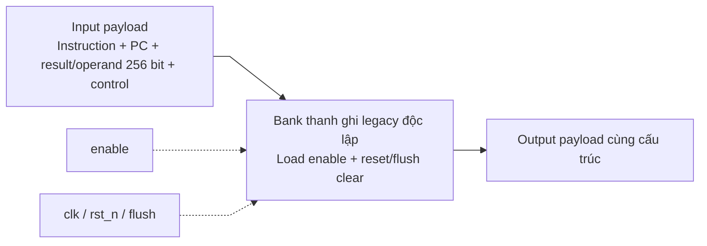

# em_reg.sv — Pipeline register Execute → Memory

[Tài liệu](../../README.md) → [Hierarchy RTL](../README.md) → [Mục lục từng file](README.md)

**Trạng thái:** Legacy — không nối vào matmulfree hiện tại.

**Source:** [em_reg.sv](<../../../Verilog%20Source%20code/em_reg.sv>). **Số dòng:** 10. **SHA-256:** `5e57748e00ff223653210e970a6a8e6d95ba124fc023c6b92b368daa692cb9ee`.

## Khối này làm gì?

File giữ ALU result, operand256 bit, instruction và control giữa stage Execute và Memory của cấu trúc pipeline cũ. Bản đang nằm trong source đã đổi payload liên quan sang256 bit, nên cũng không phải nguyên văn source thesis. Scheduler v2 không instantiate file này.

## Sơ đồ kiến trúc tổng quan



MUX dùng hình thang rộng ở phía nhiều ngõ vào và thu hẹp về ngõ ra; decoder/demux dùng hình thang ngược lại, mở rộng về phía nhiều ngõ ra. Hình chữ nhật có các vạch ngang biểu diễn bộ nhớ hoặc bank descriptor. Các hình chữ nhật thường là datapath, thanh ghi đơn hoặc giao diện. Nét liền là đường dữ liệu, nét đứt là điều khiển/cấu hình. Mũi tên hồi tiếp biểu diễn kết nối phần cứng. Sơ đồ không biểu diễn thứ tự chu kỳ, trạng thái FSM hoặc các tầng pipeline CPU. Sơ đồ riêng của module legacy/helper; module này không được instantiate trong hierarchy matmulfree hiện tại.

## Cách hoạt động chi tiết

Ở posedge clk, enable=1 cho phép chép toàn bộ input sang output. Nếu reset hoặc flush, output về 0; reset active-low asynchronous, flush synchronous và ưu tiên hơn enable. Khi enable=0, thanh ghi giữ nguyên. Các assignment nằm cùng dòng vẫn là cập nhật song song tại một cạnh clock.

1. Module chốt ALU result, operand, instruction, PC và control từ Execute sang Memory.
2. Flush/reset đưa control read/write về zero để không phát transaction ngoài ý muốn.
3. Enable bằng 1 truyền payload; enable bằng 0 giữ giá trị.
4. Source hiện dùng payload 256 bit, nhưng top single-issue không dùng stage này.

## Các nhóm logic trong source

Source được chia theo chức năng. Mỗi nhóm giữ nguyên phạm vi dòng để đối chiếu, nhưng phần giải thích tập trung vào quan hệ giữa các câu lệnh thay vì lặp lại từng dấu ngoặc, khai báo hoặc phép gán.


### [Dòng 1–10: Giao diện và register](<../../../Verilog%20Source%20code/em_reg.sv#L1>)

<!-- source-range:1:10 -->
```systemverilog
module em_reg(
    input logic clk, rst_n, enable, flush, input logic [12:0] instr_em,
    input logic [255:0] alu_out_em, reg_out_0_em, input logic reg_wr_en_em, mem_wr_en_em, mem_rd_en_em_0, mem_rd_en_em_1, input logic wb_sel_em, input logic [8:0] pc_em,
    output logic [12:0] instr_mw, output logic [255:0] alu_out_mw, reg_out_0_mw, output logic reg_wr_en_mw, mem_wr_en_mw, mem_rd_en_mw_0, mem_rd_en_mw_1, output logic wb_sel_mw, output logic [8:0] pc_mw
);
    always_ff @(posedge clk or negedge rst_n) begin
        if (!rst_n || flush) begin instr_mw <= 0;alu_out_mw <= 0;reg_out_0_mw <= 0;reg_wr_en_mw <= 0;mem_wr_en_mw <= 0;mem_rd_en_mw_0 <= 0;mem_rd_en_mw_1 <= 0;wb_sel_mw <= 0;pc_mw <= 0;end
        else if (enable) begin instr_mw <= instr_em;alu_out_mw <= alu_out_em;reg_out_0_mw <= reg_out_0_em;reg_wr_en_mw <= reg_wr_en_em;mem_wr_en_mw <= mem_wr_en_em;mem_rd_en_mw_0 <= mem_rd_en_em_0;mem_rd_en_mw_1 <= mem_rd_en_em_1;wb_sel_mw <= wb_sel_em;pc_mw <= pc_em;end
    end
endmodule
```

**Mục đích.** Các suffix của tín hiệu là tên giữ lại từ pipeline cũ. Sự có mặt của file không chứng minh top hiện tại có stage tương ứng.

**Cách phần code hoạt động.** Có logic tuần tự: register/FSM chỉ cập nhật tại cạnh clock; nonblocking assignment đọc giá trị cũ ở vế phải rồi chốt đồng thời.

**Tín hiệu và dữ liệu chính.** `enable`: cho phép pipeline register nhận input; `flush`: xóa payload/control của pipeline register.
