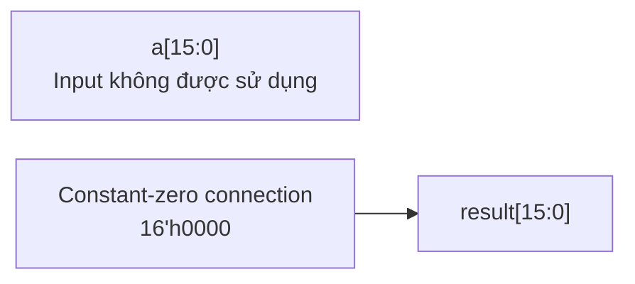

# exp.sv — EXP stub

[Tài liệu](../../README.md) → [Hierarchy RTL](../README.md) → [Mục lục từng file](README.md)

**Trạng thái:** Legacy — không phải exp có thể sử dụng.

**Source:** [exp.sv](<../../../Verilog%20Source%20code/exp.sv>). **Số dòng:** 8. **SHA-256:** `d94cf43353c33633ec7a30fbf3def2e0841a669492ec876d660c446ef7d11529`.

## Khối này làm gì?

Module có tên exp_row, nhận a16 bit nhưng luôn trả 0. Đây là stub để đường instantiate lịch sử không ra X; không tính e^a và không thay được EXP trong model.

## Sơ đồ kiến trúc tổng quan



MUX dùng hình thang rộng ở phía nhiều ngõ vào và thu hẹp về ngõ ra; decoder/demux dùng hình thang ngược lại, mở rộng về phía nhiều ngõ ra. Hình chữ nhật có các vạch ngang biểu diễn bộ nhớ hoặc bank descriptor. Các hình chữ nhật thường là datapath, thanh ghi đơn hoặc giao diện. Nét liền là đường dữ liệu, nét đứt là điều khiển/cấu hình. Mũi tên hồi tiếp biểu diễn kết nối phần cứng. Sơ đồ không biểu diễn thứ tự chu kỳ, trạng thái FSM hoặc các tầng pipeline CPU. Sơ đồ riêng của module legacy/helper; module này không được instantiate trong hierarchy matmulfree hiện tại.

## Cách hoạt động chi tiết

Scheduler từ chối opcode EXP. Greedy argmax có thể không cần softmax ở đầu ra, nhưng điều đó không có nghĩa mọi model đều không cần exp ở các operator khác.

1. Input A được giữ để tương thích interface nhưng không tham gia tính toán.
2. Result luôn zero để simulation/synthesis có đầu ra xác định nếu module bị gọi nhầm.
3. Không có ROM, polynomial hay exponential datapath; scheduler từ chối opcode EXP.
4. Greedy argmax không cần softmax không có nghĩa mọi model đều không cần EXP ở operator khác.

## Các nhóm logic trong source

Source được chia theo chức năng. Mỗi nhóm giữ nguyên phạm vi dòng để đối chiếu, nhưng phần giải thích tập trung vào quan hệ giữa các câu lệnh thay vì lặp lại từng dấu ngoặc, khai báo hoặc phép gán.


### [Dòng 1–8: Stub xác định](<../../../Verilog%20Source%20code/exp.sv#L1>)

<!-- source-range:1:8 -->
```systemverilog
module exp_row(
    input logic [15:0] a,
    output logic [15:0] result
);
    // EXP is not implemented in the ASIC baseline. Greedy decoding does not need softmax.
    // Drive zero so accidental legacy instantiation is deterministic.
    always_comb result = 16'h0000;
endmodule
```

**Mục đích.** Input a không dùng; result hằng0. Không có LUT exp trong đường inference hiện tại.

**Cách phần code hoạt động.** Có logic tổ hợp: output/intermediate được tính từ input hiện tại; các giá trị mặc định đầu khối giúp tránh suy ra latch.

**Tín hiệu và dữ liệu chính.** `a`: operand A; `result`: kết quả đã saturation.

