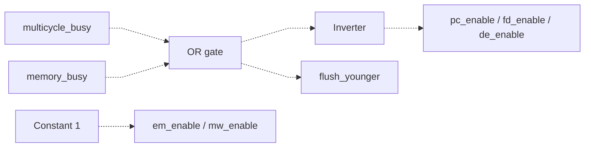

# hazard_detect.sv — Control stall/flush kiểu cũ

[Tài liệu](../../README.md) → [Hierarchy RTL](../README.md) → [Mục lục từng file](README.md)

**Trạng thái:** Legacy — không dùng trong top hiện tại.

**Source:** [hazard_detect.sv](<../../../Verilog%20Source%20code/hazard_detect.sv>). **Số dòng:** 12. **SHA-256:** `83e4434faa221906913debcd24e6a6db7366f15fe4d3e7ed37f06ec9f31991b5`.

## Khối này làm gì?

Module chỉ tạo enable/flush dựa trên hai cờ busy. Nó không có logic so sánh ID source/destination hay forwarding. Đừng đọc tên file rồi suy ra đây là hazard unit hoàn chỉnh.

## Sơ đồ kiến trúc tổng quan



MUX dùng hình thang rộng ở phía nhiều ngõ vào và thu hẹp về ngõ ra; decoder/demux dùng hình thang ngược lại, mở rộng về phía nhiều ngõ ra. Hình chữ nhật có các vạch ngang biểu diễn bộ nhớ hoặc bank descriptor. Các hình chữ nhật thường là datapath, thanh ghi đơn hoặc giao diện. Nét liền là đường dữ liệu, nét đứt là điều khiển/cấu hình. Mũi tên hồi tiếp biểu diễn kết nối phần cứng. Sơ đồ không biểu diễn thứ tự chu kỳ, trạng thái FSM hoặc các tầng pipeline CPU. Sơ đồ riêng của module legacy/helper; module này không được instantiate trong hierarchy matmulfree hiện tại.

## Cách hoạt động chi tiết

Khi multicycle_busy hoặc memory_busy, chặn PC/FD/DE, vẫn cho EM/MW chạy và đặt flush_younger. Scheduler single-issue hiện không nối các output này.

1. `multicycle_busy` hoặc `memory_busy` đều chặn PC/FD/DE.
2. EM/MW vẫn enable để instruction già hơn thoát pipeline khi stage trẻ dừng.
3. Cùng điều kiện busy đặt `flush_younger`; module không so register ID và không forwarding.
4. V2 chờ từng instruction nên không dùng module này.

## Các nhóm logic trong source

Source được chia theo chức năng. Mỗi nhóm giữ nguyên phạm vi dòng để đối chiếu, nhưng phần giải thích tập trung vào quan hệ giữa các câu lệnh thay vì lặp lại từng dấu ngoặc, khai báo hoặc phép gán.


### [Dòng 1–12: Control tổ hợp](<../../../Verilog%20Source%20code/hazard_detect.sv#L1>)

<!-- source-range:1:12 -->
```systemverilog
module hazard_detect(
    input logic multicycle_busy,
    input logic memory_busy,
    output logic pc_enable, fd_enable, de_enable, em_enable, mw_enable,
    output logic flush_younger
);
    always_comb begin
        pc_enable = !(multicycle_busy || memory_busy);
        fd_enable = pc_enable;de_enable = pc_enable;em_enable = 1'b1;mw_enable = 1'b1;
        flush_younger = multicycle_busy || memory_busy;
    end
endmodule
```

**Mục đích.** Các output chỉ phụ thuộc busy; không giữ state.

**Cách phần code hoạt động.** Có logic tổ hợp: output/intermediate được tính từ input hiện tại; các giá trị mặc định đầu khối giúp tránh suy ra latch.

**Tín hiệu và dữ liệu chính.** `flush_younger`: yêu cầu flush các instruction trẻ trong control legacy.

