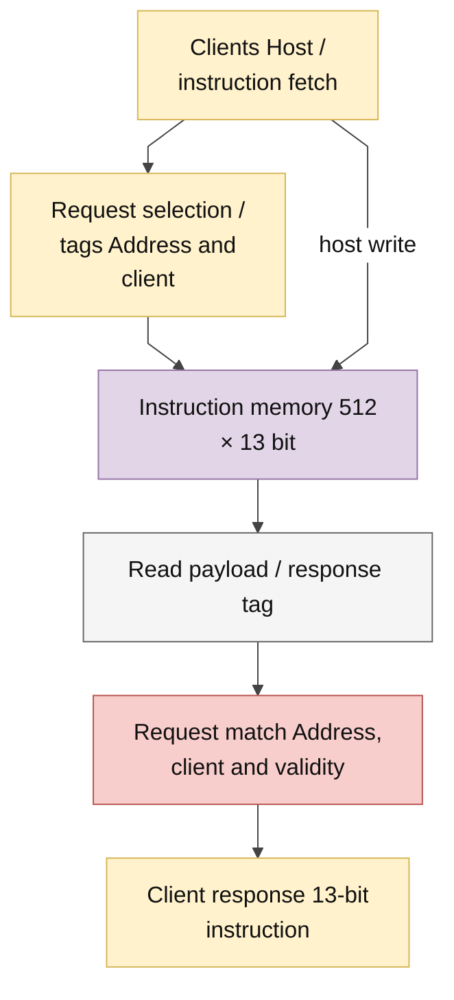

# ins_mem.sv — Instruction RAM và fetch/host valid

> **Category: GUIDE. Scope: LEGACY.** RTL is authoritative; diagrams use the [shared visual style](../../diagrams/diagram_style.md).
[Tài liệu](../../README.md) → [Hierarchy RTL](<../legacy/README.md>) → [Mục lục từng file](README.md)

**Trạng thái:** Đang dùng.

**Source:** [ins_mem.sv](<../../../Verilog%20Source%20code/ins_mem.sv>).

## At a glance

| Item | Description |
|---|---|
| Responsibility | Memory 512×13 bit do host nạp, không reset hoặc initialize nội dung. Một cổng đọc đồng bộ dùng chung cho fetch và host có tag/valid; top chặn host khi running và scheduler chờ `instr_valid`. Simulation và synthesis dùng cùng RTL và cùng latency, không phụ thuộc define hoặc thuộc tính memory của hãng. Reset chỉ xóa control/tag; host phải nạp chương trình hợp lệ và HALT trước khi start. |

## Sơ đồ kiến trúc tổng quan

Nét liền là dữ liệu, nét đứt là điều khiển và địa chỉ. Memory và read data register không có reset bất đồng bộ. Sơ đồ mô tả storage logic, không quy định macro vật lý.

## Main flow

1. Host write tại cạnh lên khi rst_n, host_en và host_we. Top chỉ chấp nhận khi core idle.
2. Một request read ổn định qua hai cạnh lên: cạnh đầu chốt address/client, cạnh thứ hai chốt RAM data và response tag. Valid chỉ lên khi request hiện tại, request tag và response tag cùng địa chỉ/client.
3. Fetch valid chỉ có khi fetch_en đang giữ. Scheduler ở S_FETCH đến khi valid rồi chốt instr_q ở cạnh tiếp theo. Fetch dùng cùng hai cạnh lên của hợp đồng bộ nhớ trong mọi build.
4. Cổng host của RAM giữ en, we=0 và address đến host_rvalid; frontend top chốt request/response rồi trả host_ready sau bốn cạnh lên cho host ngoài. Write, idle hoặc đổi client làm response cũ mất hiệu lực; đọc lại cùng địa chỉ sau write vẫn phải chờ.
5. Memory và read data register không reset; reset xóa tag/control nên response trước reset mất hiệu lực. Không được dùng data khi valid=0.
6. Test độc lập kiểm tra toàn bộ 512 địa chỉ, chuyển client, overwrite/re-read, restart cùng PC và reset không xóa contents. Test top đi đến PC=511, restart và lỗi khi chương trình cố đi qua PC cuối.

## Important state / datapath groups

Các đoạn dưới đây bao phủ nguyên văn toàn bộ source hiện tại, theo thứ tự dòng.

### [Dòng 1–19: Giao diện, memory và tag registers](<../../../Verilog%20Source%20code/ins_mem.sv#L1>)

**Mục đích.** Địa chỉ U9 chọn một trong 512 instruction 13 bit. Hai client có enable/valid riêng nhưng chia sẻ memory và read data register. Tag chứa địa chỉ/client để response chỉ acknowledge đúng request hiện tại.

### [Dòng 20–28: Host write và đọc memory đồng bộ](<../../../Verilog%20Source%20code/ins_mem.sv#L20>)

**Cách hoạt động.** Host write được chốt tại cạnh lên khi reset đã nhả và request write hợp lệ. Read dùng địa chỉ chốt ở cạnh trước; `read_pending_q` bật capture dữ liệu. Memory không initialize hoặc reset, read data register không asynchronous reset.

### [Dòng 29–37: Dữ liệu chung và valid theo client](<../../../Verilog%20Source%20code/ins_mem.sv#L29>)

**Cách hoạt động.** Cùng `read_data_q` lái cả output instruction. Valid chọn client phù hợp và yêu cầu hai tag cùng địa chỉ hiện tại. Fetch valid còn yêu cầu `fetch_en`; host valid yêu cầu read đang giữ. Data có thể còn giá trị cũ nhưng không được tiêu thụ khi valid=0.

### [Dòng 38–61: Chốt request, chuyển response và reset](<../../../Verilog%20Source%20code/ins_mem.sv#L38>)

**Cách hoạt động.** Reset chỉ xóa control/tag. Cạnh lên chuyển request tag sang response và lấy request host read hoặc fetch mới. Khi request đổi địa chỉ hoặc client, response cũ không khớp nên phải đợi đủ hai cạnh lên. Top giữ host và fetch loại trừ nhau; priority host trong mux không tạo một cổng đọc thứ hai.
