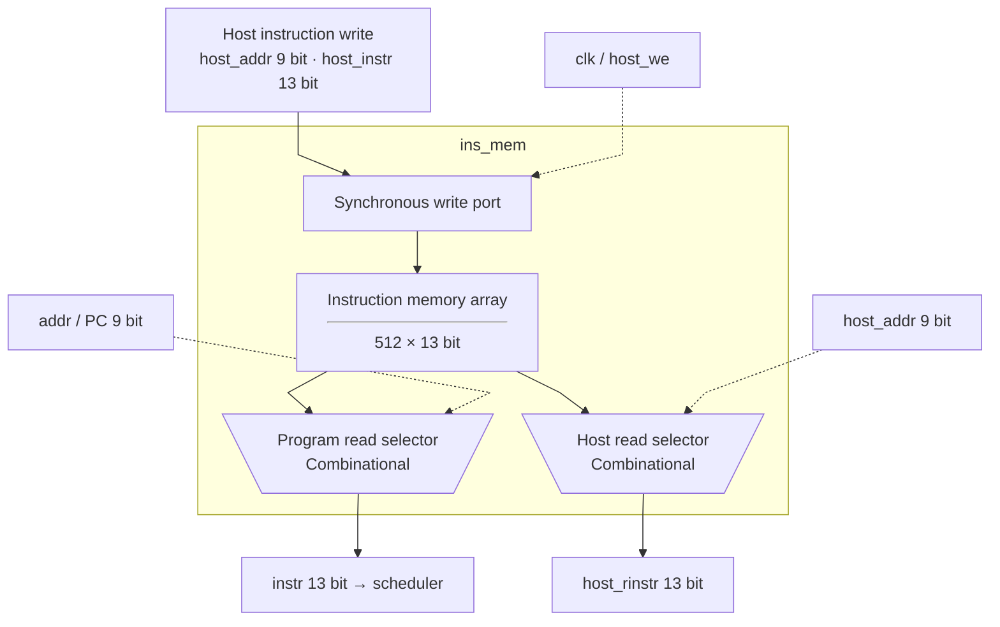

# ins_mem.sv — Instruction memory do host nạp

[Về mục lục](README.md) · [Về tổng quan](../README.md)

**Trạng thái:** Đang dùng.

**Source:** [ins_mem.sv](<../../../Verilog%20Source%20code/ins_mem.sv>). **Số dòng:** 17. **SHA-256:** `f0731fbb4f9afede319f07e24a137243a99f328d67efe79d47b5b636c63eb496`.

## Khối này làm gì?

Mảng512×13 bit có fetch read và host read combinational, host write synchronous. Không có chương trình mặc định và không reset memory. Cần nạp HALT trước khi start.

## Sơ đồ kiến trúc tổng quan



MUX dùng hình thang rộng ở phía nhiều ngõ vào và thu hẹp về ngõ ra; decoder/demux dùng hình thang ngược lại, mở rộng về phía nhiều ngõ ra. Hình chữ nhật có các vạch ngang biểu diễn bộ nhớ hoặc bank descriptor. Các hình chữ nhật thường là datapath, thanh ghi đơn hoặc giao diện. Nét liền là đường dữ liệu, nét đứt là điều khiển/cấu hình. Mũi tên hồi tiếp biểu diễn kết nối phần cứng. Sơ đồ không biểu diễn thứ tự chu kỳ, trạng thái FSM hoặc các tầng pipeline CPU.

## Cách hoạt động chi tiết

PC trực tiếp chọn mem[addr]. Host nạp host_instr tại host_addr khi host_we. Top chặn host write lúc running. Khi đưa vào ASIC, cần chọn implementation cho hai đường read này hoặc bridge tương ứng.

1. Memory chứa 512 instruction 13 bit, không reset hay initialize nên host phải nạp chương trình và HALT.
2. Fetch read là tổ hợp theo PC; scheduler chốt instruction vào `instr_q`.
3. Host có read tổ hợp để kiểm tra và write synchronous tại cạnh clock.
4. Hai đường read của behavioral model cần được xem lại khi ánh xạ sang ROM/SRAM macro ASIC.

## Các nhóm logic trong source

Source được chia theo chức năng. Mỗi nhóm giữ nguyên phạm vi dòng để đối chiếu, nhưng phần giải thích tập trung vào quan hệ giữa các câu lệnh thay vì lặp lại từng dấu ngoặc, khai báo hoặc phép gán.


### [Dòng 1–10: Giao diện và mảng](<../../../Verilog%20Source%20code/ins_mem.sv#L1>)

<!-- source-range:1:10 -->
```systemverilog
module ins_mem(
    input logic clk,
    input logic [8:0] addr,
    output logic [12:0] instr,
    input logic host_we,
    input logic [8:0] host_addr,
    input logic [12:0] host_instr,
    output logic [12:0] host_rinstr
);
    logic [12:0] mem [0:511];
```

**Mục đích.** Địa chỉ9 bit, data instruction13 bit; dung lượng logic832 byte.

**Cách phần code hoạt động.** Nhóm này định nghĩa giao diện, độ rộng, kiểu hoặc tín hiệu trung gian. Nó tạo cấu trúc để các nhóm xử lý sau sử dụng, chưa tự biểu diễn một bước runtime riêng.

**Tín hiệu và dữ liệu chính.** `addr`: địa chỉ fetch instruction; `instr`: instruction đọc từ program; `host_we`: host chọn ghi thay vì đọc; `host_addr`: địa chỉ phía host; `host_instr`: instruction13 bit host ghi; `host_rinstr`: instruction13 bit trả host; và 1 tín hiệu phụ khác trong đoạn code.


### [Dòng 11–17: Đọc/ghi](<../../../Verilog%20Source%20code/ins_mem.sv#L11>)

<!-- source-range:11:17 -->
```systemverilog
    assign instr = mem[addr];
    assign host_rinstr = mem[host_addr];
    always_ff @(posedge clk) begin
        if (host_we)
            mem[host_addr] <= host_instr;
    end
endmodule
```

**Mục đích.** Read tổ hợp; write tại posedge clk. Không suy ra latency của SRAM macro từ model này.

**Cách phần code hoạt động.** Có logic tuần tự: register/FSM chỉ cập nhật tại cạnh clock; nonblocking assignment đọc giá trị cũ ở vế phải rồi chốt đồng thời. Có continuous assignment: biểu thức luôn lái tín hiệu đích, không cần start hoặc cạnh clock.

**Tín hiệu và dữ liệu chính.** `instr`: instruction đọc từ program; `mem`: array instruction512×13 bit; `addr`: địa chỉ fetch instruction; `host_rinstr`: instruction13 bit trả host; `host_addr`: địa chỉ phía host; `host_we`: host chọn ghi thay vì đọc; và 1 tín hiệu phụ khác trong đoạn code.

