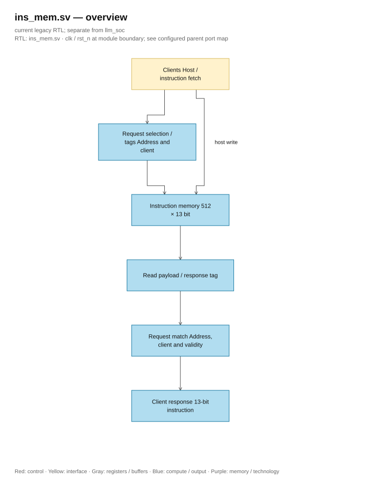

# ins_mem.sv — Instruction RAM and fetch/host valid

> **Category: GUIDE. Scope: LEGACY.** RTL is authoritative; diagrams use the [shared visual style](../../diagrams/diagram_style.md).
[Document](../../README.md) → [Hierarchy RTL](<../legacy/README.md>) → [File index](README.md)

**Status:** In use.

**Source:** [ins_mem.sv](<../../../Verilog%20Source%20code/ins_mem.sv>).

## At a glance

| Item | Description |
|---|---|
| Responsibility | Memory 512×13 bit loaded by host, does not reset or initialize contents. A synchronous read port shared for fetch and host with tag/valid; top blocks host when running and scheduler waits `instr_valid`. Simulation and synthesis use the same RTL and same latency, independent of define or vendor memory attributes. Reset only clears control/tag; host must load a valid program and HALT before start. |

## Overall architecture diagram

[Editable draw.io — ins_mem.sv — overview](../../diagrams/architecture.drawio) · Page `20_ins_mem.sv_1`.

Solid line is data, dashed line is control and address. Memory and read data register do not have asynchronous reset. The diagram describes storage logic, it does not specify physical macros.

## Main flow

1. Host writes on the rising edge when rst_n, host_en, and host_we. Top only accepts if core is idle.
2. A read request is stable over two rising edges: the first edge latches the address/client, the second edge latches RAM data and response tag. Valid is only high when the current request, request tag, and response tag have the same address/client.
3. Fetch is valid only when fetch_en is held. Scheduler stays in S_FETCH until valid, then latches instr_q on the next edge. Fetch uses the same two rising edges of the memory contract in all builds.
4. The RAM host port keeps en, we=0, and address until host_rvalid; the frontend top latches request/response and then returns host_ready after four rising edges to the external host. Write, idle, or switching client invalidates the old response; re-reading the same address after a write still must wait.
5. Memory and read data registers are not reset; reset clears tag/control so the response before reset becomes invalid. Data must not be used when valid=0.
6. Independent test checks all 512 addresses, switches client, overwrites/re-reads, restarts at the same PC, and reset does not clear contents. Top test goes to PC=511, restarts, and errors when the program tries to go past the last PC.

## Important state / datapath groups

The sections below cover the entire current source verbatim, in line order.

### [Lines 1–19: Interface, memory, and tag registers](<../../../Verilog%20Source%20code/ins_mem.sv#L1>)

**Purpose.** U9 address selects one of 512 13-bit instructions. Two clients have separate enable/valid but share memory and read data register. Tag contains address/client to respond only acknowledging the current request.

### [Lines 20–28: Host write and synchronous memory read](<../../../Verilog%20Source%20code/ins_mem.sv#L20>)

**Operation.** Host write is latched on the rising edge when reset is released and write request is valid. Read uses the address latched on the previous edge; `read_pending_q` enables data capture. Memory is not initialized or reset; read data register has no asynchronous reset.

### [Lines 29–37: General data and valid according to client](<../../../Verilog%20Source%20code/ins_mem.sv#L29>)

**Operation.** Together with `read_data_q` driving the entire output instruction. Valid selects the appropriate client and requests two tags at the current address. Fetch valid still requires `fetch_en`; host valid requires read being held. Data may still have old values but must not be consumed when valid=0.

### [Lines 38–61: Latching request, transferring response, and reset](<../../../Verilog%20Source%20code/ins_mem.sv#L38>)

**How it works.** Reset only clears the control/tag. The rising edge moves the request tag to the response and gets a new request host read or fetch. When the request changes address or client, the old response does not match, so it is necessary to wait for both rising edges. The top keeps the host and fetch mutually exclusive; host priority in mux does not create a second read port.
