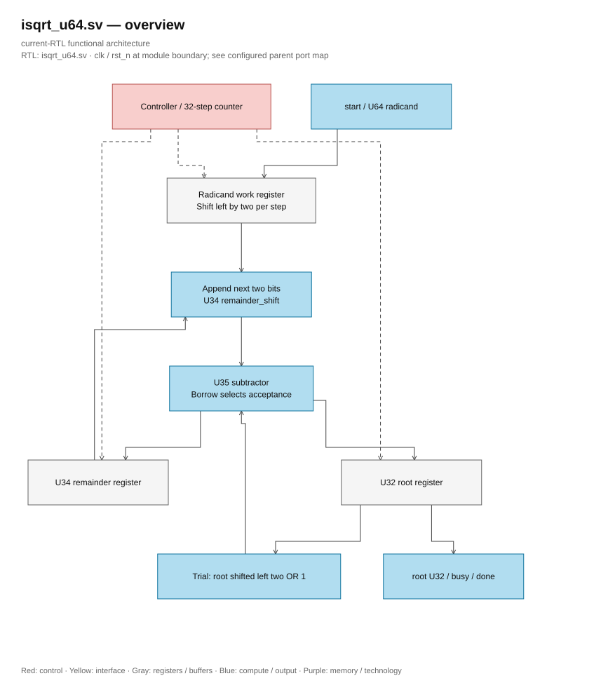

# isqrt_u64.sv

<!-- reading-navigation:start -->
[Documentation](../../README.md) → [02 · Architecture](../../02-architecture/README.md) → [Module catalog](README.md)

| Reading guide | Document |
|---|---|
| New to the subject | [NPU and RTL fundamentals](../../00-start-here/fundamentals.md) · [Glossary](../../00-start-here/glossary.md) |
| Read first | [Full RTL graph](../full_graph.md) |
| Related implementation | [llm_soc.sv](llm_soc.sv.md) |
<!-- reading-navigation:end -->

> **Category: GUIDE. Scope: CURRENT (may also have legacy callers).** RTL is authoritative; diagrams use the [shared visual style](../../diagrams/diagram_style.md).

**Source:** [isqrt_u64.sv](<../../../Verilog%20Source%20code/isqrt_u64.sv>).

## At a glance

| Item | Description |
|---|---|
| Responsibility | Unsigned floor square root with 32 radix-four iterations. Append two radicand bits per step; one U35 subtractor supplies the trial remainder and borrow decision. Root and remainder feedback are explicit registers. start is accepted only when idle; busy/done frame the result. |

## Architecture diagram

[Editable draw.io — isqrt_u64.sv — overview](../../diagrams/architecture.drawio) · Page `21_isqrt_u64.sv_1`.
