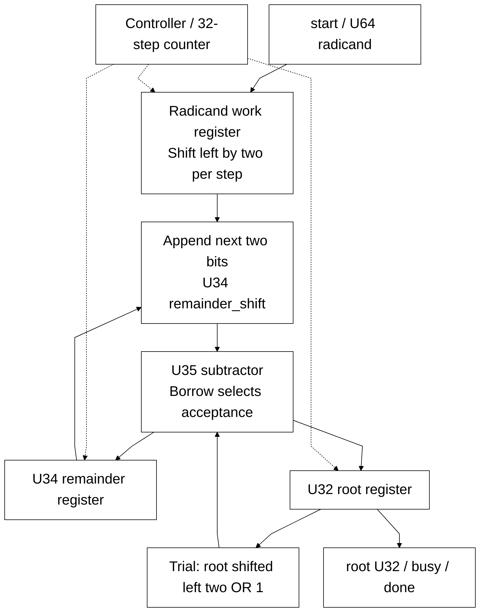

# isqrt_u64.sv

[Documentation](../../README.md) → [Source guide](../full_graph.md) → [RTL index](README.md)

**Source:** [isqrt_u64.sv](<../../../Verilog%20Source%20code/isqrt_u64.sv>). **Số dòng:** 60. **SHA-256:** `c20371b0abf819e3a6011c63a908c21970bba45fa4846af86584847cfe70c9e2`.

## Khối này làm gì?

Unsigned floor square root with 32 radix-four iterations. Append two radicand bits per step; one U35 subtractor supplies the trial remainder and borrow decision. Root and remainder feedback are explicit registers. start is accepted only when idle; busy/done frame the result.

## Sơ đồ kiến trúc



## Cách hoạt động chi tiết

Unsigned floor square root with 32 radix-four iterations. Append two radicand bits per step; one U35 subtractor supplies the trial remainder and borrow decision. Root and remainder feedback are explicit registers. start is accepted only when idle; busy/done frame the result.

## Các nhóm logic trong source

### [Dòng 1–14: Interface and working registers](<../../../Verilog%20Source%20code/isqrt_u64.sv#L1>)

<!-- source-range:1:14 -->
```systemverilog
module isqrt_u64 (
    input logic clk,
    input logic rst_n,
    input logic start,
    input logic [63:0] radicand,
    output logic busy,
    output logic done,
    output logic [31:0] root
);
    logic [63:0] radicand_work;
    logic [31:0] root_work, root_next;
    logic [33:0] remainder_work, remainder_next, remainder_shift, trial;
    logic [34:0] difference;
    logic [5:0] count;
```

### [Dòng 15–29: Trial subtraction and next arithmetic state](<../../../Verilog%20Source%20code/isqrt_u64.sv#L15>)

<!-- source-range:15:29 -->
```systemverilog
    always_comb begin
        // Before iteration 32, root_work < 2^31 and remainder_work <=
        // 2*root_work. Two new radicand bits therefore fit in U34.
        remainder_shift = {remainder_work[31:0], radicand_work[63:62]};
        trial = {root_work, 2'b01}; // 4*root_work + 1
        difference = {1'b0, remainder_shift} - {1'b0, trial};
        // The extra subtraction bit is the borrow flag; share one subtractor
        // for the trial comparison and accepted remainder update.
        root_next = {root_work[30:0], 1'b0};
        remainder_next = remainder_shift;
        if (!difference[34]) begin
            root_next[0] = 1'b1;
            remainder_next = difference[33:0];
        end
    end
```

### [Dòng 30–60: Start, iteration and completion control](<../../../Verilog%20Source%20code/isqrt_u64.sv#L30>)

<!-- source-range:30:60 -->
```systemverilog
    always_ff @(posedge clk or negedge rst_n) begin
        if (!rst_n) begin
            busy <= 0;
            done <= 0;
            root <= '0;
            radicand_work <= '0;
            root_work <= '0;
            remainder_work <= '0;
            count <= '0;
        end else begin
            done <= 1'b0;
            if (start && !busy) begin
                radicand_work <= radicand;
                root_work <= '0;
                remainder_work <= '0;
                count <= 6'd32;
                busy <= 1'b1;
            end else if (busy) begin
                radicand_work <= radicand_work << 2;
                root_work <= root_next;
                remainder_work <= remainder_next;
                count <= count - 1'b1;
                if (count == 1) begin
                    busy <= 1'b0;
                    done <= 1'b1;
                    root <= root_next;
                end
            end
        end
    end
endmodule
```
