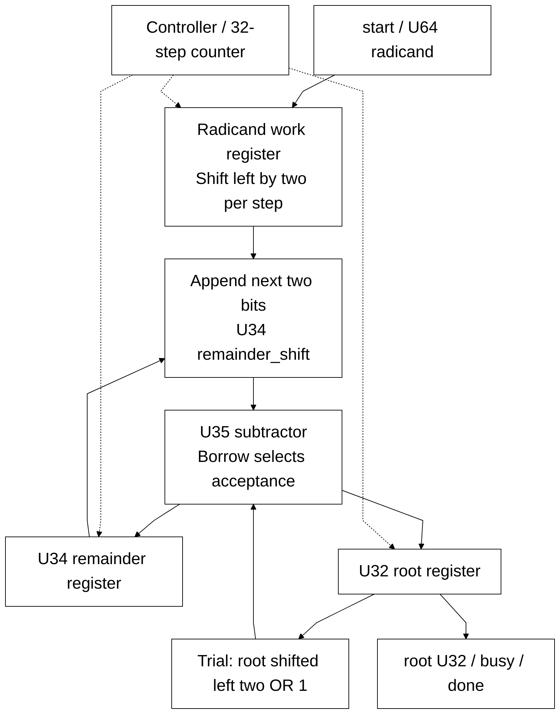

# isqrt_u64.sv

> **Category: GUIDE. Scope: CURRENT (may also have legacy callers).** RTL is authoritative; diagrams are preserved from the existing guide.
[Documentation](../../README.md) → [Source guide](../full_graph.md) → [RTL index](README.md)

**Source:** [isqrt_u64.sv](<../../../Verilog%20Source%20code/isqrt_u64.sv>).

## At a glance

| Item | Description |
|---|---|
| Responsibility | Unsigned floor square root with 32 radix-four iterations. Append two radicand bits per step; one U35 subtractor supplies the trial remainder and borrow decision. Root and remainder feedback are explicit registers. start is accepted only when idle; busy/done frame the result. |

## Sơ đồ kiến trúc

