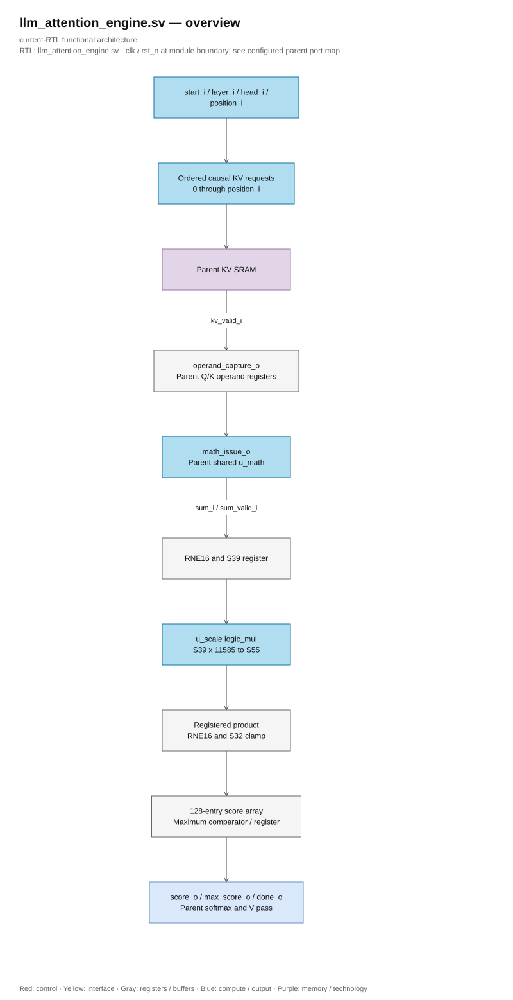

# llm_attention_engine.sv

> **Category: GUIDE. Scope: CURRENT (may also have legacy callers).** RTL is authoritative; diagrams use the [shared visual style](../../diagrams/diagram_style.md).
[Documentation](../../README.md) → [Source guide](../full_graph.md) → [RTL index](README.md)

**Source:** [llm_attention_engine.sv](<../../../Verilog%20Source%20code/llm_attention_engine.sv>).

## At a glance

| Item | Description |
|---|---|
| Responsibility | Issue ordered K-cache reads for positions zero through the current causal position. The parent captures Q/K operands and issues shared SIMD operations. Each sum is rounded by RNE16, narrowed to S39, structurally multiplied by 11585, then rounded by RNE16 and clamped to S32. The engine owns 128 scores and the running maximum; softmax and value accumulation stay in the parent. |

## Sơ đồ kiến trúc

[Editable draw.io — llm_attention_engine.sv — overview](../../diagrams/architecture.drawio) · Page `22_llm_attention_engine.sv_1`.
