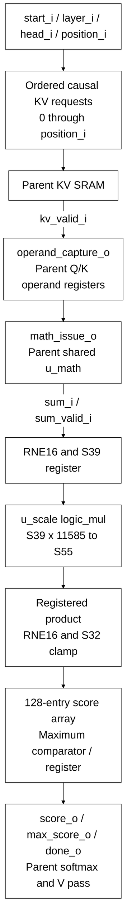

# llm_attention_engine.sv

[Documentation](../../README.md) → [Source guide](../full_graph.md) → [RTL index](README.md)

**Source:** [llm_attention_engine.sv](<../../../Verilog%20Source%20code/llm_attention_engine.sv>). **Số dòng:** 70. **SHA-256:** `4ed88adce8f72631d86adb900cb41ef264904e68e67199238ce517b0f7e2b838`.

## Khối này làm gì?

Issue ordered K-cache reads for positions zero through the current causal position. The parent captures Q/K operands and issues shared SIMD operations. Each sum is rounded by RNE16, narrowed to S39, structurally multiplied by 11585, then rounded by RNE16 and clamped to S32. The engine owns 128 scores and the running maximum; softmax and value accumulation stay in the parent.

## Sơ đồ kiến trúc



## Cách hoạt động chi tiết

Issue ordered K-cache reads for positions zero through the current causal position. The parent captures Q/K operands and issues shared SIMD operations. Each sum is rounded by RNE16, narrowed to S39, structurally multiplied by 11585, then rounded by RNE16 and clamped to S32. The engine owns 128 scores and the running maximum; softmax and value accumulation stay in the parent.

## Các nhóm logic trong source

### [Dòng 1–28: Interface and score storage](<../../../Verilog%20Source%20code/llm_attention_engine.sv#L1>)

<!-- source-range:1:28 -->
```systemverilog
// Ordered Q*K streaming pass. Score rounding and scaling exactly match the
// original two RNE steps and S39 narrowing. Softmax/value/normalization remain
// explicit parent operations, with a score array and maximum owned here.
module llm_attention_engine (
    input logic clk, rst_n, start_i, cancel_i,
    input logic [1:0] layer_i, head_i,
    input logic [6:0] position_i,
    output logic kv_req_o,
    output logic [11:0] kv_address_o,
    input logic kv_valid_i,
    output logic operand_capture_o, math_issue_o,
    input logic sum_valid_i,
    input logic signed [60:0] sum_i,
    input logic [6:0] score_address_i,
    output logic signed [31:0] score_o, max_score_o,
    output logic done_o
);
    import npu_pkg::*;
    logic active_q;
    logic [1:0] layer_q, head_q;
    logic [6:0] position_q;
    logic [7:0] request_q, response_q, score_q;
    logic signed [31:0] score_memory [0:127];
    logic [2:0] score_valid_q;
    logic signed [38:0] rounded_dot_q;
    logic signed [54:0] scaled_dot_q;
    wire [54:0] scaled_dot;
    logic signed [31:0] score_result_q;
```

### [Dòng 29–35: Scale multiplier and causal requests](<../../../Verilog%20Source%20code/llm_attention_engine.sv#L29>)

<!-- source-range:29:35 -->
```systemverilog
    logic_mul #(.A_W(39), .B_W(14), .OUT_W(55), .SIGNED_A(1), .SIGNED_B(0)) u_scale
        (.a(rounded_dot_q), .b(14'd11585), .product(scaled_dot));
    assign kv_req_o = active_q && request_q <= {1'b0, position_q};
    assign kv_address_o = {layer_q, request_q[6:0], 1'b0, head_q};
    assign operand_capture_o = active_q && kv_valid_i && response_q <= {1'b0, position_q};
    assign score_o = score_memory[score_address_i];
    always_ff @(posedge clk or negedge rst_n) begin
```

### [Dòng 36–55: Validity and completion](<../../../Verilog%20Source%20code/llm_attention_engine.sv#L36>)

<!-- source-range:36:55 -->
```systemverilog
        if (!rst_n) begin
            active_q <= 0; done_o <= 0; math_issue_o <= 0;
            request_q <= 0; response_q <= 0; score_q <= 0; score_valid_q <= 0;
        end else begin
            done_o <= 0;
            math_issue_o <= operand_capture_o;
            score_valid_q <= {score_valid_q[1:0], active_q && sum_valid_i};
            if (cancel_i) begin active_q <= 0; math_issue_o <= 0; score_valid_q <= 0; end
            else if (start_i && !active_q) begin
                active_q <= 1; request_q <= 0; response_q <= 0; score_q <= 0;
            end else if (active_q) begin
                if (kv_req_o) request_q <= request_q + 1'b1;
                if (operand_capture_o) response_q <= response_q + 1'b1;
                if (score_valid_q[2]) begin
                    score_q <= score_q + 1'b1;
                    if (score_q == {1'b0, position_q}) begin active_q <= 0; done_o <= 1; end
                end
            end
        end
    end
```

### [Dòng 56–70: Score rounding, array writes and maximum](<../../../Verilog%20Source%20code/llm_attention_engine.sv#L56>)

<!-- source-range:56:70 -->
```systemverilog
    always_ff @(posedge clk) begin
        rounded_dot_q <= 39'(rne_shift64(64'(sum_i), 6'd16));
        scaled_dot_q <= scaled_dot;
        score_result_q <= sat_s32(rne_shift64(64'(scaled_dot_q), 6'd16));
        if (rst_n && !cancel_i) begin
            if (start_i && !active_q) begin
                layer_q <= layer_i; head_q <= head_i; position_q <= position_i;
                max_score_o <= 32'sh80000000;
            end else if (active_q && score_valid_q[2]) begin
                score_memory[score_q[6:0]] <= score_result_q;
                if (score_result_q > max_score_o) max_score_o <= score_result_q;
            end
        end
    end
endmodule
```
