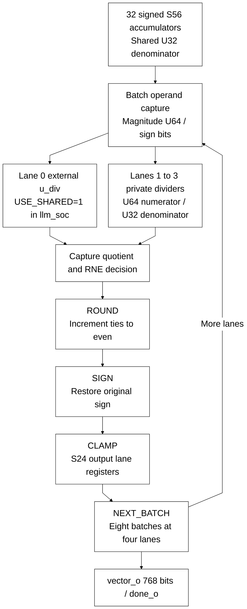

# llm_attention_normalize.sv

[Documentation](../../README.md) → [Source guide](../full_graph.md) → [RTL index](README.md)

**Source:** [llm_attention_normalize.sv](<../../../Verilog%20Source%20code/llm_attention_normalize.sv>). **Số dòng:** 95. **SHA-256:** `45d2264cabef1203bc6261bd10706274fa91d8fc02552301db02ef2d8574f0dd`.

## Khối này làm gì?

Normalize 32 signed accumulators in batches of DIV_LANES. In llm_soc, DIV_LANES=4 and USE_SHARED=1: lane zero is wired to top u_div and lanes one through three instantiate private dividers. Quotient/remainder capture, RNE, sign restoration and S24 clamp occupy separate stages. Standalone USE_SHARED=0 instantiates all dividers internally.

## Sơ đồ kiến trúc



## Cách hoạt động chi tiết

Normalize 32 signed accumulators in batches of DIV_LANES. In llm_soc, DIV_LANES=4 and USE_SHARED=1: lane zero is wired to top u_div and lanes one through three instantiate private dividers. Quotient/remainder capture, RNE, sign restoration and S24 clamp occupy separate stages. Standalone USE_SHARED=0 instantiates all dividers internally.

## Các nhóm logic trong source

### [Dòng 1–29: Interface, batching and payload](<../../../Verilog%20Source%20code/llm_attention_normalize.sv#L1>)

<!-- source-range:1:29 -->
```systemverilog
// Exact signed RNE normalization, four ordinary restoring dividers per batch.
// Quotient capture, rounding, sign restoration and S24 clamp have separate edges.
module llm_attention_normalize #(parameter int DIV_LANES = 4, parameter bit USE_SHARED = 0) (
    input logic clk, rst_n, start_i, cancel_i,
    input logic signed [55:0] accumulator_i [0:31],
    input logic [31:0] denominator_i,
    input logic shared_busy_i, shared_done_i,
    input logic [63:0] shared_quotient_i,
    input logic [31:0] shared_remainder_i,
    output logic [63:0] shared_numerator_o,
    output logic [31:0] shared_denominator_o,
    output logic ready_o, batch_start_o, done_o,
    output logic [767:0] vector_o
);
    genvar lane;
    import llm_pkg::*;
    localparam int BATCHES = 32 / DIV_LANES;
    localparam int SHIFT = $clog2(DIV_LANES);
    typedef enum logic [2:0] {IDLE, ISSUE, WAIT_DIV, ROUND, SIGN, CLAMP, NEXT_BATCH, DRAIN} state_t;
    state_t state;
    logic [4:0] batch_q;
    logic [31:0] denominator_q;
    logic [DIV_LANES - 1:0] divider_done, negative_q, round_q;
    wire [DIV_LANES - 1:0] divider_busy;
    logic [63:0] numerator_q [0:DIV_LANES - 1], quotient_q [0:DIV_LANES - 1];
    wire [63:0] quotient [0:DIV_LANES - 1];
    wire [31:0] remainder [0:DIV_LANES - 1];
    logic [63:0] rounded_q [0:DIV_LANES - 1];
    logic signed [63:0] signed_q [0:DIV_LANES - 1];
```

### [Dòng 30–54: Ready, cancellation and batch control](<../../../Verilog%20Source%20code/llm_attention_normalize.sv#L30>)

<!-- source-range:30:54 -->
```systemverilog
    assign shared_numerator_o = numerator_q[0];
    assign shared_denominator_o = denominator_q;
    assign batch_start_o = state == ISSUE;
    assign ready_o = rst_n && state == IDLE && !(|divider_busy);
    always_ff @(posedge clk or negedge rst_n) begin
        if (!rst_n) begin state <= IDLE; batch_q <= 0; done_o <= 0; end
        else begin
            done_o <= 0;
            if (cancel_i) state <= DRAIN;
            else case (state)
                IDLE: if (start_i && ready_o) begin batch_q <= 0; state <= ISSUE; end
                ISSUE: state <= WAIT_DIV;
                WAIT_DIV: if (&divider_done) state <= ROUND;
                ROUND: state <= SIGN;
                SIGN: state <= CLAMP;
                CLAMP: state <= NEXT_BATCH;
                NEXT_BATCH: if (batch_q == BATCHES - 1) begin done_o <= 1; state <= IDLE; end
                    else begin batch_q <= batch_q + 1'b1; state <= ISSUE; end
                DRAIN: if (!(|divider_busy)) state <= IDLE;
                default: state <= IDLE;
            endcase
        end
    end
    always_ff @(posedge clk)
        if (rst_n && !cancel_i && ready_o && start_i) denominator_q <= denominator_i;
```

### [Dòng 55–88: Conditional shared/private dividers](<../../../Verilog%20Source%20code/llm_attention_normalize.sv#L55>)

<!-- source-range:55:88 -->
```systemverilog
    generate
    for (lane = 0; lane < DIV_LANES; lane = lane + 1) begin : g_divider
        wire signed [55:0] next_selected = accumulator_i[(int'(batch_q + 1'b1) << SHIFT) + lane];
        if (lane == 0 && USE_SHARED) begin : g_shared
            assign divider_busy[lane] = shared_busy_i;
            assign divider_done[lane] = shared_done_i;
            assign quotient[lane] = shared_quotient_i;
            assign remainder[lane] = shared_remainder_i;
        end else begin : g_private
        div #(.NUM_W(64), .DEN_W(32)) u_div(.clk(clk), .rst_n(rst_n), .start(batch_start_o),
            .numerator(numerator_q[lane]), .denominator(denominator_q), .busy(divider_busy[lane]), .done(divider_done[lane]),
            .div_zero(), .quotient(quotient[lane]), .remainder(remainder[lane]));
        end
        always_ff @(posedge clk) begin
            if (rst_n && !cancel_i) begin
                if (ready_o && start_i) begin
                    negative_q[lane] <= accumulator_i[lane][55];
                    numerator_q[lane] <= accumulator_i[lane][55] ?
                        -(64'(accumulator_i[lane])) : 64'(accumulator_i[lane]);
                end else if (state == NEXT_BATCH && batch_q != BATCHES - 1) begin
                    negative_q[lane] <= next_selected[55];
                    numerator_q[lane] <= next_selected[55] ? -(64'(next_selected)) : 64'(next_selected);
                end
                if (state == WAIT_DIV && &divider_done) begin
                    quotient_q[lane] <= quotient[lane];
                    round_q[lane] <= {remainder[lane],1'b0} > {1'b0,denominator_q} ||
                        ({remainder[lane],1'b0} == {1'b0,denominator_q} && quotient[lane][0]);
                end
                if (state == ROUND) rounded_q[lane] <= quotient_q[lane] + {63'h0,round_q[lane]};
                if (state == SIGN) signed_q[lane] <= negative_q[lane] ?
                    -$signed(rounded_q[lane]) : $signed(rounded_q[lane]);
            end
        end
    end
```

### [Dòng 89–95: Lane output registers](<../../../Verilog%20Source%20code/llm_attention_normalize.sv#L89>)

<!-- source-range:89:95 -->
```systemverilog
    for (lane = 0; lane < 32; lane = lane + 1) begin : g_output
        always_ff @(posedge clk)
            if (rst_n && !cancel_i && state == CLAMP && batch_q == lane / DIV_LANES)
                vector_o[lane * 24 +: 24] <= llm_sat24(signed_q[lane % DIV_LANES]);
    end
    endgenerate
endmodule
```
