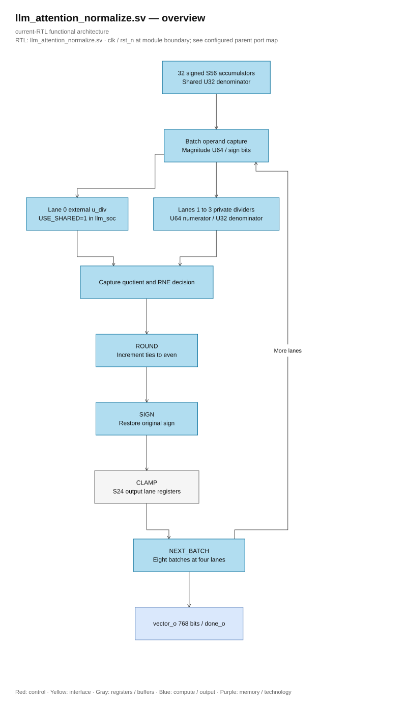

# llm_attention_normalize.sv

> **Category: GUIDE. Scope: CURRENT (may also have legacy callers).** RTL is authoritative; diagrams use the [shared visual style](../../diagrams/diagram_style.md).
[Documentation](../../README.md) → [Source guide](../full_graph.md) → [RTL index](README.md)

**Source:** [llm_attention_normalize.sv](<../../../Verilog%20Source%20code/llm_attention_normalize.sv>).

## At a glance

| Item | Description |
|---|---|
| Responsibility | Normalize 32 signed accumulators in batches of DIV_LANES. In llm_soc, DIV_LANES=4 and USE_SHARED=1: lane zero is wired to top u_div and lanes one through three instantiate private dividers. Quotient/remainder capture, RNE, sign restoration and S24 clamp occupy separate stages. Standalone USE_SHARED=0 instantiates all dividers internally. |

## Sơ đồ kiến trúc

[Editable draw.io — llm_attention_normalize.sv — overview](../../diagrams/architecture.drawio) · Page `23_llm_attention_normalize.sv_1`.
