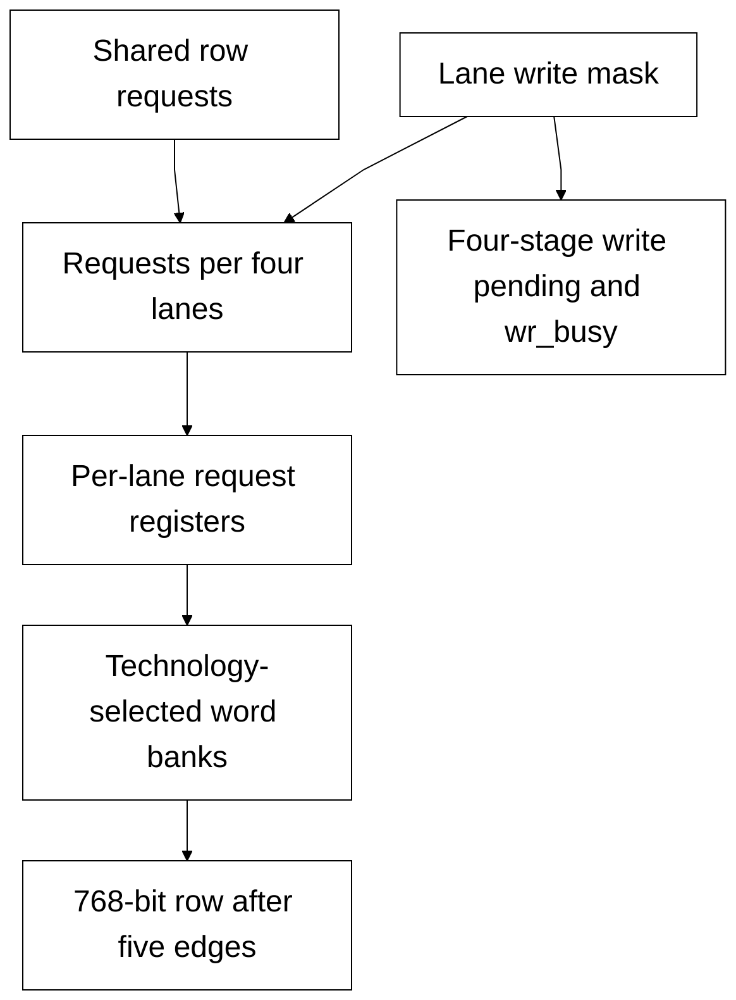

# llm_bank_ram.sv — SRAM lane-masked cho graph

[Tài liệu](../../README.md) → [Source guide](../README.md) → [Mục lục](README.md)

**Source:** [llm_bank_ram.sv](<../../../Verilog%20Source%20code/llm_bank_ram.sv>). **Số dòng:** 76. **SHA-256:** `c1150fd9a6997edb1953829dfc92a74df4d64edf45e0261d41c5bfd22c2a29fb`.

## Khối này làm gì?

32 lane S24 tạo row 768 bit. USE_QUARTUS_MEMORY chọn FPGA IP hoặc model ASIC qua word adapter. Request qua group bốn lane, lane register và adapter register trước storage; read valid năm cạnh với ROWS≤4096, write commit ở cạnh thứ tư. wr_busy buộc operator drain trước completion. Reset hủy queue/valid, giữ storage/payload.

## Sơ đồ kiến trúc



## Cách hoạt động chi tiết

32 lane S24 tạo row 768 bit. USE_QUARTUS_MEMORY chọn FPGA IP hoặc model ASIC qua word adapter. Request qua group bốn lane, lane register và adapter register trước storage; read valid năm cạnh với ROWS≤4096, write commit ở cạnh thứ tư. wr_busy buộc operator drain trước completion. Reset hủy queue/valid, giữ storage/payload.

## Các nhóm logic trong source

### [Dòng 1–24: Interface and write pending](<../../../Verilog%20Source%20code/llm_bank_ram.sv#L1>)

<!-- source-range:1:24 -->
```systemverilog
// One read port (five edges for <=4096 rows), one lane-masked write port.
// Group, lane and tile requests limit fanout; leaf writes at the fourth edge.
// Same accepted-cycle read/write collision returns old data; reset cancels
// queued requests and validity, while SRAM contents and payloads are unreset.
module llm_bank_ram #(
    parameter int LANES = 32,
    parameter int WIDTH = 24,
    parameter int ROWS = 4096,
    parameter int ADDR_W = $clog2(ROWS),
    parameter bit USE_QUARTUS_MEMORY = 0
) (
    input logic clk, rst_n, rd_en,
    input logic [ADDR_W - 1:0] rd_addr,
    output logic [LANES * WIDTH - 1:0] rd_data,
    output logic rd_valid, wr_busy,
    input logic [ADDR_W - 1:0] wr_addr,
    input logic [LANES - 1:0] wr_mask,
    input logic [LANES * WIDTH - 1:0] wr_data
);
    localparam int GROUP_LANES = 4;
    localparam int GROUPS = (LANES + GROUP_LANES - 1) / GROUP_LANES;
    logic [ADDR_W - 1:0] group_read_address_q [0:GROUPS - 1];
    logic [ADDR_W - 1:0] group_write_address_q [0:GROUPS - 1];
    logic [LANES * WIDTH - 1:0] group_write_data_q;
```

Client dùng rd_valid; operator phải chờ wr_busy hạ trước báo done. Latency bao gồm group, lane và tile stages.

### [Dòng 25–47: Group request distribution](<../../../Verilog%20Source%20code/llm_bank_ram.sv#L25>)

<!-- source-range:25:47 -->
```systemverilog
    logic [LANES - 1:0] group_write_mask_q;
    logic [GROUPS - 1:0] group_read_enable_q;
    logic [LANES - 1:0] lane_read_valid;
    logic [3:0] write_pending_q;
    always_ff @(posedge clk or negedge rst_n)
        if (!rst_n) write_pending_q <= 0;
        else write_pending_q <= {write_pending_q[2:0], |wr_mask};
    assign wr_busy = |write_pending_q;
    genvar lane, group_id;
    generate
    for (group_id = 0; group_id < GROUPS; group_id = group_id + 1) begin : g_request
        (* dont_merge *) logic [ADDR_W - 1:0] read_address_q, write_address_q;
        (* dont_merge *) logic read_enable_q;
        assign group_read_address_q[group_id] = read_address_q;
        assign group_write_address_q[group_id] = write_address_q;
        assign group_read_enable_q[group_id] = read_enable_q;
        always_ff @(posedge clk) begin read_address_q <= rd_addr; write_address_q <= wr_addr; end
        always_ff @(posedge clk or negedge rst_n)
            if (!rst_n) read_enable_q <= 0;
            else read_enable_q <= rd_en;
    end
    always_ff @(posedge clk) group_write_data_q <= wr_data;
    always_ff @(posedge clk or negedge rst_n)
```

Địa chỉ/data payload chốt không enable mux. SRAM-only dont_merge giữ locality; read/write enables reset để hủy queued requests.

### [Dòng 48–76: Lane banks and response](<../../../Verilog%20Source%20code/llm_bank_ram.sv#L48>)

<!-- source-range:48:76 -->
```systemverilog
        if (!rst_n) group_write_mask_q <= 0;
        else group_write_mask_q <= wr_mask;
    for (lane = 0; lane < LANES; lane = lane + 1) begin : g_bank
        // SRAM-adapter placement policy only: retain local address copies
        // rather than merging them back into one full-cache fanout driver.
        (* dont_merge *) logic [ADDR_W - 1:0] read_address_q, write_address_q;
        logic [WIDTH - 1:0] write_data_q;
        (* dont_merge *) logic read_enable_q, write_enable_q;
        always_ff @(posedge clk or negedge rst_n) begin
            if (!rst_n) begin read_enable_q <= 0; write_enable_q <= 0; end
            else begin
                read_enable_q <= group_read_enable_q[lane / GROUP_LANES];
                write_enable_q <= group_write_mask_q[lane];
            end
        end
        always_ff @(posedge clk) begin
            read_address_q <= group_read_address_q[lane / GROUP_LANES];
            write_address_q <= group_write_address_q[lane / GROUP_LANES];
            write_data_q <= group_write_data_q[lane * WIDTH +: WIDTH];
        end
        pipelined_word_ram #(.WIDTH(WIDTH), .ROWS(ROWS), .ADDR_W(ADDR_W),
            .USE_QUARTUS_MEMORY(USE_QUARTUS_MEMORY)) u_storage(
            .clk(clk), .rst_n(rst_n), .rd_en(read_enable_q), .wr_en(write_enable_q),
            .rd_addr(read_address_q), .wr_addr(write_address_q), .wr_data(write_data_q),
            .rd_data(rd_data[lane * WIDTH +: WIDTH]), .rd_valid(lane_read_valid[lane]), .wr_valid());
    end
    endgenerate
    assign rd_valid = lane_read_valid[0];
endmodule
```

Leaf old-data collision theo cùng accepted cycle. Lane-valid có cùng latency; output dùng lane0 valid để xác nhận cả row.
