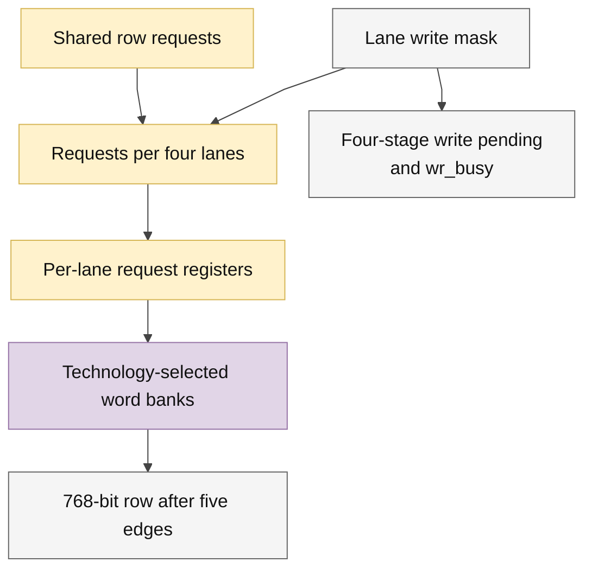

# llm_bank_ram.sv — SRAM lane-masked cho graph

> **Category: GUIDE. Scope: CURRENT (may also have legacy callers).** RTL is authoritative; diagrams use the [shared visual style](../../diagrams/diagram_style.md).
[Tài liệu](../../README.md) → [Source guide](../README.md) → [Mục lục](README.md)

**Source:** [llm_bank_ram.sv](<../../../Verilog%20Source%20code/llm_bank_ram.sv>).

## At a glance

| Item | Description |
|---|---|
| Responsibility | 32 lane S24 tạo row 768 bit. USE_QUARTUS_MEMORY chọn FPGA IP hoặc model ASIC qua word adapter. Request qua group bốn lane, lane register và adapter register trước storage; read valid năm cạnh với ROWS≤4096, write commit ở cạnh thứ tư. wr_busy buộc operator drain trước completion. Reset hủy queue/valid, giữ storage/payload. |

## Sơ đồ kiến trúc

## Important state / datapath groups

### [Dòng 1–24: Interface and write pending](<../../../Verilog%20Source%20code/llm_bank_ram.sv#L1>)

Client dùng rd_valid; operator phải chờ wr_busy hạ trước báo done. Latency bao gồm group, lane và tile stages.

### [Dòng 25–47: Group request distribution](<../../../Verilog%20Source%20code/llm_bank_ram.sv#L25>)

Địa chỉ/data payload chốt không enable mux. SRAM-only dont_merge giữ locality; read/write enables reset để hủy queued requests.

### [Dòng 48–76: Lane banks and response](<../../../Verilog%20Source%20code/llm_bank_ram.sv#L48>)

Leaf old-data collision theo cùng accepted cycle. Lane-valid có cùng latency; output dùng lane0 valid để xác nhận cả row.
