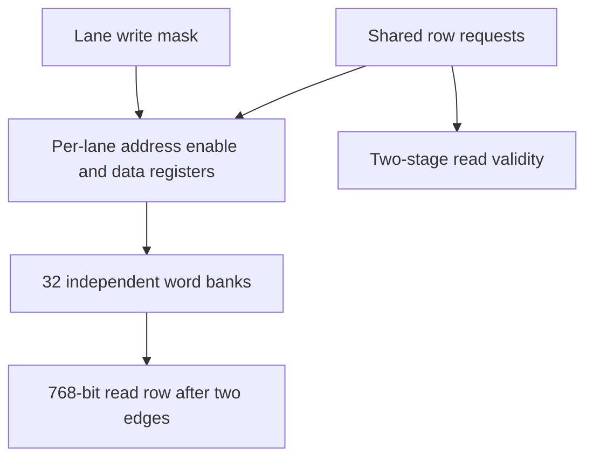

# llm_bank_ram.sv — SRAM lane-masked cho graph

[Tài liệu](../../README.md) → [Source guide](../README.md) → [Mục lục](README.md)

**Source:** [llm_bank_ram.sv](<../../../Verilog%20Source%20code/llm_bank_ram.sv>). **Số dòng:** 49. **SHA-256:** `43f096bf29a7c9452e0d75a786d80c1e51be8f7d3419873122c2665cf8944b76`.

## Khối này làm gì?

32 lane S24 độc lập tạo row 768 bit. KV dùng 4096 row, vector workspace dùng 96 row. Mỗi lane chốt địa chỉ, enable và payload riêng. Read valid sau hai cạnh; write nhận request rồi ghi leaf ở cạnh kế tiếp. Reset hủy request/valid nhưng giữ storage.

## Sơ đồ kiến trúc



## Cách hoạt động chi tiết

32 lane S24 độc lập tạo row 768 bit. KV dùng 4096 row, vector workspace dùng 96 row. Mỗi lane chốt địa chỉ, enable và payload riêng. Read valid sau hai cạnh; write nhận request rồi ghi leaf ở cạnh kế tiếp. Reset hủy request/valid nhưng giữ storage.

## Các nhóm logic trong source

### [Dòng 1–18: Interface](<../../../Verilog%20Source%20code/llm_bank_ram.sv#L1>)

<!-- source-range:1:18 -->
```systemverilog
// One read port (two edges to rd_valid) and one lane-masked write port.
// Requests are captured locally per lane, then executed at the next edge.
// Same accepted-cycle read/write collision returns old data; reset cancels
// queued requests and validity, while SRAM contents and payloads are unreset.
module llm_bank_ram #(
    parameter int LANES = 32,
    parameter int WIDTH = 24,
    parameter int ROWS = 4096,
    parameter int ADDR_W = $clog2(ROWS)
) (
    input logic clk, rst_n, rd_en,
    input logic [ADDR_W - 1:0] rd_addr,
    output logic [LANES * WIDTH - 1:0] rd_data,
    output logic rd_valid,
    input logic [ADDR_W - 1:0] wr_addr,
    input logic [LANES - 1:0] wr_mask,
    input logic [LANES * WIDTH - 1:0] wr_data
);
```

Client cấp địa chỉ hợp lệ và chỉ tiêu thụ output khi rd_valid. Adapter giữ throughput một read và một write mỗi cạnh.

### [Dòng 19–37: Local request registers](<../../../Verilog%20Source%20code/llm_bank_ram.sv#L19>)

<!-- source-range:19:37 -->
```systemverilog
    genvar lane;
    generate
    for (lane = 0; lane < LANES; lane = lane + 1) begin : g_bank
        // SRAM-adapter placement policy only: retain local address copies
        // rather than merging them back into one full-cache fanout driver.
        (* dont_merge *) logic [ADDR_W - 1:0] read_address_q, write_address_q;
        logic [WIDTH - 1:0] write_data_q;
        (* dont_merge *) logic read_enable_q, write_enable_q;
        always_ff @(posedge clk or negedge rst_n) begin
            if (!rst_n) begin read_enable_q <= 0; write_enable_q <= 0; end
            else begin read_enable_q <= rd_en; write_enable_q <= wr_mask[lane]; end
        end
        always_ff @(posedge clk) begin
            if (rst_n && rd_en) read_address_q <= rd_addr;
            if (rst_n && wr_mask[lane]) begin
                write_address_q <= wr_addr;
                write_data_q <= wr_data[lane * WIDTH +: WIDTH];
            end
        end
```

dont_merge chỉ nằm tại boundary SRAM để giữ fanout địa chỉ local. Reset hủy queued enables; payload và storage không reset.

### [Dòng 38–49: Lane banks and response validity](<../../../Verilog%20Source%20code/llm_bank_ram.sv#L38>)

<!-- source-range:38:49 -->
```systemverilog
        banked_word_ram #(.WIDTH(WIDTH), .ROWS(ROWS), .ADDR_W(ADDR_W)) u_storage(
            .clk(clk), .rd_en(read_enable_q), .wr_en(rst_n && write_enable_q),
            .rd_addr(read_address_q), .wr_addr(write_address_q), .wr_data(write_data_q),
            .rd_data(rd_data[lane * WIDTH +: WIDTH]));
    end
    endgenerate
    logic read_pending_q;
    always_ff @(posedge clk or negedge rst_n) begin
        if (!rst_n) begin read_pending_q <= 0; rd_valid <= 0; end
        else begin read_pending_q <= rd_en; rd_valid <= read_pending_q; end
    end
endmodule
```

Leaf old-data collision xảy ra khi các request đã chốt thực thi. rd_valid trễ hai cạnh; reset hủy response đang chờ.

