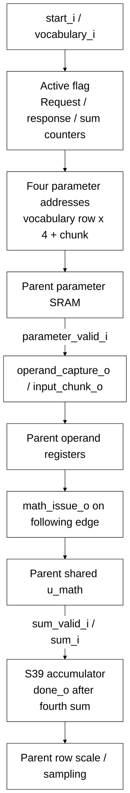

# llm_head_engine.sv

> **Category: GUIDE. Scope: CURRENT (may also have legacy callers).** RTL is authoritative; diagrams are preserved from the existing guide.
[Documentation](../../README.md) → [Source guide](../full_graph.md) → [RTL index](README.md)

**Source:** [llm_head_engine.sv](<../../../Verilog%20Source%20code/llm_head_engine.sv>).

## At a glance

| Item | Description |
|---|---|
| Responsibility | Issue four ordered parameter reads for a vocabulary row, request parent operand capture and shared SIMD issue, then accumulate four sum_valid responses into S39. The parent owns row-scale caching, RNE, PRNG order and token selection. |

## Sơ đồ kiến trúc

