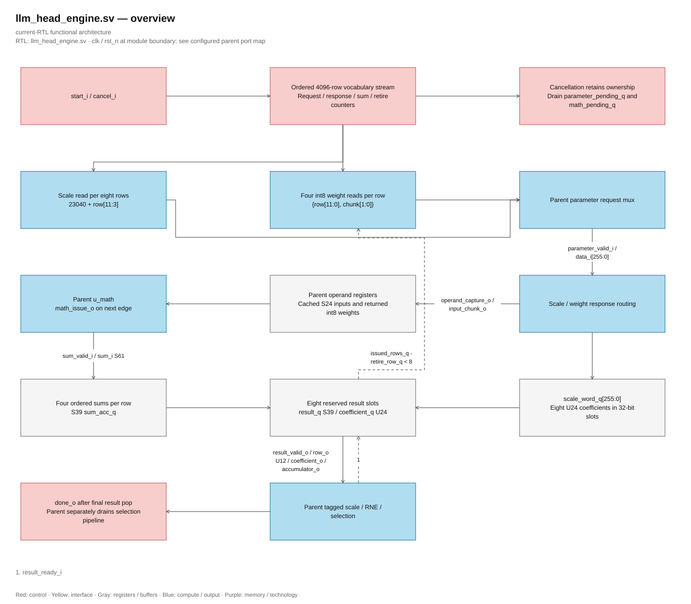

# llm_head_engine.sv

> **Category: GUIDE. Scope: CURRENT (may also have legacy callers).** RTL is authoritative; diagrams use the [shared visual style](../../diagrams/diagram_style.md).
[Documentation](../../README.md) → [Source guide](../full_graph.md) → [RTL index](README.md)

**Source:** [llm_head_engine.sv](<../../../Verilog%20Source%20code/llm_head_engine.sv>).

## At a glance

| Item | Description |
|---|---|
| Responsibility | Stream the 4,096 vocabulary rows with four ordered weight reads per row and one packed scale read per eight rows. Eight reserved result slots hold S39 sums and associated U24 coefficients; tagged results feed the parent's RNE, PRNG and selection pipeline. |

The request counter reserves a result slot before the first weight chunk. Ordered response counters distinguish scale words from weights; the row's scale is copied into its reserved slot before SIMD completion. Four ordered `sum_valid_i` responses produce each S39 result. `result_valid_o/result_ready_i` retains the oldest row under backpressure; slots include work still in memory/SIMD, so at most eight engine rows are outstanding.

`done_o` pulses after result row 4,095 is accepted; parent selection must still drain. Reset clears control/validity. Cancellation suppresses new reads, operand capture and results, and keeps `busy_o` asserted until accepted parameter/SIMD responses drain. The parent gates pending SIMD issue on cancellation before releasing shared ownership. Payload arrays need no reset because a fresh reservation writes them before result validity.

The diagram below reflects the vocabulary stream, packed-scale reads and eight backpressured result slots.

## Sơ đồ kiến trúc

[Editable draw.io — llm_head_engine.sv — overview](../../diagrams/architecture.drawio) · Page `25_llm_head_engine.sv_1`.
